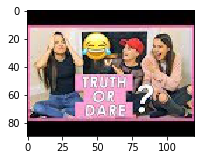
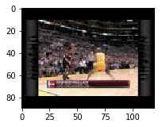
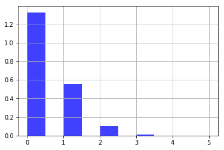
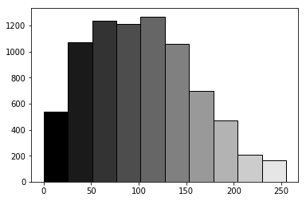
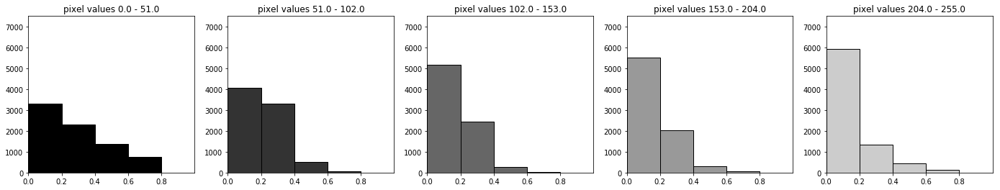
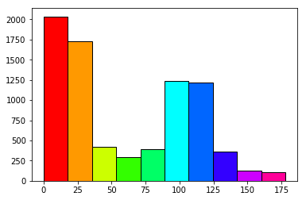
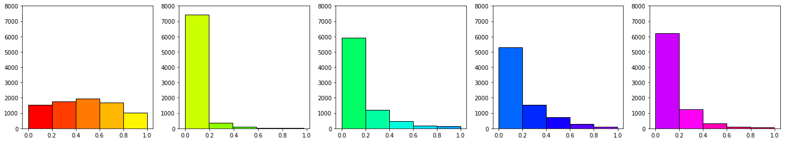
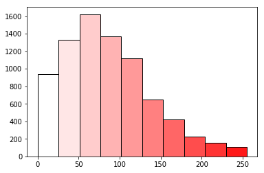
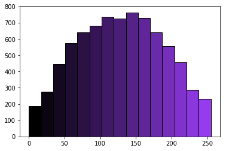
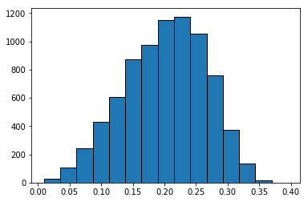

```python
import os

DOWNLOAD_IMAGES = False

path = "../data/"
files = os.listdir(path)
files
```


    ['.ipynb_checkpoints',
     'channel_title_meta.tsv',
     'channel_title_vecs.tsv',
     'default_images.txt',
     'GB_category_id.json',
     'GB_videos_5p.csv',
     'images',
     'image_attributes.csv',
     'tags_meta.tsv',
     'tags_vecs.tsv',
     'title_meta.tsv',
     'title_vecs.tsv',
     'US_category_id.json',
     'US_videos_5p.csv',
     'yolo_detections.json',
     '_meta.tsv',
     '_vecs.tsv']


```python
import pandas as pd


pd.set_option("colwidth", -1)

GB_videos_df = pd.read_csv(path + "/" + "GB_videos_5p.csv", sep=";", engine="python")
US_videos_df = pd.read_csv(path + "/" + "US_videos_5p.csv", sep=";", engine="python")

df = pd.concat([GB_videos_df, US_videos_df]).drop_duplicates().reset_index(drop=True)
```


```python
df.columns
```


    Index(['video_id', 'trending_date', 'title', 'channel_title', 'category_id',
           'publish_time', 'tags', 'views', 'likes', 'dislikes', 'comment_count',
           'thumbnail_link', 'comments_disabled', 'ratings_disabled',
           'video_error_or_removed', 'description '],
          dtype='object')


```python
len(df['thumbnail_link'].unique()), len(df['thumbnail_link'])
```


    (8608, 78255)


```python
df
```


<div>
<style scoped>
    .dataframe tbody tr th:only-of-type {
        vertical-align: middle;
    }

    .dataframe tbody tr th {
        vertical-align: top;
    }

    .dataframe thead th {
        text-align: right;
    }
</style>
<table border="1" class="dataframe">
  <thead>
    <tr style="text-align: right;">
      <th></th>
      <th>video_id</th>
      <th>trending_date</th>
      <th>title</th>
      <th>channel_title</th>
      <th>category_id</th>
      <th>publish_time</th>
      <th>tags</th>
      <th>views</th>
      <th>likes</th>
      <th>dislikes</th>
      <th>comment_count</th>
      <th>thumbnail_link</th>
      <th>comments_disabled</th>
      <th>ratings_disabled</th>
      <th>video_error_or_removed</th>
      <th>description</th>
    </tr>
  </thead>
  <tbody>
    <tr>
      <th>0</th>
      <td>Jw1Y-zhQURU</td>
      <td>17.14.11</td>
      <td>John Lewis Christmas Ad 2017 - #MozTheMonster</td>
      <td>John Lewis</td>
      <td>NaN</td>
      <td>2017-11-10T07:38:29.000Z</td>
      <td>christmas|"john lewis christmas"|"john lewis"|"christmas ad"|"mozthemonster"|"christmas 2017"|"christmas ad 2017"|"john lewis christmas advert"|"moz"</td>
      <td>7224515</td>
      <td>55681</td>
      <td>10247</td>
      <td>9479</td>
      <td>https://i.ytimg.com/vi/Jw1Y-zhQURU/default.jpg</td>
      <td>False</td>
      <td>False</td>
      <td>False</td>
      <td>Click here to continue the story and make your own monster:\nhttp://bit.ly/2mboXgj\n\nJoe befriends a noisy Monster under his bed but the two have so much fun together that he can't get to sleep, leaving him tired by day. For Christmas Joe receives a gift to help him finally get a good night’s sleep.\n\nShop the ad\nhttp://bit.ly/2hg04Lc\n\nThe music is Golden Slumbers performed by elbow, the original song was by The Beatles. \nFind the track:\nhttps://Elbow.lnk.to/GoldenSlumbersXS\n\nSubscribe to this channel for regular video updates\nhttp://bit.ly/2eU8MvW\n\nIf you want to hear more from John Lewis:\n\nLike John Lewis on Facebook\nhttp://www.facebook.com/johnlewisretail\n\nFollow John Lewis on Twitter\nhttp://twitter.com/johnlewisretail\n\nFollow John Lewis on Instagram\nhttp://instagram.com/johnlewisretail</td>
    </tr>
    <tr>
      <th>1</th>
      <td>3s1rvMFUweQ</td>
      <td>17.14.11</td>
      <td>Taylor Swift: …Ready for It? (Live) - SNL</td>
      <td>Saturday Night Live</td>
      <td>NaN</td>
      <td>2017-11-12T06:24:44.000Z</td>
      <td>SNL|"Saturday Night Live"|"SNL Season 43"|"Episode 1730"|"Tiffany Haddish"|"Taylor Swift"|"Taylor Swift Ready for It"|"s43"|"s43e5"|"episode 5"|"live"|"new york"|"comedy"|"sketch"|"funny"|"hilarious"|"late night"|"host"|"music"|"guest"|"laugh"|"impersonation"|"actor"|"improv"|"musician"|"comedian"|"actress"|"If Loving You Is Wrong"|"Oprah Winfrey"|"OWN"|"Girls Trip"|"The Carmichael Show"|"Keanu"|"Reputation"|"Look What You Made Me Do"|"ready for it?"</td>
      <td>1053632</td>
      <td>25561</td>
      <td>2294</td>
      <td>2757</td>
      <td>https://i.ytimg.com/vi/3s1rvMFUweQ/default.jpg</td>
      <td>False</td>
      <td>False</td>
      <td>False</td>
      <td>Musical guest Taylor Swift performs …Ready for It? on Saturday Night Live.\n\n#SNL #SNL43\n\nGet more SNL: http://www.nbc.com/saturday-night-live\nFull Episodes: http://www.nbc.com/saturday-night-liv...\n\nLike SNL: https://www.facebook.com/snl\nFollow SNL: https://twitter.com/nbcsnl\nSNL Tumblr: http://nbcsnl.tumblr.com/\nSNL Instagram: http://instagram.com/nbcsnl \nSNL Pinterest: http://www.pinterest.com/nbcsnl/</td>
    </tr>
    <tr>
      <th>2</th>
      <td>n1WpP7iowLc</td>
      <td>17.14.11</td>
      <td>Eminem - Walk On Water (Audio) ft. Beyoncé</td>
      <td>EminemVEVO</td>
      <td>NaN</td>
      <td>2017-11-10T17:00:03.000Z</td>
      <td>Eminem|"Walk"|"On"|"Water"|"Aftermath/Shady/Interscope"|"Rap"</td>
      <td>17158579</td>
      <td>787420</td>
      <td>43420</td>
      <td>125882</td>
      <td>https://i.ytimg.com/vi/n1WpP7iowLc/default.jpg</td>
      <td>False</td>
      <td>False</td>
      <td>False</td>
      <td>Eminem's new track Walk on Water ft. Beyoncé is available everywhere: http://shady.sr/WOWEminem \nPlaylist Best of Eminem: https://goo.gl/AquNpo\nSubscribe for more: https://goo.gl/DxCrDV\n\nFor more visit: \nhttp://eminem.com\nhttp://facebook.com/eminem\nhttp://twitter.com/eminem\nhttp://instagram.com/eminem\nhttp://eminem.tumblr.com\nhttp://shadyrecords.com\nhttp://facebook.com/shadyrecords\nhttp://twitter.com/shadyrecords\nhttp://instagram.com/shadyrecords\nhttp://trustshady.tumblr.com\n\nMusic video by Eminem performing Walk On Water. (C) 2017 Aftermath Records\nhttp://vevo.ly/gA7xKt</td>
    </tr>
    <tr>
      <th>3</th>
      <td>PUTEiSjKwJU</td>
      <td>17.14.11</td>
      <td>Goals from Salford City vs Class of 92 and Friends at The Peninsula Stadium!</td>
      <td>Salford City Football Club</td>
      <td>NaN</td>
      <td>2017-11-13T02:30:38.000Z</td>
      <td>Salford City FC|"Salford City"|"Salford"|"Class of 92"|"University of Salford"|"Salford Uni"|"Non League"|"National League"|"National League North"</td>
      <td>27833</td>
      <td>193</td>
      <td>12</td>
      <td>37</td>
      <td>https://i.ytimg.com/vi/PUTEiSjKwJU/default.jpg</td>
      <td>False</td>
      <td>False</td>
      <td>False</td>
      <td>Salford drew 4-4 against the Class of 92 and Friends at the newly opened The Peninsula Stadium!\n\nLike us on Facebook: https://www.facebook.com/SalfordCityFC/ \nFollow us on Twitter: https://twitter.com/SalfordCityFC\nFollow us on Instagram: https://www.instagram.com/salfordcityfc/ \nSubscribe to us on YouTube: https://www.youtube.com/user/SalfordCityTV\n\nWebsite: https://salfordcityfc.co.uk</td>
    </tr>
    <tr>
      <th>4</th>
      <td>rHwDegptbI4</td>
      <td>17.14.11</td>
      <td>Dashcam captures truck's near miss with child in Norway</td>
      <td>Cute Girl Videos</td>
      <td>NaN</td>
      <td>2017-11-13T01:45:13.000Z</td>
      <td>[none]</td>
      <td>9815</td>
      <td>30</td>
      <td>2</td>
      <td>30</td>
      <td>https://i.ytimg.com/vi/rHwDegptbI4/default.jpg</td>
      <td>False</td>
      <td>False</td>
      <td>False</td>
      <td>Dashcam captures truck's near miss with child in Norway\nThe close call happened as children were getting off a school bus in Norway.\n\nEurope\nNorway</td>
    </tr>
    <tr>
      <th>5</th>
      <td>AumaWl0TNBo</td>
      <td>17.14.11</td>
      <td>How My Relationship Started!</td>
      <td>PointlessBlogVlogs</td>
      <td>NaN</td>
      <td>2017-11-11T17:00:00.000Z</td>
      <td>pointlessblog|"pointlessblogtv"|"pointlessblogvlogs"|"games"|"gaming"|"daily"|"vlog"|"zoe"|"sugg"|"funny"|"zoella"|"zozeebo"|"new"|"house"|"nala"|"cute"|"puppy"|"british"|"teen"|"couple"|"zalfie"|"how"|"my"|"relationship"|"started"|"first"|"time"|"kiss"|"niomi"|"smart"|"trip"|"adventure"|"travel"|"holiday"|"merch"|"pb"|"office"|"tour"</td>
      <td>1182775</td>
      <td>52708</td>
      <td>1431</td>
      <td>2333</td>
      <td>https://i.ytimg.com/vi/AumaWl0TNBo/default.jpg</td>
      <td>False</td>
      <td>False</td>
      <td>False</td>
      <td>► HOW MY RELATIONSHIP STARTED!\n► PB Merch • http://bit.ly/New-PBMerch \n► PB Merch • http://bit.ly/New-PBMerch \n----------------------------------------­­­­­­­----------------------------------­-­-­-­\n• My Links •\nMain Channel • http://youtube.com/pointlessblog \nGaming Channel • http://youtube.com/AlfieGames \nTwitter • https://twitter.com/pointlessblog \nFacebook • http://fb.com/PointlessBlogTv \nTumblr • http://pointlessblogtv.tumblr.com \nSnapChat • PointlessBlog\n----------------------------------------­­­­­­­----------------------------------­-­-­-­-\n• Music •\nAndrew Applepie\n----------------------------------------­­­­­­­----------------------------------­-­-­-­-\n• Contact • Enquiries@PointlessBlog.co.uk\n----------------------------------------­­­­­­­----------------------------------­-­-­-­-</td>
    </tr>
    <tr>
      <th>6</th>
      <td>2Vv-BfVoq4g</td>
      <td>17.14.11</td>
      <td>Ed Sheeran - Perfect (Official Music Video)</td>
      <td>Ed Sheeran</td>
      <td>NaN</td>
      <td>2017-11-09T11:04:14.000Z</td>
      <td>edsheeran|"ed sheeran"|"acoustic"|"live"|"cover"|"official"|"remix"|"official video"|"lyrics"|"session"</td>
      <td>33523622</td>
      <td>1634124</td>
      <td>21082</td>
      <td>85067</td>
      <td>https://i.ytimg.com/vi/2Vv-BfVoq4g/default.jpg</td>
      <td>False</td>
      <td>False</td>
      <td>False</td>
      <td>🎧: https://ad.gt/yt-perfect\n💰: https://atlanti.cr/yt-album\nSubscribe to Ed's channel: http://bit.ly/SubscribeToEdSheeran\n\nFollow Ed on...\nFacebook: http://www.facebook.com/EdSheeranMusic\nTwitter: http://twitter.com/edsheeran\nInstagram: http://instagram.com/teddysphotos\nOfficial Website: http://edsheeran.com\n\nDirector: Jason Koenig\nProducer: Honna Kimmerer\nStarring: Ed Sheeran &amp; Zoey Deutch \nDirector of Photography: Johnny Valencia\nProduction Company: Anonymous Content\nExec Producer: Nina Soriano\nProduction Manager: Doug Hoff\nCommissioner: Dan Curwin\nProduction Designer: John Lavin\nLead Casting: Amy Hubbard \n \nWritten by: Jason Koenig, Ed Sheeran, Andrew Kolvet, Jenny Koenig, Murray Cummings\n\nEdited by: Jason Koenig &amp; Johnny Valencia\nVFX: Ian Hubert\n\nCast: Bo Valencia, Dennis Ranalta, Arthur Pauli\n \nSki Cinematography: Corey Koniniec\nSpecialty Camera op: Ryan Haug\n1st AC: Ryan Brown\n \n1st Assistant Director: Ole Zapatka\nArt Director: Klaus Hartl\nSnow fx: Lucien Stephenson\n\nGaffer: Thomas Berz\nStylist: Claudia Lajda\nHair &amp; Makeup: Christel Thoresen\nAustrian Casting: Ursula Kiplinger\n \nAdditional VFX: Zoic\n\nSpecial Thanks to: The Hintertux Glacier, Austria;\nThe Tenne, and Hotel Neuhintertux</td>
    </tr>
    <tr>
      <th>7</th>
      <td>#NAZWA?</td>
      <td>17.14.11</td>
      <td>CHRISTMAS HAS GONE TO MY HEAD</td>
      <td>MoreZoella</td>
      <td>NaN</td>
      <td>2017-11-10T19:19:43.000Z</td>
      <td>zoe sugg|"zoella"|"zoe"|"vlog"|"vlogging"|"vlogs"|"daily"|"every"|"day"|"british"|"in the life"|"brighton"|"nala"|"puppy"|"pug"|"alfie deyes"|"pointlessblog"|"beauty"|"fashion"|"makeup"|"lifestyle"|"life"|"clothes"|"outfits"|"dog"|"home"|"interiors"|"books"|"food"|"baking"|"christmas"</td>
      <td>1164201</td>
      <td>57309</td>
      <td>749</td>
      <td>624</td>
      <td>https://i.ytimg.com/vi/-N5eucPMTTc/default.jpg</td>
      <td>False</td>
      <td>False</td>
      <td>False</td>
      <td>CHRISTMAS HAS GONE TO MY HEAD\nPrevious Vlog: http://bit.ly/2yQn6Dr\nMain Channel: http://bit.ly/2n34AgF\n\n--- Links below marked with a * are affiliate links - which means I receive a percentage of the revenue made from purchasing products through this link —\n\nWhat I'm Wearing:\nT Shirt - Zoe Karssen - http://bit.ly/2ABhudK\n*Trousers - &amp; Other Stories - http://bit.ly/2zO41C2\n*Coat - &amp; Other Stories - http://bit.ly/2zMEWrj\n*Hat - ASOS (similar) http://bit.ly/2zM170G\n*Converse - http://bit.ly/2wrGiCw\n\nOther Places To Find Me:\n\nMAIN CHANNEL: http://youtube.com/zoella\nBLOG : http://www.zoella.co.uk\nTWITTER : http://twitter.com/Zoella\nINSTAGRAM : http://instagram.com/Zoella\nFACEBOOK : http://facebook.com/zoe.zoella\nSNAPCHAT : @OfficialZoella</td>
    </tr>
    <tr>
      <th>8</th>
      <td>LMCuKltaY3M</td>
      <td>17.14.11</td>
      <td>Elbow - Golden Slumbers (John Lewis Advert 2017)</td>
      <td>ElbowVEVO</td>
      <td>NaN</td>
      <td>2017-11-10T08:00:01.000Z</td>
      <td>Elbow|"Golden"|"Slumbers"|"Polydor"|"Alternative"</td>
      <td>154494</td>
      <td>2163</td>
      <td>147</td>
      <td>211</td>
      <td>https://i.ytimg.com/vi/LMCuKltaY3M/default.jpg</td>
      <td>False</td>
      <td>False</td>
      <td>False</td>
      <td>“Golden Slumbers”, originally by The Beatles, and as heard on the 2017 John Lewis Christmas advert. \n\nTaken from elbow’s new �Best Of’ collection, released 24/11/2017. Pre-order now and get “Golden Slumbers” instantly: https://Elbow.lnk.to/BestOfID\n\nelbow are touring in 2017 and 2018 – for tickets visit http://www.elbow.co.uk\n\nhttp://www.facebook.com/elbow\nhttp://www.twitter.com/elbow\nhttp://www.instagram.com/elbowofficial</td>
    </tr>
    <tr>
      <th>9</th>
      <td>9t9u_yPEidY</td>
      <td>17.14.11</td>
      <td>Jennifer Lopez - Amor, Amor, Amor (Official Video) ft. Wisin</td>
      <td>JenniferLopezVEVO</td>
      <td>NaN</td>
      <td>2017-11-10T15:00:00.000Z</td>
      <td>Jennifer Lopez ft. Wisin|"Jennifer Lopez ft. Wisin Music"|"Jennifer Lopez ft. Wisin Official Video"|"Jennifer Lopez ft. Wisin Video"|"Jennifer Lopez ft. Wisin Video Oficial"|"Jennifer Lopez ft. Wisin Nuevo Video"|"Jennifer Lopez ft. Wisin New Video"|"Amor"|"Amor Official Video"|"Official Video"|"Amor Single"|"Single"|"Jennifer Lopez ft. Wisin New Single"|"Jennifer Lopez ft. Wisin Single"|"Jennifer Lopez ft. Wisin Amor"|"Jennifer"|"Lopez"</td>
      <td>9548677</td>
      <td>190084</td>
      <td>15015</td>
      <td>11473</td>
      <td>https://i.ytimg.com/vi/9t9u_yPEidY/default.jpg</td>
      <td>False</td>
      <td>False</td>
      <td>False</td>
      <td>Jennifer Lopez ft. Wisin - Amor, Amor, Amor (Official Music Video)\n“Amor, Amor, Amor” is available on these digital platforms!\niTunes: http://smarturl.it/AAAi\nApple Music: http://smarturl.it/AAAap\nSpotify: http://smarturl.it/AAAs\nAmazon Music: http://smarturl.it/AAAam\nGoogle Play: http://smarturl.it/AAAgp\nVideo: http://smarturl.it/AAAv\nLinkfire: https://SML.lnk.to/AAA\n\nFollow JLO!\nOfficial Site: http://www.jenniferlopez.com\nFacebook: https://www.facebook.com/jenniferlopez\nInstagram: https://www.instagram.com/jlo\nTwitter: https://twitter.com/jlo\nOfficial music video by Jennifer Lopez ft. Wisin performing Amor, Amor, Amor. (C) 2017 Sony Music Entertainment US Latin LLC</td>
    </tr>
    <tr>
      <th>10</th>
      <td>ONQ-fAp5X64</td>
      <td>17.14.11</td>
      <td>CAN BABIES DO GYMNASTICS?  **World Record**</td>
      <td>Nile Wilson</td>
      <td>NaN</td>
      <td>2017-11-11T10:30:00.000Z</td>
      <td>nile wilson|"nile wilson gymnastics"|"nile wilson olympics"|"olympic gymnast"|"amazing gymnastics"|"gymnastics"|"strength training"|"strength"|"hard work"|"vlogging"|"vlog"|"success"|"fitness"|"world record"|"has to be a world record"|"can babies do gymnastics"|"youngest gymnast in the world"|"ultimate gymnastics challenge"|"trampoline challenge"|"gymmastics challenge"|"baby gymnastics"</td>
      <td>306724</td>
      <td>9591</td>
      <td>266</td>
      <td>448</td>
      <td>https://i.ytimg.com/vi/ONQ-fAp5X64/default.jpg</td>
      <td>False</td>
      <td>False</td>
      <td>False</td>
      <td>➢ Join my FREE 7 Steps to Success - http://www.bodybible.life/\n➢ Merch- http://www.nwclothing.co.uk/\n➢ Enquiries - luke@activatemanagement.co.uk\n➢R&amp;B- https://open.spotify.com/user/1177145901/playlist/0DqvE5p0HqNfDbE3sS8rKZ\n➢House - https://open.spotify.com/user/1177145901/playlist/2Vw8Wv059AoDWKJRaBTfzE\n➢ Handstand Programme 🤸🏼‍♂️https://bodybible.life/individual-programmes-2/\n➢ Depop -https://www.depop.com/joannaj\n➢ Gymnastics Gear ~ https://www.turn-gymnastics.com/\n➢ Intro Song ~ Tom Zanetti, Darlin'\n➢ Soundcloud ~ https://soundcloud.com/nile-wilson-2/sets/wobblers\n➢Instagram https://instagram.com/nilemw/\n➢ Body Bible instagram https://www.instagram.com/nw_bodybible/\n➢Twitter https://twitter.com/NileMW\n➢Facebook https://www.facebook.com/NileWilsonGy…\n➢SnapChat - nilewilson\n➢Songs ~ https://www.youtube.com/user/officialdjwelshy</td>
    </tr>
    <tr>
      <th>11</th>
      <td>Dlwf5u2BLAg</td>
      <td>17.14.11</td>
      <td>TV Reporter Interviews Alleged Bank Robber, Then Helps Police Catch Him</td>
      <td>Inside Edition</td>
      <td>NaN</td>
      <td>2017-11-10T01:40:07.000Z</td>
      <td>reporter|"robbery"|"Crime"|"cat-news"|"police"|"bank"|"Georgia"|"offbeat"|"Inside Edition Offbeat"|"Inside Edition newsdesk"|"local news"|"bank robber"|"television reporter"|"television anchor"|"Gwinnett County"|"georgia"|"ashley thompson"</td>
      <td>254314</td>
      <td>1746</td>
      <td>125</td>
      <td>298</td>
      <td>https://i.ytimg.com/vi/Dlwf5u2BLAg/default.jpg</td>
      <td>False</td>
      <td>False</td>
      <td>False</td>
      <td>More from Inside Edition: https://www.youtube.com/user/cbstvdinsideedition?sub_confirmation=1\nGeorgia police say in the midst of robbing banks, a suspect made time for a television interview on the local news. A reporter was doing an unrelated story about traffic when she approached the man to get his opinion. She says before going on camera, he asked to take off the same headwear seen in surveillance photos. Police contacted the reporter for his information, and her next headline was an arrest. InsideEdition.com's Lisa Voyticki has more.</td>
    </tr>
    <tr>
      <th>12</th>
      <td>NVCqz2BDfcQ</td>
      <td>17.14.11</td>
      <td>Gucci Mane  - Curve (ft. The Weeknd)</td>
      <td>OfficialGucciMane</td>
      <td>NaN</td>
      <td>2017-11-10T17:18:13.000Z</td>
      <td>Gucci Mane|"The Weeknd"|"Curve"|"Official"|"Music Video"|"Atlantic"|"Records"|"trap"|"trap god"|"1017"|"gucci"|"mr davis"|"atlanta"|"rap"|"hip hop"</td>
      <td>946859</td>
      <td>37986</td>
      <td>816</td>
      <td>2006</td>
      <td>https://i.ytimg.com/vi/NVCqz2BDfcQ/default.jpg</td>
      <td>False</td>
      <td>False</td>
      <td>False</td>
      <td>Gucci Mane - Curve feat. The Weeknd\n\n Mr. Davis out now: https://Atlantic.lnk.to/MrDavis\n\nGet exclusive Mr. Davis merchandise here: http://smarturl.it/MrDavisBundlesYT\n\nFollow Gucci Mane\nhttp://GucciManeOnline.com\nhttp://Twitter.com/Gucci1017\nhttp://Facebook.com/GucciMane\nhttp://Instagram.com/LaFlare1017\nhttps://open.spotify.com/artist/13y7CgLHjMVRMDqxdx0Xdo\n\nDIRECTOR - David Helman\nDP - Dustin Lane\nEXEC PRODUCER - Whitney Jackson\nPRODUCER - Jeff Kopchia\nGAFFER - Andrew Valenti\nKEY GRIP - Matt Garza\nPROD DESIGNER - Spencer Graves\nEDITOR - Nick Rondeau</td>
    </tr>
    <tr>
      <th>13</th>
      <td>MyEqfBkzESU</td>
      <td>17.14.11</td>
      <td>EXTREME GOLDEN TAN TRANSFORMATION</td>
      <td>John Maclean</td>
      <td>NaN</td>
      <td>2017-11-10T20:40:44.000Z</td>
      <td>Extreme Tan|"Tanning"|"Tanning Bed"|"How to get best Tan"|"Black to White"|"White To Tan"|"How to apply fake tan"|"Tanning Routine"|"Best fake tan"|"How to tan faster in the sun"|"How to make tan last"|"tanned skin"|"tan makeup"</td>
      <td>300617</td>
      <td>8133</td>
      <td>2693</td>
      <td>2911</td>
      <td>https://i.ytimg.com/vi/MyEqfBkzESU/default.jpg</td>
      <td>False</td>
      <td>False</td>
      <td>False</td>
      <td>-\n\n\nWebsite - http://www.johnmaclean.co.uk\n\nPatreon - https://www.patreon.com/johnmaclean\n\nInstagram - https://instagram.com/LordMaclean\n\nTwitter - https://twitter.com/HouseOfMaclean\n\nFacebook - https://www.facebook.com/CosmeticCons...\n\nYoutu</td>
    </tr>
    <tr>
      <th>14</th>
      <td>b4vTZx_AtHk</td>
      <td>17.14.11</td>
      <td>How To Dry a Shirt in 30 Seconds</td>
      <td>HowToBasic</td>
      <td>NaN</td>
      <td>2017-11-09T18:36:48.000Z</td>
      <td>how to dry a shirt in 30 seconds|"how to dry a shirt"|"life hack"|"how to quickly dry clothing"|"how to dry a shirt fast"|"quickly dry clothes"|"quickly dry clothing"|"dry a shirt fast"|"howtobasic"</td>
      <td>2063667</td>
      <td>98804</td>
      <td>11682</td>
      <td>11443</td>
      <td>https://i.ytimg.com/vi/b4vTZx_AtHk/default.jpg</td>
      <td>False</td>
      <td>False</td>
      <td>False</td>
      <td>Today I show you how to completely dry a shirt or any other piece of clothing in 30 seconds or less. I recently discovered this amazing trick that can dry any piece of clothing incredibly fast! I didn't believe my eyes as my shirt magically became bone dry in a matter of seconds. I thought this method was too good to keep to myself, so I decided to make this video to share it with the world. Sick of waiting for your clothes to dry? Simply follow the step by step instructions in this video.\n\nDon't keep this lightning fast clothes drying technique to yourself! SHARE IT: \nTWEET IT► https://ctt.ec/89bMT \nEGGBOOK IT► http://bit.ly/ShirtDryLifeHack \n\nClick Here To Eggscribe! --►\n‪http://bit.ly/Eggscribe\n\nHave a video Suggestion? Post it in the Comments Section, Contact me through my Facebook page or Tweet me!\n\nConnect with me!\nFacebook ► ‪http://www.facebook.com/HowToBasic‬\nTwitter ► ‪http://www.twitter.com/HowToBasic‬\nInstagram ► ‪http://instagram.com/HowToBasic‬\n2ND Channel ► ‪http://www.youtube.com/HowToBasic2‬\n \nT-Shirts &amp; Eggy Merchandise ► ‪http://howtobasic.spreadshirt.com/\n\nKnow someone that would be interested in this life hack? Link them to this video!</td>
    </tr>
    <tr>
      <th>15</th>
      <td>BsfhHKx6ajA</td>
      <td>17.14.11</td>
      <td>Attracting An Alpaca With An Accordion | Nowhere Else</td>
      <td>Good Mythical Morning</td>
      <td>NaN</td>
      <td>2017-11-10T11:00:00.000Z</td>
      <td>rhett and link|"gmm"|"good mythical morning"|"rhett and link good mythical morning"|"good mythical morning rhett and link"|"mythical morning"|"gmm food"|"Season 12"|"attracting an alpaca with an accordion"|"alpaca"|"accordion"|"apple pie"|"abraham lincoln"|"rhett link alpaca"|"gmm alpaca"|"gmm challenge"|"rhett link challenge"|"gmm bit"|"rhett link bit"|"llama"|"alpacas"|"comedy"|"animals"|"gmm music"|"try not to laugh"|"experiment"|"challenge"</td>
      <td>728547</td>
      <td>12553</td>
      <td>2146</td>
      <td>1143</td>
      <td>https://i.ytimg.com/vi/BsfhHKx6ajA/default.jpg</td>
      <td>False</td>
      <td>False</td>
      <td>False</td>
      <td>Trust us, there's nowhere else in the universe that you'll see something like this. GMM #1217\nWatch GMMore: https://youtu.be/qfBLDHxHb6Q | Part 3: https://youtu.be/BsfhHKx6ajA\nWatch today's episode from the start: http://bit.ly/GMM1217\n\nPick up all of the official GMM merch only at https://mythical.store\n\nFollow Rhett &amp; Link: \nInstagram: https://instagram.com/rhettandlink\nFacebook: https://facebook.com/rhettandlink\nTwitter: https://twitter.com/rhettandlink\nTumblr: https://rhettandlink.tumblr.com\nSnapchat: @realrhettlink\nWebsite: https://mythical.co/\n\nCheck Out Our Other Mythical Channels:\nGood Mythical MORE: https://youtube.com/goodmythicalmore\nRhett &amp; Link: https://youtube.com/rhettandlink\nThis Is Mythical: https://youtube.com/thisismythical\nEar Biscuits: https://applepodcasts.com/earbiscuits\n\nWant to send us something? https://mythical.co/contact\nHave you made a Wheel of Mythicality intro video? Submit it here: https://bit.ly/GMMWheelIntro\n\nIntro Animation by Digital Twigs: https://www.digitaltwigs.com\nIntro &amp; Outro Music by Jeff Zeigler &amp; Sarah Schimeneck https://www.jeffzeigler.com\nWheel of Mythicality theme: https://www.royaltyfreemusiclibrary.com/\nAll Supplemental Music fromOpus 1 Music: https://opus1.sourceaudio.com/\nWe use �The Mouse’ by Blue Microphones https://www.bluemic.com/mouse/\n\nNo alpacas were harmed or found themselves attracted to Abraham Lincoln during the making of this segment.</td>
    </tr>
    <tr>
      <th>16</th>
      <td>DIU3xPdhCBI</td>
      <td>17.14.11</td>
      <td>Sam Smith surprises brides at their wedding! (At The BBC)</td>
      <td>BBC Music</td>
      <td>NaN</td>
      <td>2017-11-09T22:26:10.000Z</td>
      <td>bbc|"music"|"bbc music"|"Sam Smith"|"Wedding"|"Sam Smith At The BBC"|"At the BBC"</td>
      <td>893462</td>
      <td>22326</td>
      <td>833</td>
      <td>943</td>
      <td>https://i.ytimg.com/vi/DIU3xPdhCBI/default.jpg</td>
      <td>False</td>
      <td>False</td>
      <td>False</td>
      <td>You have to watch this! Sam serenades a couple at their wedding, and it is beautiful.\n\nSubscribe now: http://bit.ly/2fKbxWg \nWatch more: http://www.bbc.co.uk/programmes/b09f47wy</td>
    </tr>
    <tr>
      <th>17</th>
      <td>pz95u3UVpaM</td>
      <td>17.14.11</td>
      <td>Camila Cabello - Havana (Vertical Video) ft. Young Thug</td>
      <td>CamilaCabelloVEVO</td>
      <td>NaN</td>
      <td>2017-11-10T05:01:00.000Z</td>
      <td>camila cabello|"camila"|"young thug"|"havana"|"fifth harmony"|"5h"|"harmonizers"|"crying in the club"|"omg"|"i have questions"|"know no better"|"lauren jauregui"|"dinah jane"|"normandi kordei"|"ally brooke"|"lele"|"pons"|"lelepons"|"shawn mendes"|"LeLe Pons"|"LuJuan James"|"influencers"|"instagram influencer"|"lele instagram"|"latina influencer"|"lelepons dance videos"|"lele pons dance battle"|"Camila Cabello feat. Young Thug"|"Havana"|"Pop"|"Syco Music/Epic"</td>
      <td>5476738</td>
      <td>286269</td>
      <td>4083</td>
      <td>12254</td>
      <td>https://i.ytimg.com/vi/pz95u3UVpaM/default.jpg</td>
      <td>False</td>
      <td>False</td>
      <td>False</td>
      <td>Havana – Spotify Vertical Video \nVideo Director: Sam Lecca\nAvailable at Spotify: http://smarturl.it/Havana_Sptfy \n\nFind Camila Here: \nTwitter: @camila_cabello\nIG: @camila_cabello \nFacebook: @97camilacabello \nWebsite: www.camilacabello.com \n \n#Havana\n#HAVANAtheMOVIE\n#Camila\n#CamilaCabello\n \n(C) 2017 Simco Ltd. under exclusive license to Epic Records, a division of Sony Music Entertainment Category: Music License: Standard YouTube License\n \nCategory: Music</td>
    </tr>
    <tr>
      <th>18</th>
      <td>jp9hK-jY6yY</td>
      <td>17.14.11</td>
      <td>When Someone Has A Crush on You | Lilly Singh</td>
      <td>IISuperwomanII</td>
      <td>NaN</td>
      <td>2017-11-09T22:21:13.000Z</td>
      <td>iisuperwomanii|"iisuperwomenii"|"superwoman"|"superwomen"|"super"|"comedy"|"comedian"|"brown"|"indian"|"desi"|"punjabi"|"hindi"|"when someone has a crush on you"|"crush"|"crush on you"|"when a crush"|"crush you"|"on you"|"someone on"|"when someone"|"llsuperwomanll"|"lilly singh"|"lily singh"|"lily sing"|"lilly sing"|"IIsuperwomanII"|"someone has"|"you crush"|"when you"|"lilly"|"singh"|"when someone likes you"|"when someone has a crush"|"that feeling when"|"someone likes you"|"someone has a crush on you"|"lilly singh crush"</td>
      <td>3371669</td>
      <td>202676</td>
      <td>3394</td>
      <td>20086</td>
      <td>https://i.ytimg.com/vi/jp9hK-jY6yY/default.jpg</td>
      <td>False</td>
      <td>False</td>
      <td>False</td>
      <td>You know that feeling when someone has a crush on you!! Watch Lilly Singh break down the three phases of finding out someone likes her.\nSubscribe: http://bit.ly/1HiqYG0 | Follow my FB: https://facebook.com/IISuperwomanII/\nSkits: https://youtube.com/watch?v=jyxi0rfEDnE&amp;list=PLuBXqtS2jaLMhu9PU0tAaHbnqloWibwl0\n\nIf you want to add translations, click the gear icon and go to Subtitles/CC then to Add subtitles or CC! \n\nFollow Roscoe (my boyfriend):\nInstagram: https://instagram.com/chickenanwaffles\n\nFollow IIManjeetII:\nInstagram: https://instagram.com/iiparamjeetii/\nTwitter: https://twitter.com/iiparamjeetii/\n\nFollow IIParamjeetII: \nInstagram: https://instagram.com/iimanjeetii/\nTwitter: https://twitter.com/iimanjeetii/\n\nGet HOW TO BE A BAWSE: https://lillysinghbook.com\n\nFollow IISuperwomanII:\nFacebook: https://facebook.com/IISuperwomanII/\nInstagram: https://instagram.com/iisuperwomanii/\nTwitter: https://twitter.com/iisuperwomanii\nSuperwomanVlog Channel: https://youtube.com/user/SuperwomanVlogs\nOfficial Website: http://lillysingh.com/\n\nWatch More IISuperwomanII:\nTypes Of People: https://youtube.com/watch?v=eR_nzGqYXNw&amp;list=PLuBXqtS2jaLMu81JnF6AOnRHzG6Csbd6y\nMy Parents: https://youtube.com/watch?v=EPHMXbZml_s&amp;list=PLuBXqtS2jaLOGQynSYvxaqUgvNl7Ovz8x\nSkits: https://youtube.com/watch?v=jyxi0rfEDnE&amp;list=PLuBXqtS2jaLMhu9PU0tAaHbnqloWibwl0\nThe Super Rants: https://youtube.com/watch?v=KYadw8gNOok&amp;list=PLuBXqtS2jaLPopv899QwFphiirmD_XWdq\nLatest Uploads: https://youtube.com/user/IISuperwomanII/videos?view=0&amp;sort=dd&amp;shelf_id=2\n\nThanks for watching and don't forget to keep smiling. You're worth it! xoxo</td>
    </tr>
    <tr>
      <th>19</th>
      <td>gEHCXl4J9Qo</td>
      <td>17.14.11</td>
      <td>Taylor Swift - “New Year’s Day” Fan Performance</td>
      <td>ABC Television Network</td>
      <td>NaN</td>
      <td>2017-11-10T02:32:15.000Z</td>
      <td>American Broadcasting Company|"ABC"|"ABC Network"|"Television"|"TV"|"what to watch"|"trailer"|"tv show"|"Television Program"|"Taylor Swift"|"New Year's Day"|"Performance"|"Reputation"</td>
      <td>2237404</td>
      <td>72593</td>
      <td>1830</td>
      <td>3501</td>
      <td>https://i.ytimg.com/vi/gEHCXl4J9Qo/default.jpg</td>
      <td>False</td>
      <td>False</td>
      <td>False</td>
      <td>This intimate fan performance of Taylor Swift's new song, New Year's Day from her album Reputation was filmed in October in the living room of her Rhode Island home. One hundred fans, who were picked by Swift herself, were in the audience.\n \nSwift invited fans to join her for special early listening parties called “secret sessions” to get an exclusive first listen of her new music before its public release. During the sessions, Swift personally walked her fans through the inspiration and the process behind making each song.\n\nSubscribe: http://goo.gl/mo7HqT</td>
    </tr>
    <tr>
      <th>20</th>
      <td>OWvCCu2t6Ts</td>
      <td>17.14.11</td>
      <td>SO Much To Tell You | 32 Weeks Pregnant | MOTHERHOOD</td>
      <td>Sprinkleofglitter</td>
      <td>NaN</td>
      <td>2017-11-10T16:59:50.000Z</td>
      <td>sprinkleofglitter|"sprinkle of glitter"|"Louise Pentland"|"motherhood"|"british mum vlogger"|"uk mum vlogger"|"32 weeks pregnant"|"3rd trimester"|"coping with SPD"|"Choosing a home birth"|"home birth after trauma"|"home birth with high bmi"</td>
      <td>238843</td>
      <td>10028</td>
      <td>248</td>
      <td>650</td>
      <td>https://i.ytimg.com/vi/OWvCCu2t6Ts/default.jpg</td>
      <td>False</td>
      <td>False</td>
      <td>False</td>
      <td>A big chat about everything going on in my pregnancy right now!\nPrevious Video (Mum Style) - http://bit.ly/2mdGCE8\n\nMore of Me : \n\nTwitter - https://twitter.com/LouisePentland\nFaceBook - https://www.facebook.com/louisepentland/\nSnapchat - LouisePentland\nInsta- Louise Pentland\nRobin Wilde - http://louisepentlandnovel.com/\n\nFor business enquiries, please contact Maddie or Charlotte at my management company, Gleam Futures!\n\nAbout Me ::\n\nHi, I'm Louise! I started this channel in 2009 after readers of my blog (also called Sprinkle of Glitter) suggested I give YouTube a try. I was instantly hooked and have found my internet playground on here. I make videos about beauty &amp; fashion, positive living, motherhood, lifestyle and occasionally have special guests (friends, kittens or my sweet Daughter Darcy). Hit the subscribe button to never miss a video again! \n\nI try to upload every Wednesday and Friday!\n\nI chat every day on my other social media (linked above) so do come and say hi! \n\nBig hugs,\n\nLouise xxx</td>
    </tr>
    <tr>
      <th>21</th>
      <td>6p-QzY5bxJ0</td>
      <td>17.14.11</td>
      <td>The 'Stranger Things' Kids Were Nearly a Motown Super Group</td>
      <td>The Late Late Show with James Corden</td>
      <td>NaN</td>
      <td>2017-11-09T06:45:55.000Z</td>
      <td>James Corden|"The Late Late Show"|"Colbert"|"late night"|"late night show"|"Stephen Colbert"|"Comedy"|"monologue"|"comedian"|"impressions"|"celebrities"|"carpool"|"karaoke"|"CBS"|"Late Late Show"|"Corden"|"joke"|"jokes"|"funny"|"funny video"|"funny videos"|"humor"|"celebrity"|"celeb"|"hollywood"|"famous"</td>
      <td>5541767</td>
      <td>263918</td>
      <td>1502</td>
      <td>10706</td>
      <td>https://i.ytimg.com/vi/6p-QzY5bxJ0/default.jpg</td>
      <td>False</td>
      <td>False</td>
      <td>False</td>
      <td>James and the young stars of Stranger Things - Finn Wolfhard, Gaten Matarazzo, Caleb McLaughlin, and Noah Schnapp - reunite their Motown cover band The Upside Downs.\n\nMore Late Late Show:\nSubscribe: http://bit.ly/CordenYouTube\nWatch Full Episodes: http://bit.ly/1ENyPw4\nFacebook: http://on.fb.me/19PIHLC\nTwitter: http://bit.ly/1Iv0q6k\nInstagram: http://bit.ly/latelategram\n\nWatch The Late Late Show with James Corden weeknights at 12:35 AM ET/11:35 PM CT. Only on CBS.\n\nGet new episodes of shows you love across devices the next day, stream live TV, and watch full seasons of CBS fan favorites anytime, anywhere with CBS All Access. Try it free! http://bit.ly/1OQA29B\n\n---\nEach week night, THE LATE LATE SHOW with JAMES CORDEN throws the ultimate late night after party with a mix of celebrity guests, edgy musical acts, games and sketches. Corden differentiates his show by offering viewers a peek behind-the-scenes into the green room, bringing all of his guests out at once and lending his musical and acting talents to various sketches. Additionally, bandleader Reggie Watts and the house band provide original, improvised music throughout the show. Since Corden took the reigns as host in March 2015, he has quickly become known for generating buzzworthy viral videos, such as Carpool Karaoke.</td>
    </tr>
    <tr>
      <th>22</th>
      <td>fiusxyygqGk</td>
      <td>17.14.11</td>
      <td>Marshmello - You &amp; Me (Official Music Video)</td>
      <td>marshmello</td>
      <td>NaN</td>
      <td>2017-11-10T15:00:03.000Z</td>
      <td>selena gomez wolves|"alone marshmello"|"marshmello - alone"|"marshmellow"|"you and me"|"marshmello music video"|"marshmello you and me"|"cooking with mello"|"silence"|"wolves"|"havana"|"nuevo musica"|"nueva canciones"|"khalid"|"selena"|"alan walker"|"marshmello AMV"|"Toon53"|"Marshmello cartoon"|"cartoon"|"animated"|"animated music video"|"toons"|"cartoons"|"rick and morty"|"pickle rick"|"rollercoasters"|"roblox"|"marshmello roblox"|"naruto"|"marshmello singing"|"musically"|"top new songs"</td>
      <td>3407008</td>
      <td>207262</td>
      <td>3167</td>
      <td>13279</td>
      <td>https://i.ytimg.com/vi/fiusxyygqGk/default.jpg</td>
      <td>False</td>
      <td>False</td>
      <td>False</td>
      <td>PURCHASE YOU &amp; ME HERE â–¶ https://smarturl.it/melloyouandme\n\nWATCH WOLVES VERTICAL VIDEO â–¶ https://youtu.be/hd2SGk90r9k\nWATCH SILENCE MUSIC VIDEO â–¶ https://youtu.be/Tx1sqYc3qas\nWATCH FIND ME MUSIC VIDEO â–¶ https://youtu.be/ymq1WdGUcw8\nWATCH MOVING ON MUSIC VIDEO â–¶ https://youtu.be/yU0tnrEk8H4\nWATCH SUMMER MUSIC VIDEO â–¶ https://youtu.be/2vMH8lITTCE\nWATCH ALONE MUSIC VIDEO â–¶ https://youtu.be/ALZHF5UqnU4\nWATCH KEEP IT MELLO MUSIC VIDEO â–¶ https://youtu.be/_J_VpmXAzqg\n\nSUBSCRIBE HERE â–¶ http://www.youtube.com/marshmellomusic?sub_confirmation=1\n\nMARSHMELLO: \nSpotify | http://spoti.fi/2lxqzzm\nSoundCloud | http://soundcloud.com/marshmellomusic\nInstagram | http://instagram.com/marshmellomusic\nTwitter | http://twitter.com/marshmellomusic\nFacebook | http://facebook.com/marshmellomusic\n\nProduced &amp; Directed by Toon53 Productions | https://www.toon53productions.com</td>
    </tr>
    <tr>
      <th>23</th>
      <td>QOksZ8VogRw</td>
      <td>17.14.11</td>
      <td>Bastille - World Gone Mad (from Bright: The Album) [Official Music Video]</td>
      <td>Atlantic Records</td>
      <td>NaN</td>
      <td>2017-11-09T17:03:42.000Z</td>
      <td>music|"official"|"music video"|"Bright"|"Bright: The Album"|"Bright The Album"|"Bastille"|"World Gone Mad"|"Atlantic Records"|"will smith"|"orc"</td>
      <td>626688</td>
      <td>25115</td>
      <td>499</td>
      <td>1392</td>
      <td>https://i.ytimg.com/vi/QOksZ8VogRw/default.jpg</td>
      <td>False</td>
      <td>False</td>
      <td>False</td>
      <td>Bastille - World Gone Mad from Bright: The Album \n\nBright The Album Available 12/13\nPre-Order/Stream Now - https://Atlantic.lnk.to/Bright \n\nWatch Bright exclusively on Netflix starting 12/22\n\nFollow Bastille\nhttps://www.facebook.com/bastilleuk/\nhttps://www.instagram.com/bastilledan\nhttps://twitter.com/bastilledan \n\nFollow Atlantic Records\nhttps://www.facebook.com/atlanticrecords\nhttps://www.instagram.com/atlanticrecords\nhttps://twitter.com/AtlanticRecords\n\nFollow Bright\nhttps://www.facebook.com/BrightMovie/\nhttps://www.instagram.com/bright/\nhttps://www.twitter.com/brightnetflix/\n\nDirected by RJ Sanchez and Brendan Vaughan\nA Snow Beach Production</td>
    </tr>
    <tr>
      <th>24</th>
      <td>lo5ERI5nPbM</td>
      <td>17.14.11</td>
      <td>Sharon Needles - Andy Warhol Is Dead [Official]</td>
      <td>Sharon Needles</td>
      <td>NaN</td>
      <td>2017-11-10T18:52:40.000Z</td>
      <td>Sharon Needles|"Andy Warhol Is Dead"|"Battle Axe"|"sharon"|"needles"|"andy"|"warhol"|"is"|"dead"|"battle"|"axe"|"drag"</td>
      <td>74934</td>
      <td>4577</td>
      <td>292</td>
      <td>440</td>
      <td>https://i.ytimg.com/vi/lo5ERI5nPbM/default.jpg</td>
      <td>False</td>
      <td>False</td>
      <td>False</td>
      <td>A Geek Mythology Production \n\nDirector Ben Simkins \nProducer Katelyn Simkins \nEdited by Katelyn and Ben Simkins\nStarring Sharon Needles\nDP Luke Askelson\nKey Grip Melanie Watson\nPA Michael Glod \nWigs Chad O'Connell\nExecutive Producer David Charpentier\n\nProducer Entertainment Group\n\nGet the single on iTunes:\nhttp://itunes.apple.com/album/id1309139954?ls=1&amp;app=itunes\n\nGet the full album Battle Axe on iTunes:\nhttp://itunes.apple.com/album/id1288713669?ls=1&amp;app=itunes</td>
    </tr>
    <tr>
      <th>25</th>
      <td>Ja_GMU7-sjs</td>
      <td>17.14.11</td>
      <td>Google Pixelbook: $1000 of Weird!</td>
      <td>Marques Brownlee</td>
      <td>NaN</td>
      <td>2017-11-09T21:18:33.000Z</td>
      <td>Google Pixelbook|"Chromebook"|"Pixel"|"$1000"|"1000 dollar"|"1000"|"expensive chromebook"|"pixelbook review"|"pixelbook pen"|"chromebook pixel"|"chromebook"|"best chromebook"|"MKBHD"</td>
      <td>1575525</td>
      <td>52829</td>
      <td>1524</td>
      <td>5864</td>
      <td>https://i.ytimg.com/vi/Ja_GMU7-sjs/default.jpg</td>
      <td>False</td>
      <td>False</td>
      <td>False</td>
      <td>Pixelbook is a $1000 2-in-1 laptop/tablet and it's super weird.\nGoogle Pixelbook (i5): http://amzn.to/2hX8yr5\nThat hoodie: http://amzn.to/2hiy9dE\n\nVideo Gear I use: http://kit.com/MKBHD/video-gear#recommendation17959\n\nIntro Track: Drugs by Alltta\n\n~\nhttp://twitter.com/MKBHD\nhttp://snapchat.com/add/MKBHD\nhttp://google.com/+MarquesBrownlee\nhttp://instagram.com/MKBHD\nhttp://facebook.com/MKBHD</td>
    </tr>
    <tr>
      <th>26</th>
      <td>_6ViZ13mN9I</td>
      <td>17.14.11</td>
      <td>GSP and Tyron Woodley Talk About Their Potential Super Fight | The Hollywood Beatdown</td>
      <td>TMZSports</td>
      <td>NaN</td>
      <td>2017-11-10T21:52:31.000Z</td>
      <td>TMZ|"TMZ Sports"|"TMZ Sports Channel"|"TMZ 2017"|"TMZ Sports 2017"|"Celebrity"|"Sports"|"Athletes"|"TMZ News"|"Famous"|"Hall of Fame"|"Sports News"|"TMZ2016FS11221"|"The Hollywood Beatdown"|"Tyron Woodley"|"UFC Tyron Woodley"|"UFC Champion Tylor Woodley"|"GSP"|"George St Pierre"|"Michael Bispin"|"UFC Fight"|"Tyron Woodley GSP Fight"|"Tyron Woodley George St Pierre"|"Conor McGregor"|"UFC Conor Mcgregor"|"Roy Halladay"|"Celine Dion"|"Steve Aoki"|"Celine dion My heart will go on live"</td>
      <td>86296</td>
      <td>629</td>
      <td>77</td>
      <td>642</td>
      <td>https://i.ytimg.com/vi/_6ViZ13mN9I/default.jpg</td>
      <td>False</td>
      <td>False</td>
      <td>False</td>
      <td>Every Friday on TMZ Sports UFC Welterweight Champion Tyron The Chosen One Woodley dishes on his favorite stories in the world of Hollywood and Sports. Hear what Tyron is FIRED UP about, who he wants to PUNCH IN THE FACE, and his honest take on a story we like to call On The Real, Though.\n\nSUBSCRIBE -- http://po.st/TMZSportsSubscribe\n\nAbout TMZ Sports:\nSome of the best stories in sports have been off the field and we’re reporting on athletes from NFL, NBA, UFC, WWE, MLB and more!  \n\nSubscribe to TMZ Sports on YouTube for the latest news, exclusive interviews, clips from TMZ Sports on FS1 and videos of your favorite athletes and celebs. \n\nNeed More TMZ?\nTMZ Sports Website: http://po.st/TMZSportsWebsite\nLIKE TMZ Sports on Facebook!http://po.st/TMZSportsLike\nFOLLOW TMZ on Twitter! http://po.st/TMZFollow\nFOLLOW TMZ on Instagram! http://po.st/TMZInsta\nTMZ on TV &amp; TMZ Sports on FS1 Tune In Info: http://po.st/TMZOnAir\nTMZ is on iOS! http://po.st/TMZiOS\nTMZ is on Android! http://po.st/TMZonAndroid\n\nGot a Tip?\nContact TMZ: http://po.st/TMZTip\n\nCheck out TMZ, TMZ Live, and toofab!\nTMZ: http://po.st/TMZWebsite\nSubscribe! TMZ: http://po.st/TMZSubscribe\nTMZ Live: http://po.st/TMZLiveWebsite\nSubscribe! TMZ Live: http://po.st/TMZLiveSubscribe\nToofab: http://po.st/toofabWebsite\nSubscribe! toofab: http://po.st/toofabSubscribe\n\nhttps://www.youtube.com/c/tmzsports</td>
    </tr>
    <tr>
      <th>27</th>
      <td>F62QpaPWXDI</td>
      <td>17.14.11</td>
      <td>THE CHEAPEST &amp; BEST EYESHADOWS?</td>
      <td>Jamie Genevieve</td>
      <td>NaN</td>
      <td>2017-11-09T18:18:59.000Z</td>
      <td>jamie genevieve|"bblogger"|"youtuber"|"makeup"|"tutorial"|"how to"|"vlog"|"makeup tutorial"|"bleach london"|"louder powder"|"bleach london eyeshadows"|"cheapest eyeshadows"</td>
      <td>110769</td>
      <td>5029</td>
      <td>81</td>
      <td>305</td>
      <td>https://i.ytimg.com/vi/F62QpaPWXDI/default.jpg</td>
      <td>False</td>
      <td>False</td>
      <td>False</td>
      <td>Subscribe and join the fam! http://www.youtube.com/jamiegenevieve\n\nHey guys! So excited to show you guys these shadows from BLEACH London. What do you think? J x\n\nPRODUCTS\n\nBleach London Louder Powder Single Eyeshadows (TD 2ma, TD ma, PH 4ma, AP 4ma, OTB 5ma)  - http://bit.ly/2yWuDQD\n\nBleach London Glitterati Single Glitter (Washed Up Mermaid) - http://bit.ly/2yXMeHU\n\nBleach London Large Palette - http://bit.ly/2yXKDlo\n\nTarte Shape Tape - http://bit.ly/2yWcpyp\n\nFenty Beauty Universal Powder - http://bit.ly/2yVwHIx\n\nLily Lashes in Mykonos - http://bit.ly/2gUV42b\n\nMac Yash Lipstick - http://bit.ly/2gVd0cY\n\nTarte - Tartiest Gloss Lip Paint -  http://bit.ly/2yX7Gg0\n\nFAVE EVER BRUSHES\n\nEYES &amp; BROWS\nZoeva Complete Eye Set - http://bit.ly/2uGWKg9\nZoeva 224 - http://bit.ly/2upoieJ\nZoeva Shader - http://bit.ly/2uGJxUZ\nZoeva Pencil - http://bit.ly/2uGl5mD\nMorphe M507 - http://bit.ly/2uppCOJ\nMAC 224 - http://bit.ly/2uGoD88\nDose of Colors Concealer Brush - http://bit.ly/2uGM9lB\nDose of Colors Shader Brush - http://bit.ly/2up6QXU\n\nFACE\nZoeva Complete Face Set - http://bit.ly/2uGUhT6\nZoeva Powder Fusion - http://bit.ly/2uGnL3s\nCharlotte Tilbury Blush Brush - http://bit.ly/2upQazr\nCharlotte Tilbury Powder &amp; Sculpt Brush - http://bit.ly/2uGgXD6\nBlank Canvas Buffing Brush - http://bit.ly/2uGTz8o\nPro Beauty Blender - http://bit.ly/2upF7q9\nMorphe M407 - http://bit.ly/2uH1YJ0\n\nMakeup Artist Starter Set - http://bit.ly/2upOZ35\nSmith Brushes - https://www.smithcosmetics.com/collections/brushes\n\n\nEQUIPMENT\nNew Filming Camera: http://bit.ly/2rOAl01\nOld Filming Camera (bit cheaper but still good) :  http://bit.ly/2t3Ibqb\nPhoto/Vlog Camera: http://bit.ly/2tGTHW2\nComputer: http://bit.ly/2t7EpwJ\nLaptop: http://bit.ly/2s87bs8\nRing Light: http://amzn.to/2kFz36Y\nSoft Boxes: http://amzn.to/2jUzeY0\nEditing Software: Final Cut Pro\n\n\nBE MY FRIEND:\nInstagram - http://www.instagram.com/jamiegenevieve\nTwitter - http://www.twitter.com/jamie_genevieve\nYouTube - http://www.youtube.com/jamiegenevieve\nSnapchat - jamie_genevieve\n\nDISCLAIMER:  Some of the above links are affiliate links, which means that if you click and make a purchase I may receive a small commission. This helps support my channel and allows me to continue to make videos like this! Thank you so much for the support.\n\nThis video was not sponsored.\n\nJ x</td>
    </tr>
    <tr>
      <th>28</th>
      <td>g5c1bk8weaQ</td>
      <td>17.14.11</td>
      <td>FIRST TIME IM DOING THIS! TALKS WITH LIZA.</td>
      <td>Liza Koshy</td>
      <td>NaN</td>
      <td>2017-11-10T03:43:43.000Z</td>
      <td>liza|"lizza"|"lizzza"|"lizzzavine"|"lizzzak"|"lizzzako"|"koshy"|"lizakoshy"|"wednesdays"|"top picks topics"|"conversations"|"boob talk"|"period talk"|"girl talk"|"talking to you"|"liza q and a"|"liza topics"|"liza koshy"|"liza koshy too"|"liza koshy characters"|"tea with liza"|"boobs"|"boob size"|"breast milk"|"having kids"|"when im having kids"|"liza pregnant"|"liza david pregnant"|"liza david kids"|"naming kids"|"kids names"|"comedy"|"improv"|"sketch"|"series"</td>
      <td>3578502</td>
      <td>307435</td>
      <td>2573</td>
      <td>12248</td>
      <td>https://i.ytimg.com/vi/g5c1bk8weaQ/default.jpg</td>
      <td>False</td>
      <td>False</td>
      <td>False</td>
      <td>Having kids, having anxiety and not having boobs! Talking topics YOU tweeted! Trying something new here, and trying hard per usual lol. Thanks for watching babes! Stalk my other social medias down below: \n••••••••••••••••••••••••••••••••••••••••­­­•••••••••••\nHelp yourself to this website! https://www.mentalhealth.gov/\n••••••••••••••••••••••••••••••••••••••••­­­•••••••••••\nFun editing bits by: JOE VULPIS!\nCheck out this video of Joe and I (Comment LIZA IS CUTER THAN DAVID!) : https://youtu.be/oMO0Yix71Cg\n••••••••••••••••••••••••••••••••••••••••­­­•••••••••••\nKeep up with this little brown girl!\nINSTAGRAM: http://instagram.com/lizakoshy\nTWEET ME: http://twitter.com/lizakoshy @LIZAKOSHY\nSNAPCHAT: @lizakoshysnaps\nMUSICAL.LY: @lizakoshy\nBUSINESS INQUIRIES: LizaKoshyPartner@gmail.com\n••••••••••••••••••••••••••••••••••••••••­­­•••••••••••\nMusic Creds: \n•Jou Beats - Brasil\n••••••••••••••••••••••••••••••••••••••••­­­•••••••••••\nWATCH MY OTHER VIDS!\nTARGET WITH LIZZZA PART 2!: https://www.youtube.com/watch?v=weGc3...\nWORLD'S BEST BEAUTY HACKS!: https://www.youtube.com/watch?v=w38IG...\nMEET JET!!: https://www.youtube.com/watch?v=6-u9o...\n••••••••••••••••••••••••••••••••••••••••­­­•••••••••••\nPLEASE SUBSCRIBE!\nwww.youtube.com/lizakoshy\nwww.youtube.com/lizakoshytoo\n••••••••••••••••••••••••••••••••••••••••­­­•••••••••••\nThank you, lil talking thots lol\n\nLove,\nLiza</td>
    </tr>
    <tr>
      <th>29</th>
      <td>3qYt_fXdaXY</td>
      <td>17.14.11</td>
      <td>Sweetie destroys Flav (Sweetie vs. Flavor Flav)</td>
      <td>Foolmarkt</td>
      <td>NaN</td>
      <td>2016-08-06T12:25:20.000Z</td>
      <td>flavor of love|"fighting"|"sweetie"|"flavor flav"|"vh1"|"fight"|"reality tv"|"tiffany pollard"|"best fight"</td>
      <td>28960</td>
      <td>399</td>
      <td>14</td>
      <td>114</td>
      <td>https://i.ytimg.com/vi/3qYt_fXdaXY/default.jpg</td>
      <td>False</td>
      <td>False</td>
      <td>False</td>
      <td>episode 4</td>
    </tr>
    <tr>
      <th>...</th>
      <td>...</td>
      <td>...</td>
      <td>...</td>
      <td>...</td>
      <td>...</td>
      <td>...</td>
      <td>...</td>
      <td>...</td>
      <td>...</td>
      <td>...</td>
      <td>...</td>
      <td>...</td>
      <td>...</td>
      <td>...</td>
      <td>...</td>
      <td>...</td>
    </tr>
    <tr>
      <th>78225</th>
      <td>JNyZ49q4vrU</td>
      <td>18.14.06</td>
      <td>Buying Used Things 2</td>
      <td>Domics</td>
      <td>NaN</td>
      <td>2018-05-23T21:28:54.000Z</td>
      <td>domics|"animation"|"kijiji"|"nordvpn"|"buying"|"used"|"things"|"craigslist"|"cintiq"|"13hd"|"wacom"|"avengers"|"thanos"</td>
      <td>3388958</td>
      <td>162795</td>
      <td>3576</td>
      <td>15424</td>
      <td>https://i.ytimg.com/vi/JNyZ49q4vrU/default.jpg</td>
      <td>False</td>
      <td>False</td>
      <td>False</td>
      <td>Start protecting yourself on the web at  https://NordVPN.com/domics and use the code domics and save 77% off a 3-year plan!Check out GG! Gaming Cafe https://www.gggaming.ca/Additional Animators:Alaylay: https://twitter.com/alaylays | https://instagram.com/alaylaysEhlboy: https://www.youtube.com/ehlboyJakeuro: https://twitter.com/jak_euro | https://www.youtube.com/jakeuroJTJomm: https://twitter.com/FlashJommShho: https://twitter.com/ShhotimeOriginal Music by Christopher CarloneYT: https://www.youtube.com/carlonecTwitter: CarlonecmusicWebsite: http://www.christophercarlone.com/Music of Domics, Vol. 1 (Music from the Animated Series)https://itun.es/us/IXA7ibPO BOX:Domics11-4040 Creditview Rd.Suite #317Mississauga ON L5C 3Y8CanadaFollow me!TUMBLR: http://www.domics.meFACEBOOK: http://www.facebook.com/domics.meINSTAGRAM: https://www.instagram.com/omnomdomz/</td>
    </tr>
    <tr>
      <th>78226</th>
      <td>99t4EBwIAt8</td>
      <td>18.14.06</td>
      <td>Shawn Mendes Answers the Web's Most Searched Questions | WIRED</td>
      <td>WIRED</td>
      <td>NaN</td>
      <td>2018-05-24T16:00:23.000Z</td>
      <td>ott autocomplete|"shawn mendes"|"mendes"|"shawn mendes interview"|"shawn mendes autocomplete"|"shawn mendes wired autocomplete"|"shawn mendes music"|"shawn mendes tattoos"|"shawn mendes funny"|"shawn mendes funny moments"|"shawn mendes musician"|"shawn mendes songs"|"shawn mendes wired"|"shawn"|"shawn mendes wired autocomplete interview"|"shawn mendes tats"|"shawn mendes interview 2018"|"wired"|"wired.com"</td>
      <td>2310794</td>
      <td>105783</td>
      <td>558</td>
      <td>2718</td>
      <td>https://i.ytimg.com/vi/99t4EBwIAt8/default.jpg</td>
      <td>False</td>
      <td>False</td>
      <td>False</td>
      <td>Shawn Mendes takes the WIRED Autocomplete Interview and answers the internet's most searched questions about himself.   Shawn Mendes' self titled album is out Friday May 25th.Still haven’t subscribed to WIRED on YouTube? ►► http://wrd.cm/15fP7B7    ABOUT WIRED WIRED is where tomorrow is realized. Through thought-provoking stories and videos, WIRED explores the future of business, innovation, and culture.Shawn Mendes Answers the Web's Most Searched Questions | WIRED</td>
    </tr>
    <tr>
      <th>78227</th>
      <td>UhiXEgqhBWs</td>
      <td>18.14.06</td>
      <td>Lauv - Bracelet [Official Audio]</td>
      <td>Lauv</td>
      <td>NaN</td>
      <td>2018-05-24T12:59:43.000Z</td>
      <td>Lauv|"IMYWIW18"|"Bracelet"|"I met you when I was 18."</td>
      <td>2224667</td>
      <td>41623</td>
      <td>401</td>
      <td>1431</td>
      <td>https://i.ytimg.com/vi/UhiXEgqhBWs/default.jpg</td>
      <td>False</td>
      <td>False</td>
      <td>False</td>
      <td>I met you when I was 18. is a collection of songs, a story. about making a big move, falling in love for the first time, and figuring out your own identity while being with someone else. listen to the entire playlist at: http://lauv.lnk.to/imywiw18Bracelet available now: http://lauv.lnk.to/braceletPre-Save on Spotify: http://smarturl.it/lauv_subscribehttp://lauvsongs.comhttp://facebook.com/lauvsongshttp://twitter.com/lauvsongshttp://instagram.com/lauvsongsLYRICSDidn’t know what I wantedI’ll admit thatStill don’t know what I’m wantingI’ll be honest, I’m not ready to let you go, no I walk down memory lane late at nightI end up losing my way every timeI wake up missing you moreOh why did I say goodbye?I used to have you, now I have this bracelet I used to have you, now I have this bracelet I let you go but baby I’m gonna wear it Until I don’t need toUntil I don’t need youAll I know is I can’t face itI used to have you, now I have this bracelet I let you go but baby I’m gonna wear it Until I don’t need toUntil I don’t need youAin’t no way I could toss itI’ll admit thatbut that don’t mean that I needa keep you wrapped around my wrist oh noI walk down memory lane late at night I end up losing my way every timeI wake up missing you moreOh why did I say goodbyeI used to have you, now I have this bracelet I used to have you, now I have this bracelet I let you go but baby I’m gonna wear it Until I don’t need toUntil I don’t need youAll I know is I can’t face itI used to have you, now I have this bracelet I let you go but baby I’m gonna wear it Until I don’t need toUntil I don’t need youAnd another day is passing by Oh I still need youAnd another day is passing by Oh I still need youAll of these Melatonin tears I cry Oh I still need youOh I still need youI used to have you, now I have this bracelet I used to have you, now I have this bracelet I let you go but baby I’m gonna wear it Until I don’t need toUntil I don’t need youAll I know is I can’t face itI used to have you, now I have this braceletI let you go but baby I’m gonna wear it Until I don’t need toUntil I don’t need youI walk down memory lane late at night I end up losing my way every timeI wake up missing you more (What if I’m missing you?)Oh why did I say goodbye? (Bye, Bye, Bye, Bye) Missing you more oh why?</td>
    </tr>
    <tr>
      <th>78228</th>
      <td>voG07pt-KYI</td>
      <td>18.14.06</td>
      <td>ZAYN - Entertainer (Official Video)</td>
      <td>ZaynVEVO</td>
      <td>NaN</td>
      <td>2018-05-23T16:00:03.000Z</td>
      <td>Entertainer|"Pop"|"RCA Records Label"|"ZAYN"</td>
      <td>21688951</td>
      <td>634770</td>
      <td>16618</td>
      <td>38300</td>
      <td>https://i.ytimg.com/vi/voG07pt-KYI/default.jpg</td>
      <td>False</td>
      <td>False</td>
      <td>False</td>
      <td>Get ZAYN’s new song “Entertainer” now:iTunes - http://smarturl.it/Z3ntrt4inerZ/itunes?iQid=ytApple Music - http://smarturl.it/Z3ntrt4inerZ/applemusic?iQid=ytSpotify - http://smarturl.it/Z3ntrt4inerZ/spotify?iQid=ytAmazon - http://smarturl.it/Z3ntrt4inerZ/az?iQid=ytGoogle Play - http://smarturl.it/Z3ntrt4inerZ/googleplay?iQid=yt Get ZAYN’s single “Let Me”: http://smarturl.it/ZlZmZ?IQid=ytWatch the official video: http://smarturl.it/ZlZmZv?IQid=yt ZAYN's debut album 'Mind Of Mine'Get it on Apple Music: http://smarturl.it/MindOfMine?IQid=ytTarget Deluxe with 2 Bonus Tracks: http://smarturl.it/MindOfMineTarget?iQid=ytStream/Add on Spotify: http://smarturl.it/MindOfMineSp?IQid=ytAmazon Music: http://smarturl.it/MindOfMineAMZ?IQid=ytGoogle Play: http://smarturl.it/MindOfMineGP?IQid=ytStream on Deezer: http://smarturl.it/MoMdeezer?IQid=yt Exclusive vinyl: http://smarturl.it/MindOfMineD2C?IQid=yt Stream the official music videos from �Mind of Mine’:http://smarturl.it/ZMOMVs Follow ZAYN:http://www.facebook.com/ZAYNhttps://twitter.com/zaynmalikhttp://www.instagram.com/ZAYNSnapchat: @ZAYNhttp://smarturl.it/ZAYNSpotifyhttp://www.inZAYN.com Best of ZAYN:http://smarturl.it/BoZPlaylist Subscribe for more:http://smarturl.it/ZSubscribeV</td>
    </tr>
    <tr>
      <th>78229</th>
      <td>vDyYMcjf500</td>
      <td>18.14.06</td>
      <td>The History of Fortnite Battle Royale - Did You Know Gaming? Feat. Remix</td>
      <td>DidYouKnowGaming?</td>
      <td>NaN</td>
      <td>2018-05-24T19:00:24.000Z</td>
      <td>fortnite|"fortnite pc"|"fortnite battle royale"|"battle royale"|"fortnite save the world"|"fortnite mobile"|"fortnite facts"|"fortnite easter egg"|"ps4 fortnite"|"xbox fortnite"|"xbox one fortnite"|"thanos fortnite"|"fortnite game"|"battle royale fortnite"|"fortnight"|"fortnite ninja"|"ninja"|"gaming"|"history"|"dykgaming"|"didyouknowgaming"|"did you know gaming"|"dykg"|"fortnite battleroyale"|"epic games"|"playstation 4"|"ps4"|"xbox"|"xbox one"|"pc game"|"thanos"</td>
      <td>324219</td>
      <td>7840</td>
      <td>1333</td>
      <td>1257</td>
      <td>https://i.ytimg.com/vi/vDyYMcjf500/default.jpg</td>
      <td>False</td>
      <td>False</td>
      <td>False</td>
      <td>Thanks to Skillshare for sponsoring this video. The first 500 people to sign up at this link in the will get their first 2 months for free â–ş http://skl.sh/DYKSUBSCRIBE for more Fortnite Easter Eggs â–ş http://bit.ly/DYKG_SubscribeIn this episode, Did You Know Gaming takes a look at some facts, secrets, Easter eggs and the history of Fortnite Battle Royale. Fortnite is developed and published by Epic Games, and is available as a PC game, as well as appearing on the PlayStation 4 (PS4), Xbox One and mobile platforms such as iOS and Android. This video covers the game's origins as a tower defense game, how it entered the battle royale genre, and its relationship with pop culture such as the stream with Drake and Ninja, and the collaboration with Marvel to introduce Thanos.Follow DYKG on:Twitter: http://bit.ly/2oOavs2Instagram: http://bit.ly/2oO4jjAFacebook: http://bit.ly/2nIrFp9Website: http://bit.ly/NpYDbDVideo editing by Luis Illingworth @HeyRaguioResearch/Writing by Forrest LeeSources/Further Reading:https://www.eurogamer.net/articles/2011-12-12-epic-reveals-minecraft-inspiration-for-fortnitehttps://www.wired.com/2012/07/fortnite-unreal-engine-4/https://www.forbes.com/sites/johngaudiosi/2011/12/10/epic-games-new-franchise-fortnite-blends-survival-horror-with-tower-defense-strategy/#3ea711d6393f https://www.pcgamesn.com/fortnite/why-has-fortnite-taken-so-long https://www.polygon.com/2014/3/26/5542822/the-future-of-games-epic-games-tim-sweeney-fortnite-unreal-tournamenthttps://www.rollingstone.com/glixel/features/the-story-behind-fortnites-less-popular-mode-w518226 https://www.gamespot.com/articles/gears-of-war-dev-s-pc-exclusive-fortnite-has-diablo-like-looting/1100-6418846/https://www.pcgamer.com/fortnite-battle-royale-is-a-100-player-last-man-standing-mode-coming-this-month/https://www.gamasutra.com/view/news/315485/QA_How_Epic_pared_down_Fortnite_Battle_Royale_to_be_fast_and_approachable.phphttps://www.gamespot.com/articles/fortnites-huge-success-means-its-studios-other-gam/1100-6456179/https://www.rollingstone.com/glixel/features/the-evolution-of-the-worlds-largest-battle-royale-game-w515421https://www.kotaku.com.au/2012/09/the-evolution-of-fortnite-to-something-less-creepy/https://www.engadget.com/2011/12/11/cliff-b-talks-fortnite-theres-no-dudebros-in-it/https://www.eurogamer.net/articles/2017-08-11-the-big-cliff-bleszinski-interviewhttps://arstechnica.com/gaming/2017/09/fortnite-devs-inadvertently-prove-cross-console-play-is-possible/https://kotaku.com/teens-and-teachers-say-fortnite-mobile-is-destroying-so-1823997450https://www.vg247.com/2018/04/02/fortnite-mobile-now-warning-kids-stop-playing-class/https://waypoint.vice.com/en_us/article/59j9pk/teachers-and-parents-share-stories-from-inside-the-fortnite-phenomenonhttps://www.youtube.com/watch?v=Nkx3HzGF9uEhttps://kotaku.com/drake-says-hell-rap-about-fortnite-if-epic-makes-a-hotl-1825172527https://kotaku.com/fortnite-seems-to-be-overtaking-pubg-1823649466http://www.nme.com/news/music/drake-breaks-twitch-streaming-record-playing-fortnite-2265699https://www.forbes.com/sites/insertcoin/2018/04/21/you-can-now-officially-earn-a-fortnite-battle-royale-college-scholarship/#17a44d249fbehttps://www.gamespot.com/articles/fortnite-update-adds-thanos-gameplay-mode-patch-no/1100-6458795/http://pixelkin.org/2017/09/13/fortnite-adds-pubg-like-battle-royale-pvp-mode/</td>
    </tr>
    <tr>
      <th>78230</th>
      <td>3Q2j5ApzSqs</td>
      <td>18.14.06</td>
      <td>Christina Aguilera - Fall In Line (Official Video) ft. Demi Lovato</td>
      <td>CAguileraVEVO</td>
      <td>NaN</td>
      <td>2018-05-23T17:00:01.000Z</td>
      <td>Christina Aguilera feat. Demi Lovato|"Fall In Line"|"Pop"|"RCA Records Label"</td>
      <td>16777231</td>
      <td>518106</td>
      <td>14427</td>
      <td>26162</td>
      <td>https://i.ytimg.com/vi/3Q2j5ApzSqs/default.jpg</td>
      <td>False</td>
      <td>False</td>
      <td>False</td>
      <td>Pre-order Christina Aguilera’s new album �Liberation’ available June 15 and instantly get the new songs “Fall In Line” feat. Demi Lovato, “Like I Do” ft. GoldLink, “Twice” and “Accelerate” ft. Ty Dolla $ign and 2 Chainz!iTunes - http://smarturl.it/CxAxLx/itunes?iQid=ytAmazon - http://smarturl.it/CxAxLx/az?iQid=yt Pre-save the album to have it automatically download in your Spotify library on release day!http://smarturl.it/CxAxLx/spotifypresave?iQid=yt Get “Fall In Line” feat. Demi Lovato:iTunes - http://smarturl.it/CAxFILxDLx/itunes?iQid=ytApple Music - http://smarturl.it/CAxFILxDLx/applemusic?iQid=ytSpotify - http://smarturl.it/CAxFILxDLx/spotify?iQid=ytGoogle Play - http://smarturl.it/CAxFILxDLx/googleplay?iQid=ytAmazon - http://smarturl.it/CAxFILxDLx/az?iQid=ytGet “Like I Do” feat. GoldLink:iTunes - http://smarturl.it/xCA4xLIDxGL/itunes?iQid=ytApple Music - http://smarturl.it/xCA4xLIDxGL/applemusic?iQid=ytSpotify - http://smarturl.it/xCA4xLIDxGL/spotify?iQid=ytAmazon - http://smarturl.it/xCA4xLIDxGL/az?iQid=ytGoogle Play - http://smarturl.it/xCA4xLIDxGL/googleplay?iQid=ytGet “Twice”:iTunes - http://smarturl.it/C2A2xTWICEx/itunes?iQid=ytApple Music - http://smarturl.it/C2A2xTWICEx/applemusic?iQid=ytSpotify - http://smarturl.it/C2A2xTWICEx/spotify?iQid=ytGoogle Play - http://smarturl.it/C2A2xTWICEx/googleplay?iQid=ytAmazon - http://smarturl.it/C2A2xTWICEx/az?iQid=ytGet “Accelerate” feat. Ty Dolla $ign and 2 Chainz:iTunes - http://smarturl.it/CxAxAx/itunes?iQid=ytApple Music - http://smarturl.it/CxAxAx/applemusic?iQid=ytSpotify - http://smarturl.it/CxAxAx/spotify?iQid=ytGoogle Play - http://smarturl.it/CxAxAx/googleplay?iQid=ytAmazon - http://smarturl.it/CxAxAx/az?iQid=yt Watch the official music video for “Accelerate”:http://smarturl.it/CxAxAxV?iQid=ytFollow Christina!Website - http://www.christinaaguilera.com/Facebook - https://www.facebook.com/christinaaguileraTwitter - https://twitter.com/XTINAInstagram - https://www.instagram.com/xtina/</td>
    </tr>
    <tr>
      <th>78231</th>
      <td>GfxNGjfSKRY</td>
      <td>18.14.06</td>
      <td>James Bay - Delicate (Taylor Swift cover) in the Live Lounge</td>
      <td>BBCRadio1VEVO</td>
      <td>NaN</td>
      <td>2018-05-24T17:00:17.000Z</td>
      <td>James Bay|"Taylor Swift"|"Delicate"|"BBC"|"Radio 1"|"Live Lounge"</td>
      <td>832097</td>
      <td>28479</td>
      <td>543</td>
      <td>936</td>
      <td>https://i.ytimg.com/vi/GfxNGjfSKRY/default.jpg</td>
      <td>False</td>
      <td>False</td>
      <td>False</td>
      <td>James Bay covers Taylor Swift's Delicate in the BBC Radio 1 Live Loungehttp://vevo.ly/kWnwf1</td>
    </tr>
    <tr>
      <th>78232</th>
      <td>amtC28yfYCM</td>
      <td>18.14.06</td>
      <td>Mindy Kaling Is Mad She Wasn't Invited to the Royal Wedding</td>
      <td>The Tonight Show Starring Jimmy Fallon</td>
      <td>NaN</td>
      <td>2018-05-24T08:00:00.000Z</td>
      <td>The Tonight Show|"Jimmy Fallon"|"Mindy Kaling"|"Mad"|"Invited"|"Royal Wedding"|"NBC"|"NBC TV"|"Television"|"Funny"|"Talk Show"|"comedic"|"humor"|"snl"|"Fallon Stand-up"|"Fallon monologue"|"tonight"|"show"|"jokes"|"funny video"|"interview"|"variety"|"comedy sketches"|"talent"|"celebrities"|"video"|"clip"|"highlight"|"The Office"|"Inside out"|"The Mindy Project"|"Wreck-It Ralph"|"No Strings Attached"|"Chadwick Boseman"|"Black Panther"</td>
      <td>588133</td>
      <td>6583</td>
      <td>381</td>
      <td>486</td>
      <td>https://i.ytimg.com/vi/amtC28yfYCM/default.jpg</td>
      <td>False</td>
      <td>False</td>
      <td>False</td>
      <td>Mindy Kaling chats with Jimmy about his thoughtful baby gift basket, the very specific reason she deserved an invite to Prince Harry and Meghan Markle's wedding and her failed attempt to spread rumors about dating Chadwick Boseman.Subscribe NOW to The Tonight Show Starring Jimmy Fallon: http://bit.ly/1nwT1aNWatch The Tonight Show Starring Jimmy Fallon Weeknights 11:35/10:35cGet more Jimmy Fallon: Follow Jimmy: http://Twitter.com/JimmyFallonLike Jimmy: https://Facebook.com/JimmyFallonGet more The Tonight Show Starring Jimmy Fallon: Follow The Tonight Show: http://Twitter.com/FallonTonightLike The Tonight Show: https://Facebook.com/FallonTonightThe Tonight Show Tumblr: http://fallontonight.tumblr.com/Get more NBC: NBC YouTube: http://bit.ly/1dM1qBHLike NBC: http://Facebook.com/NBCFollow NBC: http://Twitter.com/NBCNBC Tumblr: http://nbctv.tumblr.com/NBC Google+: https://plus.google.com/+NBC/postsThe Tonight Show Starring Jimmy Fallon features hilarious highlights from the show including: comedy sketches, music parodies, celebrity interviews, ridiculous games, and, of course, Jimmy's Thank You Notes and hashtags! You'll also find behind the scenes videos and other great web exclusives.Mindy Kaling Is Mad She Wasn't Invited to the Royal Weddinghttp://www.youtube.com/fallontonight</td>
    </tr>
    <tr>
      <th>78233</th>
      <td>9NC2saE5MbQ</td>
      <td>18.14.06</td>
      <td>Camels vs. Cactus!!!   جمل</td>
      <td>camelsandfriends</td>
      <td>NaN</td>
      <td>2018-05-23T13:33:03.000Z</td>
      <td>camels|"cactus"|"pets"|"livestock"|"animals"|"baby"|"nessie"|"camels and friends"|"pet camels"|"dromedary camel"|"arizona"|"desert"|"arabian"|"جمل"|"�kaməl"|"الجمل العربي"|"aljamal alearabiu"|"�dräməˌderē"|"جمل �حيد السنام"|"tek hörgüçlü deve"|"hecin devesi"|"deve"|"камель"|"ऊंट"|"उष्ट्र"|"लड़ा�"|"न�त्य"|"आक्रमण"|"सा�ड़नी"|"doberman"|"dogs"|"pit bull"|"bully breed"|"rescue"|"pet care"|"eating"|"feeding"|"wild animals as pets"|"wild animals"|"farm"|"hoofstock"|"breeding"|"mating"|"prickly pear"|"jelly"|"ASMR"</td>
      <td>5985284</td>
      <td>33243</td>
      <td>4899</td>
      <td>16703</td>
      <td>https://i.ytimg.com/vi/9NC2saE5MbQ/default.jpg</td>
      <td>False</td>
      <td>False</td>
      <td>False</td>
      <td>Dromedary camels tear through prickly pear cactus with 6 inch needles. Can you watch this? MORE CAMELS EATING THINGS CLICK SHOW MOREDON'T FORGET TO SUBSCRIBE: https://www.youtube.com/user/camelsandfriends?sub_confirmation=1SHOP FOR THE ANIMALS &amp; SEND A GIFT: http://amzn.com/w/14RKCEYEMWH1Z|TUMBLR| http://camelsandfriends.tumblr.com|FACEBOOK| http://www.facebook.com/camelsandfriends|VISIT| http://www.camelsandfriends.comDONATE TO SUGAR TREE'S VET FUND: http://www.gofundme.com/mysugartree________________________________MORE CAMELS EATING THINGSCamels eating other things. You should subscribe because camels eating things is a thing. Or it should be.Camels awkwardly eating apples: https://www.youtube.com/watch?v=h-_H6UX9EJ4Camels eat pineapple. Weirdly as well: https://www.youtube.com/watch?v=zXiR-QP0ju8Camels drinking water straight from a hose like it was a straw: https://www.youtube.com/watch?v=QmgMRR9pkJoCamels eating a tag of a mattress: https://www.youtube.com/watch?v=hBiK7UUCyYkCamels just destroying everything. Ripping apart clothes: https://www.youtube.com/watch?v=ig69XRbzYRUCamels eating boxes: https://www.youtube.com/watch?v=Eb6hWwAwUAg&amp;Camels eating... god only knows: https://www.youtube.com/watch?v=duaTfR1YZK0&amp;Camels eating an ice block of frozen fruit: https://www.youtube.com/watch?v=h2WVKBzrUTg&amp;Camels eating EVERYTHING for 90 minutes in a sped up time lapse: https://www.youtube.com/watch?v=U3YQhE2UoN0&amp;And finally just for fun... Camels have a backwards penis: https://www.youtube.com/watch?v=SXuk4GEHxeQ&amp;tYou're welcome.</td>
    </tr>
    <tr>
      <th>78234</th>
      <td>XdNOI-q70q4</td>
      <td>18.14.06</td>
      <td>GIANT Bowl of Lucky Charms CHALLENGE (5,000+ Calories)</td>
      <td>Matt Stonie</td>
      <td>NaN</td>
      <td>2018-05-23T00:15:30.000Z</td>
      <td>Matt Stonie|"Megatoad"|"Competitive Eating"|"Food Challenge"|"Speed Eating"|"Eating Challenge"|"Lucky Charms"|"Cereal"|"Cereal Challenge"|"Lucky Charms Challenge"|"Fortnite"|"Fortnite Promo"|"Twitch"</td>
      <td>2025376</td>
      <td>50919</td>
      <td>2127</td>
      <td>8253</td>
      <td>https://i.ytimg.com/vi/XdNOI-q70q4/default.jpg</td>
      <td>False</td>
      <td>False</td>
      <td>False</td>
      <td>Download Fortnite!! https://pixly.go2cloud.org/SHeJSponsored by Epic GamesGood Video? Like/Fav &amp; Share!!One MASSIVE Bowl of Lucky Charms!! Probably the 5th or 6th Cereal challenge I've done to date. Honestly probably one of the more enjoyable ones too..Cereal Challenge PlaylistENJOY!!!Follow me on Social!FACEBOOK - https://www.facebook.com/megatoadTWITTER - https://www.twitter.com/mattstonieINSTAGRAM - https://www.instagram.com/matt_stonieTWITCH - https://www.twitch.tv/mattstonieMERCH - http://mattstonie.bigcartel.com/Mailing Address:P.O. Box 22210San Jose, CA 95151Credits:Royalty Free Music by http://audiomicro.com/royalty-free-music</td>
    </tr>
    <tr>
      <th>78235</th>
      <td>QgOXIEhHU1Y</td>
      <td>18.14.06</td>
      <td>Diplo, French Montana &amp; Lil Pump ft. Zhavia - Welcome To The Party (Official Video)</td>
      <td>Diplo</td>
      <td>NaN</td>
      <td>2018-05-21T14:12:22.000Z</td>
      <td>Welcome to the party|"Diplo"|"Lil Pump"|"French Montana"|"Zhavia"|"Welcome to the party audio"|"welcome to the party song"|"wttp"|"welcome to the party diplo"|"welcome to the party lil pump"|"welcome to the party french montana"|"welcome to the party zhavia"|"wttp diplo"|"deadpool 2 soundtrack"|"diplo deadpool"|"diplo welcome to the party"|"french montana welcome to the party"|"new diplo music"|"deadpool 2 welcome to the party"|"deadpool 2 motion picture soundtrack"|"welcome to the party video"</td>
      <td>40087764</td>
      <td>835657</td>
      <td>25283</td>
      <td>38305</td>
      <td>https://i.ytimg.com/vi/QgOXIEhHU1Y/default.jpg</td>
      <td>False</td>
      <td>False</td>
      <td>False</td>
      <td>Official Video | Diplo, French Montana &amp; Lil Pump ft. Zhavia - Welcome To The Party (From the Deadpool 2 Motion Picture Soundtrack)Subscribe to Diplo YouTube Channel - http://diplo.fm/YouTubeGet the song here: http://smarturl.it/wttpApple Music – http://smarturl.it/wttp/applemusicSpotify – http://smarturl.it/wttp/spotifyiTunes – http://smarturl.it/wttp/itunesAmazon Music – http://smarturl.it/wttp/azGoogle Play – http://smarturl.it/wttp/googleplayGet the soundtrack here: http://smarturl.it/dp2soundtrackGet tickets to Deadpool 2 here: http://deadpool.comProduction Company: Anonymous ContentDirector: Jason KoenigExecutive Producer: Nina SorianoProducer: Brooke McDanielDirector of Photography: Jeff BiermanEditor: Tobias SuhmProduced by myself and Valentino Khan#Deadpool2</td>
    </tr>
    <tr>
      <th>78236</th>
      <td>SQsPvrev_bQ</td>
      <td>18.14.06</td>
      <td>435</td>
      <td>Tyler, The Creator</td>
      <td>NaN</td>
      <td>2018-05-22T15:20:56.000Z</td>
      <td>tyler the creator|"435"|"nice toenails"|"golf le fleur"|"st ettiene"|"water bagel"|"freestyle"</td>
      <td>2252933</td>
      <td>129865</td>
      <td>1550</td>
      <td>6673</td>
      <td>https://i.ytimg.com/vi/SQsPvrev_bQ/default.jpg</td>
      <td>False</td>
      <td>False</td>
      <td>False</td>
      <td>a random song laying around from the flower boy tour in febfilmed by luis panch perez</td>
    </tr>
    <tr>
      <th>78237</th>
      <td>_1LdMWlNYS4</td>
      <td>18.14.06</td>
      <td>That Time It Rained for Two Million Years</td>
      <td>PBS Eons</td>
      <td>NaN</td>
      <td>2018-05-22T21:00:37.000Z</td>
      <td>dinosaurs|"dinos"|"paleo"|"paleontology"|"scishow"|"eons"|"pbs"|"pbs digital studios"|"hank green"|"john green"|"complexly"|"fossils"|"natural history"|"Carnian Pluvial Episode"|"CPE"|"Triassic Period"|"reptiles"|"volcanic eruptions"|"Pangea"|"crurotarsans"|"rhynchosaurs"|"dicynodonts"|"Bennettitales"|"trees"|"rain"|"Carnian Humid Episode"|"The Wet Intermezzo"|"Wrangellian eruptions"|"supercontinent"</td>
      <td>1925345</td>
      <td>46673</td>
      <td>1765</td>
      <td>4973</td>
      <td>https://i.ytimg.com/vi/_1LdMWlNYS4/default.jpg</td>
      <td>False</td>
      <td>False</td>
      <td>False</td>
      <td>Check out our NEW POSTER: https://store.dftba.com/products/eons-posterAt the beginning of the Triassic Period, with the continents locked together from pole-to-pole in the supercontinent of Pangea, the world is hot, flat, and very, very dry. But then 234 million years ago, the climate suddenly changed for the wetter. Thanks as always to Nobumichi Tamura for allowing us to use his wonderful paleoart: http://spinops.blogspot.com/Produced in collaboration with PBS Digital Studios: http://youtube.com/pbsdigitalstudiosWant to follow Eons elsewhere on the internet?Facebook - https://www.facebook.com/eonsshowTwitter - https://twitter.com/eonsshowInstagram - https://www.instagram.com/eonsshow/References:https://www.sciencedirect.com/science/article/pii/S0031018214003253http://journals.plos.org/plosbiology/article?id=10.1371/journal.pbio.1001853 http://journals.plos.org/plosone/article?id=10.1371/journal.pone.0161457 http://www.journals.uchicago.edu/doi/abs/10.1086/413056https://www.nature.com/articles/s41467-018-03996-1http://science.sciencemag.org/content/321/5895/1485.shorthttps://pubs.geoscienceworld.org/gsa/geology/article-abstract/40/1/79/130736https://ttu-ir.tdl.org/ttu-ir/bitstream/handle/2346/20221/31295008017864.pdf?sequence=1http://www.jstor.org/stable/41684613?seq=1#page_scan_tab_contents https://www.sciencedirect.com/science/article/pii/S0031018298001175https://www.sciencedirect.com/science/article/pii/S0031018215003053 https://onlinelibrary.wiley.com/doi/epdf/10.1111/j.1475-4983.2007.00704.x https://www.sciencedirect.com/science/article/pii/S0031018210001434https://www.sciencedirect.com/science/article/pii/S0031018205005286http://science.sciencemag.org/content/sci/254/5029/263.full.pdf?casa_token=7g3gnYUD0gIAAAAA:PcbqrP5BLHUzxbhQgHKmNPI27ma_gB6Ph3nnFzWkXZZd4nPju5fE6ieeTv-4GAGCBxGnzMtu-xFK0g https://www.sciencedirect.com/science/article/pii/S0031018209004805http://eprints.whiterose.ac.uk/90239/1/Carnian%20humidity%20final%20version.pdfhttps://www.researchgate.net/profile/Michael_Simms4/publication/249546497_Climatic_and_biotic_change_in_the_Late_Triassic/links/56543f2b08ae1ef929767f3f.pdfhttp://science.sciencemag.org/content/338/6105/366.short http://palaeo.gly.bris.ac.uk/benton/reprints/1982triassic.pdf</td>
    </tr>
    <tr>
      <th>78238</th>
      <td>AFbu21AGSho</td>
      <td>18.14.06</td>
      <td>Watch a Hercules Beetle Metamorphose Before Your Eyes | Nat Geo Wild</td>
      <td>Nat Geo WILD</td>
      <td>NaN</td>
      <td>2018-05-22T12:00:00.000Z</td>
      <td>nat geo wild|"national geographic"|"wild"|"wildlife"|"animals"|"nat geo"|"natgeo"|"science"|"discover"|"nature"|"documentary"|"hercules beetle"|"metamorphosis"|"insect"|"pupal chamber"|"transformation"|"PLNxd9fYeqXeamV13ttpA4RMGDY3tkKWbe"|"PLNxd9fYeqXeYQaV1z9-tWQXJBeq_s8hX9"|"Watch a Hercules Beetle"|"Beetle Metamorphose"|"Hercules"|"Before Your Eyes"|"Watch this beetle"|"larvae to giant"|"largest flying insects"|"flying insects in the world"|"Hercules Beetle Metamorphose"|"flying insects"</td>
      <td>1165339</td>
      <td>20248</td>
      <td>668</td>
      <td>2261</td>
      <td>https://i.ytimg.com/vi/AFbu21AGSho/default.jpg</td>
      <td>False</td>
      <td>False</td>
      <td>False</td>
      <td>Watch this beetle go from larvae to giant. The Hercules beetle is one of the largest flying insects in the world. ➡ Subscribe: http://bit.ly/NatGeoWILDSubscribeAbout Nat Geo Wild:Welcome to a place so wild, anything can happen. Nat Geo Wild is the network all about animals from National Geographic, where every story is an adventure and your imagination is allowed to run wild.Get More Nat Geo Wild: Official Site: http://bit.ly/NatGeoWILDFacebook: http://bit.ly/NGWFacebookTwitter: http://bit.ly/NGWTwitterInstagram: http://bit.ly/NGWInstagramAs grubs they are impressively large. As beetle expert Brett Ratcliffe puts it, they “are basically the size of a Polish sausage.” Hercules beetles also go through metamorphosis, like a butterfly. Except, a butterfly spins a cocoon out of silk. The beetle builds a pupal chamber out of its own feces and, in it, transforms. As an adult, male Hercules beetles can stretch up to seven inches long including their horns.Watch a Hercules Beetle Metamorphose Before Your Eyes | Nat Geo Wildhttps://youtu.be/AFbu21AGShoNat Geo Wild https://www.youtube.com/user/NatGeoWild</td>
    </tr>
    <tr>
      <th>78239</th>
      <td>wI89nVn6LHk</td>
      <td>18.14.06</td>
      <td>Maddie Poppe Wins American Idol 2018 - Finale - American Idol 2018 on ABC</td>
      <td>American Idol</td>
      <td>NaN</td>
      <td>2018-05-22T04:08:24.000Z</td>
      <td>ABC|"americanidol"|"idol"|"american idol"|"ryan"|"seacrest"|"ryan seacrest"|"katy"|"perry"|"katy perry"|"luke"|"bryan"|"luke bryan"|"lionel"|"richie"|"lionel richie"|"season 16"|"american idol XVI"|"television"|"ad"|"spring"|"2018"|"music"|"reality"|"competition"|"song"|"sing"|"audition"|"auditions"|"performance"|"live"|"fox"|"AI"|"hollywood"|"contestant"|"official"|"american"|"official american idol"|"hollywood week"|"hometown audition"</td>
      <td>2003345</td>
      <td>19895</td>
      <td>2831</td>
      <td>3481</td>
      <td>https://i.ytimg.com/vi/wI89nVn6LHk/default.jpg</td>
      <td>False</td>
      <td>False</td>
      <td>False</td>
      <td>Maddie Poppe the crowd the American Idol 2018 winner and performs her new song, Going Going Gone. Stream and download “Going Going Gone” here:Download: http://hollywoodrecs.co/MPGoingGoingGoneStreaming: http://hollywoodrecs.co/goinggoinggoneSee more of American Idol on our official site: http://www.americanidol.comLike American Idol on Facebook: https://www.facebook.com/AmericanIdolFollow American Idol on Twitter: https://twitter.com/americanidolFollow American Idol on Instagram: https://www.instagram.com/americanidol/Like ABC on Facebook: https://www.facebook.com/ABCNetwork/Follow ABC on Twitter: ‪https://twitter.com/abcnetworkFollow ABC on Instagram: ‪https://www.instagram.com/abcnetwork/AMERICAN IDOL, the iconic series that revolutionized the television landscape by pioneering the music competition genre, will return to airwaves on SUNDAY, MARCH 11 at 8|7c, at its new home on ABC.The nationwide search for the next superstar kicked off in August 2017, as the Idol Bus traveled from Portland, Oregon, to Orlando, Florida, in its pursuit for talent, covering 23 cities across the country. Auditioning was made easier than ever as hopefuls also had the opportunity to submit audition videos online, as well as via select social media platforms using an official tag, #TheNextIdol, cultivating over 300,000 posts. Also, for the first time in “American Idol” history, hopefuls had the opportunity to audition through a livestream platform.Helping to determine who America will ultimately vote for to become the next singing sensation, are music industry forces and superstar judges, Luke Bryan, Katy Perry and Lionel Richie. Emmy® Award-winning host and producer Ryan Seacrest will return as host of the beloved series.</td>
    </tr>
    <tr>
      <th>78240</th>
      <td>oLDbO545aKQ</td>
      <td>18.14.06</td>
      <td>Terrible Magicians | Rudy Mancuso &amp; Juanpa Zurita</td>
      <td>Rudy Mancuso</td>
      <td>NaN</td>
      <td>2018-05-21T21:00:33.000Z</td>
      <td>terrible magicians|"rudy"|"mancuso"|"juanpa"|"zurita"|"terrible"|"magicians"|"everything is alright"|"rudy mancuso maia mitchell magic acoustic version"|"racist superman"|"Everything is Alright | Rudy Mancuso"|"lelepons"|"hannahstocking"|"rudymancuso"|"inanna"|"anwar"|"sarkis"|"shots"|"shotsstudios"|"alesso"|"anitta"|"brazil"</td>
      <td>3825440</td>
      <td>196635</td>
      <td>4514</td>
      <td>11203</td>
      <td>https://i.ytimg.com/vi/oLDbO545aKQ/default.jpg</td>
      <td>False</td>
      <td>False</td>
      <td>False</td>
      <td>WATCH MORE â–¶ https://youtu.be/Q9_WGkd_svIWATCH MORE LUCAS &amp; LORENZO â–¶ https://www.youtube.com/playlist?list=PLEKh8p2zZRX_zWbVJfTk_LDsDQcYmSjmUSUBSCRIBE â–ş https://www.youtube.com/channel/UC5jkXpfnBhlDjqh0ir5FsIQ?sub_confirmation=1THANKS FOR WATCHING! LIKE &amp; SUBSCRIBE FOR MORE VIDEOS!-----------------------------------------------------------FIND ME ON: Instagram | http://instagram.com/rudymancusoTwitter | http://twitter.com/rudymancusoFacebook | http://facebook.com/rudymancusoCAST: Rudy Mancuso | http://youtube.com/c/rudymancusoJuanpa Zurita | https://youtube.com/eljuanpazuritaFOLLOW THE SHOTS FAMILY â–¶ http://instagram.com/theshotsfamilyShots Studios Channels:Alesso | https://youtube.com/c/alessoAnitta | http://youtube.com/c/anittaAnwar Jibawi | http://youtube.com/c/anwarAwkward Puppets | http://youtube.com/c/awkwardpuppetsDelaney Glazer | http://youtube.com/c/deeglazerHannah Stocking | http://youtube.com/c/hannahstockingLele Pons | http://youtube.com/c/leleponsRudy Mancuso | http://youtube.com/c/rudymancusoShots Studios | http://youtube.com/c/shots#Rudy#RudyMancuso#Juanpa#JuanpaZurita</td>
    </tr>
    <tr>
      <th>78241</th>
      <td>tiF9SzzzX_o</td>
      <td>18.14.06</td>
      <td>The Voice 2018 Brynn Cartelli - Finale: Skyfall</td>
      <td>The Voice</td>
      <td>NaN</td>
      <td>2018-05-22T02:34:39.000Z</td>
      <td>the voice season 14|"the voice finale performances"|"live finale"|"finale"|"team adam"|"adam levine"|"team alicia"|"alicia keys"|"team kelly"|"kelly clarkson"|"team blake"|"blake shelton"|"brynn cartelli"|"adele"|"skyfall"|"the voice"|"the voice nbc"|"the voice new season"|"The Voice 2018"|"The Voice USA"|"The Voice Season 14"|"The voice winners"|"Alicia Keys"|"Kelly Clarkson"|"carson daly"|"the voice auditions"|"NBC"|"tv"|"television"|"music"</td>
      <td>1437051</td>
      <td>19930</td>
      <td>1794</td>
      <td>1671</td>
      <td>https://i.ytimg.com/vi/tiF9SzzzX_o/default.jpg</td>
      <td>False</td>
      <td>False</td>
      <td>False</td>
      <td>Brynn Cartelli sings Adele's Skyfall during the first night of the live finale.» Get The Voice Official App: http://bit.ly/TheVoiceOfficialApp» Subscribe for More: http://bit.ly/TheVoiceSub» Get Brynn's Performance on iTunes: https://apple.co/2GC22zz» Watch Full Episodes: http://bit.ly/TheVoiceFullEpisodesTHE VOICE ON SOCIAL:Like The Voice: http://Facebook.com/NBCTheVoiceFollow The Voice: https://Twitter.com/NBCTheVoiceThe Voice Tumblr: http://nbcTheVoice.Tumblr.com/Follow The Voice on Instagram: https://instagram.com/nbcthevoice/NBC’s The Voice follows the strongest vocalists from across the country and invites them to compete in this season's blockbuster vocal competition.Find The Voice trailers, full episode highlights, previews, promos, clips, and digital exclusives here.NBC ON SOCIAL:NBC YouTube: http://www.youtube.com/nbcLike NBC: http://Facebook.com/NBCFollow NBC: http://Twitter.com/NBCNBC Tumblr: http://nbctv.tumblr.com/NBC Google+: https://plus.google.com/+NBC/postsNBC Instagram: http://instagram.com/nbcABOUT THE VOICEThe Voice 2018 USA YouTube channel features exclusive content with The Voice coaches, highlights from The Voice auditions, interviews with The Voice winners, as well as The Voice recaps and results. Learn more about The Voice contestants, The Voice tour, the eliminations, and follow your favorite performers all the way to the finale. In season 14, Kelly Clarkson joins returning coaches Adam Levine, Blake Shelton, and welcomes back Alicia Keys as celebrity musician coaches, while Carson Daly continues to serve as host. The show’s innovative format features five stages of competition: the first begins with the blind auditions, followed by the battle rounds, the knockouts, the live playoffs and finally, the live performance shows.The Voice 2018 Brynn Cartelli - Finale: Skyfallhttps://youtu.be/tiF9SzzzX_oThe Voicehttp://www.youtube.com/user/nbcthevoice</td>
    </tr>
    <tr>
      <th>78242</th>
      <td>Gs26bZTRkdU</td>
      <td>18.14.06</td>
      <td>8 Survival Myths That Will Definitely Make Things Worse</td>
      <td>SciShow</td>
      <td>NaN</td>
      <td>2018-05-20T21:00:00.000Z</td>
      <td>SciShow|"science"|"Hank"|"Green"|"education"|"learn"|"snow"|"hydration"|"survival"|"water"|"exposure"|"blizzard"|"desert"|"food"|"heat"|"body"|"cactus"|"CAM photosynthesis"|"malic acid"|"oxalic acid"|"calcium oxalate"|"alkaloid"|"urine"|"blood"|"toxic"|"moss"|"direction"|"navigation"|"alcohol"|"frostbite"|"snakebite"|"venom"|"snake"|"bite"|"antivenom"|"jellyfish"|"sting"|"pee"|"cnidocyte"|"acetic acid"|"vinegar"</td>
      <td>979732</td>
      <td>29038</td>
      <td>1121</td>
      <td>2584</td>
      <td>https://i.ytimg.com/vi/Gs26bZTRkdU/default.jpg</td>
      <td>False</td>
      <td>False</td>
      <td>False</td>
      <td>You might think you know how to survive if you end up stranded in the wild, but those tips you read on the internet might just make things worse!Some tips seem too good to be true, and they are. Others are ingrained enough to be common knowledge, except they’re wrong.Hosted by: Hank GreenHead to https://scishowfinds.com/ for hand selected artifacts of the universe! ----------Support SciShow by becoming a patron on Patreon: https://www.patreon.com/scishow----------Dooblydoo thanks go to the following Patreon supporters: Jerry Perez, Lazarus G, Sam Lutfi, Kevin Knupp, Nicholas Smith, D.A. Noe, alexander wadsworth, سلطان الخلي�ي, Piya Shedden, KatieMarie Magnone, Scott Satovsky Jr, Charles Southerland, Bader AlGhamdi, James Harshaw, Patrick D. Ashmore, Candy, Tim Curwick, charles george, Saul, Mark Terrio-Cameron, Viraansh Bhanushali. Kevin Bealer, Philippe von Bergen, Chris Peters, Justin Lentz----------Looking for SciShow elsewhere on the internet?Facebook: http://www.facebook.com/scishowTwitter: http://www.twitter.com/scishowTumblr: http://scishow.tumblr.comInstagram: http://instagram.com/thescishow----------Sources:https://www.istockphoto.com/photo/desert-cloudscape-gm482377760-69992289https://www.istockphoto.com/photo/snowy-empty-driving-road-in-the-winter-iceland-gm657042568-119691245Eating snowhttp://scienceline.ucsb.edu/getkey.php?key=1619 https://www.npr.org/sections/thesalt/2016/01/23/463959512/so-you-want-to-eat-snow-is-it-safe-we-asked-scientistshttps://www.istockphoto.com/photo/winter-scene-thaw-gm628875450-111753311Cactus juicehttps://www.britannica.com/story/can-you-drink-water-from-a-cactushttps://www.ncbi.nlm.nih.gov/pmc/articles/PMC148931/ https://onlinelibrary.wiley.com/doi/pdf/10.1002/jsfa.2740350410 https://toxnet.nlm.nih.gov/cgi-bin/sis/search/a?dbs+hsdb:@term+@DOCNO+1202https://www.khanacademy.org/science/biology/photosynthesis-in-plants/photorespiration--c3-c4-cam-plants/a/c3-c4-and-cam-plants-agriculturehttps://www.kidney.org/atoz/content/calcium-oxalate-stone  https://commons.wikimedia.org/wiki/File:Ferocactus_wislizeni_(6541006057).jpghttps://en.wikipedia.org/wiki/File:Prickly_Pear_Closeup.jpghttps://www.istockphoto.com/photo/field-of-cactus-gm145997810-6138805Urine and bloodhttp://www.slate.com/articles/news_and_politics/explainer/2008/05/the_yellow_liquid_diet.htmlhttps://www.livescience.com/15899-drinking-blood-safe.htmlhttps://www.hemochromatosis.org/#overview https://www.istockphoto.com/photo/beer-with-forth-gm183243456-14730136https://www.istockphoto.com/photo/blood-dripping-gm157509239-10684671Mosshttp://mentalfloss.com/article/56243/does-moss-really-only-grow-north-side-treeshttp://scienceline.ucsb.edu/getkey.php?key=2975http://projects.ncsu.edu/project/bio181de/Lab/plant_phylogeny/non-vascular.html https://www.istockphoto.com/photo/strong-roots-of-old-tree-covered-with-green-moss-close-up-gm866600452-144131965https://www.istockphoto.com/photo/the-gree-hell-mossy-roots-and-trunks-in-deep-forest-gm912425688-251189812Alcoholhttp://mentalfloss.com/article/32256/does-drinking-alcohol-really-keep-you-warm-when-its-cold-outhttps://www.ncbi.nlm.nih.gov/pubmed/2318781https://www.princeton.edu/~oa/safety/hypocold.shtml https://www.istockphoto.com/photo/close-up-view-of-the-bottle-in-ice-gm133897014-18274727https://www.istockphoto.com/photo/young-woman-drinking-a-tea-on-the-city-gm628664428-111676911Frostbitehttps://emedicine.medscape.com/article/926249-overview#a3 https://www.mayoclinic.org/diseases-conditions/hypothermia/diagnosis-treatment/drc-20352688 https://www.istockphoto.com/photo/man-with-a-tan-beanie-and-red-scarf-trying-to-warm-up-gm142527503-17874723Snakebitehttp://www.nejm.org/doi/full/10.1056/NEJMra013477https://www.omicsonline.org/open-access/pathophysiological-and-pharmacological-effects-of-snake-venom-components-molecular-targets-2161-0495.1000-190.php?aid=25709 http://www.umich.edu/~elements/fogler&amp;gurmen/html/web_mod/cobra/avenom.htm https://www.istockphoto.com/photo/venomous-snake-bites-mans-finger-gm939901378-256963981https://www.istockphoto.com/photo/isolated-diamondback-rattlesnake-gm91032724-5881298Jellyfishhttps://www.britannica.com/science/nematocyst#ref1013437http://www.mdpi.com/2072-6651/9/3/105/htm?xid=PS_smithsonianhttps://www.smithsonianmag.com/travel/how-fix-jellyfish-sting-180963582/https://www.smithsonianmag.com/science-nature/whats-behind-that-jellyfish-sting-2844876/https://www.ncbi.nlm.nih.gov/pmc/articles/PMC4728541/https://www.nytimes.com/2007/08/14/health/14real.htmlhttps://www.ncbi.nlm.nih.gov/pmc/articles/PMC3773479/ https://en.wikipedia.org/wiki/File:Moon_jellyfish_at_Gota_Sagher.JPGhttps://www.istockphoto.com/photo/stingers-gm172300393-3544362Thumbnail:https://www.istockphoto.com/photo/caveman-gm157533887-11308958</td>
    </tr>
    <tr>
      <th>78243</th>
      <td>2in8XqiElwc</td>
      <td>18.14.06</td>
      <td>Nicki Minaj - Chun-Li (Live on SNL / 2018)</td>
      <td>NickiMinajAtVEVO</td>
      <td>NaN</td>
      <td>2018-05-20T07:53:59.000Z</td>
      <td>Nicki Minaj new music|"Nicki Minaj Queen"|"Nicki Minaj new album"|"Nicki Minaj TV performance"|"Nicki Minaj Live"|"Nicki Minaj Chun-li"|"Chun-li"|"SNL performances"|"SNL live performances"</td>
      <td>4945185</td>
      <td>189265</td>
      <td>9406</td>
      <td>18683</td>
      <td>https://i.ytimg.com/vi/2in8XqiElwc/default.jpg</td>
      <td>False</td>
      <td>False</td>
      <td>False</td>
      <td>Chun-Li (Live on SNL / 2018)Song Available Here: https://nickiminaj.lnk.to/clYD Connect with Nickihttps://www.mypinkfriday.com  https://www.instagram.com/nickiminaj  https://twitter.com/nickiminaj  https://facebook.com/nickiminaj Filmed May 19th, 2018Studio 8H Rockefeller Center In New York, NY Music video by Nicki Minaj performing Chun-Li. © 2018 Young Money/Cash Money Recordshttp://vevo.ly/kJQb4l</td>
    </tr>
    <tr>
      <th>78244</th>
      <td>Xr2rgT9uEnA</td>
      <td>18.14.06</td>
      <td>LIE DETECTOR TEST WITH MY GIRLFRIEND!</td>
      <td>miniminter</td>
      <td>NaN</td>
      <td>2018-05-20T18:00:02.000Z</td>
      <td>miniminter|"mm7games"|"simon"|"random"|"lie detector"|"test"|"girlfriend"|"lol"</td>
      <td>3229540</td>
      <td>109945</td>
      <td>3062</td>
      <td>6774</td>
      <td>https://i.ytimg.com/vi/Xr2rgT9uEnA/default.jpg</td>
      <td>False</td>
      <td>False</td>
      <td>False</td>
      <td>Talia: https://www.youtube.com/user/nataliahaddockJosh: https://www.youtube.com/user/ZerkaaHDTickets: http://www.sidemenfc.co.uk/ZRK: https://zrk.london/Their twitters: Josh: https://twitter.com/ZerkaaHDTalia: https://twitter.com/TaliaMarMusicSecond Channel: https://goo.gl/acaMTtTwitter: https://goo.gl/ugsA1YFacebook: https://goo.gl/S7X2XQSidemen Clothing: https://goo.gl/8RLHBRSidemen Book: https://goo.gl/wqFrjSMy PC: http://bit.ly/miniminterCustom Controller: http://bit.ly/SideCCUKHOW I RECORD MY GAMEPLAY: http://e.lga.to/mmWHERE I GET MY CHAIR:UK: http://goo.gl/35aEHxUSA: https://goo.gl/BbkxsFMusic from: https://www.youtube.com/user/NoCopyrightSoundsMusic from MediaMusicNow.co.ukVideo uploaded bySimon/Miniminter/mm7games</td>
    </tr>
    <tr>
      <th>78245</th>
      <td>v7H_Or9Nr5I</td>
      <td>18.14.06</td>
      <td>Lucas the Spider - Giant Spider</td>
      <td>Lucas the Spider</td>
      <td>NaN</td>
      <td>2018-05-19T14:52:43.000Z</td>
      <td>LucastheSpider|"Animation"|"3D Animation"|"Cute"</td>
      <td>8300584</td>
      <td>266267</td>
      <td>4237</td>
      <td>14617</td>
      <td>https://i.ytimg.com/vi/v7H_Or9Nr5I/default.jpg</td>
      <td>False</td>
      <td>False</td>
      <td>False</td>
      <td>Lucas is a tiny spider to some...giant arachnid to others.</td>
    </tr>
    <tr>
      <th>78246</th>
      <td>n_W54baizX8</td>
      <td>18.14.06</td>
      <td>Daddy Yankee - Hielo (Video Oficial)</td>
      <td>Daddy Yankee</td>
      <td>NaN</td>
      <td>2018-05-18T14:00:04.000Z</td>
      <td>daddy yankee reggaeton|"daddy yankee youtube"|"music daddy yankee"|"daddy"|"gasolina daddy yankee"|"shaky shaky"|"music video daddy yankee"|"Daddy Yankee Dura"|"Daddy Yankee"|"Hielo"|"Daddy Yankee Hielo"|"Hielo Daddy Yankee"|"Daddy"|"Yankee"|"Reggaeton"|"Audio"|"Music Video"|"Official Audio"|"Daddy Yankee Oficial"|"Music Daddy"|"Dura"|"Daddy Yankee YouTube"|"Daddy Yankee Mp3"|"Daddy Yankee Reggaeton"|"music Daddy Yankee"|"Daddy y Yankee"|"trap latino"</td>
      <td>41803845</td>
      <td>628861</td>
      <td>42833</td>
      <td>39363</td>
      <td>https://i.ytimg.com/vi/n_W54baizX8/default.jpg</td>
      <td>False</td>
      <td>False</td>
      <td>False</td>
      <td>Daddy Yankee - Hielo (Video Oficial)Spotify: https://goo.gl/LPP4j9Apple Music: https://goo.gl/s8omcvGoogle Play: https://goo.gl/d9V2VVTidal: https://goo.gl/44UiYxDeezer: https://goo.gl/11jHihFacebook-http://goo.gl/QYZ53aTwitter-http://goo.gl/AzaR8o Instagram-http://goo.gl/a6F7gz www.daddyyankee.comDaddy Yankee - Dura (Video Oficial)https://www.youtube.com/watch?v=sGIm0-dQd8MHIELOTe han contado mil cosas de miNo se equivocaron, te hablaron claroPero si quieres ganar mi corazónTiene algo malo, te hablaré claroYo soy hielo, hielo, hieloYo soy hielo, hielo, hieloYo soy hielo, hielo, hieloYo soy hielo, hielo, hielo Dijeron que en cuartel tienen una foto con mi nombrePorque desapareció un buen hombreAquel pasado yo lo maté Las gatas no caben en la piscina Parece la NASA mi marquesina Alquilo el amor sin dar propinaCambié por el poder de una vaginaYo no soy para ti tú no eres para mi no cabes en mi kingEn el juego de damas cuando una me llama la hago mi queen (Coroné!)De todo lo vivido ya aprendíLa realidad es que en el mundo vivimo asíQuieren al maloOdian al buenoDeje de ser un remedio ahora soy venenoQuieren al maloOdian al buenoTengo los sentimientos bajo ceroTe han contado mil cosas de miNo se equivocaron, te hablaron claroPero si quieres ganar mi corazónTiene algo malo, te hablaré claroYo soy hielo, hielo, hieloYo soy hielo, hielo, hieloYo soy hielo, hielo, hieloYo soy hielo, hielo, hielo No creo en caritas prettyCrudo como New York CityLas tratas primera clase y cogen viaje como spiritLo que no te mata te hace mas frío y mas cruelPréstame tu corazón pa’ congelarlo en el motel eh!Mi cansé de regalar mi confianzaDe tantas puñaladas me quedao’ sin espaldaQuien me haga algo le dejo las cuentas saldasJalé to’ el peso de la venganza a mi balanza porqueQuieren al maloOdian al buenoDeje de ser un remedio ahora soy venenoQuieren al maloOdian al buenoTengo los sentimientos bajo ceroTe han contado mil cosas de miNo se equivocaron, te hablaron claroPero si quieres ganar mi corazónTiene algo malo, te hablaré claroYo soy hielo, hielo, hieloYo soy hielo, hielo, hieloYo soy hielo, hielo, hieloYo soy hielo, hielo, hieloThis is the official Youtube channel from urban music legend, Daddy Yankee who has sold over 40 million records on his career. Major hits are Gasolina, Pose, Rompe, Dura, Despacito, among others. For product integration contact: info@nevarezpr.com</td>
    </tr>
    <tr>
      <th>78247</th>
      <td>_QWZvU7VCn8</td>
      <td>18.14.06</td>
      <td>Brad Pitt Bid $120k For A Night With Emilia Clarke!  | The Graham Norton Show</td>
      <td>The Graham Norton Show</td>
      <td>NaN</td>
      <td>2018-05-18T17:13:08.000Z</td>
      <td>Graham Norton|"Graham Norton Show Official"|"Entertainment"|"Chat Show"|"Gloria Estefan"|"Emilia Clarke"|"Phoebe Waller-Bridge"|"David Tennant"|"Leon Bridges"|"Star Wars"|"doctor who"|"dr who"</td>
      <td>5564576</td>
      <td>46351</td>
      <td>2295</td>
      <td>2861</td>
      <td>https://i.ytimg.com/vi/_QWZvU7VCn8/default.jpg</td>
      <td>False</td>
      <td>False</td>
      <td>False</td>
      <td>Check out all that Emilia Clarke merch... Subscribe for weekly updates: http://www.youtube.com/subscription_center?add_user=officialgrahamnorton</td>
    </tr>
    <tr>
      <th>78248</th>
      <td>7UoP9ABJXGE</td>
      <td>18.14.06</td>
      <td>Dan + Shay - Speechless (Wedding Video)</td>
      <td>Dan And Shay</td>
      <td>NaN</td>
      <td>2018-05-18T04:04:58.000Z</td>
      <td>wedding video|"heartfelt wedding video"|"emotional wedding video"|"celebrity wedding video"|"summer wedding"|"speechless"|"dan + shay"|"dan and shay"|"husband and wife"|"outside wedding"|"groomsmen"|"bridesmaid"|"dan smyers"|"shay mooney"|"country music"|"country duo"|"all to myself"|"tequila"|"how not to"|"from the ground up"|"dan + shay speechless"|"dan + shay album"|"dan smyers wedding"|"shay mooney wedding"</td>
      <td>5534278</td>
      <td>45128</td>
      <td>1591</td>
      <td>806</td>
      <td>https://i.ytimg.com/vi/7UoP9ABJXGE/default.jpg</td>
      <td>False</td>
      <td>False</td>
      <td>False</td>
      <td>Stream + Download:https://wmna.sh/speechlesshttps://wmna.sh/dstequilahttps://wmna.sh/alltomyselfPre-order self-titled album:http://wmna.sh/dsthealbumMusic video by Dan + Shay©2018 Warner Music Nashville LLC</td>
    </tr>
    <tr>
      <th>78249</th>
      <td>ju_inUnrLc4</td>
      <td>18.14.06</td>
      <td>Fifth Harmony - Don't Say You Love Me</td>
      <td>FifthHarmonyVEVO</td>
      <td>NaN</td>
      <td>2018-05-18T07:00:08.000Z</td>
      <td>fifth hamony|"harmonizers"|"lauren"|"ally"|"normani"|"camila"|"dinah-jane"|"fifth harmony full album"|"5h"|"work from home"|"down"|"he liked that"|"worth it"|"all in my head"|"halsey"|"gucci mane"|"ty dolla $ign"|"x factor"|"simon cowell"|"syco"|"Don't Say You Love Me"|"Fifth Harmony"|"Pop"|"Syco Music/Epic"</td>
      <td>23502572</td>
      <td>676467</td>
      <td>15993</td>
      <td>52432</td>
      <td>https://i.ytimg.com/vi/ju_inUnrLc4/default.jpg</td>
      <td>False</td>
      <td>False</td>
      <td>False</td>
      <td>Fifth Harmony available at iTunes http://smarturl.it/FifthHarmonyA/itunesApple Music http://smarturl.it/FifthHarmonyA/applemusicSpotify  http://smarturl.it/FifthHarmonyA/spotifyGoogle Play http://smarturl.it/FifthHarmonyA/googleplayAmazon http://smarturl.it/FifthHarmonyA/amazonmusicbuyDeezer http://smarturl.it/FifthHarmonyA/deezerSoundcloud http://smarturl.it/FifthHarmonyA/soundcloudTidal  http://smarturl.it/FifthHarmonyA/tidalD2C http://smarturl.it/FifthHarmonyA/officialstorebuyTarget http://smarturl.it/FifthHarmonyA/targetWalmart  http://smarturl.it/FifthHarmonyA/walmartFYE http://smarturl.it/FifthHarmonyA/fyeBest Buy http://smarturl.it/FifthHarmonyA/bestbuyFifth Harmony onlinehttps://fifthharmony.com/https://twitter.com/fifthharmonyhttps://www.facebook.com/fifthharmonyhttps://www.instagram.com/fifthharmony/(C) 2017 Simco Ltd. under exclusive license to Epic Records, a division of Sony Music Entertainment</td>
    </tr>
    <tr>
      <th>78250</th>
      <td>1PhPYr_9zRY</td>
      <td>18.14.06</td>
      <td>BTS Plays With Puppies While Answering Fan Questions</td>
      <td>BuzzFeed Celeb</td>
      <td>NaN</td>
      <td>2018-05-18T16:39:29.000Z</td>
      <td>BuzzFeed|"BuzzFeedVideo"|"Puppy Interview"|"puppy"|"john lennon"|"questions"|"q&amp;A"|"BTS"|"k-pop"|"korean"|"korean music"|"korean pop music"|"fashion"|"BuzzFeedCeleb"|"ARMY's"|"songs"|"music"|"new album"|"funny"|"cute"|"puppies"|"cute puppies"|"Play with puppies"|"animals"|"cute animals"|"celebrities"|"boyband"</td>
      <td>8259128</td>
      <td>645888</td>
      <td>4052</td>
      <td>62610</td>
      <td>https://i.ytimg.com/vi/1PhPYr_9zRY/default.jpg</td>
      <td>False</td>
      <td>False</td>
      <td>False</td>
      <td>BTS with the PPS, the puppies. These adorable puppies were provided by: The Vanderpump Dogs Foundation https://www.vanderpumpdogs.org/ For More BTS check out: https://www.buzzfeed.com/christianzamora/bts-played-with-puppies-while-answering-fan-questions?utm_term=.ut56BrwkqZ#.cn3RE0d7O9 Credits: https://www.buzzfeed.com/bfmp/videos/56912GET MORE BUZZFEED:https://www.buzzfeed.comhttps://www.buzzfeed.com/videoshttps://www.youtube.com/buzzfeedvideohttps://www.youtube.com/asishttps://www.youtube.com/buzzfeedbluehttps://www.youtube.com/buzzfeedviolethttps://www.youtube.com/perolikehttps://www.youtube.com/ladylikeBuzzFeed CelebShort, funny, original videos from the Buzzfeed crew about you and the things you like. Just like BuzzFeedVideo but popping harder.MUSICLicensed via Audio NetworkSFX Provided By AudioBlocks(https://www.audioblocks.com) EXTERNAL CREDITS The Vanderpump Dogs Foundation https://www.vanderpumpdogs.org/</td>
    </tr>
    <tr>
      <th>78251</th>
      <td>1h7KV2sjUWY</td>
      <td>18.14.06</td>
      <td>True Facts : Ant Mutualism</td>
      <td>zefrank1</td>
      <td>NaN</td>
      <td>2018-05-18T01:00:06.000Z</td>
      <td>[none]</td>
      <td>1064798</td>
      <td>60008</td>
      <td>382</td>
      <td>3936</td>
      <td>https://i.ytimg.com/vi/1h7KV2sjUWY/default.jpg</td>
      <td>False</td>
      <td>False</td>
      <td>False</td>
      <td>NaN</td>
    </tr>
    <tr>
      <th>78252</th>
      <td>D6Oy4LfoqsU</td>
      <td>18.14.06</td>
      <td>I GAVE SAFIYA NYGAARD A PERFECT HAIR MAKEOVER BASED ON HER FEATURES: BTS! |bradmondo</td>
      <td>Brad Mondo</td>
      <td>NaN</td>
      <td>2018-05-18T17:34:22.000Z</td>
      <td>I gave safiya nygaard a perfect hair makeover based on her features: bts|"brad mondo"|"safiya and tyler"|"safiya nygaard"|"hair transformation"|"makeover"|"I got a perfect makeover based on my features"|"bts"|"hairdresser reacts"|"before and after"|"hair"|"makeup"|"transformation"|"ANTM"|"what not to wear"|"the ideal haircut and color for your face"|"safiya buzzfeed"|"color for your skin tone"|"haircut for your face shape"|"tutorial"|"balayage"|"hair stylist"|"hair color"|"hair tutorial"</td>
      <td>1066451</td>
      <td>48068</td>
      <td>1032</td>
      <td>3992</td>
      <td>https://i.ytimg.com/vi/D6Oy4LfoqsU/default.jpg</td>
      <td>False</td>
      <td>False</td>
      <td>False</td>
      <td>I had so much fun transforming Safiyas hair in this video! She was serving major lewks!SAFIYAS VIDEO▷https://goo.gl/C92AmbSHOP MY LIMITED EDITION HOODIE!▷ https://goo.gl/VN6tVD LET'S BE BFFS!INSTAGRAM ▷ https://www.instagram.com/bradmondonyc/TWITTER ▷ https://twitter.com/bradmondonycFACEBOOK ▷ https://www.facebook.com/bradmondonyc/WANNA SEE MORE OF MY FACE? ▷ https://goo.gl/QjHDAuWANNA SEE MY LAST VIDEO? ▷ https://goo.gl/exP6gWFILMING EQUIPMENT: UMBRELLA LIGHTS▷ http://amzn.to/2qNy9K4RING LIGHT▷ http://amzn.to/2Erv1p9CAMERA▷ http://amzn.to/2EsXQRYCAMERA LENS▷http://amzn.to/2DdlN0rTRIPOD▷ http://amzn.to/2mePXbDMIC▷ http://amzn.to/2Bpt9PHBACKGROUND PAPER▷http://amzn.to/2FkKKHXWANT AN INTRO LIKE MINE? CONTACT▷www.marcelsaleta.comDON'T FORGET TO LIVE YOUR EXTRA LIFE! �</td>
    </tr>
    <tr>
      <th>78253</th>
      <td>oV0zkMe1K8s</td>
      <td>18.14.06</td>
      <td>How Black Panther Should Have Ended</td>
      <td>How It Should Have Ended</td>
      <td>NaN</td>
      <td>2018-05-17T17:00:04.000Z</td>
      <td>Black Panther|"HISHE"|"Marvel"|"Infinity War"|"How It Should Have Ended"|"parody"|"comedy"|"entertainment"|"wakanda"|"Chadwick Boseman"|"Michael B Jordan"|"movies"|"animation"|"fortnite"|"azerrz"|"movie"|"plothole"|"review"|"childish gambino"|"donald glover"|"this is america"|"ending explained"</td>
      <td>5660813</td>
      <td>192957</td>
      <td>2846</td>
      <td>13088</td>
      <td>https://i.ytimg.com/vi/oV0zkMe1K8s/default.jpg</td>
      <td>False</td>
      <td>False</td>
      <td>False</td>
      <td>How Black Panther Should Have EndedWatch More HISHEs: https://bit.ly/HISHEPlaylistSubscribe to HISHE: https://bit.ly/HISHEsubscribeTwitter @theHISHEdotcomhttps://twitter.com/TheHISHEdotcomInstagram @HISHEgramhttps://instagram.com/hishegram/Facebook:https://www.facebook.com/howitshouldhaveended/HISHE Swag:http://www.dftba.com/hisheSpecial Thanks to Guest Voices Azerzz https://www.youtube.com/user/HeyitzAzerrzNicholas Andrew Louie https://www.youtube.com/user/NicholasAndrewLouie--------------Previous Episodes--------------------Avengers Infinity War and Beyond (Toy Story Mashup)https://youtu.be/bvXxLp_G9w0How IT Should Have Endedhttps://youtu.be/gh0WvZtbATEVillain Pub - The Dead Poolhttps://youtu.be/3DGlk_JAm8UHow Justice League Should Have Endedhttps://youtu.be/zj_y8eAKpQUHow Star Wars The Last Jedi Should Have Endedhttps://youtu.be/rCB8DUGpYQQHow Thor Ragnarok Should Have Endedhttps://youtu.be/lPZRmkVLeOEHow Spider-Man Homecoming Should Have Endedhttps://youtu.be/hjuHNdEgN30Batman V Superman - Comedy Recaphttps://youtu.be/bNjhtHyihJ0How The Incredibles Should Have Endedhttps://youtu.be/C0VJaFN4bncVillain Pub - Penny For Your Fearshttps://youtu.be/ZLyulYMZbj8Blade Runner - Comedy Recaphttps://youtu.be/fVwe9xXBdHQRogue One LEGO HISHE - Chirrut VS Everythinghttps://youtu.be/T5jK4XnaAQQHow Wonder Woman Should Have Endedhttps://youtu.be/Lf6gl4-MPd0How Guardians of the Galaxy Vol.2 Should Have Endedhttps://youtu.be/GBxxjhnjH4YHow Jurassic World Should Have Ended:https://youtu.be/TXGCyjJh48IHulk Spoils Movieshttps://youtu.be/HAg3fuFczs0How Kong Skull Island Should Have Endedhttps://youtu.be/C3H0OWehlVI?list=PL3...How Rogue One Should Have Endedhttps://youtu.be/RjR71XpAu0I?list=PL3...How Moana Should Have Endedhttps://youtu.be/4aHGssCxMo4?list=PL3...How The LEGO Batman Movie Should Have Endedhttps://youtu.be/g7OH2OhIjJAHow Doctor Strange Should Have Endedhttps://youtu.be/9e5epVDd9h0?list=PL3...How Beauty and the Beast Should Have Endedhttps://youtu.be/8hm9ezomDhQHow Star Wars Should Have Ended (Special Edition)https://youtu.be/oXUJiHut7YE?list=PLi...More HISHE Reviewshttps://www.youtube.com/playlist?list...Villain Pub - The Boss Battlehttps://youtu.be/bt__1gwGZSA?list=PL3...LEGO Harry Potter in 90 Secondshttps://youtu.be/jnbBcAr7XGo?list=PL3...Suicide Squad HISHEhttps://youtu.be/Wje0SdFWrzUHow Guardians of the Galaxy Vol.1 Should Have Endedhttps://youtu.be/d0K436vUM4wStar Trek Beyond HISHEhttps://youtu.be/Fymz7yoELS4?list=PL3...Super Cafe: Batman GOhttps://youtu.be/KntOy6am7CM?list=PL3...Civil War HISHEhttps://youtu.be/fvLw021rVN0Villain Pub - The New Smilehttps://youtu.be/0oP8s4GK1BE?list=PLA...How Batman V Superman Should Have Endedhttps://youtu.be/pTuyfQ5CR4QTMNT: Out of the Shadows HISHEhttps://youtu.be/_ac8xKxeqzk?list=PL3...How Deadpool Should Have Endedhttps://youtu.be/5vbEcTIAdPs?list=PL3...Hero Swap - Gladiator Starring Iron Manhttps://youtu.be/P4mY4qmuJas?list=PL3...How X-Men: Days of Future Past Should Have Ended:https://youtu.be/uT6YOI6JcRsStar Wars - Revenge of the Sith HISHEhttps://youtu.be/K2ScVx4mRDEJungle Book HISHEhttps://youtu.be/WcfDDa5YoV8?list=PL3...BAT BLOOD - A Batman V Superman AND Bad Blood Parody ft. Batman:https://youtu.be/maX-ObiJB3oVillain Pub - The New Smile:https://youtu.be/0oP8s4GK1BE</td>
    </tr>
    <tr>
      <th>78254</th>
      <td>ooyjaVdt-jA</td>
      <td>18.14.06</td>
      <td>Official Call of Duty®: Black Ops 4 — Multiplayer Reveal Trailer</td>
      <td>Call of Duty</td>
      <td>NaN</td>
      <td>2018-05-17T17:09:38.000Z</td>
      <td>call of duty|"cod"|"activision"|"Black Ops 4"</td>
      <td>10306119</td>
      <td>357079</td>
      <td>212976</td>
      <td>144795</td>
      <td>https://i.ytimg.com/vi/ooyjaVdt-jA/default.jpg</td>
      <td>False</td>
      <td>False</td>
      <td>False</td>
      <td>Call of Duty: Black Ops 4 Multiplayer raises the bar for the famed multiplayer mode delivering the most thrilling grounded combat experience yet with a focus on tactical gameplay and player choice.Call of Duty®: Black Ops 4 is available October 12, 2018. Pre-order at participating retailers on disc or digital download and get Private Beta Access: https://www.callofduty.com/blackops4/buyFollow us for all the latest intel: Web: http://www.CallofDuty.com ;Facebook: http://facebook.com/CallofDuty and http://www.facebook.com/Treyarch/;Twitter: http://twitter.com/CallofDuty and http://twitter.com/Treyarch;Instagram: http://instagram.com/CallofDuty and http://www.instagram.com/treyarch/;Snapchat: callofduty</td>
    </tr>
  </tbody>
</table>
<p>78255 rows × 16 columns</p>
</div>


## Downloading images


```python
images_path = os.path.join(path, "images")
try:
    os.mkdir(images_path)
except FileExistsError:
    pass

def url2filename(url):
    return url.replace("/", "")

# get content and write it to file
def write_to_file(filename, content):
    f = open(filename, 'wb')
    f.write(content)
    f.close()

from urllib.request import urlopen
from concurrent.futures import ThreadPoolExecutor

URLs = df['thumbnail_link'].unique()

import concurrent.futures
import urllib.request

# Retrieve a single page and report the URL and contents
def load_url(url, timeout):
    with urllib.request.urlopen(url, timeout=timeout) as conn:
        return conn.read()

# We can use a with statement to ensure threads are cleaned up promptly
def download_urls(urls, images_path, url2filename_func):
    with concurrent.futures.ThreadPoolExecutor(max_workers=5) as executor:
        # Start the load operations and mark each future with its URL
        future_to_url = {executor.submit(load_url, url, 60): url for url in URLs}
        for future in concurrent.futures.as_completed(future_to_url):
            url = future_to_url[future]
            try:
                data = future.result()
            except Exception as exc:
                if not "HTTP Error 404" in str(exc):
                    print('%r generated an exception: %s' % (url, exc))
            else:
                write_to_file(os.path.join(images_path, url2filename_func(url)), data)

if DOWNLOAD_IMAGES:
     download_urls(URLs, images_path, url2filename)
```

## Images preview
> There are 'missing values' in images as well - some thumbnails are default gray picture with a rectangle in the middle


```python
%matplotlib inline

import matplotlib.pyplot as plt
import matplotlib.image as mpimg
import numpy as np
import cv2

sample_images = []

fig=plt.figure(figsize=(12, 24))
columns, rows = 4, 10
for i in range(1, columns*rows +1):
    image_path = os.path.join(images_path, os.listdir(images_path)[i*2])
    sample_images.append(image_path)
    
    img = mpimg.imread(image_path)
    fig.add_subplot(rows, columns, i)
    plt.imshow(img)
    
plt.show()
```


### Display default picture


```python
default_sample = mpimg.imread(os.path.join(images_path, "https_i.ytimg.comvi_0uV-jMbHQUdefault.jpg"))
fig = plt.figure(figsize=(3, 3))
plt.imshow(default_sample)
print(default_sample.shape)
```

    (90, 120, 3)
    


### Add boolean `has thumbnail` attribute; True or False if image is default thumbnail


```python
df["image_filename"] = df["thumbnail_link"].apply(lambda x : x.replace('/', '').replace(':', '_'))
```


```python
is_default_dict = {}
def check_if_image_is_default(thumbnail_link, default_sample):
    global is_default_dict
    images_path = '../data/images'
    image_filename = thumbnail_link.replace('/', '').replace(':', '_')
    if image_filename in is_default_dict.keys():
        return is_default_dict[image_filename]
    else:
        if os.path.isfile(os.path.join(images_path, image_filename)):
            img = mpimg.imread(os.path.join(images_path, image_filename))
            if img.shape != default_sample.shape:
                img = cv2.resize(img, default_sample.shape[:2][::-1], interpolation = cv2.INTER_AREA)
            diff_from_default = np.sum(np.power((img-default_sample) / 255.0, 2))
            is_default = diff_from_default < 100.0
            is_default_dict[image_filename] = is_default
            return is_default

df["has_thumbnail"] = df["thumbnail_link"].apply(lambda x : not check_if_image_is_default(x, default_sample))
default_thumbnails = df[df["has_thumbnail"] == False]["image_filename"].values
df.head(3)
```


<div>
<style scoped>
    .dataframe tbody tr th:only-of-type {
        vertical-align: middle;
    }

    .dataframe tbody tr th {
        vertical-align: top;
    }

    .dataframe thead th {
        text-align: right;
    }
</style>
<table border="1" class="dataframe">
  <thead>
    <tr style="text-align: right;">
      <th></th>
      <th>video_id</th>
      <th>trending_date</th>
      <th>title</th>
      <th>channel_title</th>
      <th>category_id</th>
      <th>publish_time</th>
      <th>tags</th>
      <th>views</th>
      <th>likes</th>
      <th>dislikes</th>
      <th>comment_count</th>
      <th>thumbnail_link</th>
      <th>comments_disabled</th>
      <th>ratings_disabled</th>
      <th>video_error_or_removed</th>
      <th>description</th>
      <th>image_filename</th>
      <th>has_thumbnail</th>
    </tr>
  </thead>
  <tbody>
    <tr>
      <th>0</th>
      <td>Jw1Y-zhQURU</td>
      <td>17.14.11</td>
      <td>John Lewis Christmas Ad 2017 - #MozTheMonster</td>
      <td>John Lewis</td>
      <td>NaN</td>
      <td>2017-11-10T07:38:29.000Z</td>
      <td>christmas|"john lewis christmas"|"john lewis"|"christmas ad"|"mozthemonster"|"christmas 2017"|"christmas ad 2017"|"john lewis christmas advert"|"moz"</td>
      <td>7224515</td>
      <td>55681</td>
      <td>10247</td>
      <td>9479</td>
      <td>https://i.ytimg.com/vi/Jw1Y-zhQURU/default.jpg</td>
      <td>False</td>
      <td>False</td>
      <td>False</td>
      <td>Click here to continue the story and make your own monster:\nhttp://bit.ly/2mboXgj\n\nJoe befriends a noisy Monster under his bed but the two have so much fun together that he can't get to sleep, leaving him tired by day. For Christmas Joe receives a gift to help him finally get a good night’s sleep.\n\nShop the ad\nhttp://bit.ly/2hg04Lc\n\nThe music is Golden Slumbers performed by elbow, the original song was by The Beatles. \nFind the track:\nhttps://Elbow.lnk.to/GoldenSlumbersXS\n\nSubscribe to this channel for regular video updates\nhttp://bit.ly/2eU8MvW\n\nIf you want to hear more from John Lewis:\n\nLike John Lewis on Facebook\nhttp://www.facebook.com/johnlewisretail\n\nFollow John Lewis on Twitter\nhttp://twitter.com/johnlewisretail\n\nFollow John Lewis on Instagram\nhttp://instagram.com/johnlewisretail</td>
      <td>https_i.ytimg.comviJw1Y-zhQURUdefault.jpg</td>
      <td>False</td>
    </tr>
    <tr>
      <th>1</th>
      <td>3s1rvMFUweQ</td>
      <td>17.14.11</td>
      <td>Taylor Swift: …Ready for It? (Live) - SNL</td>
      <td>Saturday Night Live</td>
      <td>NaN</td>
      <td>2017-11-12T06:24:44.000Z</td>
      <td>SNL|"Saturday Night Live"|"SNL Season 43"|"Episode 1730"|"Tiffany Haddish"|"Taylor Swift"|"Taylor Swift Ready for It"|"s43"|"s43e5"|"episode 5"|"live"|"new york"|"comedy"|"sketch"|"funny"|"hilarious"|"late night"|"host"|"music"|"guest"|"laugh"|"impersonation"|"actor"|"improv"|"musician"|"comedian"|"actress"|"If Loving You Is Wrong"|"Oprah Winfrey"|"OWN"|"Girls Trip"|"The Carmichael Show"|"Keanu"|"Reputation"|"Look What You Made Me Do"|"ready for it?"</td>
      <td>1053632</td>
      <td>25561</td>
      <td>2294</td>
      <td>2757</td>
      <td>https://i.ytimg.com/vi/3s1rvMFUweQ/default.jpg</td>
      <td>False</td>
      <td>False</td>
      <td>False</td>
      <td>Musical guest Taylor Swift performs …Ready for It? on Saturday Night Live.\n\n#SNL #SNL43\n\nGet more SNL: http://www.nbc.com/saturday-night-live\nFull Episodes: http://www.nbc.com/saturday-night-liv...\n\nLike SNL: https://www.facebook.com/snl\nFollow SNL: https://twitter.com/nbcsnl\nSNL Tumblr: http://nbcsnl.tumblr.com/\nSNL Instagram: http://instagram.com/nbcsnl \nSNL Pinterest: http://www.pinterest.com/nbcsnl/</td>
      <td>https_i.ytimg.comvi3s1rvMFUweQdefault.jpg</td>
      <td>False</td>
    </tr>
    <tr>
      <th>2</th>
      <td>n1WpP7iowLc</td>
      <td>17.14.11</td>
      <td>Eminem - Walk On Water (Audio) ft. Beyoncé</td>
      <td>EminemVEVO</td>
      <td>NaN</td>
      <td>2017-11-10T17:00:03.000Z</td>
      <td>Eminem|"Walk"|"On"|"Water"|"Aftermath/Shady/Interscope"|"Rap"</td>
      <td>17158579</td>
      <td>787420</td>
      <td>43420</td>
      <td>125882</td>
      <td>https://i.ytimg.com/vi/n1WpP7iowLc/default.jpg</td>
      <td>False</td>
      <td>False</td>
      <td>False</td>
      <td>Eminem's new track Walk on Water ft. Beyoncé is available everywhere: http://shady.sr/WOWEminem \nPlaylist Best of Eminem: https://goo.gl/AquNpo\nSubscribe for more: https://goo.gl/DxCrDV\n\nFor more visit: \nhttp://eminem.com\nhttp://facebook.com/eminem\nhttp://twitter.com/eminem\nhttp://instagram.com/eminem\nhttp://eminem.tumblr.com\nhttp://shadyrecords.com\nhttp://facebook.com/shadyrecords\nhttp://twitter.com/shadyrecords\nhttp://instagram.com/shadyrecords\nhttp://trustshady.tumblr.com\n\nMusic video by Eminem performing Walk On Water. (C) 2017 Aftermath Records\nhttp://vevo.ly/gA7xKt</td>
      <td>https_i.ytimg.comvin1WpP7iowLcdefault.jpg</td>
      <td>True</td>
    </tr>
  </tbody>
</table>
</div>


### (optional) - save list of default images to file, to avoid repeating the same work


```python
default_thumbnails = df[df["has_thumbnail"] == False]["image_filename"].values

with open("../data/default_images.txt", "w") as handle:
    for dt in default_thumbnails:
        handle.write(dt)
        handle.write('\n')
```

### Prepare `df_images` dataframe that will store only UNIQUE links to images, which are not default images


```python
df_images = pd.DataFrame(
    {"image_filename": np.unique(df.loc[df["has_thumbnail"] == True, "image_filename"].values)}
)
df_images.head(5)
print(df_images.shape)
```

    (7929, 1)
    

### Load detection models
> Tested: YOLO, tinyTOLO and Retinanet, however YOLO turned out to yield the best results.

> Sometimes the results could be complementary to each other, but we skipped those detections as they were too costly computationally, while still uncertain if detections are correct AND useful.


```python
from imageai.Detection import ObjectDetection

def get_yolo_detector():
    detector = ObjectDetection()
    detector.setModelTypeAsYOLOv3()
    detector.setModelPath('../models/yolo.h5')
    detector.loadModel()
    return detector

def get_retinanet_detector():
    detector = ObjectDetection()
    detector.setModelTypeAsRetinaNet()
    detector.setModelPath('../models/resnet50_coco_best_v2.0.1.h5')
    detector.loadModel()
    return detector

yolo_d = get_yolo_detector()
print("yolo loaded")
retinanet_d = get_retinanet_detector()
print("retinanet loaded")

detectors_dict = {
    "yolo" : yolo_d,
    "retinanet": retinanet_d,
}

import cv2

models_path = "../models"
face_cascade = cv2.CascadeClassifier(os.path.join(models_path, 'haarcascade_frontalface_default.xml'))

```

    Using TensorFlow backend.
    

    WARNING:tensorflow:From C:\Users\julka\Anaconda3\lib\site-packages\tensorflow\python\ops\array_ops.py:1354: add_dispatch_support.<locals>.wrapper (from tensorflow.python.ops.array_ops) is deprecated and will be removed in a future version.
    Instructions for updating:
    Use tf.where in 2.0, which has the same broadcast rule as np.where
    yolo loaded
    WARNING:tensorflow:From C:\Users\julka\Anaconda3\lib\site-packages\keras\backend\tensorflow_backend.py:4070: The name tf.nn.max_pool is deprecated. Please use tf.nn.max_pool2d instead.
    
    WARNING:tensorflow:From C:\Users\julka\Anaconda3\lib\site-packages\imageai\Detection\keras_retinanet\backend\tensorflow_backend.py:22: The name tf.image.resize_images is deprecated. Please use tf.image.resize instead.
    
    tracking <tf.Variable 'Variable:0' shape=(9, 4) dtype=float32> anchors
    tracking <tf.Variable 'Variable_1:0' shape=(9, 4) dtype=float32> anchors
    tracking <tf.Variable 'Variable_2:0' shape=(9, 4) dtype=float32> anchors
    tracking <tf.Variable 'Variable_3:0' shape=(9, 4) dtype=float32> anchors
    tracking <tf.Variable 'Variable_4:0' shape=(9, 4) dtype=float32> anchors
    retinanet loaded
    

### Test object detection on some sample images
> Take only TOP 5 detections every time (sorted by probability)

We decreased the `minimum_percentage_probability`, as the images are small and the models have some troubles detecting objects. In some images, all the probabilities would be below 50% (default threshold), while still accurate.


```python
def resize_image(img, scale_percent):
    width = int(img.shape[1] * scale_percent / 100)
    height = int(img.shape[0] * scale_percent / 100)
    dim = (width, height)
    return cv2.resize(img, dim, interpolation = cv2.INTER_AREA)

# can use output_image_path to save results
for image_path in sample_images[:5]:
    img = mpimg.imread(image_path)
    # resized = resize_image(img, 200) # ? does not seem to work better ...
    gray = cv2.cvtColor(img, cv2.COLOR_RGB2GRAY)
    
    print()
    print(image_path)
    
    fig = plt.figure(figsize=(3, 3))
    plt.imshow(img)
    plt.show()
    
    for d_name in detectors_dict:
        print(d_name)
        detection = sorted(detectors_dict[d_name].detectObjectsFromImage(
                input_image=img,
                input_type="array",
                minimum_percentage_probability=25
            ), key=lambda x : -1*x["percentage_probability"]
        )

        for eachItem in detection[:5]:
            print("\t", eachItem["name"] , " : ", eachItem["percentage_probability"])
            
    detections = face_cascade.detectMultiScale(gray, 1.03, 3)
    print(f"Haar Cascade faces -> number of detections = {len(detections)}")
```

    
    ../data/images\https_i.ytimg.comvi-0NYY8cqdiQdefault.jpg
    


    yolo
    	 person  :  98.48672151565552
    	 cup  :  90.42099118232727
    	 person  :  87.65501976013184
    	 cup  :  79.60031032562256
    retinanet
    WARNING:tensorflow:From C:\Users\julka\Anaconda3\lib\site-packages\keras\backend\tensorflow_backend.py:422: The name tf.global_variables is deprecated. Please use tf.compat.v1.global_variables instead.
    
    	 person  :  79.40545082092285
    	 person  :  54.61936593055725
    	 potted plant  :  46.05942368507385
    	 person  :  44.52604949474335
    	 cup  :  42.85162389278412
    Haar Cascade faces -> number of detections = 0
    
    ../data/images\https_i.ytimg.comvi-1yT-K3c6YIdefault.jpg
    





    yolo
    	 person  :  93.56834292411804
    	 person  :  91.8409526348114
    retinanet
    	 person  :  88.92384767532349
    	 person  :  73.86226654052734
    	 person  :  54.34902310371399
    	 person  :  45.5171138048172
    	 person  :  39.888909459114075
    Haar Cascade faces -> number of detections = 1
    
    ../data/images\https_i.ytimg.comvi-2b4qSoMnKEdefault.jpg
    


    yolo
    	 person  :  94.97436881065369
    retinanet
    	 person  :  84.9874198436737
    	 person  :  45.006752014160156
    Haar Cascade faces -> number of detections = 1
    
    ../data/images\https_i.ytimg.comvi-2wRFv-mScQdefault.jpg
    


    yolo
    	 person  :  73.94278645515442
    	 person  :  73.529452085495
    retinanet
    	 person  :  84.91247892379761
    	 book  :  33.563196659088135
    	 book  :  25.148874521255493
    Haar Cascade faces -> number of detections = 1
    
    ../data/images\https_i.ytimg.comvi-37nIo_tLnkdefault.jpg
    





    yolo
    retinanet
    	 person  :  32.38624930381775
    Haar Cascade faces -> number of detections = 0
    

### Perform YOLO detection on all thumbnails
> `WARNING`: This is taking a lot of time.
#### Result of running the cell below is written to `yolo_detections.json` file for convenience


```python
image_filenames = df_images["image_filename"].values
yolo_detections = []

# for idx, i in enumerate(image_filenames):
for idx, i in enumerate(image_filenames[:5]):
    image_path = os.path.join(images_path, i)
    img = mpimg.imread(image_path)
    detection = sorted(yolo_d.detectObjectsFromImage(
            input_image=img,
            input_type="array",
            minimum_percentage_probability=25
        ), key=lambda x : -1*x["percentage_probability"]
    )[:5] # assumption - take top 5 most confident
    classes = [item["name"] for item in detection]
    yolo_detections.append(classes)
    print(f'"{i}": {str(classes)},')
```

### Load `json` storing YOLO detections
> What are the most common detections?


```python
import json
with open("..\data\yolo_detections.json", "r") as handle:
    yolo_detections_dict = json.load(handle)
    
all_detections = []
for key in yolo_detections_dict:
    all_detections.extend(yolo_detections_dict[key])

from collections import Counter
Counter(all_detections).most_common(15)
```


    [('person', 9744),
     ('tv', 1129),
     ('tie', 515),
     ('cup', 222),
     ('car', 175),
     ('dog', 148),
     ('cake', 143),
     ('book', 112),
     ('laptop', 98),
     ('bottle', 83),
     ('chair', 77),
     ('cell phone', 77),
     ('truck', 76),
     ('bicycle', 61),
     ('pizza', 59)]


What are all possible classes that were found?


```python
print(set(all_detections), "\n", "number of classes:", len(set(all_detections)))
```

    {'keyboard', 'motorcycle', 'refrigerator', 'traffic light', 'cell phone', 'hot dog', 'handbag', 'suitcase', 'giraffe', 'bus', 'chair', 'cake', 'cup', 'banana', 'zebra', 'laptop', 'surfboard', 'couch', 'frisbee', 'baseball bat', 'bottle', 'bowl', 'spoon', 'mouse', 'wine glass', 'pizza', 'sink', 'toothbrush', 'sheep', 'potted plant', 'oven', 'baseball glove', 'stop sign', 'sports ball', 'cat', 'vase', 'skateboard', 'donut', 'fire hydrant', 'horse', 'bear', 'truck', 'apple', 'teddy bear', 'bench', 'book', 'scissors', 'remote', 'orange', 'dining table', 'broccoli', 'umbrella', 'sandwich', 'bed', 'tie', 'dog', 'airplane', 'kite', 'microwave', 'car', 'fork', 'backpack', 'clock', 'carrot', 'cow', 'bicycle', 'tv', 'train', 'snowboard', 'boat', 'knife', 'elephant', 'person', 'bird'} 
     number of classes: 74
    

#### Which detections are actually useful?
- Only one class is dominant: 'person'
- Another one, **TV**, might also be useful, but we should keep in mind that TV seems hard to detect
- For the remaining ones, we can define custom **groups** of classes, or assign "other" group to the rest

Possible features:
- if there was any detection at all
- if there was a detection of person
- if there was a detection of something else than person

Possible groups:
- vehicles
- animals
- food 


```python
vehicles = "bicycle,   car,   motorcycle,   airplane, bus,   train,   truck,   boat "
vehicles = list(map(lambda x : x.strip(), vehicles.split(',')))

animals = " bird,   cat,   dog,   horse,   sheep,   cow,   elephant,   bear,   zebra, giraffe  "
animals = list(map(lambda x : x.strip(), animals.split(',')))

food = "  banana,   apple,   sandwich,   orange, broccoli,   carrot,   hot dog,   pizza,   donut,   cake  "
food = list(map(lambda x : x.strip(), food.split(',')))
```


```python
df_images["has_detection"] = df_images["image_filename"].apply(lambda x : len(yolo_detections_dict[x]) > 0)
df_images["person_detected"] = df_images["image_filename"].apply(lambda x : "person" in yolo_detections_dict[x])
df_images["object_detected"] = df_images["image_filename"].apply(lambda x : len(yolo_detections_dict[x]) > 0 and any(d != "person" for d in yolo_detections_dict[x]))

df_images["vehicle_detected"] = df_images["image_filename"].apply(lambda x : any(d in vehicles for d in yolo_detections_dict[x]))
df_images["animal_detected"] = df_images["image_filename"].apply(lambda x : any(d in animals for d in yolo_detections_dict[x]))
df_images["food_detected"] = df_images["image_filename"].apply(lambda x : any(d in food for d in yolo_detections_dict[x]))

df_images.head(4)
```


<div>
<style scoped>
    .dataframe tbody tr th:only-of-type {
        vertical-align: middle;
    }

    .dataframe tbody tr th {
        vertical-align: top;
    }

    .dataframe thead th {
        text-align: right;
    }
</style>
<table border="1" class="dataframe">
  <thead>
    <tr style="text-align: right;">
      <th></th>
      <th>image_filename</th>
      <th>has_detection</th>
      <th>person_detected</th>
      <th>object_detected</th>
      <th>vehicle_detected</th>
      <th>animal_detected</th>
      <th>food_detected</th>
    </tr>
  </thead>
  <tbody>
    <tr>
      <th>0</th>
      <td>https_i.ytimg.comvi--uXQQ0h-yQdefault.jpg</td>
      <td>True</td>
      <td>True</td>
      <td>False</td>
      <td>False</td>
      <td>False</td>
      <td>False</td>
    </tr>
    <tr>
      <th>1</th>
      <td>https_i.ytimg.comvi-0CMnp02rNYdefault.jpg</td>
      <td>True</td>
      <td>True</td>
      <td>True</td>
      <td>False</td>
      <td>False</td>
      <td>False</td>
    </tr>
    <tr>
      <th>2</th>
      <td>https_i.ytimg.comvi-0NYY8cqdiQdefault.jpg</td>
      <td>True</td>
      <td>True</td>
      <td>True</td>
      <td>False</td>
      <td>False</td>
      <td>False</td>
    </tr>
    <tr>
      <th>3</th>
      <td>https_i.ytimg.comvi-1Hm41N0dUsdefault.jpg</td>
      <td>True</td>
      <td>True</td>
      <td>True</td>
      <td>False</td>
      <td>False</td>
      <td>False</td>
    </tr>
  </tbody>
</table>
</div>


#### How many rows have `True` values in the newly created attributes?
- any_detection: 81% 
- person: 71%
- vehicles: almost 4% ...


```python
for cname in df_images.columns:
    if 'detect' in cname:
        print(cname, " : ", df_images[cname].sum(), " : ", f"{df_images[cname].sum() / df_images.shape[0] * 100.0:.2f}%")
```

    has_detection  :  6456  :  81.42%
    person_detected  :  5663  :  71.42%
    object_detected  :  2970  :  37.46%
    vehicle_detected  :  308  :  3.88%
    animal_detected  :  250  :  3.15%
    food_detected  :  255  :  3.22%
    

### Perform Haar Cascade face detection on all thumbnails


```python
image_filenames = df_images["image_filename"].values
face_detections = []

for idx, i in enumerate(image_filenames):
    image_path = os.path.join(images_path, i)
    img = mpimg.imread(image_path)
    gray = cv2.cvtColor(img, cv2.COLOR_RGB2GRAY)
    
    detections = face_cascade.detectMultiScale(gray, 1.03, 3)
    face_detections.append(len(detections))
```


```python
face_detections = np.asarray(face_detections)
n, bins, patches = plt.hist(face_detections, density=True, facecolor='b', alpha=0.75)

plt.grid(True)
plt.show()
```





The histogram shows that usually no face is detected, however, the algorithm manages to detect a face in some cases. Therefore, we will use it as an additional feature - single number.

#### Add attribute: `face_count` based upon Haar Cascade algorithm


```python
fd_dict = dict(zip(image_filenames, face_detections))
df_images["face_count"] = df_images["image_filename"].apply(lambda x : fd_dict[x])
df_images.head(10)
```


<div>
<style scoped>
    .dataframe tbody tr th:only-of-type {
        vertical-align: middle;
    }

    .dataframe tbody tr th {
        vertical-align: top;
    }

    .dataframe thead th {
        text-align: right;
    }
</style>
<table border="1" class="dataframe">
  <thead>
    <tr style="text-align: right;">
      <th></th>
      <th>image_filename</th>
      <th>has_detection</th>
      <th>person_detected</th>
      <th>object_detected</th>
      <th>vehicle_detected</th>
      <th>animal_detected</th>
      <th>food_detected</th>
      <th>face_count</th>
    </tr>
  </thead>
  <tbody>
    <tr>
      <th>0</th>
      <td>https_i.ytimg.comvi--uXQQ0h-yQdefault.jpg</td>
      <td>True</td>
      <td>True</td>
      <td>False</td>
      <td>False</td>
      <td>False</td>
      <td>False</td>
      <td>0</td>
    </tr>
    <tr>
      <th>1</th>
      <td>https_i.ytimg.comvi-0CMnp02rNYdefault.jpg</td>
      <td>True</td>
      <td>True</td>
      <td>True</td>
      <td>False</td>
      <td>False</td>
      <td>False</td>
      <td>0</td>
    </tr>
    <tr>
      <th>2</th>
      <td>https_i.ytimg.comvi-0NYY8cqdiQdefault.jpg</td>
      <td>True</td>
      <td>True</td>
      <td>True</td>
      <td>False</td>
      <td>False</td>
      <td>False</td>
      <td>0</td>
    </tr>
    <tr>
      <th>3</th>
      <td>https_i.ytimg.comvi-1Hm41N0dUsdefault.jpg</td>
      <td>True</td>
      <td>True</td>
      <td>True</td>
      <td>False</td>
      <td>False</td>
      <td>False</td>
      <td>0</td>
    </tr>
    <tr>
      <th>4</th>
      <td>https_i.ytimg.comvi-1yT-K3c6YIdefault.jpg</td>
      <td>True</td>
      <td>True</td>
      <td>False</td>
      <td>False</td>
      <td>False</td>
      <td>False</td>
      <td>1</td>
    </tr>
    <tr>
      <th>5</th>
      <td>https_i.ytimg.comvi-2RVw2_QyxQdefault.jpg</td>
      <td>True</td>
      <td>True</td>
      <td>False</td>
      <td>False</td>
      <td>False</td>
      <td>False</td>
      <td>0</td>
    </tr>
    <tr>
      <th>6</th>
      <td>https_i.ytimg.comvi-2aVkGcI7ZAdefault.jpg</td>
      <td>True</td>
      <td>True</td>
      <td>False</td>
      <td>False</td>
      <td>False</td>
      <td>False</td>
      <td>2</td>
    </tr>
    <tr>
      <th>7</th>
      <td>https_i.ytimg.comvi-2b4qSoMnKEdefault.jpg</td>
      <td>True</td>
      <td>True</td>
      <td>False</td>
      <td>False</td>
      <td>False</td>
      <td>False</td>
      <td>1</td>
    </tr>
    <tr>
      <th>8</th>
      <td>https_i.ytimg.comvi-2wRFv-mScQdefault.jpg</td>
      <td>True</td>
      <td>True</td>
      <td>False</td>
      <td>False</td>
      <td>False</td>
      <td>False</td>
      <td>1</td>
    </tr>
    <tr>
      <th>9</th>
      <td>https_i.ytimg.comvi-35jibKqbEodefault.jpg</td>
      <td>False</td>
      <td>False</td>
      <td>False</td>
      <td>False</td>
      <td>False</td>
      <td>False</td>
      <td>0</td>
    </tr>
  </tbody>
</table>
</div>


## Images metadata - median pixel values and histograms (`5 bins`)

We can analyze images on lower level than objects/text detection. 

Pixel values can tell about the dominant color, or level of brightness or saturation.

- Basic approach is to take median pixel values for all the images. We can characterize the images overall by analyzing the distribution of this median.


- More in-depth approach would create a histogram of pixel values for each image. We don't need to use many bins to be able to tell if an image is rather bright or dark. Values of those 5 bins can be a feature of an image.

### A) When converted to grayscale


```python
img_cache = {}
def get_gray_histogram(image_filename):
    global img_cache
    if image_filename not in img_cache:
        img = mpimg.imread(os.path.join(images_path, image_filename))
        gray = cv2.cvtColor(img, cv2.COLOR_RGB2GRAY)
        gray = gray[11:79, :] # remove top and bottom black rectangles
        img_cache[image_filename] = gray
    else:
        gray = img_cache[image_filename]
    hist, _ = np.histogram(gray.flatten(), bins=5)
    return hist / len(gray.flatten())

def get_median_gray_value(image_filename):
    global img_cache
    if image_filename not in img_cache:
        img = mpimg.imread(os.path.join(images_path, image_filename))
        gray = cv2.cvtColor(img, cv2.COLOR_RGB2GRAY)
        gray = gray[11:79, :] # remove top and bottom black rectangles
        img_cache[image_filename] = gray
    else:
        gray = img_cache[image_filename]
    return np.median(gray.flatten())

df_images.loc[:, "gray_histogram"] = df_images["image_filename"].apply(get_gray_histogram)
df_images.loc[:, "gray_median"] = df_images["image_filename"].apply(get_median_gray_value)

df_images.head(3)
```


<div>
<style scoped>
    .dataframe tbody tr th:only-of-type {
        vertical-align: middle;
    }

    .dataframe tbody tr th {
        vertical-align: top;
    }

    .dataframe thead th {
        text-align: right;
    }
</style>
<table border="1" class="dataframe">
  <thead>
    <tr style="text-align: right;">
      <th></th>
      <th>image_filename</th>
      <th>has_detection</th>
      <th>person_detected</th>
      <th>object_detected</th>
      <th>vehicle_detected</th>
      <th>animal_detected</th>
      <th>food_detected</th>
      <th>face_count</th>
      <th>gray_histogram</th>
      <th>gray_median</th>
    </tr>
  </thead>
  <tbody>
    <tr>
      <th>0</th>
      <td>https_i.ytimg.comvi--uXQQ0h-yQdefault.jpg</td>
      <td>True</td>
      <td>True</td>
      <td>False</td>
      <td>False</td>
      <td>False</td>
      <td>False</td>
      <td>0</td>
      <td>[0.5339460784313725, 0.09215686274509804, 0.025245098039215687, 0.04093137254901961, 0.30772058823529413]</td>
      <td>42.0</td>
    </tr>
    <tr>
      <th>1</th>
      <td>https_i.ytimg.comvi-0CMnp02rNYdefault.jpg</td>
      <td>True</td>
      <td>True</td>
      <td>True</td>
      <td>False</td>
      <td>False</td>
      <td>False</td>
      <td>0</td>
      <td>[0.15024509803921568, 0.23480392156862745, 0.24399509803921568, 0.22806372549019607, 0.1428921568627451]</td>
      <td>128.0</td>
    </tr>
    <tr>
      <th>2</th>
      <td>https_i.ytimg.comvi-0NYY8cqdiQdefault.jpg</td>
      <td>True</td>
      <td>True</td>
      <td>True</td>
      <td>False</td>
      <td>False</td>
      <td>False</td>
      <td>0</td>
      <td>[0.16151960784313726, 0.17977941176470588, 0.17512254901960783, 0.26838235294117646, 0.21519607843137256]</td>
      <td>148.0</td>
    </tr>
  </tbody>
</table>
</div>


#### Median pixel value of an image

Looking at the histogram, we can tell that most images median value is something in the middle of pixel range: 0.0 - 255.0. However, there is a tendency towards darker images - left tail of the histogram is thicker.


```python
gray_medians = df_images.loc[:, "gray_median"].values
BINS = 10
n, bins, patches = plt.hist(gray_medians, edgecolor='black', bins=10)

for i in range(len(patches)):
    patches[i].set_facecolor((i/10.0, i/10.0, i/10.0))
```





#### More details - plot distributions of each histogram bin separately
How is the visualization below constructed:
- for each image, a histogram is computed with 5 bins

- after all histograms are computed, we can separately aggreagate values from first, second ... fifth bin from those histograms, and display those distributions on separate plots (also histograms :))

The histograms somehow reflect the more general plot above. We can see the darker shades domination.

There are not many bright images, while darker images exist. Looking at the lowest pixel range, 0.0-51.0 (where max=255.0) - leftmost plot, a bin with the highest value corresponds to 20%-40%; second highest - 40%-60%. Looking at the next histograms, the leftmost bin, representing 0%-20% range, is getting higher and higher value.


```python
gray_histograms = np.stack(df_images.loc[:, "gray_histogram"].values)

fig, axes = plt.subplots(1, 5, figsize=(24, 4))

for i in range(len(axes)):
    axes[i].set_ylim(0, 7500)
    BINS = [i/5 for i in range(5)]
    n, bins, patches = axes[i].hist(gray_histograms[:, i], edgecolor='black', color=str(i / 5), bins=BINS)
    axes[i].set_title(f"pixel values {i/5*255.0} - {(i+1)/5*255.0}")
    axes[i].set_xlim(0.0, 1.0)
    axes[i].set_xticks(BINS)

plt.show()
```





### B) When converted to HSV

We can perform similar analysis in HSV color scale, as it is way more interpretable than RGB.

HSV representation provides three interesting channels:
- Hue
- Saturation
- Value


```python
img_cache = {}
def get_hsv_histogram(image_filename, channel="hue"):
    global img_cache
    if image_filename not in img_cache:
        img = mpimg.imread(os.path.join(images_path, image_filename))
        hsv = cv2.cvtColor(img, cv2.COLOR_RGB2HSV)
        hsv = hsv[11:79, :, :] 
        img_cache[image_filename] = hsv
    else:
        hsv = img_cache[image_filename]
    c = 0 if channel == "hue" else 1 if channel == "saturation" else 2 if channel == "value" else -1
    hist, _ = np.histogram(hsv[:, :, c].flatten(), bins=5)
    return hist / len(hsv[:, :, c].flatten())

def get_median_hsv_value(image_filename, channel="hue"):
    global img_cache
    if image_filename not in img_cache:
        img = mpimg.imread(os.path.join(images_path, image_filename))
        hsv = cv2.cvtColor(img, cv2.COLOR_RGB2HSV)
        hsv = hsv[11:79, :, :] 
        img_cache[image_filename] = hsv
    else:
        hsv = img_cache[image_filename]
    c = 0 if channel == "hue" else 1 if channel == "saturation" else 2 if channel == "value" else -1
    return np.median(hsv[:, :, c].flatten())

df_images.loc[:, "hue_histogram"] = df_images["image_filename"].apply(lambda x : get_hsv_histogram(x, channel="hue"))
df_images.loc[:, "hue_median"] = df_images["image_filename"].apply(lambda x : get_median_hsv_value(x, channel="hue"))

df_images.loc[:, "saturation_histogram"] = df_images["image_filename"].apply(lambda x : get_hsv_histogram(x, channel="saturation"))
df_images.loc[:, "saturation_median"] = df_images["image_filename"].apply(lambda x : get_median_hsv_value(x, channel="saturation"))

df_images.loc[:, "value_histogram"] = df_images["image_filename"].apply(lambda x : get_hsv_histogram(x, channel="value"))
df_images.loc[:, "value_median"] = df_images["image_filename"].apply(lambda x : get_median_hsv_value(x, channel="value"))

df_images.head()
```


<div>
<style scoped>
    .dataframe tbody tr th:only-of-type {
        vertical-align: middle;
    }

    .dataframe tbody tr th {
        vertical-align: top;
    }

    .dataframe thead th {
        text-align: right;
    }
</style>
<table border="1" class="dataframe">
  <thead>
    <tr style="text-align: right;">
      <th></th>
      <th>image_filename</th>
      <th>has_detection</th>
      <th>person_detected</th>
      <th>object_detected</th>
      <th>vehicle_detected</th>
      <th>animal_detected</th>
      <th>food_detected</th>
      <th>face_count</th>
      <th>gray_histogram</th>
      <th>gray_median</th>
      <th>hue_histogram</th>
      <th>hue_median</th>
      <th>saturation_histogram</th>
      <th>saturation_median</th>
      <th>value_histogram</th>
      <th>value_median</th>
    </tr>
  </thead>
  <tbody>
    <tr>
      <th>0</th>
      <td>https_i.ytimg.comvi--uXQQ0h-yQdefault.jpg</td>
      <td>True</td>
      <td>True</td>
      <td>False</td>
      <td>False</td>
      <td>False</td>
      <td>False</td>
      <td>0</td>
      <td>[0.5339460784313725, 0.09215686274509804, 0.025245098039215687, 0.04093137254901961, 0.30772058823529413]</td>
      <td>42.0</td>
      <td>[0.26691176470588235, 0.08345588235294117, 0.3969362745098039, 0.2202205882352941, 0.032475490196078434]</td>
      <td>75.0</td>
      <td>[0.8704656862745098, 0.10588235294117647, 0.01948529411764706, 0.001715686274509804, 0.0024509803921568627]</td>
      <td>13.0</td>
      <td>[0.5160539215686275, 0.10747549019607844, 0.026470588235294117, 0.036887254901960785, 0.3131127450980392]</td>
      <td>46.0</td>
    </tr>
    <tr>
      <th>1</th>
      <td>https_i.ytimg.comvi-0CMnp02rNYdefault.jpg</td>
      <td>True</td>
      <td>True</td>
      <td>True</td>
      <td>False</td>
      <td>False</td>
      <td>False</td>
      <td>0</td>
      <td>[0.15024509803921568, 0.23480392156862745, 0.24399509803921568, 0.22806372549019607, 0.1428921568627451]</td>
      <td>128.0</td>
      <td>[0.5748774509803921, 0.033455882352941176, 0.19375, 0.1463235294117647, 0.05159313725490196]</td>
      <td>20.0</td>
      <td>[0.5060049019607843, 0.16580882352941176, 0.10637254901960784, 0.08860294117647059, 0.1332107843137255]</td>
      <td>49.0</td>
      <td>[0.11348039215686274, 0.12941176470588237, 0.19424019607843138, 0.29375, 0.2691176470588235]</td>
      <td>163.0</td>
    </tr>
    <tr>
      <th>2</th>
      <td>https_i.ytimg.comvi-0NYY8cqdiQdefault.jpg</td>
      <td>True</td>
      <td>True</td>
      <td>True</td>
      <td>False</td>
      <td>False</td>
      <td>False</td>
      <td>0</td>
      <td>[0.16151960784313726, 0.17977941176470588, 0.17512254901960783, 0.26838235294117646, 0.21519607843137256]</td>
      <td>148.0</td>
      <td>[0.6209558823529412, 0.022916666666666665, 0.21213235294117647, 0.0965686274509804, 0.04742647058823529]</td>
      <td>17.0</td>
      <td>[0.5323529411764706, 0.1667892156862745, 0.09522058823529411, 0.08014705882352942, 0.12549019607843137]</td>
      <td>46.0</td>
      <td>[0.13504901960784313, 0.09522058823529411, 0.11838235294117647, 0.24595588235294116, 0.4053921568627451]</td>
      <td>193.0</td>
    </tr>
    <tr>
      <th>3</th>
      <td>https_i.ytimg.comvi-1Hm41N0dUsdefault.jpg</td>
      <td>True</td>
      <td>True</td>
      <td>True</td>
      <td>False</td>
      <td>False</td>
      <td>False</td>
      <td>0</td>
      <td>[0.34595588235294117, 0.21507352941176472, 0.10281862745098039, 0.14362745098039215, 0.19252450980392158]</td>
      <td>87.0</td>
      <td>[0.7575980392156862, 0.025490196078431372, 0.009558823529411765, 0.006004901960784314, 0.20134803921568628]</td>
      <td>9.0</td>
      <td>[0.3677696078431373, 0.2068627450980392, 0.21568627450980393, 0.09485294117647058, 0.11482843137254901]</td>
      <td>85.0</td>
      <td>[0.29325980392156864, 0.16629901960784313, 0.15379901960784315, 0.14068627450980392, 0.24595588235294116]</td>
      <td>112.0</td>
    </tr>
    <tr>
      <th>4</th>
      <td>https_i.ytimg.comvi-1yT-K3c6YIdefault.jpg</td>
      <td>True</td>
      <td>True</td>
      <td>False</td>
      <td>False</td>
      <td>False</td>
      <td>False</td>
      <td>1</td>
      <td>[0.16850490196078433, 0.13786764705882354, 0.1661764705882353, 0.2969362745098039, 0.23051470588235295]</td>
      <td>160.0</td>
      <td>[0.439828431372549, 0.023774509803921567, 0.10306372549019607, 0.1008578431372549, 0.3324754901960784]</td>
      <td>96.0</td>
      <td>[0.30772058823529413, 0.41274509803921566, 0.18774509803921569, 0.05870098039215686, 0.03308823529411765]</td>
      <td>77.0</td>
      <td>[0.1096813725490196, 0.14448529411764705, 0.09252450980392157, 0.18480392156862746, 0.4685049019607843]</td>
      <td>197.0</td>
    </tr>
  </tbody>
</table>
</div>


#### B) a) HUE

We can distinguish two dominant colors looking at the distribution of median HUE value across all the images.

1. RED shades
2. BLUE shades

Green and pink medians are rare.


```python
import matplotlib.colors

hue_medians = df_images.loc[:, "hue_median"].values
BINS = 10
n, bins, patches = plt.hist(hue_medians, edgecolor='black', bins=10)

for i in range(len(patches)):
    patches[i].set_facecolor(matplotlib.colors.hsv_to_rgb((i/10, 1.0, 1.0)))
```





#### More details - plot distributions of each histogram bin separately

Looking at the detailed histograms, we can observe that:
- some images dominant colors are shades of RED, ORANGE, and some YELLOW-ORANGE (even up to 80%-100% of the pixels)
- most images have very little YELLOW-GREEN shades
- most images have mild addition of GREEN, BLUE and VIOLET; their distribution is very similar (usually 20% of all colors distribution)

<u>On the plot below, the colors do not refer to the bins at all - the bins are colored to represent the color range</u>


```python
hue_histograms = np.stack(df_images.loc[:, "hue_histogram"].values)

fig, axes = plt.subplots(1, 5, figsize=(24, 4))

import matplotlib.colors
from matplotlib.pyplot import cm


for i in range(len(axes)):
    axes[i].set_ylim(0, 8000)
    n, bins, patches = axes[i].hist(
        hue_histograms[:, i], 
        edgecolor='black', 
        color=matplotlib.colors.hsv_to_rgb((i/5, 1.0, 1.0)), 
        bins=5,
    )

    for p in range(len(patches)):
        patches[p].set_facecolor(matplotlib.colors.hsv_to_rgb(((i+(p/len(patches)))/5, 1.0, 1.0)))
    
plt.show()
```





#### B) b) SATURATION

Analysis of median SATURATION of all images show that most images are not highly saturated. Highest values cummulate below the middle value of saturation available. A histogram has a right tail longer, with reflects the tendency towards mild saturation.


```python
saturation_medians = df_images.loc[:, "saturation_median"].values
BINS = 10
n, bins, patches = plt.hist(saturation_medians, edgecolor='black', bins=10)

for i in range(len(patches)):
    patches[i].set_facecolor(matplotlib.colors.hsv_to_rgb((1.0, i/10.0, 1.0)))
```





#### B) c) VALUE

Median of the VALUE seems to be normally distributed. Medium values are the most frequent, and the edge values are the least.


```python
value_medians = df_images.loc[:, "value_median"].values
BINS = 15
n, bins, patches = plt.hist(value_medians, edgecolor='black', bins=BINS)

for i in range(len(patches)):
    patches[i].set_facecolor(matplotlib.colors.hsv_to_rgb((0.75, 0.75, i/BINS)))
```





### Edge detection 
We can try to describe DYNAMICS of an image by applying Canny filter.

We add `edges` attribute which is a ratio of edges detected to all pixels in an image. Lower values mean that the image is smooth. Higher values suggest that the image is dynamic and the frequencies change often.


```python
def get_edges(image_filename):
    img = mpimg.imread(os.path.join(images_path, image_filename))
    img = img[11:79, :, :]
    edges = cv2.Canny(img, 100, 200) / 255.0
    return np.sum(edges) / edges.size

df_images.loc[:, "edges"] = df_images["image_filename"].apply(get_edges)
df_images.head(3)

```


<div>
<style scoped>
    .dataframe tbody tr th:only-of-type {
        vertical-align: middle;
    }

    .dataframe tbody tr th {
        vertical-align: top;
    }

    .dataframe thead th {
        text-align: right;
    }
</style>
<table border="1" class="dataframe">
  <thead>
    <tr style="text-align: right;">
      <th></th>
      <th>image_filename</th>
      <th>has_detection</th>
      <th>person_detected</th>
      <th>object_detected</th>
      <th>vehicle_detected</th>
      <th>animal_detected</th>
      <th>food_detected</th>
      <th>face_count</th>
      <th>gray_histogram</th>
      <th>gray_median</th>
      <th>hue_histogram</th>
      <th>hue_median</th>
      <th>saturation_histogram</th>
      <th>saturation_median</th>
      <th>value_histogram</th>
      <th>value_median</th>
      <th>edges</th>
    </tr>
  </thead>
  <tbody>
    <tr>
      <th>0</th>
      <td>https_i.ytimg.comvi--uXQQ0h-yQdefault.jpg</td>
      <td>True</td>
      <td>True</td>
      <td>False</td>
      <td>False</td>
      <td>False</td>
      <td>False</td>
      <td>0</td>
      <td>[0.5339460784313725, 0.09215686274509804, 0.025245098039215687, 0.04093137254901961, 0.30772058823529413]</td>
      <td>42.0</td>
      <td>[0.26691176470588235, 0.08345588235294117, 0.3969362745098039, 0.2202205882352941, 0.032475490196078434]</td>
      <td>75.0</td>
      <td>[0.8704656862745098, 0.10588235294117647, 0.01948529411764706, 0.001715686274509804, 0.0024509803921568627]</td>
      <td>13.0</td>
      <td>[0.5160539215686275, 0.10747549019607844, 0.026470588235294117, 0.036887254901960785, 0.3131127450980392]</td>
      <td>46.0</td>
      <td>0.112990</td>
    </tr>
    <tr>
      <th>1</th>
      <td>https_i.ytimg.comvi-0CMnp02rNYdefault.jpg</td>
      <td>True</td>
      <td>True</td>
      <td>True</td>
      <td>False</td>
      <td>False</td>
      <td>False</td>
      <td>0</td>
      <td>[0.15024509803921568, 0.23480392156862745, 0.24399509803921568, 0.22806372549019607, 0.1428921568627451]</td>
      <td>128.0</td>
      <td>[0.5748774509803921, 0.033455882352941176, 0.19375, 0.1463235294117647, 0.05159313725490196]</td>
      <td>20.0</td>
      <td>[0.5060049019607843, 0.16580882352941176, 0.10637254901960784, 0.08860294117647059, 0.1332107843137255]</td>
      <td>49.0</td>
      <td>[0.11348039215686274, 0.12941176470588237, 0.19424019607843138, 0.29375, 0.2691176470588235]</td>
      <td>163.0</td>
      <td>0.261029</td>
    </tr>
    <tr>
      <th>2</th>
      <td>https_i.ytimg.comvi-0NYY8cqdiQdefault.jpg</td>
      <td>True</td>
      <td>True</td>
      <td>True</td>
      <td>False</td>
      <td>False</td>
      <td>False</td>
      <td>0</td>
      <td>[0.16151960784313726, 0.17977941176470588, 0.17512254901960783, 0.26838235294117646, 0.21519607843137256]</td>
      <td>148.0</td>
      <td>[0.6209558823529412, 0.022916666666666665, 0.21213235294117647, 0.0965686274509804, 0.04742647058823529]</td>
      <td>17.0</td>
      <td>[0.5323529411764706, 0.1667892156862745, 0.09522058823529411, 0.08014705882352942, 0.12549019607843137]</td>
      <td>46.0</td>
      <td>[0.13504901960784313, 0.09522058823529411, 0.11838235294117647, 0.24595588235294116, 0.4053921568627451]</td>
      <td>193.0</td>
      <td>0.223775</td>
    </tr>
  </tbody>
</table>
</div>


It turns out that the distribution of such ratio is pretty normal. Usually the edges ratio is around 20-25%.


```python
edges = df_images.loc[:, "edges"].values
BINS = 15
n, bins, patches = plt.hist(edges, edgecolor='black', bins=BINS)
```





## Save DF to file


```python
df_images.head()
```


```python
df_images.to_csv("..\data\image_attributes.csv", index=False)
```

### Voila!
