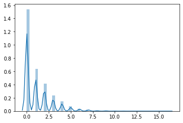
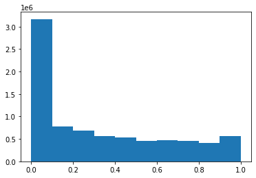
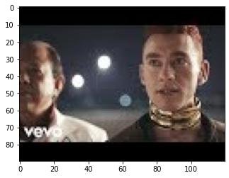
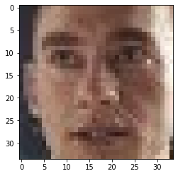
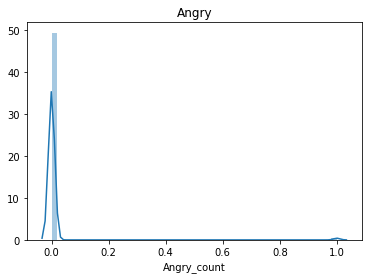
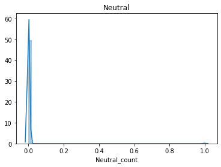
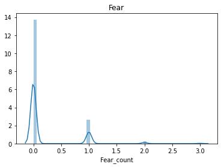
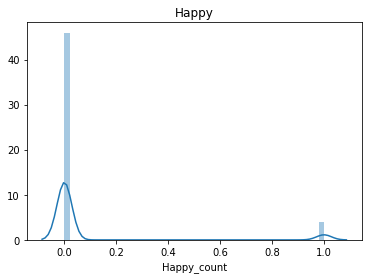

```python
import os

DOWNLOAD_IMAGES = False
GENERATE_OCR = False
CORRECT_THUMBNAIL_OCR = False

path = "../data/"
models_path = "../models"
files = os.listdir(path)
files
```


    ['US_category_id.json',
     '_vecs.tsv',
     'filename2text.json',
     'meta.tsv',
     'US_videos_5p.csv',
     'GB_category_id.json',
     'images.zip',
     'errors.txt',
     'title_meta.tsv',
     'vecs.tsv',
     'descriptions.csv',
     'channel_title_meta.tsv',
     'channel_title_vecs.tsv',
     'images',
     'title_vecs.tsv',
     'tags_meta.tsv',
     '_meta.tsv',
     'corrected_thumbnail.json',
     'thumbnail_ocr_vecs.tsv',
     'thumbnail_ocr_meta.tsv',
     'tags_vecs.tsv',
     'GB_videos_5p.csv',
     'errors copy.txt']


```python
import pandas as pd

pd.set_option("colwidth", None)

GB_videos_df = pd.read_csv(path + "/" + "GB_videos_5p.csv", sep=";", engine="python")
US_videos_df = pd.read_csv(path + "/" + "US_videos_5p.csv", sep=";", engine="python")

df = pd.concat([GB_videos_df, US_videos_df]).drop_duplicates().reset_index(drop=True)
```


```python
df.columns
```


    Index(['video_id', 'trending_date', 'title', 'channel_title', 'category_id',
           'publish_time', 'tags', 'views', 'likes', 'dislikes', 'comment_count',
           'thumbnail_link', 'comments_disabled', 'ratings_disabled',
           'video_error_or_removed', 'description '],
          dtype='object')


```python
len(df['thumbnail_link'].unique()), len(df['thumbnail_link'])
```


    (8608, 78255)


```python
df['video_id'].head()
```


    0    Jw1Y-zhQURU
    1    3s1rvMFUweQ
    2    n1WpP7iowLc
    3    PUTEiSjKwJU
    4    rHwDegptbI4
    Name: video_id, dtype: object


# Thumbnails analysis

## Downloading images


```python
images_path = os.path.join(path, "images")
try:
    os.mkdir(images_path)
except FileExistsError:
    pass

def url2filename(url):
    return url.replace("/", "")

# get content and write it to file
def write_to_file(filename, content):
    f = open(filename, 'wb')
    f.write(content)
    f.close()

from urllib.request import urlopen
from concurrent.futures import ThreadPoolExecutor

URLs = df['thumbnail_link'].unique()

import concurrent.futures
import urllib.request

# Retrieve a single page and report the URL and contents
def load_url(url, timeout):
    with urllib.request.urlopen(url, timeout=timeout) as conn:
        return conn.read()

# We can use a with statement to ensure threads are cleaned up promptly
def download_urls(urls, images_path, url2filename_func):
    with concurrent.futures.ThreadPoolExecutor(max_workers=5) as executor:
        # Start the load operations and mark each future with its URL
        future_to_url = {executor.submit(load_url, url, 60): url for url in URLs}
        for future in concurrent.futures.as_completed(future_to_url):
            url = future_to_url[future]
            try:
                data = future.result()
            except Exception as exc:
                if not "HTTP Error 404" in str(exc):
                    print('%r generated an exception: %s' % (url, exc))
            else:
                write_to_file(os.path.join(images_path, url2filename_func(url)), data)

if DOWNLOAD_IMAGES:
     download_urls(URLs, images_path, url2filename)
```

## Text recognition


```python
import matplotlib.pyplot as plt
import tensorflow as tf
import keras_ocr
import pathlib
```


```python
pipeline = keras_ocr.pipeline.Pipeline()
```

    Looking for /home/maaslak/.keras-ocr/craft_mlt_25k.h5
    WARNING:tensorflow:From /home/maaslak/PycharmProjects/ped/venv/lib/python3.8/site-packages/tensorflow/python/keras/backend.py:5869: sparse_to_dense (from tensorflow.python.ops.sparse_ops) is deprecated and will be removed in a future version.
    Instructions for updating:
    Create a `tf.sparse.SparseTensor` and use `tf.sparse.to_dense` instead.
    Looking for /home/maaslak/.keras-ocr/crnn_kurapan.h5


```python
data_dir = pathlib.Path(images_path)
print(data_dir)
```

    ../data/images


```python
image_count = len(list(data_dir.glob('*.jpg')))
image_count
```


    7929


```python
list_ds = tf.data.Dataset.list_files(str(data_dir/'*'))
```


```python
AUTOTUNE = 10
BATCH_SIZE = 250
IMG_WIDTH, IMG_HEIGHT = 90, 120

def decode_img(img):
    # convert the compressed string to a 3D uint8 tensor
    img = tf.image.decode_jpeg(img, channels=3)
    # Use `convert_image_dtype` to convert to floats in the [0,1] range.
    img = tf.image.convert_image_dtype(img, tf.float32)
    # resize the image to the desired size.
    return tf.image.resize(img, [IMG_WIDTH, IMG_HEIGHT])

def process_path(file_path):
    # load the raw data from the file as a string
    img = tf.io.read_file(file_path)
    img = decode_img(img)
    return img, file_path

ds = list_ds.map(process_path) # , num_parallel_calls=AUTOTUNE)
ds = ds.batch(BATCH_SIZE)
ds = ds.repeat()
```


```python
import json
ocr_file_path = os.path.join(path, 'filename2text.json')
def genarete_texts_dict(ds, num_steps):
    descriptions = {}
    for i, (img_batch, filenames_batch) in enumerate(ds):
        print(f"Step {i + 1}/{num_steps}")
        if i == num_steps:
            break
        prediction_groups = pipeline.recognize(img_batch.numpy() * 256)
        texts = [" ".join([item[0] for item in group])for group in prediction_groups] # joining words into sentence
        for filename, text in zip(filenames_batch.numpy(), texts):
            descriptions[filename.decode().split("/")[-1][:-4]] = text
    return descriptions

if GENERATE_OCR:
    filename2text = genarete_texts_dict(ds, int(image_count/BATCH_SIZE) + 1)
    with open(ocr_file_path, 'w') as fp:
        json.dump(filename2text, fp)
else:
    with open(ocr_file_path, 'r') as f:
        filename2text = json.load(f)
```

### Correcting words

#### Create known words from descriptions


```python
descriptions_path = os.path.join(path, 'descriptions.csv')
df['description '].to_csv(descriptions_path, index=False, sep=" ")
```


```python
import re 
preprocessed_descriptions = pd.Series([
    " ".join([word for word in re.split(r"[^a-zA-Z]", sentence.replace("\\n", " ")) if len(word) < 15 and len(word) > 2])
    for sentence in df['description '].unique() if type(sentence) == str
])
preprocessed_descriptions.to_csv(descriptions_path, index=False, sep=" ")
```


```python
from spellchecker import SpellChecker

spell = SpellChecker()
spell.word_frequency.load_text_file(descriptions_path)
```


```python
spell.word_frequency._longest_word_length
```


    32


```python
import timeit
thumbnails_path = os.path.join(path, 'corrected_thumbnail.json')
start = timeit.default_timer()
if False:
    result = {}
    for i, (key, value) in enumerate(filename2text.items()):
        if i % 500 == 0:
            print(f"{i}/{len(filename2text)}")
            stop = timeit.default_timer()
            print('Time: ', stop - start)
            start = stop
        if value:
            result[key] = " ".join([spell.correction(word) for word in value.split(" ")])
        else :
            result[key] = value
    with open(thumbnails_path, 'w') as fp:
        json.dump(result, fp)
else:
    with open(thumbnails_path) as fp:
        result = json.load(fp)
```

#### Visualization of results


```python
def show_batch(image_batch, labels=None):
    plt.figure(figsize=(10,10))
    for n in range(25):
        ax = plt.subplot(5,5,n+1)
        plt.imshow(image_batch[n])
        plt.axis('off')
        if labels:
            plt.title(labels[n])
    plt.tight_layout()


image_batch, filenames = next(iter(ds))

show_batch(image_batch.numpy(), [result[str(filename).split("/")[-1][:-5]] for filename in filenames[:25].numpy()])
```


```python
df['thumbnail_ocr'] = df['thumbnail_link'].map(lambda x: result[url2filename(x)[:-4]] if url2filename(x)[:-4] in result else "")
```

#### Apply text processing


```python
import io
import os

import tensorflow as tf
import tensorflow_hub as hub
import numpy as np

tf.__version__
```


    '2.2.0-rc2'


```python
#  encoder = info.features['text'].encoder
def write_embedding_files(labels, embedded_ndarray, path=path, prefix=""):
    out_v = io.open(os.path.join(path, f"{prefix}_vecs.tsv"), "w", encoding="utf-8")
    out_m = io.open(os.path.join(path, f"{prefix}_meta.tsv"), "w", encoding="utf-8")
    vectors = embedded_ndarray
    for message, vector in zip(labels, vectors):
        out_m.write(message + "\n")
        out_v.write("\t".join([str(x) for x in vector]) + "\n")
    out_v.close()
    out_m.close()
```


```python
embed = hub.load("https://tfhub.dev/google/universal-sentence-encoder/4")
```


```python
def calc_embeddings(df, column_names, write_visualizations_files=False):
    extended_df = df
    for column in column_names:
        # batch_processing
        batch_size = 1000
        input_col = df[column].to_numpy()
        num_it = len(input_col) // batch_size

        result = np.zeros(shape=[len(input_col), 512])
        for i in range(num_it):
            result[batch_size * i: batch_size * (i + 1)]= embed(input_col[batch_size * i: batch_size * (i + 1)]).numpy()
        if len(input_col) % batch_size:
            result[batch_size * i:]= embed(input_col[batch_size * i:]).numpy()
        if write_visualizations_files:
            unique_inputs, unique_indexes = np.unique(input_col, return_index=True) 
            write_embedding_files(unique_inputs, result[unique_indexes], prefix=column)
        extended_df[f"{column}_embed"] = list(result)
    return extended_df

extended_df = calc_embeddings(df, ["thumbnail_ocr"], True) # , "description" Description doesnt work...
```

#### OCR lengths

> Conclusion: There are a lot of thumbnails without text detected, but median and mean values show that there are aproximately 1 word per image,
    which could be informative as well


```python
import seaborn as sns
import nltk
nltk.download('punkt')
from nltk.tokenize import word_tokenize

lengths = []
for t in df["thumbnail_ocr"].to_numpy():
    lengths.append(len(word_tokenize(t)))

print(pd.DataFrame({"length_statistics": lengths}).describe())
df["thumbnail_ocr_length"] = df["thumbnail_ocr"].apply(lambda x : len(word_tokenize(x)))
sns.distplot(lengths)
```

    [nltk_data] Downloading package punkt to /home/maaslak/nltk_data...
    [nltk_data]   Package punkt is already up-to-date!


           length_statistics
    count       78255.000000
    mean            1.165651
    std             1.599159
    min             0.000000
    25%             0.000000
    50%             1.000000
    75%             2.000000
    max            16.000000


    <matplotlib.axes._subplots.AxesSubplot at 0x7f3b64dec3d0>





# Emotions analysis


```python
import face_recognition
```


```python
image_batch.numpy()[0].shape
plt.hist(np.reshape(image_batch.numpy(), [-1]))
```


    (array([3170164.,  783406.,  681412.,  563154.,  530484.,  461403.,
             476414.,  462545.,  405359.,  565659.]),
     array([0. , 0.1, 0.2, 0.3, 0.4, 0.5, 0.6, 0.7, 0.8, 0.9, 1. ],
           dtype=float32),
     <a list of 10 Patch objects>)





#### First face at the image visualization


```python
image_batch, filenames = next(iter(ds))
plt.imshow(image_batch[0])
plt.show()
```





```python
image = tf.image.convert_image_dtype(image_batch, tf.uint8).numpy()[0]
face_locations = face_recognition.face_locations(image, number_of_times_to_upsample=2, model="cnn")
if face_locations:
    top, right, bottom, left = face_locations[0]
    face_image = image[top:bottom, left:right]
```


```python
plt.imshow(face_image)
plt.show()
```





```python
from tensorflow.keras.models import load_model
```


```python
face_locations
```


    [(21, 103, 55, 69)]


```python
face_recognition_model = load_model(os.path.join(models_path, "face_recognition.hdf5"))
```

    WARNING:tensorflow:Error in loading the saved optimizer state. As a result, your model is starting with a freshly initialized optimizer.


    WARNING:tensorflow:Error in loading the saved optimizer state. As a result, your model is starting with a freshly initialized optimizer.


#### Detected emotion


```python
emotions_map = {'Angry': 0, 'Sad': 5, 'Neutral': 4, 'Disgust': 1, 'Surprise': 6, 'Fear': 2, 'Happy': 3}
emotions_map_inv = {value: key for key, value in emotions_map.items()}
emotions_map_inv[np.argmax(face_recognition_model.predict(tf.image.rgb_to_grayscale(tf.image.resize([face_image], [48, 48]))))]
```


    'Surprise'


```python
from collections import Counter

def transform_face_image(img):
    return tf.image.rgb_to_grayscale(tf.image.resize(img, [48, 48])).numpy()

def genarete_emotions_counts(ds, num_steps):
    emotions = {}
    for i, (img_batch, filenames_batch) in enumerate(ds):
        if i == num_steps:
            break
        print(f"Step {i + 1}/{num_steps}")
        images = tf.image.convert_image_dtype(image_batch, tf.uint8).numpy()
        face_images = [
            [
                image[location[0]:location[2], location[3]:location[1]]
                for location in face_recognition.face_locations(image, number_of_times_to_upsample=2, model="cnn")
            ] 
            for image in images
        ]
        for filename, face_images_per_img in zip(filenames_batch.numpy(), face_images):
            key = filename.decode().split("/")[-1][:-4]
            if face_images_per_img:
                models_input = np.array(list(map(transform_face_image, face_images_per_img)))
                predicted_emotions = list(map(lambda x: emotions_map_inv[x], np.argmax(face_recognition_model.predict(models_input), axis=1)))
                emotions[key] = Counter(predicted_emotions)
            else:
                emotions[key] = Counter()
    return emotions
emotions_dict = genarete_emotions_counts(ds, int(image_count/BATCH_SIZE) + 1)
```

    Step 1/32
    Step 2/32
    Step 3/32
    Step 4/32
    Step 5/32
    Step 6/32
    Step 7/32
    Step 8/32
    Step 9/32
    Step 10/32
    Step 11/32
    Step 12/32
    Step 13/32
    Step 14/32
    Step 15/32
    Step 16/32
    Step 17/32
    Step 18/32
    Step 19/32
    Step 20/32
    Step 21/32
    Step 22/32
    Step 23/32
    Step 24/32
    Step 25/32
    Step 26/32
    Step 27/32
    Step 28/32
    Step 29/32
    Step 30/32
    Step 31/32
    Step 32/32


```python
len(emotions_dict), emotions_dict[list(emotions_dict.keys())[0]], list(emotions_dict.keys())[0]
```


    (7929, Counter({'Surprise': 1}), 'https:i.ytimg.comviTxY10VhmLR4default')


#### Constructing columns


```python
def gen_column_value(thumbnail_url, emotion):
    filename = url2filename(thumbnail_url)[:-4]
    # print(filename)
    if filename in emotions_dict:
        counter = emotions_dict[filename]
        if emotion in counter:
            return counter[emotion]
    return 0

for emotion in emotions_map:
    emotion_count = df["thumbnail_link"].apply(lambda x: gen_column_value(x, emotion))
    if emotion_count.max() > 0:
        df[f"{emotion}_count"] = emotion_count
        sns.distplot(df[f"{emotion}_count"]).set_title(emotion)
        plt.show()

```














Conlusions
> Only some of emotions are present at the images


```python
df[['Angry_count', 'Neutral_count', 'Surprise_count', 'Fear_count', 'Happy_count']].describe()
```


<div>
<style scoped>
    .dataframe tbody tr th:only-of-type {
        vertical-align: middle;
    }

    .dataframe tbody tr th {
        vertical-align: top;
    }

    .dataframe thead th {
        text-align: right;
    }
</style>
<table border="1" class="dataframe">
  <thead>
    <tr style="text-align: right;">
      <th></th>
      <th>Angry_count</th>
      <th>Neutral_count</th>
      <th>Surprise_count</th>
      <th>Fear_count</th>
      <th>Happy_count</th>
    </tr>
  </thead>
  <tbody>
    <tr>
      <th>count</th>
      <td>78255.000000</td>
      <td>78255.000000</td>
      <td>78255.000000</td>
      <td>78255.000000</td>
      <td>78255.000000</td>
    </tr>
    <tr>
      <th>mean</th>
      <td>0.011309</td>
      <td>0.003437</td>
      <td>0.218810</td>
      <td>0.199642</td>
      <td>0.081388</td>
    </tr>
    <tr>
      <th>std</th>
      <td>0.105742</td>
      <td>0.058530</td>
      <td>0.503779</td>
      <td>0.461905</td>
      <td>0.273431</td>
    </tr>
    <tr>
      <th>min</th>
      <td>0.000000</td>
      <td>0.000000</td>
      <td>0.000000</td>
      <td>0.000000</td>
      <td>0.000000</td>
    </tr>
    <tr>
      <th>25%</th>
      <td>0.000000</td>
      <td>0.000000</td>
      <td>0.000000</td>
      <td>0.000000</td>
      <td>0.000000</td>
    </tr>
    <tr>
      <th>50%</th>
      <td>0.000000</td>
      <td>0.000000</td>
      <td>0.000000</td>
      <td>0.000000</td>
      <td>0.000000</td>
    </tr>
    <tr>
      <th>75%</th>
      <td>0.000000</td>
      <td>0.000000</td>
      <td>0.000000</td>
      <td>0.000000</td>
      <td>0.000000</td>
    </tr>
    <tr>
      <th>max</th>
      <td>1.000000</td>
      <td>1.000000</td>
      <td>3.000000</td>
      <td>3.000000</td>
      <td>1.000000</td>
    </tr>
  </tbody>
</table>
</div>


#### Emotions visualization


```python
image_batch, filenames = next(iter(ds))
show_batch(image_batch.numpy(), [list(emotions_dict[str(filename).split("/")[-1][:-5]].keys()) for filename in filenames[:25].numpy()])
```


