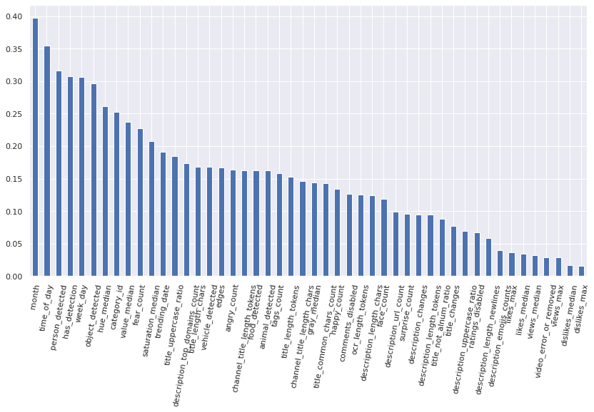
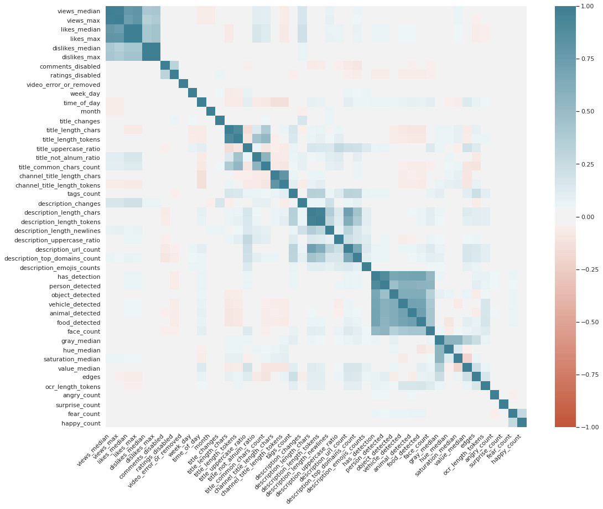
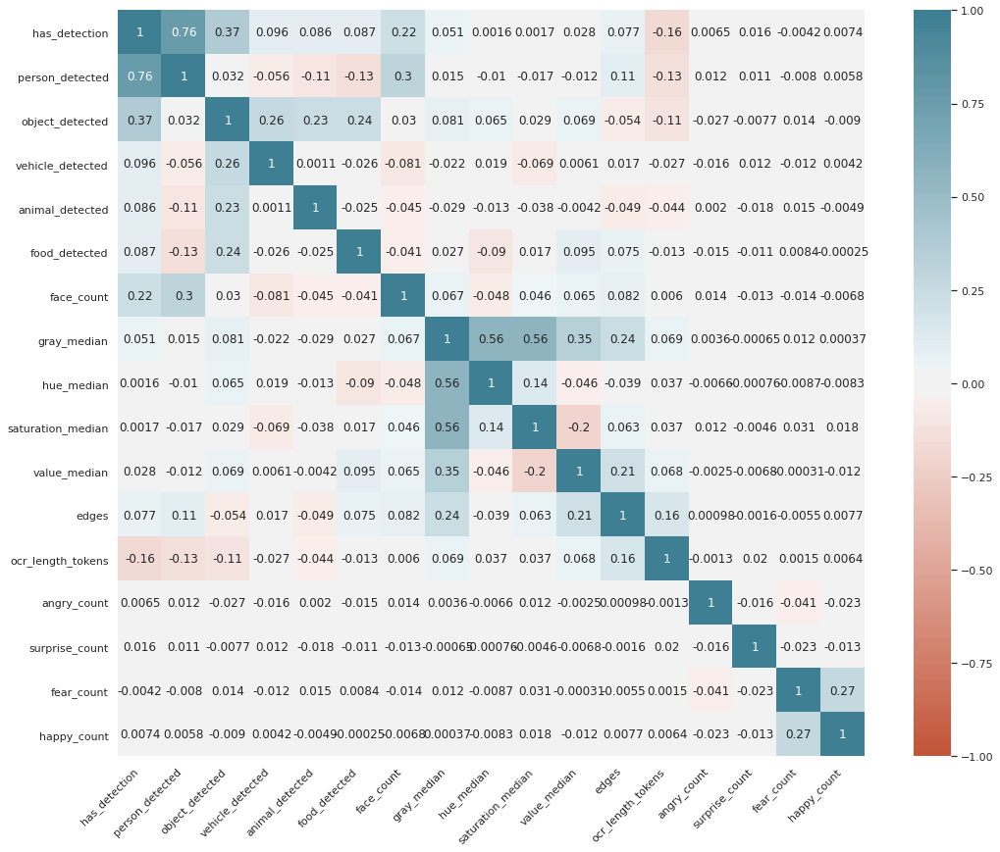
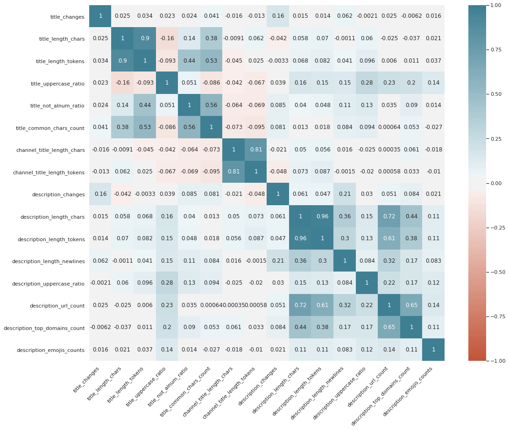
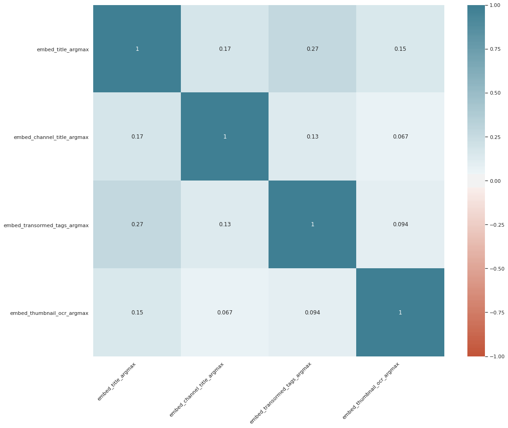
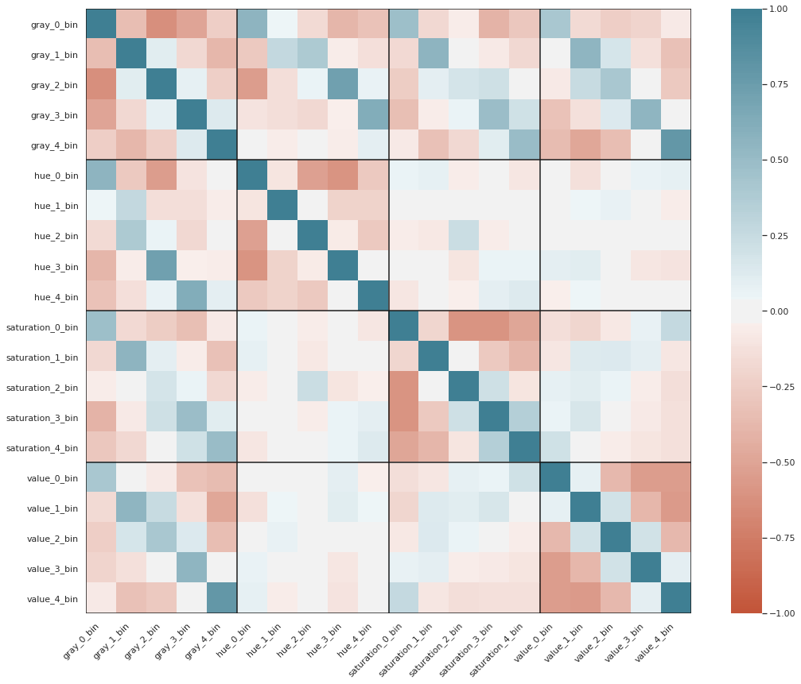
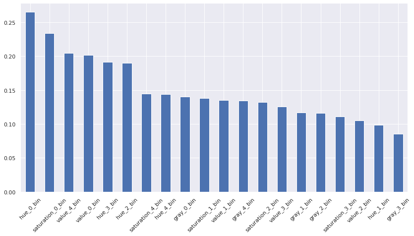
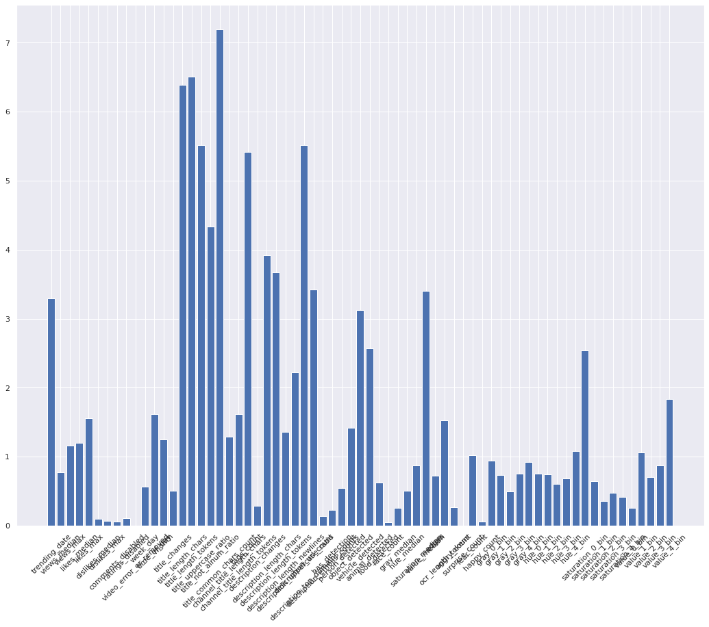
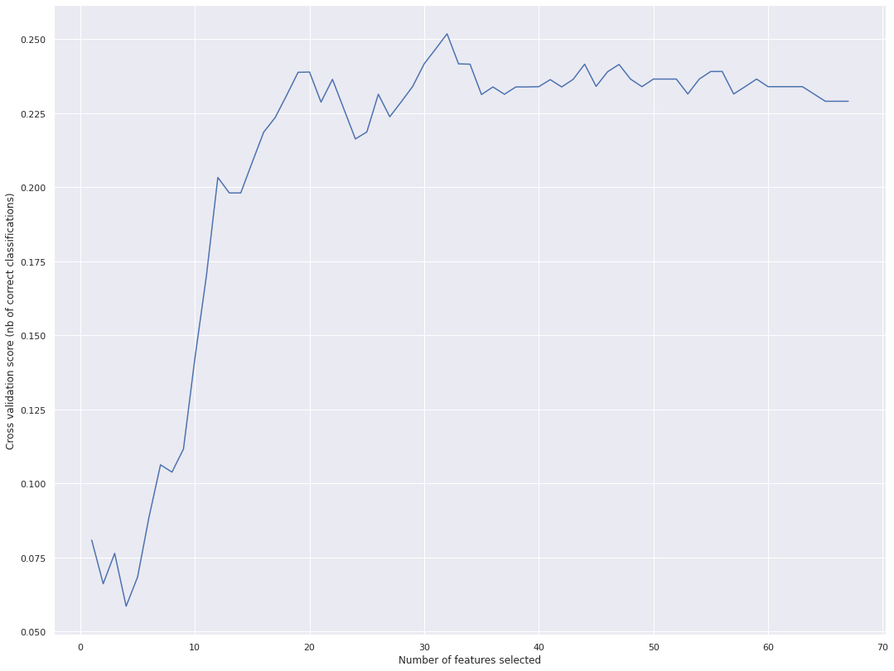

### Load dataframes with text and visual attributes


```python
import pandas as pd
import numpy as np
import os
import scipy.spatial
import scipy.stats as ss

FIGURES_DIR=os.path.join('..', 'figures')
```


```python
text_df = pd.read_csv(os.path.join('..', 'data', 'text_attributes_bedzju.csv'))
img_df = pd.read_csv(os.path.join('..', 'data', 'image_attributes_bedzju.csv'))
img_df_2 = pd.read_csv(os.path.join('..', 'data', 'image_attributes_nawrba.csv'))
text_df_2 = pd.read_csv(os.path.join('..', 'data', 'text_attributes_nawrba.csv'))
```

#### Text DF preview


```python
print(text_df.shape, img_df_2.shape, text_df_2.shape)
text_df.head()
```

#### Visual DF preview


```python
# need to convert 'list strings' into numpy arrays
for cname in img_df.columns:
    if 'histogram' in cname:
        img_df[cname] = img_df[cname].apply(lambda x : np.fromstring(x[1:-1], sep=' '))

print(img_df.shape)
img_df.head()
```

    (7929, 17)


<div>
<style scoped>
    .dataframe tbody tr th:only-of-type {
        vertical-align: middle;
    }

    .dataframe tbody tr th {
        vertical-align: top;
    }

    .dataframe thead th {
        text-align: right;
    }
</style>
<table border="1" class="dataframe">
  <thead>
    <tr style="text-align: right;">
      <th></th>
      <th>image_filename</th>
      <th>has_detection</th>
      <th>person_detected</th>
      <th>object_detected</th>
      <th>vehicle_detected</th>
      <th>animal_detected</th>
      <th>food_detected</th>
      <th>face_count</th>
      <th>gray_histogram</th>
      <th>gray_median</th>
      <th>hue_histogram</th>
      <th>hue_median</th>
      <th>saturation_histogram</th>
      <th>saturation_median</th>
      <th>value_histogram</th>
      <th>value_median</th>
      <th>edges</th>
    </tr>
  </thead>
  <tbody>
    <tr>
      <th>0</th>
      <td>https_i.ytimg.comvi--uXQQ0h-yQdefault.jpg</td>
      <td>True</td>
      <td>True</td>
      <td>False</td>
      <td>False</td>
      <td>False</td>
      <td>False</td>
      <td>0</td>
      <td>[0.56368464, 0.21678922, 0.09207516, 0.0373774...</td>
      <td>37.0</td>
      <td>[0.26691176, 0.08345588, 0.39693627, 0.2202205...</td>
      <td>75.0</td>
      <td>[0.87046569, 0.10588235, 0.01948529, 0.0017156...</td>
      <td>13.0</td>
      <td>[0.51605392, 0.10747549, 0.02647059, 0.0368872...</td>
      <td>46.0</td>
      <td>0.112990</td>
    </tr>
    <tr>
      <th>1</th>
      <td>https_i.ytimg.comvi-0CMnp02rNYdefault.jpg</td>
      <td>True</td>
      <td>True</td>
      <td>True</td>
      <td>False</td>
      <td>False</td>
      <td>False</td>
      <td>0</td>
      <td>[0.40555556, 0.12136438, 0.19681373, 0.1421568...</td>
      <td>94.0</td>
      <td>[0.57487745, 0.03345588, 0.19375, 0.14632353, ...</td>
      <td>20.0</td>
      <td>[0.5060049, 0.16580882, 0.10637255, 0.08860294...</td>
      <td>49.0</td>
      <td>[0.11348039, 0.12941176, 0.1942402, 0.29375, 0...</td>
      <td>163.0</td>
      <td>0.261029</td>
    </tr>
    <tr>
      <th>2</th>
      <td>https_i.ytimg.comvi-0NYY8cqdiQdefault.jpg</td>
      <td>True</td>
      <td>True</td>
      <td>True</td>
      <td>False</td>
      <td>False</td>
      <td>False</td>
      <td>0</td>
      <td>[0.43378268, 0.11102941, 0.15535131, 0.1228758...</td>
      <td>84.0</td>
      <td>[0.62095588, 0.02291667, 0.21213235, 0.0965686...</td>
      <td>17.0</td>
      <td>[0.53235294, 0.16678922, 0.09522059, 0.0801470...</td>
      <td>46.0</td>
      <td>[0.13504902, 0.09522059, 0.11838235, 0.2459558...</td>
      <td>193.0</td>
      <td>0.223775</td>
    </tr>
    <tr>
      <th>3</th>
      <td>https_i.ytimg.comvi-1Hm41N0dUsdefault.jpg</td>
      <td>True</td>
      <td>True</td>
      <td>True</td>
      <td>False</td>
      <td>False</td>
      <td>False</td>
      <td>0</td>
      <td>[0.47855392, 0.13018791, 0.12593954, 0.1450571...</td>
      <td>61.0</td>
      <td>[0.75759804, 0.0254902, 0.00955882, 0.0060049,...</td>
      <td>9.0</td>
      <td>[0.36776961, 0.20686275, 0.21568627, 0.0948529...</td>
      <td>85.0</td>
      <td>[0.2932598, 0.16629902, 0.15379902, 0.14068627...</td>
      <td>112.0</td>
      <td>0.168750</td>
    </tr>
    <tr>
      <th>4</th>
      <td>https_i.ytimg.comvi-1yT-K3c6YIdefault.jpg</td>
      <td>True</td>
      <td>True</td>
      <td>False</td>
      <td>False</td>
      <td>False</td>
      <td>False</td>
      <td>1</td>
      <td>[0.28815359, 0.20959967, 0.15089869, 0.1824754...</td>
      <td>102.0</td>
      <td>[0.43982843, 0.02377451, 0.10306373, 0.1008578...</td>
      <td>96.0</td>
      <td>[0.30772059, 0.4127451, 0.1877451, 0.05870098,...</td>
      <td>77.0</td>
      <td>[0.10968137, 0.14448529, 0.09252451, 0.1848039...</td>
      <td>197.0</td>
      <td>0.268260</td>
    </tr>
  </tbody>
</table>
</div>


### Join dataframes with visual and text attributes


```python
text_df["image_filename"] = text_df["thumbnail_link"].apply(lambda x : x.replace('/', '').replace(':', '_'))

df = pd.concat([text_df, text_df_2, img_df_2], axis=1).set_index("image_filename").join(img_df.set_index("image_filename"))
print(df.shape)
print(df.columns)

df = df.reset_index()
df.head()
```

    (78255, 62)
    Index(['video_id', 'trending_date', 'title', 'channel_title', 'category_id',
           'publish_time', 'tags', 'views', 'likes', 'dislikes', 'comment_count',
           'thumbnail_link', 'comments_disabled', 'ratings_disabled',
           'video_error_or_removed', 'description', 'week_day', 'time_of_day',
           'month', 'title_length_chars', 'title_length_tokens',
           'title_uppercase_ratio', 'title_not_alnum_ratio',
           'title_common_chars_count', 'channel_title_length_chars',
           'channel_title_length_tokens', 'tags_count', 'description_length_chars',
           'description_length_tokens', 'description_length_newlines',
           'description_uppercase_ratio', 'description_url_count',
           'description_top_domains_count', 'Unnamed: 0', 'emojis_counts',
           'title_embed', 'channel_title_embed', 'transormed_tags',
           'transormed_tags_embed', 'thumbnail_link', 'thumbnail_ocr_embed',
           'thumbnail_ocr_length', 'angry_count', 'surprise_count', 'fear_count',
           'happy_count', 'has_detection', 'person_detected', 'object_detected',
           'vehicle_detected', 'animal_detected', 'food_detected', 'face_count',
           'gray_histogram', 'gray_median', 'hue_histogram', 'hue_median',
           'saturation_histogram', 'saturation_median', 'value_histogram',
           'value_median', 'edges'],
          dtype='object')


<div>
<style scoped>
    .dataframe tbody tr th:only-of-type {
        vertical-align: middle;
    }

    .dataframe tbody tr th {
        vertical-align: top;
    }

    .dataframe thead th {
        text-align: right;
    }
</style>
<table border="1" class="dataframe">
  <thead>
    <tr style="text-align: right;">
      <th></th>
      <th>image_filename</th>
      <th>video_id</th>
      <th>trending_date</th>
      <th>title</th>
      <th>channel_title</th>
      <th>category_id</th>
      <th>publish_time</th>
      <th>tags</th>
      <th>views</th>
      <th>likes</th>
      <th>...</th>
      <th>face_count</th>
      <th>gray_histogram</th>
      <th>gray_median</th>
      <th>hue_histogram</th>
      <th>hue_median</th>
      <th>saturation_histogram</th>
      <th>saturation_median</th>
      <th>value_histogram</th>
      <th>value_median</th>
      <th>edges</th>
    </tr>
  </thead>
  <tbody>
    <tr>
      <th>0</th>
      <td>https_i.ytimg.comvi--uXQQ0h-yQdefault.jpg</td>
      <td>XXX11</td>
      <td>17.25.12</td>
      <td>Paul McCartney - Pipes of Peace</td>
      <td>PonteFractus</td>
      <td>NaN</td>
      <td>2008-11-24T17:59:52.000Z</td>
      <td>ww1|"great"|"war"|"trenches"|"tommies"</td>
      <td>24723</td>
      <td>216</td>
      <td>...</td>
      <td>0.0</td>
      <td>[0.56368464, 0.21678922, 0.09207516, 0.0373774...</td>
      <td>37.0</td>
      <td>[0.26691176, 0.08345588, 0.39693627, 0.2202205...</td>
      <td>75.0</td>
      <td>[0.87046569, 0.10588235, 0.01948529, 0.0017156...</td>
      <td>13.0</td>
      <td>[0.51605392, 0.10747549, 0.02647059, 0.0368872...</td>
      <td>46.0</td>
      <td>0.11299</td>
    </tr>
    <tr>
      <th>1</th>
      <td>https_i.ytimg.comvi--uXQQ0h-yQdefault.jpg</td>
      <td>XXX11</td>
      <td>17.26.12</td>
      <td>Paul McCartney - Pipes of Peace</td>
      <td>PonteFractus</td>
      <td>NaN</td>
      <td>2008-11-24T17:59:52.000Z</td>
      <td>ww1|"great"|"war"|"trenches"|"tommies"</td>
      <td>26299</td>
      <td>234</td>
      <td>...</td>
      <td>0.0</td>
      <td>[0.56368464, 0.21678922, 0.09207516, 0.0373774...</td>
      <td>37.0</td>
      <td>[0.26691176, 0.08345588, 0.39693627, 0.2202205...</td>
      <td>75.0</td>
      <td>[0.87046569, 0.10588235, 0.01948529, 0.0017156...</td>
      <td>13.0</td>
      <td>[0.51605392, 0.10747549, 0.02647059, 0.0368872...</td>
      <td>46.0</td>
      <td>0.11299</td>
    </tr>
    <tr>
      <th>2</th>
      <td>https_i.ytimg.comvi--uXQQ0h-yQdefault.jpg</td>
      <td>XXX11</td>
      <td>17.27.12</td>
      <td>Paul McCartney - Pipes of Peace</td>
      <td>PonteFractus</td>
      <td>NaN</td>
      <td>2008-11-24T17:59:52.000Z</td>
      <td>ww1|"great"|"war"|"trenches"|"tommies"</td>
      <td>27022</td>
      <td>235</td>
      <td>...</td>
      <td>0.0</td>
      <td>[0.56368464, 0.21678922, 0.09207516, 0.0373774...</td>
      <td>37.0</td>
      <td>[0.26691176, 0.08345588, 0.39693627, 0.2202205...</td>
      <td>75.0</td>
      <td>[0.87046569, 0.10588235, 0.01948529, 0.0017156...</td>
      <td>13.0</td>
      <td>[0.51605392, 0.10747549, 0.02647059, 0.0368872...</td>
      <td>46.0</td>
      <td>0.11299</td>
    </tr>
    <tr>
      <th>3</th>
      <td>https_i.ytimg.comvi--uXQQ0h-yQdefault.jpg</td>
      <td>XXX11</td>
      <td>17.28.12</td>
      <td>Paul McCartney - Pipes of Peace</td>
      <td>PonteFractus</td>
      <td>NaN</td>
      <td>2008-11-24T17:59:52.000Z</td>
      <td>ww1|"great"|"war"|"trenches"|"tommies"</td>
      <td>27413</td>
      <td>241</td>
      <td>...</td>
      <td>0.0</td>
      <td>[0.56368464, 0.21678922, 0.09207516, 0.0373774...</td>
      <td>37.0</td>
      <td>[0.26691176, 0.08345588, 0.39693627, 0.2202205...</td>
      <td>75.0</td>
      <td>[0.87046569, 0.10588235, 0.01948529, 0.0017156...</td>
      <td>13.0</td>
      <td>[0.51605392, 0.10747549, 0.02647059, 0.0368872...</td>
      <td>46.0</td>
      <td>0.11299</td>
    </tr>
    <tr>
      <th>4</th>
      <td>https_i.ytimg.comvi--uXQQ0h-yQdefault.jpg</td>
      <td>XXX11</td>
      <td>17.29.12</td>
      <td>Paul McCartney - Pipes of Peace</td>
      <td>PonteFractus</td>
      <td>NaN</td>
      <td>2008-11-24T17:59:52.000Z</td>
      <td>ww1|"great"|"war"|"trenches"|"tommies"</td>
      <td>27689</td>
      <td>243</td>
      <td>...</td>
      <td>0.0</td>
      <td>[0.56368464, 0.21678922, 0.09207516, 0.0373774...</td>
      <td>37.0</td>
      <td>[0.26691176, 0.08345588, 0.39693627, 0.2202205...</td>
      <td>75.0</td>
      <td>[0.87046569, 0.10588235, 0.01948529, 0.0017156...</td>
      <td>13.0</td>
      <td>[0.51605392, 0.10747549, 0.02647059, 0.0368872...</td>
      <td>46.0</td>
      <td>0.11299</td>
    </tr>
  </tbody>
</table>
<p>5 rows × 63 columns</p>
</div>


```python
list(df[['channel_title_embed', 'transormed_tags_embed', 'thumbnail_ocr_embed']].dtypes)
```


    [dtype('O'), dtype('O'), dtype('O')]


```python
def cast_to_list(x):
    if x:
        return [float(num) for num in x[1:-1].replace("\n", "").split(" ") if num]
    else:
        return None

for column in ['channel_title_embed', 'transormed_tags_embed', 'thumbnail_ocr_embed', "title_embed"]:
    df[column] = df[column].apply(cast_to_list)
```


```python
df[['channel_title_embed', 'transormed_tags_embed', 'thumbnail_ocr_embed', "title_embed"]].isnull().describe()
```


<div>
<style scoped>
    .dataframe tbody tr th:only-of-type {
        vertical-align: middle;
    }

    .dataframe tbody tr th {
        vertical-align: top;
    }

    .dataframe thead th {
        text-align: right;
    }
</style>
<table border="1" class="dataframe">
  <thead>
    <tr style="text-align: right;">
      <th></th>
      <th>channel_title_embed</th>
      <th>transormed_tags_embed</th>
      <th>thumbnail_ocr_embed</th>
      <th>title_embed</th>
    </tr>
  </thead>
  <tbody>
    <tr>
      <th>count</th>
      <td>78255</td>
      <td>78255</td>
      <td>78255</td>
      <td>78255</td>
    </tr>
    <tr>
      <th>unique</th>
      <td>1</td>
      <td>1</td>
      <td>1</td>
      <td>1</td>
    </tr>
    <tr>
      <th>top</th>
      <td>False</td>
      <td>False</td>
      <td>False</td>
      <td>False</td>
    </tr>
    <tr>
      <th>freq</th>
      <td>78255</td>
      <td>78255</td>
      <td>78255</td>
      <td>78255</td>
    </tr>
  </tbody>
</table>
</div>


## Perform aggregations


```python
def reduce_histogram(series):
    series = list(filter(lambda x : not isinstance(x, float), series))
    if series:
        return tuple(np.mean(series, axis=0))
    else:
        return tuple(np.zeros(5)-1.0)

def max_with_nans(series):
    result = max(series)
    if np.isnan(result):
        return -1.0
    else:
        return float(result) if isinstance(result, bool) else result
    
def reduce_medoid(series):
    series = np.array([row for row in series.to_numpy()])
    dist_matrix = scipy.spatial.distance_matrix(series, series)    
    return tuple(series[np.argmin(dist_matrix.sum(axis=0))])

agg_df = df.groupby("video_id").agg(
    trending_date=("trending_date", lambda s : len(set(s))), # how many days this video was trending,
    category_id=("category_id", lambda s : max(s)), # if a category was given, then take it :)
    publish_time=("publish_time", lambda s : max(s)), # we expect only one publish time anyway
    
    views_median=("views", "median"),
    views_max=("views", "max"),
    
    likes_median=("likes", "median"),
    likes_max=("likes", "max"),
    
    dislikes_median=("dislikes", "median"),
    dislikes_max=("dislikes", "max"),

    comments_disabled=("comments_disabled", "mean"),
    ratings_disabled=('ratings_disabled', "mean"),
    video_error_or_removed=('video_error_or_removed', "mean"),
    
    week_day=('week_day', "max"), # we don't expect different values here
    time_of_day=("time_of_day", "max"), # as they come from publish_time column
    month=('month', "max"),
    
    title_changes=("title", lambda s : len(set(s))), # how many different titles did we have?
    title_length_chars=('title_length_chars', "median"),
    title_length_tokens=("title_length_tokens", "median"),
    title_uppercase_ratio=("title_uppercase_ratio", "mean"),
    title_not_alnum_ratio=("title_not_alnum_ratio", "mean"),
    title_common_chars_count=("title_common_chars_count", "median"),
    
    channel_title_length_chars=("channel_title_length_chars", "median"),
    channel_title_length_tokens=("channel_title_length_tokens", "median"),
    
    tags_count=("tags_count", "median"),
    
    description_changes=("description", lambda s : len(set(s))), # how many changes of description?
    description_length_chars=("description_length_chars", "median"),
    description_length_tokens=("description_length_tokens", "median"),
    description_length_newlines=("description_length_newlines", "median"),
    description_uppercase_ratio=("description_uppercase_ratio", "mean"),
    description_url_count=("description_url_count", "median"),
    description_top_domains_count=("description_top_domains_count", "median"),
    description_emojis_counts = ('emojis_counts', "median"),
    
    has_detection=("has_detection", max_with_nans),
    person_detected=("person_detected", max_with_nans),
    object_detected=("object_detected", max_with_nans),
    vehicle_detected=("vehicle_detected", max_with_nans),
    animal_detected=("animal_detected", max_with_nans),
    food_detected=("food_detected", max_with_nans),
    face_count=("face_count", max_with_nans),
    
    gray_histogram=("gray_histogram", reduce_histogram),
    hue_histogram=("hue_histogram", reduce_histogram),
    saturation_histogram=("saturation_histogram", reduce_histogram),
    value_histogram=("value_histogram", reduce_histogram),
    
    gray_median=("gray_median", "median"),
    hue_median=("hue_median", "median"),
    saturation_median=("saturation_median", "median"),
    value_median=("value_median", "median"),
    edges=("edges", "median"),
    
    ocr_length_tokens=('thumbnail_ocr_length', "median"),
    angry_count=('angry_count', "median"),
    surprise_count=('surprise_count', "median"),
    fear_count=('fear_count', "median"),
    happy_count=('happy_count', "median"),
    
    embed_title=('title_embed', reduce_medoid), 
    embed_channel_title=('channel_title_embed', reduce_medoid),
    embed_transormed_tags=('transormed_tags_embed', reduce_medoid), 
    embed_thumbnail_ocr=('thumbnail_ocr_embed', reduce_medoid),
)
agg_df.head()
```


<div>
<style scoped>
    .dataframe tbody tr th:only-of-type {
        vertical-align: middle;
    }

    .dataframe tbody tr th {
        vertical-align: top;
    }

    .dataframe thead th {
        text-align: right;
    }
</style>
<table border="1" class="dataframe">
  <thead>
    <tr style="text-align: right;">
      <th></th>
      <th>trending_date</th>
      <th>category_id</th>
      <th>publish_time</th>
      <th>views_median</th>
      <th>views_max</th>
      <th>likes_median</th>
      <th>likes_max</th>
      <th>dislikes_median</th>
      <th>dislikes_max</th>
      <th>comments_disabled</th>
      <th>...</th>
      <th>edges</th>
      <th>ocr_length_tokens</th>
      <th>angry_count</th>
      <th>surprise_count</th>
      <th>fear_count</th>
      <th>happy_count</th>
      <th>embed_title</th>
      <th>embed_channel_title</th>
      <th>embed_transormed_tags</th>
      <th>embed_thumbnail_ocr</th>
    </tr>
    <tr>
      <th>video_id</th>
      <th></th>
      <th></th>
      <th></th>
      <th></th>
      <th></th>
      <th></th>
      <th></th>
      <th></th>
      <th></th>
      <th></th>
      <th></th>
      <th></th>
      <th></th>
      <th></th>
      <th></th>
      <th></th>
      <th></th>
      <th></th>
      <th></th>
      <th></th>
      <th></th>
    </tr>
  </thead>
  <tbody>
    <tr>
      <th>-0CMnp02rNY</th>
      <td>6</td>
      <td>NaN</td>
      <td>2018-06-04T13:00:00.000Z</td>
      <td>730129.5</td>
      <td>800359</td>
      <td>9162.5</td>
      <td>9773</td>
      <td>290.0</td>
      <td>332</td>
      <td>0.0</td>
      <td>...</td>
      <td>0.261029</td>
      <td>0</td>
      <td>0</td>
      <td>0</td>
      <td>0</td>
      <td>0</td>
      <td>(-0.00371913332, -0.0168767683, 0.0225340948, ...</td>
      <td>(-0.0549158342, 0.0274216682, 0.0595019385, 0....</td>
      <td>(-0.04590597, -0.03426603, 0.04779967, -0.0468...</td>
      <td>(-0.0356568135, -0.0331957191, 0.0704742745, 0...</td>
    </tr>
    <tr>
      <th>-0NYY8cqdiQ</th>
      <td>1</td>
      <td>NaN</td>
      <td>2018-01-29T14:00:39.000Z</td>
      <td>563746.0</td>
      <td>563746</td>
      <td>4429.0</td>
      <td>4429</td>
      <td>54.0</td>
      <td>54</td>
      <td>0.0</td>
      <td>...</td>
      <td>0.223775</td>
      <td>0</td>
      <td>0</td>
      <td>0</td>
      <td>0</td>
      <td>0</td>
      <td>(0.00032845416, 0.0106091229, -0.0233515855, -...</td>
      <td>(-0.0549158342, 0.0274216682, 0.0595019385, 0....</td>
      <td>(-0.00803639, -0.05238112, 0.05465588, -0.0220...</td>
      <td>(-0.0356568135, -0.0331957191, 0.0704742745, 0...</td>
    </tr>
    <tr>
      <th>-1Hm41N0dUs</th>
      <td>3</td>
      <td>NaN</td>
      <td>2018-04-27T07:30:02.000Z</td>
      <td>1882352.0</td>
      <td>2058516</td>
      <td>38165.0</td>
      <td>41248</td>
      <td>530.0</td>
      <td>580</td>
      <td>0.0</td>
      <td>...</td>
      <td>0.168750</td>
      <td>0</td>
      <td>0</td>
      <td>0</td>
      <td>1</td>
      <td>0</td>
      <td>(0.02845987, -0.03479211, 0.05059669, -0.00171...</td>
      <td>(0.01689476, 0.02873862, 0.04671108, -0.011432...</td>
      <td>(0.02862862, 0.02523988, 0.04522077, -0.013216...</td>
      <td>(-0.0356568135, -0.0331957191, 0.0704742745, 0...</td>
    </tr>
    <tr>
      <th>-1yT-K3c6YI</th>
      <td>4</td>
      <td>22.0</td>
      <td>2017-11-28T18:30:43.000Z</td>
      <td>208271.0</td>
      <td>231341</td>
      <td>7178.5</td>
      <td>7734</td>
      <td>196.5</td>
      <td>212</td>
      <td>0.0</td>
      <td>...</td>
      <td>0.268260</td>
      <td>3</td>
      <td>0</td>
      <td>0</td>
      <td>0</td>
      <td>0</td>
      <td>(-0.0492094941, -0.0301082768, -0.0224586241, ...</td>
      <td>(0.03462418, 0.0363837, 0.06015505, -0.0610783...</td>
      <td>(-0.0609717779, 0.0197733995, 0.0397348553, -0...</td>
      <td>(0.0155941769, -0.055417031, -0.0317068174, -0...</td>
    </tr>
    <tr>
      <th>-2RVw2_QyxQ</th>
      <td>3</td>
      <td>NaN</td>
      <td>2017-11-12T02:39:01.000Z</td>
      <td>69786.0</td>
      <td>71089</td>
      <td>453.0</td>
      <td>460</td>
      <td>26.0</td>
      <td>27</td>
      <td>0.0</td>
      <td>...</td>
      <td>0.182108</td>
      <td>2</td>
      <td>0</td>
      <td>0</td>
      <td>0</td>
      <td>0</td>
      <td>(-0.0724469945, -0.0718068704, 0.0340826772, -...</td>
      <td>(0.017030824, -0.0218540728, -0.0148408422, -0...</td>
      <td>(0.00157200976, 0.0165646076, -0.0321795493, -...</td>
      <td>(-0.0351575203, -0.0193154868, 0.0345676132, 0...</td>
    </tr>
  </tbody>
</table>
<p>5 rows × 57 columns</p>
</div>


### Extract subsets: numeric columns, non-numeric, histograms and videos with category_id given


```python
agg_df_histograms = agg_df[[cname for cname in agg_df.columns if 'histogram' in cname]]
agg_df_numeric = agg_df[[cname for idx, cname in enumerate(agg_df.columns) if agg_df.dtypes[idx] in [np.int64, np.float64]]]
agg_df_not_numeric = agg_df[[cname for idx, cname in enumerate(agg_df.columns) if agg_df.dtypes[idx] not in [np.int64, np.float64]]]
agg_df_embeddings = agg_df[[cname for cname in agg_df.columns if cname.startswith('embed_')]]

categories_df = agg_df[~agg_df["category_id"].isna()]
categories_df.shape
```


    (394, 57)


### Analyze features stats
> In order to do so, we normalize all the values into one range: 0-1, so that the variances are more comparable


```python
# normalized_df = (agg_df_numeric - agg_df_numeric.mean()) / agg_df_numeric.std()

normalized_df = (agg_df_numeric - agg_df_numeric.min()) / (agg_df_numeric.max()-agg_df_numeric.min())

stats = normalized_df.describe()
stats
```


<div>
<style scoped>
    .dataframe tbody tr th:only-of-type {
        vertical-align: middle;
    }

    .dataframe tbody tr th {
        vertical-align: top;
    }

    .dataframe thead th {
        text-align: right;
    }
</style>
<table border="1" class="dataframe">
  <thead>
    <tr style="text-align: right;">
      <th></th>
      <th>trending_date</th>
      <th>category_id</th>
      <th>views_median</th>
      <th>views_max</th>
      <th>likes_median</th>
      <th>likes_max</th>
      <th>dislikes_median</th>
      <th>dislikes_max</th>
      <th>comments_disabled</th>
      <th>ratings_disabled</th>
      <th>...</th>
      <th>gray_median</th>
      <th>hue_median</th>
      <th>saturation_median</th>
      <th>value_median</th>
      <th>edges</th>
      <th>ocr_length_tokens</th>
      <th>angry_count</th>
      <th>surprise_count</th>
      <th>fear_count</th>
      <th>happy_count</th>
    </tr>
  </thead>
  <tbody>
    <tr>
      <th>count</th>
      <td>8607.000000</td>
      <td>394.000000</td>
      <td>8607.000000</td>
      <td>8607.000000</td>
      <td>8607.000000</td>
      <td>8607.000000</td>
      <td>8607.000000</td>
      <td>8607.000000</td>
      <td>8607.000000</td>
      <td>8607.000000</td>
      <td>...</td>
      <td>7929.000000</td>
      <td>7929.000000</td>
      <td>7929.000000</td>
      <td>7929.000000</td>
      <td>7929.000000</td>
      <td>8607.000000</td>
      <td>8607.000000</td>
      <td>8607.000000</td>
      <td>8607.000000</td>
      <td>8607.000000</td>
    </tr>
    <tr>
      <th>mean</th>
      <td>0.203361</td>
      <td>0.684826</td>
      <td>0.008263</td>
      <td>0.006166</td>
      <td>0.010066</td>
      <td>0.010622</td>
      <td>0.001721</td>
      <td>0.001674</td>
      <td>0.016486</td>
      <td>0.004684</td>
      <td>...</td>
      <td>0.372071</td>
      <td>0.340161</td>
      <td>0.332771</td>
      <td>0.502657</td>
      <td>0.496447</td>
      <td>0.091495</td>
      <td>0.027768</td>
      <td>0.009295</td>
      <td>0.054955</td>
      <td>0.018241</td>
    </tr>
    <tr>
      <th>std</th>
      <td>0.191622</td>
      <td>0.253186</td>
      <td>0.031781</td>
      <td>0.028913</td>
      <td>0.034047</td>
      <td>0.037140</td>
      <td>0.016864</td>
      <td>0.016188</td>
      <td>0.126530</td>
      <td>0.066934</td>
      <td>...</td>
      <td>0.143678</td>
      <td>0.261284</td>
      <td>0.207720</td>
      <td>0.237431</td>
      <td>0.166814</td>
      <td>0.125210</td>
      <td>0.164317</td>
      <td>0.095966</td>
      <td>0.227906</td>
      <td>0.133829</td>
    </tr>
    <tr>
      <th>min</th>
      <td>0.000000</td>
      <td>0.000000</td>
      <td>0.000000</td>
      <td>0.000000</td>
      <td>0.000000</td>
      <td>0.000000</td>
      <td>0.000000</td>
      <td>0.000000</td>
      <td>0.000000</td>
      <td>0.000000</td>
      <td>...</td>
      <td>0.000000</td>
      <td>0.000000</td>
      <td>0.000000</td>
      <td>0.000000</td>
      <td>0.000000</td>
      <td>0.000000</td>
      <td>0.000000</td>
      <td>0.000000</td>
      <td>0.000000</td>
      <td>0.000000</td>
    </tr>
    <tr>
      <th>25%</th>
      <td>0.081081</td>
      <td>0.571429</td>
      <td>0.000588</td>
      <td>0.000344</td>
      <td>0.000479</td>
      <td>0.000477</td>
      <td>0.000066</td>
      <td>0.000060</td>
      <td>0.000000</td>
      <td>0.000000</td>
      <td>...</td>
      <td>0.282609</td>
      <td>0.095506</td>
      <td>0.180392</td>
      <td>0.317647</td>
      <td>0.379486</td>
      <td>0.000000</td>
      <td>0.000000</td>
      <td>0.000000</td>
      <td>0.000000</td>
      <td>0.000000</td>
    </tr>
    <tr>
      <th>50%</th>
      <td>0.162162</td>
      <td>0.785714</td>
      <td>0.001897</td>
      <td>0.001142</td>
      <td>0.001964</td>
      <td>0.002002</td>
      <td>0.000238</td>
      <td>0.000215</td>
      <td>0.000000</td>
      <td>0.000000</td>
      <td>...</td>
      <td>0.382609</td>
      <td>0.238764</td>
      <td>0.305882</td>
      <td>0.505882</td>
      <td>0.509368</td>
      <td>0.071429</td>
      <td>0.000000</td>
      <td>0.000000</td>
      <td>0.000000</td>
      <td>0.000000</td>
    </tr>
    <tr>
      <th>75%</th>
      <td>0.270270</td>
      <td>0.821429</td>
      <td>0.005806</td>
      <td>0.003579</td>
      <td>0.006702</td>
      <td>0.006834</td>
      <td>0.000823</td>
      <td>0.000771</td>
      <td>0.000000</td>
      <td>0.000000</td>
      <td>...</td>
      <td>0.460870</td>
      <td>0.589888</td>
      <td>0.454902</td>
      <td>0.682353</td>
      <td>0.619879</td>
      <td>0.142857</td>
      <td>0.000000</td>
      <td>0.000000</td>
      <td>0.000000</td>
      <td>0.000000</td>
    </tr>
    <tr>
      <th>max</th>
      <td>1.000000</td>
      <td>1.000000</td>
      <td>1.000000</td>
      <td>1.000000</td>
      <td>1.000000</td>
      <td>1.000000</td>
      <td>1.000000</td>
      <td>1.000000</td>
      <td>1.000000</td>
      <td>1.000000</td>
      <td>...</td>
      <td>1.000000</td>
      <td>1.000000</td>
      <td>1.000000</td>
      <td>1.000000</td>
      <td>1.000000</td>
      <td>1.000000</td>
      <td>1.000000</td>
      <td>1.000000</td>
      <td>1.000000</td>
      <td>1.000000</td>
    </tr>
  </tbody>
</table>
<p>8 rows × 48 columns</p>
</div>


#### Which columns have the highest variance?


```python
import matplotlib.pyplot as plt

std_deviations = stats.loc["std", :].sort_values(ascending=False)
std_plot = std_deviations.plot.bar(figsize=(14, 7), rot=80)
std_plot.get_figure().savefig("std_dev.pdf")
std_plot.plot()
```


    []





```python
std_deviations[ std_deviations < 0.1 ]
```


    description_url_count          0.098652
    surprise_count                 0.095966
    description_changes            0.095092
    description_length_tokens      0.095028
    title_not_alnum_ratio          0.087673
    title_changes                  0.077628
    description_uppercase_ratio    0.069094
    ratings_disabled               0.066934
    description_length_newlines    0.058986
    description_emojis_counts      0.040044
    likes_max                      0.037140
    likes_median                   0.034047
    views_median                   0.031781
    video_error_or_removed         0.029012
    views_max                      0.028913
    dislikes_median                0.016864
    dislikes_max                   0.016188
    Name: std, dtype: float64


## Feature corerlations
> Using `-1.0` to denote missing values will potentially break the usefulness of correlation coef, so in the next heatmaps we split the features by their 'domain' (text or visual), skipping the missing values. This makes new coefficients more relevant.


```python
import seaborn as sns
sns.set(rc={'figure.figsize':(18, 14)})

corr = agg_df_numeric[[
    cname for cname in agg_df_numeric.columns if cname not in ["trending_date", "category_id"]]
].corr()
ax = sns.heatmap(
    corr, 
    vmin=-1, vmax=1, center=0,
    cmap=sns.diverging_palette(20, 220, n=200),
    square=True
)

xxx = ax.set_xticklabels(
    ax.get_xticklabels(),
    rotation=45,
    horizontalalignment='right'
)
```





```python
ax.get_figure().savefig(os.path.join(FIGURES_DIR, "corr_all.pdf"))
```

## Let's go deeper
### Visual attributes


```python
visual_words = ['detect', 'face', 'gray', 'hue', 'saturation', 'value', 'edges', "ocr_length_tokens", "angry_count", "surprise_count", "fear_count", "happy_count"]
select_columns = [cname for cname in agg_df_numeric.columns if any([word in cname for word in visual_words])]

select_df = agg_df_numeric[select_columns]
select_df = select_df[select_df != -1.0]

corr = select_df.corr()
ax = sns.heatmap(
    corr, 
    vmin=-1, vmax=1, center=0,
    cmap=sns.diverging_palette(20, 220, n=200),
    square=True,
    annot=True
)

xxx = ax.set_xticklabels(
    ax.get_xticklabels(),
    rotation=45,
    horizontalalignment='right'
)
```





```python
ax.get_figure().savefig(os.path.join(FIGURES_DIR, "corr_visual.pdf"))
```

## Title, Channel Title + Description attributes


```python
select_columns = [cname for cname in agg_df_numeric.columns if any([word in cname for word in ["title", "description"]])]

select_df = agg_df_numeric[select_columns]
select_df = select_df[select_df != -1.0]

corr = select_df.corr()
ax = sns.heatmap(
    corr, 
    vmin=-1, vmax=1, center=0,
    cmap=sns.diverging_palette(20, 220, n=200),
    square=True,
    annot=True
)

xxx = ax.set_xticklabels(
    ax.get_xticklabels(),
    rotation=45,
    horizontalalignment='right'
)
```





```python
ax.get_figure().savefig(os.path.join(FIGURES_DIR, "corr_desc.pdf"))
```

## Print most and least correlated feature for each column


```python
import pandas as pd
import numpy as np

for idx, cname in enumerate(corr.index):
    if cname == 'category_id':
        continue
    
    max_corr = np.max(corr.loc[cname, corr.columns != cname])
    closest_idx = np.argmax(corr.loc[cname, (corr.columns != cname) & (corr.columns != "category_id")])
    print(cname, '-', corr.index[closest_idx], ' : ', max_corr)
    
    min_corr = np.min(corr.loc[cname, corr.columns != cname])
    furthest_idx = np.argmin(corr.loc[cname, (corr.columns != cname) & (corr.columns != "category_id")])
    print(cname, '-', corr.index[furthest_idx], ' : ', min_corr)
    
    print()
```

    title_changes - channel_title_length_tokens  :  0.16474094972313402
    title_changes - title_common_chars_count  :  -0.015629006066185218
    
    title_length_chars - title_length_chars  :  0.9012634463796949
    title_length_chars - title_length_tokens  :  -0.15512143365896483
    
    title_length_tokens - title_length_chars  :  0.9012634463796949
    title_length_tokens - title_length_tokens  :  -0.09326520552146714
    
    title_uppercase_ratio - description_length_newlines  :  0.2793320658203535
    title_uppercase_ratio - title_length_chars  :  -0.15512143365896483
    
    title_not_alnum_ratio - title_not_alnum_ratio  :  0.5624862616885521
    title_not_alnum_ratio - channel_title_length_chars  :  -0.0688036227929158
    
    title_common_chars_count - title_not_alnum_ratio  :  0.5624862616885521
    title_common_chars_count - channel_title_length_chars  :  -0.09549685828506022
    
    channel_title_length_chars - channel_title_length_chars  :  0.8056956043643819
    channel_title_length_chars - title_common_chars_count  :  -0.07296424831453452
    
    channel_title_length_tokens - channel_title_length_chars  :  0.8056956043643819
    channel_title_length_tokens - title_common_chars_count  :  -0.09549685828506022
    
    description_changes - description_length_tokens  :  0.20651007194539864
    description_changes - channel_title_length_tokens  :  -0.047916855042259315
    
    description_length_chars - description_length_chars  :  0.9604167279478895
    description_length_chars - title_common_chars_count  :  0.013443372359078025
    
    description_length_tokens - description_length_chars  :  0.9604167279478895
    description_length_tokens - title_changes  :  0.014272294897527004
    
    description_length_newlines - description_length_chars  :  0.364662091673419
    description_length_newlines - channel_title_length_tokens  :  -0.0015231004594006066
    
    description_uppercase_ratio - title_uppercase_ratio  :  0.2793320658203535
    description_uppercase_ratio - channel_title_length_chars  :  -0.02497309147698456
    
    description_url_count - description_length_chars  :  0.7246537395296606
    description_url_count - title_length_chars  :  -0.024867425683950145
    
    description_top_domains_count - description_url_count  :  0.6506296879436535
    description_top_domains_count - title_length_chars  :  -0.036838339506548946
    
    description_emojis_counts - description_url_count  :  0.14384994374533178
    description_emojis_counts - title_common_chars_count  :  -0.027436330572602658
    


### Embeddings comparison


```python
for column_name in agg_df_embeddings.columns:
    print(column_name)
    agg_df_embeddings[column_name + "_argmax"] = agg_df_embeddings[column_name].copy().apply(np.argmax).copy()
```

    embed_title


    <ipython-input-85-038be2c54ba2>:3: SettingWithCopyWarning: 
    A value is trying to be set on a copy of a slice from a DataFrame.
    Try using .loc[row_indexer,col_indexer] = value instead
    
    See the caveats in the documentation: https://pandas.pydata.org/pandas-docs/stable/user_guide/indexing.html#returning-a-view-versus-a-copy
      agg_df_embeddings[column_name + "_argmax"] = agg_df_embeddings[column_name].copy().apply(np.argmax).copy()


    embed_channel_title
    embed_transormed_tags
    embed_thumbnail_ocr


```python
agg_df_embeddings.columns
```


    Index(['embed_title', 'embed_channel_title', 'embed_transormed_tags',
           'embed_thumbnail_ocr', 'embed_title_argmax',
           'embed_channel_title_argmax', 'embed_transormed_tags_argmax',
           'embed_thumbnail_ocr_argmax'],
          dtype='object')


```python
def cramers_corrected_stat(confusion_matrix):
    """ calculate Cramers V statistic for categorial-categorial association.
        uses correction from Bergsma and Wicher, 
        Journal of the Korean Statistical Society 42 (2013): 323-328
    """
    chi2 = ss.chi2_contingency(confusion_matrix)[0]
    n = confusion_matrix.sum()
    phi2 = chi2/n
    r,k = confusion_matrix.shape
    phi2corr = max(0, phi2 - ((k-1)*(r-1))/(n-1))    
    rcorr = r - ((r-1)**2)/(n-1)
    kcorr = k - ((k-1)**2)/(n-1)
    return np.sqrt(phi2corr / min( (kcorr-1), (rcorr-1)))
```


```python
max_embed_column_names = [colname for colname in agg_df_embeddings.columns if colname.endswith("_argmax")]
corr = []
for column_name in max_embed_column_names:
    corr.append([])
    for column_name_2 in max_embed_column_names:
        confusion_matrix = pd.crosstab(agg_df_embeddings[column_name], agg_df_embeddings[column_name_2]).values
        # print(confusion_matrix)
        corr[-1].append(cramers_corrected_stat(confusion_matrix))
```


```python
corr
```


    [[1.0, 0.17307659813548182, 0.2676390843685021, 0.1527886520530955],
     [0.17307659813548185, 1.0, 0.1278404688693782, 0.06730812450445554],
     [0.2676390843685021, 0.12784046886937825, 1.0, 0.09430174214600366],
     [0.15278865205309558,
      0.06730812450445559,
      0.09430174214600366,
      1.0000000000000002]]


```python
ax = sns.heatmap(
    corr, 
    vmin=-1, vmax=1, center=0,
    cmap=sns.diverging_palette(20, 220, n=200),
    square=True,
    annot=True,
    xticklabels=max_embed_column_names,
    yticklabels=max_embed_column_names
)

xxx = ax.set_xticklabels(
    ax.get_xticklabels(),
    rotation=45,
    horizontalalignment='right'
)

yxx = ax.set_yticklabels(
    ax.get_yticklabels(),
    rotation=0,
)
```





```python
ax.get_figure().savefig(os.path.join(FIGURES_DIR, "corr_embed.pdf"))
```

### "Flatten" histogram values into columns


```python
def transform_histogram_df(df):
    for cname in df.columns:
        if 'histogram' in cname:
            prefix = cname.split('_')[0]
            for i in range(5):
                df[f"{prefix}_{i}_bin"] = df[cname].apply(lambda x : x[i])
            df = df.drop(columns=[cname])
    return df

agg_df_histograms = transform_histogram_df(agg_df[[cname for cname in agg_df.columns if 'histogram' in cname]])
     
# VERY important, remove -1.0s! 
agg_df_histograms = agg_df_histograms[agg_df_histograms["gray_0_bin"] != -1.0]
```

    <ipython-input-114-3140a966a8f1>:6: SettingWithCopyWarning: 
    A value is trying to be set on a copy of a slice from a DataFrame.
    Try using .loc[row_indexer,col_indexer] = value instead
    
    See the caveats in the documentation: https://pandas.pydata.org/pandas-docs/stable/user_guide/indexing.html#returning-a-view-versus-a-copy
      df[f"{prefix}_{i}_bin"] = df[cname].apply(lambda x : x[i])


```python
corr = agg_df_histograms.corr()
ax = sns.heatmap(
    corr, 
    vmin=-1, vmax=1, center=0,
    cmap=sns.diverging_palette(20, 220, n=200),
    square=True
)

xxx = ax.set_xticklabels(
    ax.get_xticklabels(),
    rotation=45,
    horizontalalignment='right'
)

ax.hlines([0, 5, 10, 15, 20], *ax.get_xlim())
ax.vlines([0, 5, 10, 15, 20], *ax.get_xlim())
```


    <matplotlib.collections.LineCollection at 0x7fa4dbfc0e50>





### Histogram bins variances


```python
normalized_df = (agg_df_histograms - agg_df_histograms.min()) / (agg_df_histograms.max()-agg_df_histograms.min())

stats = normalized_df.describe()

std_deviations = stats.loc["std", :].sort_values(ascending=False)
std_deviations.plot.bar(figsize=(14, 7), rot=45)
```


    <matplotlib.axes._subplots.AxesSubplot at 0x7fa4dc6f07c0>





> Feature selection is performed using ANOVA F measure via the f_classif() function.


```python
print(categories_df.shape)

categories_df_numeric = transform_histogram_df(categories_df)
categories_df_numeric = categories_df_numeric[[cname for idx, cname in enumerate(categories_df_numeric.columns) if categories_df_numeric.dtypes[idx] in [np.int64, np.float64]]]

y = categories_df_numeric["category_id"].values
X = categories_df_numeric.drop(columns=["category_id"]).fillna(-1.0)
X = (X - X.min()) / (X.max()-X.min()+1e-12) # normalize values - how about those that are missing?

X_columns = X.columns
X = X.values
X.shape
```

    (394, 62)


    <ipython-input-114-3140a966a8f1>:6: SettingWithCopyWarning: 
    A value is trying to be set on a copy of a slice from a DataFrame.
    Try using .loc[row_indexer,col_indexer] = value instead
    
    See the caveats in the documentation: https://pandas.pydata.org/pandas-docs/stable/user_guide/indexing.html#returning-a-view-versus-a-copy
      df[f"{prefix}_{i}_bin"] = df[cname].apply(lambda x : x[i])


    (394, 67)


```python
from sklearn.feature_selection import SelectKBest
from sklearn.feature_selection import f_classif

selector = SelectKBest(score_func=f_classif, k=15)
fit = selector.fit(X, y)

# summarize scores
print(fit.scores_)
features = fit.transform(X)

cols = selecport(indices=True)
print(list(X_columns[coltor.get_sups]))

X_indices = np.arange(X.shape[-1])
plt.bar(X_indices, -np.log10(selector.pvalues_), tick_label=X_columns)
# plt.bar(X_indices, selector.pvalues_, tick_label=X_columns)

plt.xticks(rotation=45)
```

    /home/maaslak/PycharmProjects/ped/venv/lib/python3.8/site-packages/sklearn/feature_selection/_univariate_selection.py:113: UserWarning: Features [9] are constant.
      warnings.warn("Features %s are constant." % constant_features_idx,
    /home/maaslak/PycharmProjects/ped/venv/lib/python3.8/site-packages/sklearn/feature_selection/_univariate_selection.py:115: RuntimeWarning: invalid value encountered in true_divide
      f = msb / msw


    [2.81161205 1.36630359 1.626238   1.65417745 1.87650946 0.68099842
     0.62400487 0.59731462 0.6955922         nan 1.20394209 1.91235212
     1.68605643 1.14788699 4.31161738 4.36956694 3.89806254 3.33168222
     4.68809381 1.71438259 1.90758166 3.85153263 0.94530058 3.12819773
     3.0049152  1.75403443 2.2522239  3.90090625 2.87958045 0.74919825
     0.86741853 1.18868565 1.79276472 2.72926156 2.43670633 1.25288778
     0.57604645 0.90534085 1.15572223 1.43531448 2.87072306 1.32473114
     1.85595218 0.92271036 0.28779337 1.53628217 0.59669361 1.48141585
     1.33524646 1.14451439 1.34634522 1.47187074 1.34732988 1.34059077
     1.23066474 1.29408063 1.5804697  2.42275912 1.2679535  1.01441744
     1.12309921 1.07407277 0.91031603 1.56250893 1.30942151 1.43345128
     2.03777538]
    ['trending_date', 'title_length_chars', 'title_length_tokens', 'title_uppercase_ratio', 'title_not_alnum_ratio', 'title_common_chars_count', 'tags_count', 'description_length_chars', 'description_length_tokens', 'description_url_count', 'description_top_domains_count', 'vehicle_detected', 'animal_detected', 'value_median', 'saturation_0_bin']


    (array([ 0,  1,  2,  3,  4,  5,  6,  7,  8,  9, 10, 11, 12, 13, 14, 15, 16,
            17, 18, 19, 20, 21, 22, 23, 24, 25, 26, 27, 28, 29, 30, 31, 32, 33,
            34, 35, 36, 37, 38, 39, 40, 41, 42, 43, 44, 45, 46, 47, 48, 49, 50,
            51, 52, 53, 54, 55, 56, 57, 58, 59, 60, 61, 62, 63, 64, 65, 66]),
     <a list of 67 Text major ticklabel objects>)





```python
from sklearn.feature_selection import chi2

selector = SelectKBest(score_func=chi2, k=10)
fit = selector.fit(X, y)

# summarize scores
print(fit.scores_)
features = fit.transform(X)

cols = selector.get_support(indices=True)
print(list(X_columns[cols]))

X_indices = np.arange(X.shape[-1])
# plt.bar(X_indices, selector.pvalues_)
```

    [ 6.95794393  4.72312568  5.45762351  6.42420716  6.86069628  2.38239183
      2.18766311  8.09364708  9.82               nan  3.56738388  6.14727334
      8.74325756 15.86416667  6.40999387  5.31389412  8.59321257  2.23725847
      9.31609352  2.76883143  6.84495987  6.38919035  4.36854453  6.53791816
      4.84574609  6.5571965   2.26440061  8.33134479  7.29881302  6.4661551
      1.84288515  2.65174649  3.94743487  2.71060252  2.44404069  1.20886713
      0.84191617  1.44309307  3.93603153  3.31478551  6.14456053  1.9175711
      6.77249188 12.72288462  4.11295347 20.13813054  8.34608241  1.89392429
      1.76505385  1.49789102  1.56135026  1.81008438  2.00564484  1.2159873
      1.39193075  1.56033265  1.71678783  3.26484438  1.67895681  1.02407611
      1.22396614  1.16896595  1.1072126   1.76167709  1.53219992  1.68248324
      2.48037828]
    ['comments_disabled', 'ratings_disabled', 'month', 'title_changes', 'title_uppercase_ratio', 'title_common_chars_count', 'description_url_count', 'angry_count', 'fear_count', 'happy_count']


```python
from sklearn.feature_selection import mutual_info_classif

selector = SelectKBest(score_func=mutual_info_classif, k=10)
fit = selector.fit(X, y)

# summarize scores
print(fit.scores_)
features = fit.transform(X)

cols = selector.get_support(indices=True)
print(list(X_columns[cols]))
```

    [0.04058086 0.05531988 0.04528419 0.10999427 0.06748944 0.07286735
     0.10689142 0.03396466 0.05102247 0.         0.05456974 0.00641773
     0.08926078 0.00396006 0.05374054 0.08174067 0.10133521 0.04059871
     0.07647131 0.07683272 0.11018653 0.07096885 0.0363593  0.02060903
     0.0976764  0.11090794 0.08781685 0.10682631 0.15654739 0.08215889
     0.10006344 0.07664148 0.10455174 0.03429845 0.0846809  0.22040661
     0.16944623 0.04829116 0.03268137 0.13599237 0.         0.0690752
     0.02027027 0.         0.         0.         0.02235769 0.09275362
     0.         0.06560683 0.05785155 0.         0.06709369 0.07763456
     0.         0.03242404 0.0783068  0.08777291 0.03759351 0.06942741
     0.14717872 0.05496088 0.04687959 0.08892508 0.00903604 0.06302421
     0.08575518]
    ['likes_median', 'dislikes_max', 'channel_title_length_tokens', 'description_length_newlines', 'description_url_count', 'description_top_domains_count', 'food_detected', 'face_count', 'saturation_median', 'saturation_3_bin']


```python
import matplotlib.pyplot as plt
from sklearn.svm import SVC
from sklearn.model_selection import StratifiedKFold
from sklearn.feature_selection import RFECV
from sklearn.datasets import make_classification

# Create the RFE object and compute a cross-validated score.
svc = SVC(kernel="linear", class_weight='balanced')
# The "accuracy" scoring is proportional to the number of correct
# classifications
rfecv = RFECV(estimator=svc, step=1, cv=StratifiedKFold(n_splits=15, shuffle=True, random_state=15042020),
              scoring='accuracy')
rfecv.fit(X, y)

print("Optimal number of features : %d" % rfecv.n_features_)

# Plot number of features VS. cross-validation scores
plt.figure()
plt.xlabel("Number of features selected")
plt.ylabel("Cross validation score (nb of correct classifications)")
plt.plot(range(1, len(rfecv.grid_scores_) + 1), rfecv.grid_scores_)
plt.show()
```

    /home/maaslak/PycharmProjects/ped/venv/lib/python3.8/site-packages/sklearn/model_selection/_split.py:665: UserWarning: The least populated class in y has only 1 members, which is less than n_splits=15.
      warnings.warn(("The least populated class in y has only %d"


    Optimal number of features : 32




