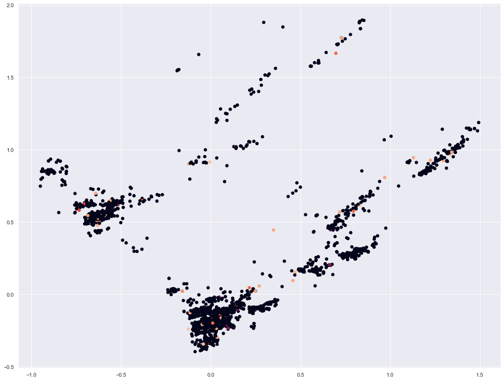
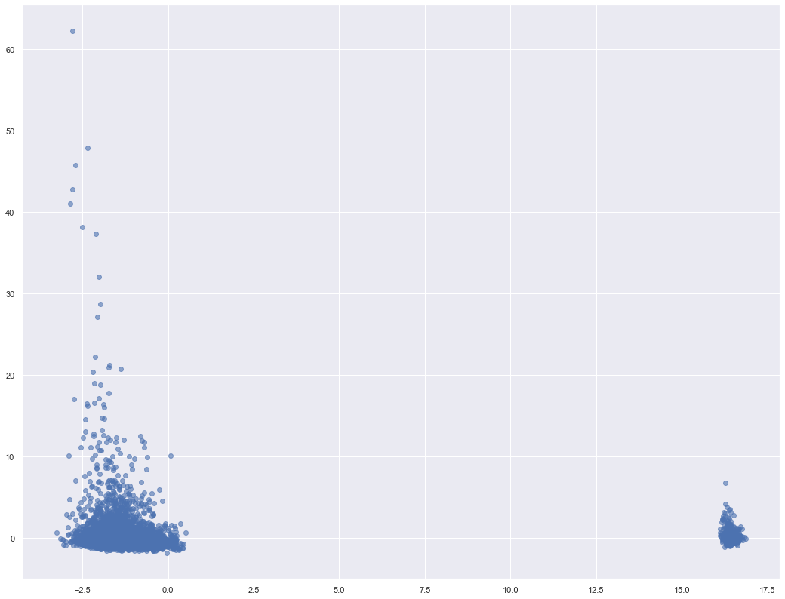
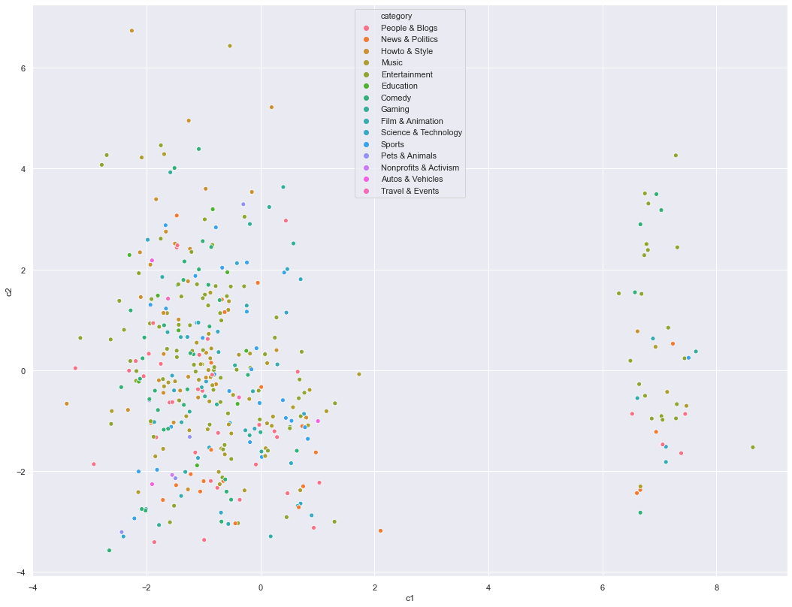
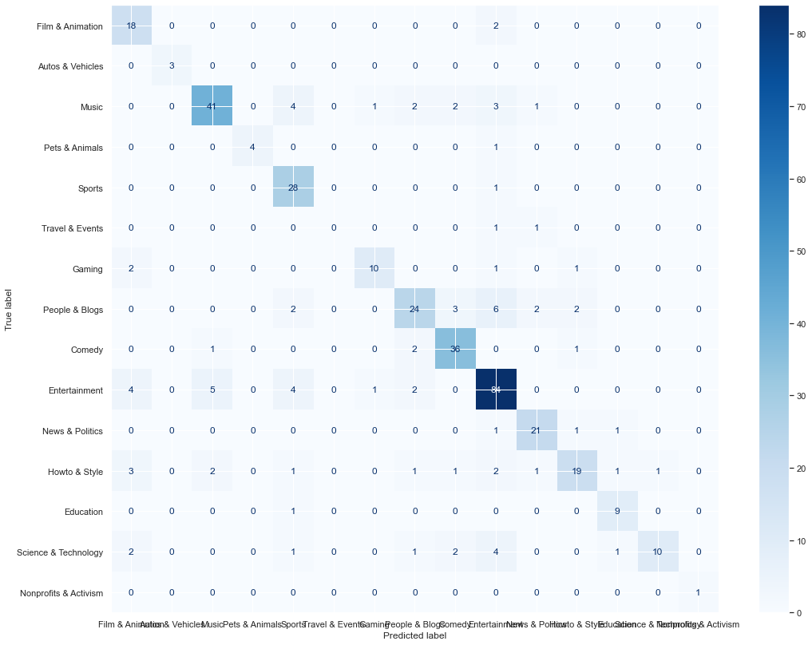

## Read Aggregated Data


```python
import pandas as pd
import numpy as np
import os
import scipy.spatial
import scipy.stats as ss

agg_df = pd.read_csv('aggregated.csv')
print(agg_df.shape)
agg_df.columns
```

    (8607, 94)
    


    Index(['video_id', 'trending_date', 'category_id', 'publish_time',
           'views_median', 'views_max', 'likes_median', 'likes_max',
           'dislikes_median', 'dislikes_max', 'comments_disabled',
           'ratings_disabled', 'video_error_or_removed', 'week_day', 'time_of_day',
           'month', 'title_changes', 'title_length_chars', 'title_length_tokens',
           'title_uppercase_ratio', 'title_not_alnum_ratio',
           'title_common_chars_count', 'channel_title_length_chars',
           'channel_title_length_tokens', 'tags_count', 'description_changes',
           'description_length_chars', 'description_length_tokens',
           'description_length_newlines', 'description_uppercase_ratio',
           'description_url_count', 'description_top_domains_count',
           'description_emojis_counts', 'has_detection', 'person_detected',
           'object_detected', 'vehicle_detected', 'animal_detected',
           'food_detected', 'face_count', 'gray_median', 'hue_median',
           'saturation_median', 'value_median', 'edges', 'ocr_length_tokens',
           'angry_count', 'surprise_count', 'fear_count', 'happy_count',
           'embed_title', 'embed_channel_title', 'embed_transormed_tags',
           'embed_thumbnail_ocr', 'gray_0_bin', 'gray_1_bin', 'gray_2_bin',
           'gray_3_bin', 'gray_4_bin', 'hue_0_bin', 'hue_1_bin', 'hue_2_bin',
           'hue_3_bin', 'hue_4_bin', 'saturation_0_bin', 'saturation_1_bin',
           'saturation_2_bin', 'saturation_3_bin', 'saturation_4_bin',
           'value_0_bin', 'value_1_bin', 'value_2_bin', 'value_3_bin',
           'value_4_bin', 'title_0_bin', 'title_1_bin', 'title_2_bin',
           'title_3_bin', 'title_4_bin', 'title_5_bin', 'title_6_bin',
           'title_7_bin', 'title_8_bin', 'title_9_bin', 'title_10_bin',
           'title_11_bin', 'title_12_bin', 'title_13_bin', 'title_14_bin',
           'title_15_bin', 'title_16_bin', 'title_17_bin', 'title_18_bin',
           'title_19_bin'],
          dtype='object')


## Read simple category_id -> title mapper


```python
import csv

# LOOKS LIKE WORST PYTHON FILE READING CODE :D

categories = {}
with open(os.path.join('..', 'data', 'categories.csv')) as csv_file:
    csv_reader = csv.reader(csv_file, delimiter=';')
    
    line_count = 0
    for row in csv_reader:
        if line_count == 0:
            line_count += 1
            continue
        else:
            categories[int(row[0])] = row[1]
        line_count += 1
        
    print(f'Processed {line_count} lines.')
    
categories
```

    Processed 51 lines.
    


    {1: 'Film & Animation',
     2: 'Autos & Vehicles',
     3: '?',
     4: '?',
     5: '?',
     6: '?',
     7: '?',
     8: '?',
     9: '?',
     10: 'Music',
     11: '?',
     12: '?',
     13: '?',
     14: '?',
     15: 'Pets & Animals',
     16: '?',
     17: 'Sports',
     18: 'Short Movies',
     19: 'Travel & Events',
     20: 'Gaming',
     21: 'Videoblogging',
     22: 'People & Blogs',
     23: 'Comedy',
     24: 'Entertainment',
     25: 'News & Politics',
     26: 'Howto & Style',
     27: 'Education',
     28: 'Science & Technology',
     29: 'Nonprofits & Activism',
     30: 'Movies',
     31: 'Anime/Animation',
     32: 'Action/Adventure',
     33: 'Classics',
     34: 'Comedy',
     35: 'Documentary',
     36: 'Drama',
     37: 'Family',
     38: 'Foreign',
     39: 'Horror',
     40: 'Sci-Fi/Fantasy',
     41: 'Thriller',
     42: 'Shorts',
     43: 'Shows',
     44: 'Trailers',
     45: '?',
     46: '?',
     47: '?',
     48: '?',
     49: '?',
     50: '?'}


### Apply PCA over those multi-one-hot vectors


```python
from sklearn.decomposition import PCA
import matplotlib.pyplot as plt
import seaborn as sns
sns.set(rc={'figure.figsize':(18, 14)})

title_onehot_feature_columns = list(filter(lambda x : 'title' in x and 'bin' in x, agg_df.columns))
X = agg_df[title_onehot_feature_columns].values
pca = PCA(n_components=2)
X_pca = pca.fit_transform(X)

plt.scatter(X_pca[:, 0], X_pca[:, 1], c=agg_df["category_id"].fillna(0).values)
```


    <matplotlib.collections.PathCollection at 0x1ea69f022e0>





```python
category_id_indices = agg_df.index[~agg_df["category_id"].isna()].tolist()
plt.scatter(X_pca[category_id_indices, 0], X_pca[category_id_indices, 1], c=agg_df.loc[category_id_indices, "category_id"])
```


    <matplotlib.collections.PathCollection at 0x1ea69fb7310>


## Apply PCA over all columns, normalized by mean and std


```python
agg_df_numeric = agg_df[[cname for idx, cname in enumerate(agg_df.columns) if agg_df.dtypes[idx] in [np.int64, np.float64]]]
agg_df_not_numeric = agg_df[[cname for idx, cname in enumerate(agg_df.columns) if agg_df.dtypes[idx] not in [np.int64, np.float64]]]
agg_df_embeddings = agg_df[[cname for cname in agg_df.columns if cname.startswith('embed_')]]

all_numeric_df = agg_df_numeric.reset_index().fillna(-1).drop(columns=['trending_date', 'category_id'])
normalized_df = (all_numeric_df - all_numeric_df.mean()) / all_numeric_df.std()

X = normalized_df.values
pca = PCA(n_components=5)
X_pca = pca.fit_transform(X)

plt.scatter(X_pca[:, 0], X_pca[:, 1], alpha=0.6)
ax = plt.gca()
```





## Select features based on previous checkpoint's analysis


```python
ANOVA_BEST = ['time_of_day', 'title_length_chars', 'title_length_tokens', 'title_uppercase_ratio', 'title_not_alnum_ratio', 'title_common_chars_count', 'tags_count', 'description_length_chars', 'description_length_tokens', 'description_uppercase_ratio', 'description_url_count', 'description_top_domains_count', 'vehicle_detected', 'animal_detected', 'value_median', 'title_0_bin', 'title_1_bin', 'title_2_bin', 'title_5_bin', 'title_12_bin']

CHI2_BEST = ['likes_median', 'likes_max', 'comments_disabled', 'ratings_disabled', 'month', 'title_changes', 'title_length_chars', 'title_uppercase_ratio', 'title_common_chars_count', 'channel_title_length_tokens', 'tags_count', 'description_length_chars', 'description_length_newlines', 'description_url_count', 'description_top_domains_count', 'description_emojis_counts', 'ocr_length_tokens', 'angry_count', 'fear_count', 'happy_count']

MI_BEST = ['likes_median', 'dislikes_max', 'title_uppercase_ratio', 'title_common_chars_count', 'channel_title_length_chars', 'description_length_newlines', 'description_top_domains_count', 'has_detection', 'person_detected', 'vehicle_detected', 'animal_detected', 'food_detected', 'face_count', 'saturation_median', 'title_1_bin', 'title_2_bin', 'title_5_bin', 'title_7_bin', 'title_8_bin', 'title_13_bin']

RFECV_BEST = ['comments_disabled', 'week_day', 'time_of_day', 'month',
       'title_length_chars', 'title_length_tokens', 'title_uppercase_ratio',
       'title_not_alnum_ratio', 'title_common_chars_count',
       'channel_title_length_chars', 'channel_title_length_tokens',
       'tags_count', 'description_changes', 'description_length_chars',
       'description_length_newlines', 'description_uppercase_ratio',
       'description_url_count', 'description_top_domains_count',
       'person_detected', 'object_detected', 'vehicle_detected',
       'animal_detected', 'food_detected', 'face_count', 'gray_median',
       'hue_median', 'saturation_median', 'value_median', 'ocr_length_tokens',
       'angry_count', 'fear_count', 'happy_count', 'gray_0_bin', 'gray_1_bin',
       'title_0_bin', 'title_1_bin', 'title_2_bin', 'title_3_bin',
       'title_5_bin', 'title_7_bin', 'title_9_bin', 'title_10_bin',
       'title_11_bin', 'title_12_bin', 'title_13_bin', 'title_14_bin',
       'title_16_bin', 'title_17_bin', 'title_18_bin', 'title_19_bin']

N = 20
SELECT_FEATURES = list(set([*ANOVA_BEST[:N], *CHI2_BEST[:N], *MI_BEST[:N], *RFECV_BEST[:N]]))
len(SELECT_FEATURES), len(agg_df.columns)
```


    (46, 94)


#### Just out of curiosity, we also decided to skip all `title_x_bin` features, which we created by applying PCA over simplified Bag-of-words representation (the change is included in `PED_3`. Therefore, we keep all the other features, also title-related, but skip this particular one.


```python
LESS_FEATURES = [feat for feat in SELECT_FEATURES if not (feat.startswith('title') and feat.endswith('bin'))]
```

## Apply PCA over SELECTED FEATURES


```python
select_features_df = agg_df_numeric.fillna(0)[SELECT_FEATURES]
normalized_df = (select_features_df - select_features_df.mean()) / select_features_df.std()

X_all = normalized_df.values
y_all = list(map(int, agg_df.fillna(-1).loc[:, "category_id"].values))

# * LESS
less_features_df = agg_df_numeric.fillna(0)[LESS_FEATURES]
lnormalized_df = (less_features_df - less_features_df.mean()) / less_features_df.std()

X_all_less = lnormalized_df.values
# / LESS

pca_all = PCA(n_components=5)
X_pca_all = pca_all.fit_transform(X_all)

import seaborn as sns

sns.scatterplot(
    x='c1', 
    y='c2',
      hue='category',
    size='has_category',
    data=pd.DataFrame({
      'c1': X_pca_all[:, 0],
      'c2': X_pca_all[:, 1],
      'category': list(map(lambda x : categories.get(int(x), "undefined"), y_all)),
        'has_category': list(map(lambda x : 1 if x == -1 else 15, y_all))
  })); 
```


```python
labeled_idx = agg_df.index[~agg_df["category_id"].isna()].tolist()
X = normalized_df.loc[labeled_idx, :].values
y = list(map(int, agg_df.loc[labeled_idx, "category_id"].values))

# * LESS
X_less = lnormalized_df.loc[labeled_idx, :].values
# / LESS

pca = PCA(n_components=2)
X_pca = pca.fit_transform(X)

import seaborn as sns

sns.scatterplot(
    x='c1', 
    y='c2',
      hue='category',
    data=pd.DataFrame({
      'c1': X_pca[:, 0],
      'c2': X_pca[:, 1],
      'category': list(map(lambda x : categories.get(int(x), "undefined"), y)),
  })); 
```





```python
_ = normalized_df.hist(bins=20)
plt.show()
```


## Distribution of known categories


```python
ax = sns.countplot(
    x="category", 
    data=pd.DataFrame({"category": map(lambda x : categories.get(x),filter(lambda x : x > -1, y_all))})
)
```


## Try: supervised apprroach vs. naive Self Learning Model


```python
import numpy as np
import random
from frameworks.CPLELearning import CPLELearningModel
from sklearn.linear_model.stochastic_gradient import SGDClassifier
import sklearn.svm
from methods.scikitWQDA import WQDA
from frameworks.SelfLearning import SelfLearningModel

# supervised score 
# basemodel = WQDA() # weighted Quadratic Discriminant Analysis
basemodel = SGDClassifier(loss='log', penalty='l2', random_state=20200501) # scikit logistic regression
basemodel.fit(X, y)
print("supervised log.reg. score", basemodel.score(X, y))

y = np.array(y)
y_all = np.array(y_all)

# # fast (but naive, unsafe) self learning framework
ssmodel = SelfLearningModel(basemodel)
ssmodel.fit(X_all, y_all)
print("self-learning log.reg. score", ssmodel.score(X, y))
```

    supervised log.reg. score 0.5177664974619289
    

    d:\__studia-d\projekt eksploracji danych\ped\venv\lib\site-packages\sklearn\utils\deprecation.py:144: FutureWarning: The sklearn.linear_model.stochastic_gradient module is  deprecated in version 0.22 and will be removed in version 0.24. The corresponding classes / functions should instead be imported from sklearn.linear_model. Anything that cannot be imported from sklearn.linear_model is now part of the private API.
      warnings.warn(message, FutureWarning)
    

    self-learning log.reg. score 0.1116751269035533
    

## Label Spreading


```python
from sklearn.semi_supervised import LabelSpreading

# label_spread = LabelSpreading(kernel='knn', alpha=0.8, max_iter=1000)
label_spread = LabelSpreading(kernel='knn', alpha=0.2)

label_spread.fit(X_all, y_all)

from sklearn.metrics import plot_confusion_matrix
from sklearn.metrics import confusion_matrix, classification_report

y_pred = label_spread.predict(X)
cm = confusion_matrix(y, y_pred, labels=label_spread.classes_)
labels_titles = list(map(lambda x : categories.get(x, '?'), label_spread.classes_))

print(classification_report(y, y_pred, target_names=labels_titles))

disp = plot_confusion_matrix(label_spread, X, y,
                              display_labels=labels_titles,
                                 cmap=plt.cm.Blues)
```

    d:\__studia-d\projekt eksploracji danych\ped\venv\lib\site-packages\sklearn\semi_supervised\_label_propagation.py:293: RuntimeWarning: invalid value encountered in true_divide
      self.label_distributions_ /= normalizer
    

                           precision    recall  f1-score   support
    
         Film & Animation       0.62      0.90      0.73        20
         Autos & Vehicles       1.00      1.00      1.00         3
                    Music       0.84      0.76      0.80        54
           Pets & Animals       1.00      0.80      0.89         5
                   Sports       0.68      0.97      0.80        29
          Travel & Events       0.00      0.00      0.00         2
                   Gaming       0.83      0.71      0.77        14
           People & Blogs       0.75      0.62      0.68        39
                   Comedy       0.82      0.90      0.86        40
            Entertainment       0.79      0.84      0.82       100
          News & Politics       0.81      0.88      0.84        24
            Howto & Style       0.79      0.59      0.68        32
                Education       0.75      0.90      0.82        10
     Science & Technology       0.91      0.48      0.62        21
    Nonprofits & Activism       1.00      1.00      1.00         1
    
                 accuracy                           0.78       394
                macro avg       0.77      0.76      0.75       394
             weighted avg       0.79      0.78      0.78       394
    
    

    d:\__studia-d\projekt eksploracji danych\ped\venv\lib\site-packages\sklearn\metrics\_classification.py:1272: UndefinedMetricWarning: Precision and F-score are ill-defined and being set to 0.0 in labels with no predicted samples. Use `zero_division` parameter to control this behavior.
      _warn_prf(average, modifier, msg_start, len(result))
    





```python
sns.scatterplot(
    x='c1', 
    y='c2',
      hue='category',
    size='correct',
    data=pd.DataFrame({
      'c1': X_pca_all[:, 0],
      'c2': X_pca_all[:, 1],
      'category': list(map(lambda x : categories.get(int(x), "undefined"), 
                          label_spread.predict(X_all))),
        'correct': list(map(
            lambda x : 15 if x[0] == x[1] else 1, zip(y_all, label_spread.predict(X_all))))
  })); 
```


## Entropies


```python
from scipy import stats

pred_entropies = stats.distributions.entropy(label_spread.label_distributions_.T)
print(pred_entropies.shape)

sns.distplot(pred_entropies)
```

    (8607,)
    


    <matplotlib.axes._subplots.AxesSubplot at 0x1ea7f5d0ca0>


### Read original dataframe to reference original titles & tags


```python
path = "../data/"

GB_videos_df = pd.read_csv(path + "/" + "GB_videos_5p.csv", sep=";", engine="python")
US_videos_df = pd.read_csv(path + "/" + "US_videos_5p.csv", sep=";", engine="python")

df = pd.concat([GB_videos_df, US_videos_df]).drop_duplicates().reset_index(drop=True)
df = df.rename(columns={"description ": "description"})
print(df.shape)
df.head(3) 
```

    (78255, 16)
    


<div>
<style scoped>
    .dataframe tbody tr th:only-of-type {
        vertical-align: middle;
    }

    .dataframe tbody tr th {
        vertical-align: top;
    }

    .dataframe thead th {
        text-align: right;
    }
</style>
<table border="1" class="dataframe">
  <thead>
    <tr style="text-align: right;">
      <th></th>
      <th>video_id</th>
      <th>trending_date</th>
      <th>title</th>
      <th>channel_title</th>
      <th>category_id</th>
      <th>publish_time</th>
      <th>tags</th>
      <th>views</th>
      <th>likes</th>
      <th>dislikes</th>
      <th>comment_count</th>
      <th>thumbnail_link</th>
      <th>comments_disabled</th>
      <th>ratings_disabled</th>
      <th>video_error_or_removed</th>
      <th>description</th>
    </tr>
  </thead>
  <tbody>
    <tr>
      <th>0</th>
      <td>Jw1Y-zhQURU</td>
      <td>17.14.11</td>
      <td>John Lewis Christmas Ad 2017 - #MozTheMonster</td>
      <td>John Lewis</td>
      <td>NaN</td>
      <td>2017-11-10T07:38:29.000Z</td>
      <td>christmas|"john lewis christmas"|"john lewis"|...</td>
      <td>7224515</td>
      <td>55681</td>
      <td>10247</td>
      <td>9479</td>
      <td>https://i.ytimg.com/vi/Jw1Y-zhQURU/default.jpg</td>
      <td>False</td>
      <td>False</td>
      <td>False</td>
      <td>Click here to continue the story and make your...</td>
    </tr>
    <tr>
      <th>1</th>
      <td>3s1rvMFUweQ</td>
      <td>17.14.11</td>
      <td>Taylor Swift: …Ready for It? (Live) - SNL</td>
      <td>Saturday Night Live</td>
      <td>NaN</td>
      <td>2017-11-12T06:24:44.000Z</td>
      <td>SNL|"Saturday Night Live"|"SNL Season 43"|"Epi...</td>
      <td>1053632</td>
      <td>25561</td>
      <td>2294</td>
      <td>2757</td>
      <td>https://i.ytimg.com/vi/3s1rvMFUweQ/default.jpg</td>
      <td>False</td>
      <td>False</td>
      <td>False</td>
      <td>Musical guest Taylor Swift performs …Ready f...</td>
    </tr>
    <tr>
      <th>2</th>
      <td>n1WpP7iowLc</td>
      <td>17.14.11</td>
      <td>Eminem - Walk On Water (Audio) ft. Beyoncé</td>
      <td>EminemVEVO</td>
      <td>NaN</td>
      <td>2017-11-10T17:00:03.000Z</td>
      <td>Eminem|"Walk"|"On"|"Water"|"Aftermath/Shady/In...</td>
      <td>17158579</td>
      <td>787420</td>
      <td>43420</td>
      <td>125882</td>
      <td>https://i.ytimg.com/vi/n1WpP7iowLc/default.jpg</td>
      <td>False</td>
      <td>False</td>
      <td>False</td>
      <td>Eminem's new track Walk on Water ft. Beyoncé ...</td>
    </tr>
  </tbody>
</table>
</div>


## Least certain


```python
transductions_entropies = list(zip(
    label_spread.transduction_, 
    pred_entropies,
    [i for i in range(len(pred_entropies))]
))

for c in label_spread.classes_:
    print("\nCATEGORY", categories.get(c))
    print(">>> SUPPORT: ", len(list(filter(lambda x : x == c, label_spread.transduction_))), "\n")
    
    t_e_per_class = list(filter(lambda x : x[0] == c, transductions_entropies))
    t_e_per_class = list(sorted(t_e_per_class, key=lambda x : -1*x[1]))
    for _, entropy, idx in t_e_per_class[:5]:
        print(entropy)
        vid_id = agg_df.loc[idx, ["video_id"]].values[0]
        select_from_df = df[df["video_id"] == vid_id]
        print(select_from_df.loc[:, ["title"]].values[0][0])
        print(select_from_df.loc[:, ["tags"]].values[0][0])
        print()

```

    
    CATEGORY Film & Animation
    >>> SUPPORT:  466 
    
    1.5658614474303463
    Three peg - 978938-3
    Viral|"Video"|"Epic"
    
    1.5470879559778368
    TRY NOT TO Slip 'N Slide Through the Wrong MYSTERY BOX!!
    faze rug|"rug"|"rugfaze"|"mystery box"|"don't water slide through the wrong mystery box"|"cam and jeff"|"cam and jeff don't water slide through the wrong mystery box"|"do not slip n slide through the wrong mystery box"|"slip n slide gone wrong"|"slip n slide challenge"|"box challenge"|"whats in the box"|"backyard waterslide"|"box fort"|"mystery games"|"slip and slide"
    
    1.5217293023375147
    How To Make Your Own Subway Sandwich
    how to make your own subway sandwich|"subway"|"subway sandwich"|"gus subway"|"make your own subway"|"funny subway"|"subway meme"|"funny video"|"trending video"|"youtube trending"|"short funny video"|"meme"|"new"
    
    1.5120197976885843
    STAR WARS THE LAST JEDI - Movie Review (Black Nerd)
    star wars|"star wars last jedi"|"star wars the last jedi"|"the last jedi"|"star wars last jedi review"|"star wars the last jedi review"|"the last jedi review"|"star wars last jedi movie review"|"star wars the last jedi movie review"|"the last jedi movie review"|"rey"|"finn"|"luke skywalker"|"leia"|"kylo ren"|"finn and rose the last jedi"|"rey kylo ren fight"|"rey kylo ren love"|"reylo"|"black nerd"|"blacknerd"|"black nerd comedy"|"black nerd star wars"|"star wars black nerd"|"rose tico"|"snoke"
    
    1.455213591880686
    Deadpool’s “Wet on Wet” Teaser
    Trailer|"Deadpool"|"20th Century Fox (Production Company)"|"Deadpool Movie"|"Ryan Reynolds (Celebrity)"|"Ed Skrein (Musical Artist)"|"T. J. Miller (TV Writer)"|"Gina Carano (Martial Artist)"|"Red band"|"Red band deadpool"|"Marvel"|"Marvel Comics"|"Comic Book (Comic Book Genre)"|"Dead pool"|"Deadpool green band"|"Deadpool red band"|"Action"|"Comedy"|"Action Comedy"|"X-Men (Award-Winning Work)"
    
    
    CATEGORY Autos & Vehicles
    >>> SUPPORT:  42 
    
    1.6752376393747028
    Noah Kahan, Julia Michaels - Hurt Somebody (Audio)
    Noah|"Kahan"|"Julia"|"Michaels"|"Hurt"|"Somebody"|"Universal"|"Records"|"Alternative"
    
    1.4912661566419605
    GoPro: BMW Sets GUINNESS WORLD RECORDS™ Title for Drifting - 4K
    GoPro|"Hero4"|"Hero5"|"Hero Camera"|"HD Camera"|"stoked"|"rad"|"HD"|"best"|"go pro"|"cam"|"epic"|"hero4 session"|"Hero5 Session"|"session"|"action"|"beautiful"|"crazy"|"high definition"|"high def"|"be a hero"|"beahero"|"hero five"|"karma"|"gpro"|"BMW"|"drift"|"world record"|"Guinness World Records"|"drift track"|"gasoline"|"drift world record"|"driving"|"race"|"driver"|"driving record"|"non-stop"
    
    1.3983173209379487
    Hugh Jackman On Keeping His 21-Year Marriage Strong: The Crazy Ups & Crazy Downs | PeopleTV
    hughjackman|"hugh jackman"|"celebrities"|"logan"|"x-men"|"wolverine"|"the greatest showman"|"the greatest showman interview"|"hugh jackman singing"|"hugh jackman greatest showman"|"hugh jackman interview"|"hugh jackman les miserables"|"hugh jackman wolverine"|"greatestshowman"|"thegreatestshowman"|"hugh jackman wife"|"hugh jackman wife deb"|"People"|"people magazine"|"news"|"rumors"|"interview"|"style"|"magazine"|"time"|"celebrity gossip"|"entertainment"|"gossip"|"celebrity"|"famous"|"Hollywood"|"celeb"|"celebrity (media genre)"
    
    1.3798470266448084
    Remy Ma - Melanin Magic (Pretty Brown) (Audio) ft. Chris Brown
    Columbia|"Hip Hop"|"Melanin Magic (Pretty Brown)"|"Remy Ma feat. Chris Brown"
    
    1.16674041872205
    BBC reporter mobbed by lemurs - BBC News
    bbc|"bbc news"|"news"|"lemurs"|"BBC reporter"|"reporter mobbed by lemurs"|"animals"|"cute animals"|"tv gaffe"|"funny video"|"funny news"|"funny animals"|"tv bloopers"|"bloopers"|"blooper"|"report on an animal count"
    
    
    CATEGORY Music
    >>> SUPPORT:  1225 
    
    1.8395967570661758
    60 Seconds Left - New Year Movie Countdown
    new year|"happy new year"|"countdown"|"2018"|"best wishes"|"mashup"|"movies"
    
    1.7691106008507445
    World's Smallest Cat - Cute, Tiny and Mean
    worlds smallest cat|"small cat"|"tiny cat"|"rusty spotted cat"|"smallest cat in the world"|"world’s smallest cat video"|"world’s smallest cat ever"|"world’s smallest cat species"|"smallest cats ever"|"smallest cat breed"|"smallest cat species"|"smallest"|"smallest animals in the world"|"smallest animals ever"|"smallest animals"|"tiniest"|"smallest things ever"|"world’s smallest animals"|"smallest animal"|"small animals"|"smallest animal on earth"|"smallest animals on earth"|"themeankitty"
    
    1.7220866833917925
    SPORCLE WORLD RECORD - Typing Every Country in Under 3 Minutes
    review|"vat19"|"nvjds"|"awesome"|"reviews"|"vat19nvj"|"vat19nvjds"|"countries"|"all countries"|"united states"|"madrid"|"spain"|"cleveland"|"geography"|"genius"|"protege"|"prodigy"|"genius boy"|"quiz"|"sporcle quiz"|"sporcle"|"test"|"countries of the world"|"world record"|"fastest"|"time"|"ever"|"world"|"record"
    
    1.715455380622868
    What are those curlers actually shouting? | Burning Questions
    Olympic Games|"Olympics"|"IOC"|"Sport"|"Champion"|"Winter Games"|"Winter Olympics"|"Why"|"Questions"|"Q&A"|"PyeongChang"|"PyeongChang 2018"|"Burning Questions"|"Did you know"|"fact"|"funfacts"|"PLBurningQuestions"|"yt:cc=on"|"ال�يرلنج"|"冰壶"|"Curling"|"カ���グ"|"컬�"|"Керлинг"|"why do"|"faq"|"curlers"|"shout"|"yell"|"what do"|"scream"|"what are they saying"
    
    1.6830513880153035
    RC Chinook Bicopter - Part 3
    rc|"remote"|"control"|"remote control"|"heli"|"helicopter"|"chinook"|"bicopter"|"bi-copter"|"bi copter"|"copter"|"aircraft"|"DIY"|"3D"|"3D Printer"|"3D Printed"|"3d print"|"PETG"|"tom stanton"|"model aircraft"|"model helicopter"|"boeing ch-47 chinook"|"CH-47"|"scale"|"army"
    
    
    CATEGORY Pets & Animals
    >>> SUPPORT:  44 
    
    1.8653372918087912
    Lift Yourself
    Kanye West|"カ�エ�ウェス�"|"カ�エウェス�"|"Lift Yourself"|"Lift Yourself"
    
    1.6190419392957571
    THE BICYCLE OF SPRINGS
    colin|"furze"|"colinfurze"|"bicycle of springs"|"bike"|"bicycle"|"springs"|"suspension"|"flex"|"weird"|"crazy"|"making of"|"how to"|"building"|"welding"|"workshop"|"invention"|"creation"|"project"|"madness"|"insane"|"mountian bike"|"retro"
    
    1.554188918873588
    $3 date night with Julianna, clearly worth it
    [none]
    
    1.3720576846439176
    WHAT MY $1100 LA STUDIO LOOKS LIKE
    apartment tour|"home tour"|"los angeles studio"|"studio tour"|"small homes"|"small apartments"|"tour vlog"|"home vlog"|"damon and jo"|"koreatown apartment"|"central la"|"condo tour"|"flat tour"|"small space design ideas"|"small apartment design tips"|"design hacks"|"how to design an apartment"|"hacks"|"tips and tricks"|"tiny homes"|"house hunters"|"mtv cribs"|"youtubers homes"|"damon dominique"|"jo franco"|"travel youtubers"|"life in los angeles"|"california"
    
    1.218504228127145
    ANIMALS BITE ME...a lot.
    adventure|"adventurous"|"animals"|"breaking"|"breaking trail"|"coyote"|"coyote peterson"|"peterson"|"trail"|"wild"|"wildlife"|"ouch"|"chomped"|"animal bite"|"animal bites"|"stung"|"sting"|"bite"|"bitten"|"bitten off"|"bit"|"bit by a"|"worst bite"|"worst bites"|"painful"|"bug bite"|"snapping turtle"|"gila monster"|"animals bite me"|"animals bite me a lot"|"bitten by a"|"stung by a"|"this bites"|"bites"|"alligator bite"|"most powerful"|"creepy animals that bite"|"centipede bite"|"toe biter"|"dog bite"|"gator bite"|"turtle bite"
    
    
    CATEGORY Sports
    >>> SUPPORT:  772 
    
    1.9238778646179917
    Brexit Talks: What does 'regulatory alignment' mean? - BBC News
    bbc|"bbc news"|"news"|"regulatory"|"alignment"|"regulatory alignment"|"regulatory divergence"|"brexit"|"brexit talks"|"brexit fail"|"theresa may"|"north ireland"|"northern ireland"|"irish"|"irish border"|"hard border"|"brexit bill"|"dup"
    
    1.8668282598572836
    Troye Sivan - Dance To This (Official Audio) ft. Ariana Grande
    Troye|"Sivan"|"Dance"|"To"|"This"|"EMI"|"Recorded"|"Music"|"Australia"|"Pty"|"Ltd"|"Pop"|"troy sivan"|"troy"|"sivann"|"Ariana"|"grande"|"arian"|"grand"|"dance to this"|"dance"|"dnce"|"to"|"this"|"bloom"|"blooom"|"pop"|"my my my"|"no tears left to cry"|"no tears"|"youth"|"wild"|"blue neighbourhood"|"blu"|"dangerous woman"
    
    1.866546755945493
    Why this elbow is a TIME person of the year
    vox.com|"vox"|"explain"|"harvey weinstein"|"metoo"|"metoo movement"|"#metoo"|"feminism"|"womens rights"|"sexual assault"|"sexual abuse"|"hollywood"|"media"|"politics"|"feminist"|"terry crews"|"misogny"|"rape culture"|"rape"|"sexual violence"|"workplace harassment"|"harassment"
    
    1.8532557329692432
    A ROADTRIP TO OUR 2017 (YEAR END RECAP) | Ranz and Niana
    ranz|"ranz kyle"|"niana"|"niana guerrero"|"ranz niana"|"ranz and niana"|"ranz kyle niana"|"niana ranz"|"siblings"|"sibling goals"|"#siblinggoals"|"goals"|"vlogs"|"vlog"|"dance"|"dance choreography"|"viral"|"2017"|"recap"|"rewind"|"year"|"year end"|"roadtriprecap 2017"|"ranz niana recap"|"youtube rewind"|"lit"|"2018"|"best year"|"prank"|"pranks"|"compilation"|"motivational"|"inspirational"|"carpool"|"jam"|"natalia"
    
    1.8168689799097906
    Lewis Capaldi - Rush (Official Audio) ft. Jessie Reyez
    Lewis|"Capaldi"|"Rush"|"Vertigo"|"Berlin"|"Alternative"|"Jessie Reyez"|"Figures"|"Bruises"|"Lost On You"|"Mercy"|"Fade"|"Audio"|"Singer-Songwriter"|"Pop"|"Lewis Capaldi"|"LewisCapaldiVEVO"|"The Vibe Guide"|"IndieAir"|"Selected"|"Delta Jack Remix"|"Tep No"|"Songwriter"|"music video"|"aberdeen"|"official video"|"Universal"|"Official Audio"|"Bloom"
    
    
    CATEGORY Travel & Events
    >>> SUPPORT:  7 
    
    1.1337586411671179
    Comedian Tig Notaro Says It's A 'Huge Relief' Louis CK Was 'Removed' From Comedy Industry | The View
    Tig Notaro|"Louis CK"|"The View"|"hot topics"|"sexual misconduct"|"Amazon"|"One Mississippi"|"comedy"|"comedian"|"stand-up"
    
    0.7850711516888955
    Game Theory: FNAF, The Theory That Changed EVERYTHING!! (FNAF 6 Ultimate Custom Night)
    fnaf|"five nights"|"New Fnaf"|"fnaf cassidy"|"custom night"|"Fnaf 6"|"fnaf 6 custom night"|"five nights at freddy's"|"fnaf pizza simulator"|"FNAF sister location"|"FNAF 2"|"fnaf 3"|"FNAF 4"|"fnaf 5"|"Sister location"|"FNAF timeline"|"jumpscare"|"jumpscares"|"fnaf theory"|"matpat fnaf"|"matpat five nights at freddys"|"game theory FNAF"|"game theory five nights at freddys"|"matpat game theory"|"fnaf game theory"|"matpat"|"markiplier fnaf"|"fnaf markiplier"|"fnaf ending"
    
    0.7752697471683803
    Rony Abovitz, founder of Magic Leap, and Adam Silver, NBA Commissioner | Full interview | Code Media
    [none]
    
    0.2905225683262014
    Wanna Be Startin' Somethin' w/ the Stars! | Lip Sync Battle Live: A Michael Jackson Celebration
    Singing|"Lip Sync Battle"|"Dancing"|"Lip Syncing"|"Spike"|"Jimmy Fallon Lip Sync Battle"|"LL Cool J"|"Chrissy Teigen"|"Music"|"Comedy"|"lip sync"|"battle"|"dance"|"Lip Sync Show"|"lsb"|"Michael Jackson"|"MJ"|"Michael Jackson Celebration"|"Paramount Network"|"Epic"|"Classic"|"Wanna Be Startin' Something"|"Wanna Be Starting Something"|"Neil Patrick Harris"|"Laverne Cox"|"Hailee Steinfeld"|"Taraj P. Henson"|"sync"|"Live"|"Performance"|"Full Performance"
    
    0.08292099689049426
    Film Theory: Willy Wonka and the Golden Ticket SCAM! (Willy Wonka and the Chocolate Factory)
    willy wonka|"willy wonka and the chocolate factory"|"charlie and the chocolate factory"|"golden ticket"|"golden tickets"|"gene wilder"|"charlie"|"oompa loompa"|"roald Dahl"|"chocolate factory"|"disaster"|"flop"|"candy"|"chocolate"|"scam"|"Exposed"|"uncovered"|"film theory"|"film theorists"|"matpat"|"film theory willy wonka"|"matpat willy wonka"|"film theory golden ticket"|"matpat golden ticket"|"it's a trap"|"oompa loompa song"
    
    
    CATEGORY Gaming
    >>> SUPPORT:  169 
    
    1.7108570031470218
    How Millennials Are Killing the Diamond Industry
    Cracked|"cracked.com"|"sketch"|"comedy"|"funny"|"spoof"|"laugh"|"satire"|"parody"|"hilarious"|"spoofs"|"millineals hate"|"millineals killing"|"millineals are good"|"truth of millineals"|"fact about millineals"|"funny millineals"|"carmen angelica"|"bad millineals"|"millineals dumb"|"millineals smart"|"millineals facts"|"millineals secret"|"diamond industry"|"expensive"
    
    1.6598875203018375
    How to Actually Finish Something, for Once
    Collegehumor|"CH originals"|"comedy"|"sketch comedy"|"internet"|"humor"|"funny"|"sketch"|"DIY"|"roommates"|"housing"|"tutorials"|"advice"|"messy"|"horrible people"|"passive aggressive"|"ally beardsley"|"shane crown"|"CH Shorts"|"roommate fails"|"shitty roommate projects"|"unfinished projects"
    
    1.557490412020214
    The Thegn Thrand Sword Challenge: My Take!
    Thegn Thrand|"sword launch"|"Challenge"
    
    1.5278968934577495
    Russo bros FINALLY explain Hawkeye 'absence' for Avengers: Infinity War
    Russo|"Brothers"|"Anthony"|"Joe"|"Marvel"|"Peter Dinklage"|"Tyrion"|"Avengers"|"Infinity War"|"Interview"|"Fun"|"Funny"|"Secret"|"Death"|"Scene"|"Spoiler"|"Trailer"|"Hawkeye"|"Ebony Maw"|"Tom Vaughan-Lawlor"|"Nidge"|"Preview"|"Teaser"|"Exclusive"|"Commentary"|"Director"|"Fight"|"Hulk"|"Thor"|"Iron Man"|"Thanos"|"Children"|"Captain America"|"Black Order"|"End credits"|"Stan Lee"|"Cameo"|"Attack"|"Guardians"|"Groot"|"Dance"|"Where"|"Explain"|"Absence"|"Finally"|"Eoghan Doherty"|"Ireland"|"JOE.ie"|"The Big Reviewski"
    
    1.44590328008014
    POP SONGS TURNED OPERA
    colleen ballinger|"colleen"|"ballinger"|"psychosoprano"|"miranda sings"|"no lipstick"|"vlog"|"vlogging"|"singing"|"without lipstick"|"comedy"|"how to"|"tutorial"|"silly"|"funny"|"pop songs"|"pop"|"music"|"turned"|"opera"|"opera singing"|"sing"|"sung"|"sung like"|"pop songs sung like opera songs"|"if pop songs were an opera"
    
    
    CATEGORY People & Blogs
    >>> SUPPORT:  820 
    
    1.8881473846125991
    


    ---------------------------------------------------------------------------

    IndexError                                Traceback (most recent call last)

    <ipython-input-17-85d5f99cbf77> in <module>
         15         vid_id = agg_df.loc[idx, ["video_id"]].values[0]
         16         select_from_df = df[df["video_id"] == vid_id]
    ---> 17         print(select_from_df.loc[:, ["title"]].values[0][0])
         18         print(select_from_df.loc[:, ["tags"]].values[0][0])
         19         print()
    

    IndexError: index 0 is out of bounds for axis 0 with size 0


## Most certain


```python
transductions_entropies = list(zip(
    label_spread.transduction_, 
    pred_entropies,
    [i for i in range(len(pred_entropies))]
))

for c in label_spread.classes_:
    print("\nCATEGORY", categories.get(c))
    print(">>> SUPPORT: ", len(list(filter(lambda x : x == c, label_spread.transduction_))), "\n")
    
    t_e_per_class = list(filter(lambda x : x[0] == c, transductions_entropies))
    t_e_per_class = list(sorted(t_e_per_class, key=lambda x : x[1]))
    for _, entropy, idx in t_e_per_class[:5]:
        print(entropy)
        vid_id = agg_df.loc[idx, ["video_id"]].values[0]
        select_from_df = df[df["video_id"] == vid_id]
        if select_from_df.shape[0] > 0:
            print(select_from_df.loc[:, ["title"]].values[0][0])
            print(select_from_df.loc[:, ["tags"]].values[0][0][:100])
            print()

```

    
    CATEGORY Film & Animation
    >>> SUPPORT:  466 
    
    0.0
    I FEEL PRETTY Official Trailer (2018) Amy Schumer, Emily Ratajkowski Comedy Movie HD
    Cinema|"Trailer"|"Official"|"Movie"|"Film"|"I Feel Pretty"|"Amy Schumer"|"Emily Ratajkowski"|"Michel
    
    0.0
    Trader Green Room: All Evening Long
    Financial advisor|"financial goals"|"financial plans"|"personal financial advisor"|"financial advice
    
    0.0
    Paris Hilton - “I Need You” (Official Music Video)
    Paris Hilton - “I Need You” (Official Music Video)|"Paris"|"Hilton"|"Paris Hilton I need you"|"P
    
    0.0
    The Unsung
    i'll stand by you|"mr. adderley"|"boca high lunch club"|"ad"|"sblii"|"superbowl"|"super bowl"|"sb52"
    
    0.0015448713101802601
    TREMORS SEASON 1 Official Trailer (2018) Kevin Bacon
    [none]
    
    
    CATEGORY Autos & Vehicles
    >>> SUPPORT:  42 
    
    0.0021552256010640195
    New Year's Eve Penske Peel at the 11foot8 bridge
    11foot8|"low clearance crash"|"truck crash"|"train trestle"|"Durham"
    
    0.0037786059878582028
    FIA GT World Cup 2017. Qualification Race Macau Grand Prix. Huge Pile Up
    GT Series|"Qualification Race"|"Macau Grand Prix"|"FIA GT World Cup"|"Pile Up"|"traffic jam"|"start"
    
    0.031576674677614144
    I Said I Would NEVER Do This To My Truck... BIG MODS INCOMING!
    tj hunt|"tjhunt"|"salomondrin"|"doug demuro"|"tanner fox"|"cleetus"|"cleetus mcfarland"|"cleetusmcfa
    
    0.03197941615077673
    [HOONIGAN] DT 190: $200 Miata Kart Build [Part 6] - Cage Build and Indoor Donuts
    miata|"mazda"|"$200 mazda miata"|"custom build"|"death kart"|"kart"|"roll cage"|"build show"|"daily 
    
    0.0402499910394964
    Stephen A. Smith says Bengals don't give a damn about fans | First Take | ESPN
    espn|"espn live"|"first take"|"espn first"|"first take today"|"first take daily"|"first take live"|"
    
    
    CATEGORY Music
    >>> SUPPORT:  1225 
    
    5.252625191481461e-08
    Billie Eilish - lovely (with Khalid) Audio
    Billie Eilish|"Lovely"|"Khalid"
    
    6.614008064718131e-08
    Snoop Dogg - One More Day (Audio) ft. Charlie Wilson
    All The Time Entertainment|"Gospel/Christian"|"One More Day (Audio)"|"Snoop Dogg feat. Charlie Wilso
    
    2.1085405446602768e-07
    Veno - Dolce (Official Music Video)
    NetNobody|"Net Nobody"|"Net"|"Nobody"|"Veno Dolce"|"Veno"|"Dolce"|"Watson"|"TheOnlyWatson"|"Pretty B
    
    3.8900977395193897e-07
    Manic Street Preachers - Distant Colours (Official Video)
    manic street preachers|"manic street preachers if you tolerate this"|"manic street preachers motorcy
    
    5.786068118245475e-07
    Kylie Minogue - Stop Me From Falling (Official Audio)
    [none]
    
    
    CATEGORY Pets & Animals
    >>> SUPPORT:  44 
    
    0.0003672428519394435
    A Friendly Arctic Fox Greets Explorers | National Geographic
    national geographic|"nat geo"|"natgeo"|"animals"|"wildlife"|"science"|"explore"|"discover"|"survival
    
    0.0016008791311352296
    OH NO! ALL ANTS DEAD?!
    ants|"antscanada"|"mikey bustos"|"myrmecology"|"antfarm"|"ant colony"|"ant nest"|"queen ant"|"formic
    
    0.005819623950290921
    GoPro: Gorilla Tickling at the GRACE Center
    GoPro|"Hero4"|"Hero5"|"Hero Camera"|"HD Camera"|"stoked"|"rad"|"HD"|"best"|"go pro"|"cam"|"epic"|"he
    
    0.006173487058371974
    Look At This Pups Leg!
    dog|"dogs"|"animal"|"animals"|"vet"|"vetranch"|"drkarri"|"drmatt"|"surgery"|"veterinarian"|"puppy"|"
    
    0.009742246781315102
    Fans Vs Disney Star Wars: The Current State Of Things
    Star Wars|"fans"|"fans vs star wars"|"kathleen kennedy"|"disney star wars"|"movie"|"review"|"Awesome
    
    
    CATEGORY Sports
    >>> SUPPORT:  772 
    
    0.0
    Xbox - May 2018 Games with Gold
    Xbox|"Xbox360"|"xbox 360"|"Xbox One"|"Xbox One S"|"Games with Gold"|"Xbox Gold"|"Xbox Live"|"Xbox Li
    
    0.0
    Top 10 Plays of the Night: January 27, 2018
    nba|"highlights"|"basketball"|"plays"|"amazing"|"sports"|"hoops"|"finals"|"games"|"game"|"top"|"top 
    
    0.0
    Top 5 Plays of the Night: February 25, 2018
    nba|"highlights"|"basketball"|"plays"|"amazing"|"sports"|"hoops"|"finals"|"games"|"game"|"top 5"|"Dw
    
    0.0
    Top 5 Plays of the Night | January 02, 2018
    nba|"highlights"|"basketball"|"plays"|"amazing"|"sports"|"hoops"|"finals"|"games"|"game"|"Kris Dunn"
    
    0.0
    Top 10 Plays of the Night: February 3, 2018
    nba|"highlights"|"basketball"|"plays"|"amazing"|"sports"|"hoops"|"finals"|"games"|"game"|"top"|"top 
    
    
    CATEGORY Travel & Events
    >>> SUPPORT:  7 
    
    0.03078452526380701
    Trump - S**thole Countries - shithole statement by NAMIBIAđź’©đź’©
    Trump|"shithole"|"shithole countries"|"statement"|"america"|"africa"|"haiti"|"trump shithole"|"trump
    
    0.03220014249926304
    Shane MacGowan & Nick Cave - Summer in Siam + The Wild Mountain Thyme - Shane’s 60th Birthday Party
    shane macgowan|"nick cave"|"birthday party"|"the pogues"|"dublin"|"ireland"|"summer in siam"|"nation
    
    0.08292099689049426
    Film Theory: Willy Wonka and the Golden Ticket SCAM! (Willy Wonka and the Chocolate Factory)
    willy wonka|"willy wonka and the chocolate factory"|"charlie and the chocolate factory"|"golden tick
    
    0.2905225683262014
    Wanna Be Startin' Somethin' w/ the Stars! | Lip Sync Battle Live: A Michael Jackson Celebration
    Singing|"Lip Sync Battle"|"Dancing"|"Lip Syncing"|"Spike"|"Jimmy Fallon Lip Sync Battle"|"LL Cool J"
    
    0.7752697471683803
    Rony Abovitz, founder of Magic Leap, and Adam Silver, NBA Commissioner | Full interview | Code Media
    [none]
    
    
    CATEGORY Gaming
    >>> SUPPORT:  169 
    
    3.2833887934495023e-05
    [Fallout 4] Codsworth tells an absolute banger
    fallout 4|"codsworth"|"commonwealth"|"funny"|"explosion"|"perfect timing"|"joke"|"olive or twist"|"o
    
    0.0002066072506176948
    Death Stranding - E3 2018 4K Trailer | PS4
    Death Stranding|"Norman Reedus"|"Lea Seydoux"|"Mads Mikkelsen"|"Lindsay Wagner"|"E3"|"E3 2018"|"Sony
    
    0.0003434674809969195
    Officials provide update after Ohio 7th-grader shoots himself at school
    Jackson Township Middle School|"lock down"|"police"|"authorities"|"school shooting"|"7th grader"|"oh
    
    0.0004978398269742508
    The History of Fortnite Battle Royale - Did You Know Gaming? Feat. Remix
    fortnite|"fortnite pc"|"fortnite battle royale"|"battle royale"|"fortnite save the world"|"fortnite 
    
    0.0005065427021893673
    The Toyota Previa Is the Weirdest Minivan Ever
    toyota previa|"previa"|"minivan"|"toyota minivan"|"toyota estima"|"toyota van"|"weird van"|"weird mi
    
    
    CATEGORY People & Blogs
    >>> SUPPORT:  820 
    
    2.1904448924979855e-07
    In Loving Memory of,
    with|"love"
    
    1.7782760866456575e-06
    Watch tie-breaking draw decide key Virginia race
    latest News|"Happening Now"|"CNN"|"virginia"|"David Yancey"|"94th district"|"politics"|"ath"|"at thi
    
    4.390903558995098e-06
    Cat Has War Flashbacks
    [none]
    
    5.894948255491282e-06
    A Sainty Switch
    saintly|"switch"|"new"|"orleans"|"saints"|"vivica"|"anjanetta"|"fox"|"david"|"alan"|"grier"|"footbal
    
    6.3101049416170686e-06
    This Is What I'm Wearing Right Now
    Connor Franta|"ConnorFranta"|"clothing"|"clothes"|"haul"|"hauls"|"fun"|"funny"|"2018"|"new year"|"sw
    
    
    CATEGORY Comedy
    >>> SUPPORT:  1015 
    
    0.0
    It’s Just Water Weight | Kevin Hart: What The Fit | Laugh Out Loud Network
    What the Fit|"Kevin Hart What the Fit"|"Kevin Hart"|"YouTube Originals"|"YouTube Originals Series"|"
    
    0.0
    Voldemort: Origins of the Heir - An unofficial fanfilm (HD + Subtitles)
    harrypotter|"jkrowling"|"voldemort"|"voldemortoriginsoftheheir"|"voldemortorigins"|"magic"|"film"|"t
    
    0.0
    Slide Into Strength | Kevin Hart: What The Fit | Laugh Out Loud Network
    What the Fit|"Kevin Hart What the Fit"|"Kevin Hart"|"YouTube Originals"|"YouTube Originals Series"|"
    
    0.0
    Sumo Wrestling with Conan O’Brien | Kevin Hart: What The Fit Episode 1 | Laugh Out Loud Network
    What the Fit|"YouTube Originals"|"YouTube Originals Series"|"Series"|"Conan O’Brien"|"James Corden
    
    0.0
    
    CATEGORY Entertainment
    >>> SUPPORT:  2105 
    
    0.0
    Gabby Barrett Sings The Climb by Miley Cyrus - Top 14 - American Idol 2018 on ABC
    ABC|"americanidol"|"idol"|"american idol"|"ryan"|"seacrest"|"ryan seacrest"|"katy"|"perry"|"katy per
    
    0.0
    Sisters Audition for American Idol Together - American Idol 2018 on ABC
    ABC|"americanidol"|"idol"|"american idol"|"ryan"|"seacrest"|"ryan seacrest"|"katy"|"perry"|"katy per
    
    0.0
    Dylan Minnette on 13 Reasons Why, High School & Looking Like Jimmy Kimmel
    jimmy|"kimmel"|"live"|"late"|"night"|"talk"|"show"|"funny"|"comedic"|"comedy"|"clip"|"comedian"|"dyl
    
    0.0
    Benjamin Glaze Auditions for American Idol With Nick Jonas' Levels - American Idol 2018 on ABC
    ABC|"americanidol"|"idol"|"american idol"|"ryan"|"seacrest"|"ryan seacrest"|"katy"|"perry"|"katy per
    
    0.0
    Michelle Sussett Sings If I Were A Boy by Beyonce - Top 24 Solos - American Idol 2018 on ABC
    ABC|"americanidol"|"idol"|"american idol"|"ryan"|"seacrest"|"ryan seacrest"|"katy"|"perry"|"katy per
    
    
    CATEGORY News & Politics
    >>> SUPPORT:  723 
    
    6.017868084940048e-06
    Controversial WH adviser speaks out on resignation
    Omarosa Manigault Newman|"Apprentice"|"Donald Trump"|"you're fired"|"White House"|"adviser"|"communi
    
    5.500552751854333e-05
    Ex-UFO program chief: We may not be alone
    latest News|"Happening Now"|"CNN"|"luis elizondo"|"UFO"|"ALiens"|"ebof"|"erin burnett"|"US news"
    
    9.94652980839852e-05
    4 officers hurt in shooting in South Carolina
    Washington Post YouTube|"Washington Post Video"|"WaPo Video"|"The Washington Post"|"News"
    
    0.00010097486777519113
    True Facts : Carnivorous Plants
    [none]
    
    0.00010339919467239442
    What Martin Luther King Actually Thought About Car Commercials
    [none]
    
    
    CATEGORY Howto & Style
    >>> SUPPORT:  542 
    
    3.0219840413174113e-06
    How to Eat Sichuan Hot Pot | Food Skills
    First we feast|"fwf"|"firstwefeast"|"food"|"food porn"|"cook"|"cooking"|"chef"|"kitchen"|"recipe"|"c
    
    5.2522772959308514e-05
    WHAT I GOT FOR CHRISTMAS 2017 | VLOGMAS 68
    Inthefrow|"In the frow"|"WHAT I GOT FOR CHRISTMAS 2017 | VLOGMAS 68"|"WHAT I GOT FOR CHRISTMAS"|"VLO
    
    0.00022398326633871836
    DRESSED UP IN ALL DOLCE AND GABBANA | VLOG 51
    Inthefrow|"In the frow"|"I SPENT THE EVENING AS A DOLCE AND GABBANA PRINCESS | VLOG 51"|"I SPENT THE
    
    0.0003421731457180335
    VIRAL INSTAGRAM ONE-SWIPE EYESHADOW Review (finally)
    heyitsfeiii|"heyitsfei"|"boyfriend"|"kpop"|"reaction"|"kbeauty"|"acne"|"pimples"|"blackheads"|"how"|
    
    0.0004119166114100975
    COME CHRISTMAS SHOPPING WITH US AND FOR DOUBLE DATE NIGHT | VLOGMAS 63
    Inthefrow|"In the frow"|"COME CHRISTMAS SHOPPING WITH US AND FOR DOUBLE DATE NIGHT | VLOGMAS 63"|"CO
    
    
    CATEGORY Education
    >>> SUPPORT:  317 
    
    5.3725322929548065e-06
    Cooking a Steak with Molten Salt
    cooking a steak with salt|"cooking a steak with molten salt"|"steak molten salt"|"king of random ste
    
    5.391728471458023e-06
    Fortnite Rocket Slammer Pt. 1
    fortnite|"fortnite battle royale gameplay"|"fortnite funny moments"|"fort nite"|"in real life"|"real
    
    5.4593780742302105e-06
    Sound in a Vacuum Chamber
    speaker|"vacuum"|"chamber"|"vacuum chamber"|"no air"|"sound"|"vibration"|"recorder"|"bluetooth"|"spa
    
    6.206899115876354e-06
    The best places to watch the Falcon Heavy launch!
    Falcon Heavy|"SpaceX"|"SpaceX Falcon heavy launch date"|"when is falcon heavy"|"where to watch falco
    
    6.226439218969938e-06
    What Happens to Diesel in Liquid Nitrogen?
    diesel|"fuel"|"gas"|"gasoline"|"liquid nitrogen"|"freeze"|"cold"|"nitrogen"|"diesel fuel"|"engine"|"
    
    
    CATEGORY Science & Technology
    >>> SUPPORT:  330 
    
    0.0
    Speechless Thoughts with Charles Barkley - Closed Captioned
    yt:cc=on
    
    0.0
    DJ Khaled, Rihanna - Wild Thoughts (2018 Live Performance)
    [none]
    
    0.0
    Holiday — Sway — Apple
    airpods|"airpods dancing ad"|"airpods snow ad"|"airpods holiday ad"|"airpods sway"|"apple"|"apple da
    
    0.0
    A Magical Holiday
    hm|"hmlovesfashion"|"ad"|"nicki minaj"|"john turturro"|"jessie williams"|"holiday"|"2017"|"christmas
    
    0.0
    HomePod — Welcome Home by Spike Jonze — Apple
    anderson paak|"apartment"|"apple"|"apple music"|"choreography"|"dancer"|"dancing"|"fka twigs"|"twigs
    
    
    CATEGORY Nonprofits & Activism
    >>> SUPPORT:  30 
    
    0.027120154487932632
    Rose McGowan Talks Alleged Sexual Misconduct By Harvey Weinstein | The View
    Rose McGowan|"Rose's Army"|"MeToo"|"Time's Up"|"The View"|"feminism"|"women's rights"|"hot topics"|"
    
    0.027258912744493376
    Meghan Markle Engaged To Prince Harry | The View
    Meghan Markle|"prince harry"|"the view"|"princess diana"|"hot topics"
    
    0.027791541454269507
    Jemele Hill Talks Tweets About Trump, National Anthem Protests, Suspension From ESPN | The View
    Jemele Hill|"Donald Trump"|"national anthem"|"Charlottesville"|"ESPN"|"SportsCenter"|"the view"|"hot
    
    0.030095089180346438
    Second Woman Accuses Sen. Al Franken Of Inappropriate Touching | The View
    al franken|"roy moore"|"politics"|"senate"|"the view"|"hot topics"|"women's rights"|"sexual harassme
    
    0.03239271443869383
    Veteran Congressman John Conyers Announces He Is Retiring | The View
    John Conyers|"congress"|"the view"|"hot topics"|"democrats"|"democratic party"
    
    

# * 

## Running LabelSpreading on less features yields better results !!!


```python
label_spread = LabelSpreading(kernel='knn', alpha=0.2)

label_spread.fit(X_all_less, y_all)

y_pred = label_spread.predict(X_less)
cm = confusion_matrix(y, y_pred, labels=label_spread.classes_)
labels_titles = list(map(lambda x : categories.get(x, '?'), label_spread.classes_))

print(classification_report(y, y_pred, target_names=labels_titles))

disp = plot_confusion_matrix(label_spread, X_less, y,
                              display_labels=labels_titles,
                                 cmap=plt.cm.Blues)
```

    d:\__studia-d\projekt eksploracji danych\ped\venv\lib\site-packages\sklearn\semi_supervised\_label_propagation.py:293: RuntimeWarning: invalid value encountered in true_divide
      self.label_distributions_ /= normalizer
    

                           precision    recall  f1-score   support
    
         Film & Animation       0.84      0.80      0.82        20
         Autos & Vehicles       1.00      0.67      0.80         3
                    Music       0.89      0.89      0.89        54
           Pets & Animals       1.00      0.60      0.75         5
                   Sports       0.93      0.86      0.89        29
          Travel & Events       1.00      1.00      1.00         2
                   Gaming       0.90      0.64      0.75        14
           People & Blogs       0.88      0.77      0.82        39
                   Comedy       0.80      0.88      0.83        40
            Entertainment       0.75      0.88      0.81       100
          News & Politics       0.85      0.96      0.90        24
            Howto & Style       0.89      0.78      0.83        32
                Education       0.90      0.90      0.90        10
     Science & Technology       0.81      0.62      0.70        21
    Nonprofits & Activism       1.00      1.00      1.00         1
    
                 accuracy                           0.84       394
                macro avg       0.90      0.82      0.85       394
             weighted avg       0.84      0.84      0.83       394
    
    


### What is the distribution of newly assigned labels?


```python
chart = sns.countplot([categories.get(x) for x in label_spread.transduction_])
_ = chart.set_xticklabels(chart.get_xticklabels(), rotation=45, horizontalalignment='right')
```


