## Read Aggregated Data


```python
import pandas as pd
import numpy as np
import os

agg_df = pd.read_csv('../data/aggregated.csv')
print(agg_df.shape)
agg_df.columns
```

    /home/maaslak/PycharmProjects/ped/venv/lib/python3.8/site-packages/pandas/compat/__init__.py:117: UserWarning: Could not import the lzma module. Your installed Python is incomplete. Attempting to use lzma compression will result in a RuntimeError.
      warnings.warn(msg)


    (8607, 94)


    Index(['video_id', 'trending_date', 'category_id', 'publish_time',
           'views_median', 'views_max', 'likes_median', 'likes_max',
           'dislikes_median', 'dislikes_max', 'comments_disabled',
           'ratings_disabled', 'video_error_or_removed', 'week_day', 'time_of_day',
           'month', 'title_changes', 'title_length_chars', 'title_length_tokens',
           'title_uppercase_ratio', 'title_not_alnum_ratio',
           'title_common_chars_count', 'channel_title_length_chars',
           'channel_title_length_tokens', 'tags_count', 'description_changes',
           'description_length_chars', 'description_length_tokens',
           'description_length_newlines', 'description_uppercase_ratio',
           'description_url_count', 'description_top_domains_count',
           'description_emojis_counts', 'has_detection', 'person_detected',
           'object_detected', 'vehicle_detected', 'animal_detected',
           'food_detected', 'face_count', 'gray_median', 'hue_median',
           'saturation_median', 'value_median', 'edges', 'ocr_length_tokens',
           'angry_count', 'surprise_count', 'fear_count', 'happy_count',
           'embed_title', 'embed_channel_title', 'embed_transormed_tags',
           'embed_thumbnail_ocr', 'gray_0_bin', 'gray_1_bin', 'gray_2_bin',
           'gray_3_bin', 'gray_4_bin', 'hue_0_bin', 'hue_1_bin', 'hue_2_bin',
           'hue_3_bin', 'hue_4_bin', 'saturation_0_bin', 'saturation_1_bin',
           'saturation_2_bin', 'saturation_3_bin', 'saturation_4_bin',
           'value_0_bin', 'value_1_bin', 'value_2_bin', 'value_3_bin',
           'value_4_bin', 'title_0_bin', 'title_1_bin', 'title_2_bin',
           'title_3_bin', 'title_4_bin', 'title_5_bin', 'title_6_bin',
           'title_7_bin', 'title_8_bin', 'title_9_bin', 'title_10_bin',
           'title_11_bin', 'title_12_bin', 'title_13_bin', 'title_14_bin',
           'title_15_bin', 'title_16_bin', 'title_17_bin', 'title_18_bin',
           'title_19_bin'],
          dtype='object')


## Read simple category_id -> title mapper


```python
import csv

# LOOKS LIKE WORST PYTHON FILE READING CODE :D

categories = {}
with open(os.path.join('..', 'data', 'categories.csv')) as csv_file:
    csv_reader = csv.reader(csv_file, delimiter=';')
    
    line_count = 0
    for row in csv_reader:
        if line_count == 0:
            line_count += 1
            continue
        else:
            categories[int(row[0])] = row[1]
        line_count += 1
        
    print(f'Processed {line_count} lines.')
    
categories
```

    Processed 51 lines.


    {1: 'Film & Animation',
     2: 'Autos & Vehicles',
     3: '?',
     4: '?',
     5: '?',
     6: '?',
     7: '?',
     8: '?',
     9: '?',
     10: 'Music',
     11: '?',
     12: '?',
     13: '?',
     14: '?',
     15: 'Pets & Animals',
     16: '?',
     17: 'Sports',
     18: 'Short Movies',
     19: 'Travel & Events',
     20: 'Gaming',
     21: 'Videoblogging',
     22: 'People & Blogs',
     23: 'Comedy',
     24: 'Entertainment',
     25: 'News & Politics',
     26: 'Howto & Style',
     27: 'Education',
     28: 'Science & Technology',
     29: 'Nonprofits & Activism',
     30: 'Movies',
     31: 'Anime/Animation',
     32: 'Action/Adventure',
     33: 'Classics',
     34: 'Comedy',
     35: 'Documentary',
     36: 'Drama',
     37: 'Family',
     38: 'Foreign',
     39: 'Horror',
     40: 'Sci-Fi/Fantasy',
     41: 'Thriller',
     42: 'Shorts',
     43: 'Shows',
     44: 'Trailers',
     45: '?',
     46: '?',
     47: '?',
     48: '?',
     49: '?',
     50: '?'}


### Apply PCA over those multi-one-hot vectors


```python
from sklearn.decomposition import PCA
import matplotlib.pyplot as plt
import seaborn as sns
sns.set(rc={'figure.figsize':(18, 14)})

title_onehot_feature_columns = list(filter(lambda x : 'title' in x and 'bin' in x, agg_df.columns))
X = agg_df[title_onehot_feature_columns].values
pca = PCA(n_components=2)
X_pca = pca.fit_transform(X)

plt.scatter(X_pca[:, 0], X_pca[:, 1], c=agg_df["category_id"].fillna(0).values)
plt.show()
```


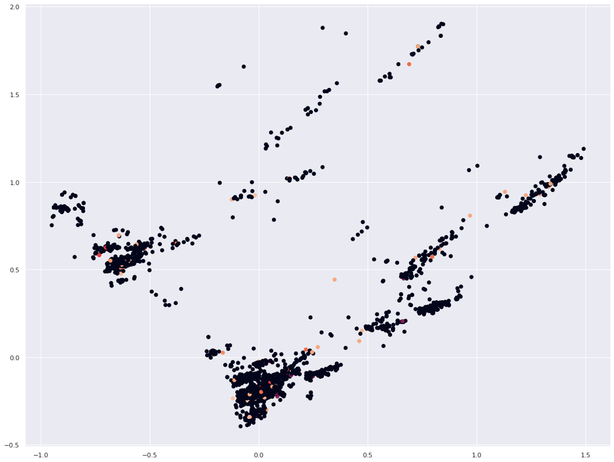


```python
category_id_indices = agg_df.index[~agg_df["category_id"].isna()].tolist()
plt.scatter(X_pca[category_id_indices, 0], X_pca[category_id_indices, 1], c=agg_df.loc[category_id_indices, "category_id"])
plt.show()
```


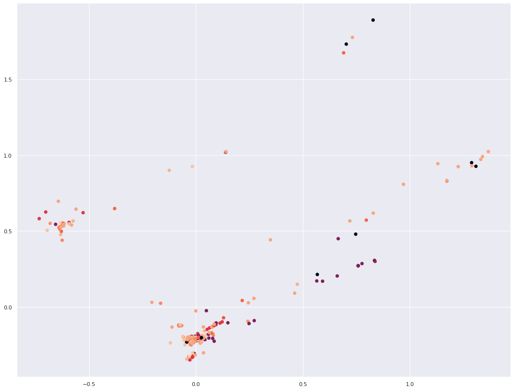


## Apply PCA over all columns, normalized by mean and std


```python

agg_df_embeddings = agg_df[[cname for cname in agg_df.columns if cname.startswith('embed_')]]

def cast_to_list(x):
    if x:
        return [float(num) for num in x[1:-1].replace("\n", "").split(", ") if num]
    else:
        return None


for column in agg_df_embeddings.columns:
    agg_df_embeddings[column] = agg_df_embeddings[column].apply(cast_to_list)

agg_df_embeddings_numeric = pd.concat([
    pd.DataFrame(agg_df_embeddings[colname].values.tolist()).add_prefix(colname + '_')
    for colname in agg_df_embeddings.columns
], axis=1)
```

    <ipython-input-5-5b856c689a4c>:11: SettingWithCopyWarning: 
    A value is trying to be set on a copy of a slice from a DataFrame.
    Try using .loc[row_indexer,col_indexer] = value instead
    
    See the caveats in the documentation: https://pandas.pydata.org/pandas-docs/stable/user_guide/indexing.html#returning-a-view-versus-a-copy
      agg_df_embeddings[column] = agg_df_embeddings[column].apply(cast_to_list)


```python

len(agg_df_embeddings_numeric.columns)
```


    2048


```python
agg_df_numeric = agg_df[[cname for idx, cname in enumerate(agg_df.columns) if agg_df.dtypes[idx] in [np.int64, np.float64]]]
agg_df_not_numeric = agg_df[[cname for idx, cname in enumerate(agg_df.columns) if agg_df.dtypes[idx] not in [np.int64, np.float64]]]
agg_df_embeddings = agg_df[[cname for cname in agg_df.columns if cname.startswith('embed_')]]

agg_df_numeric = pd.concat([agg_df_numeric, agg_df_embeddings_numeric], axis=1)

all_numeric_df = agg_df_numeric.reset_index().fillna(-1).drop(columns=['trending_date', 'category_id'])
normalized_df = (all_numeric_df - all_numeric_df.mean()) / all_numeric_df.std()

X = normalized_df.values
pca = PCA(n_components=5)
X_pca = pca.fit_transform(X)

plt.scatter(X_pca[:, 0], X_pca[:, 1], alpha=0.6)
ax = plt.gca()
plt.show()
```


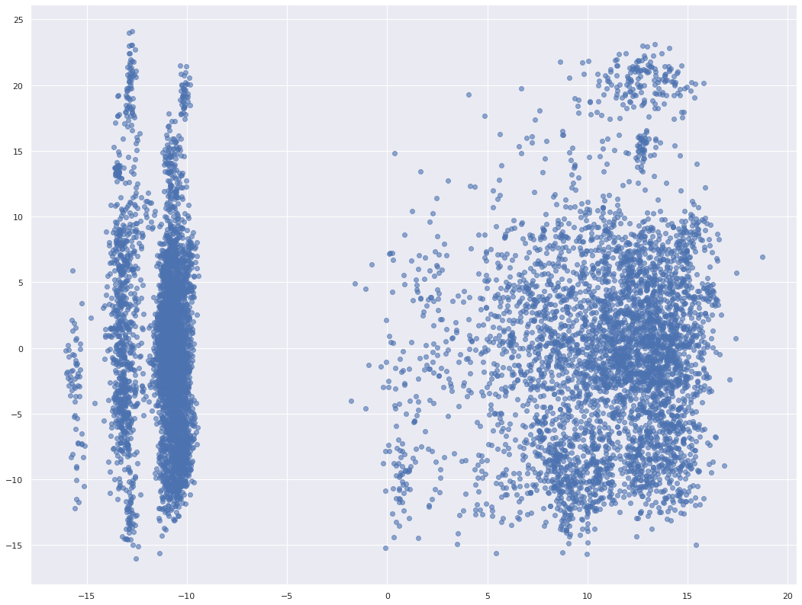


## Select features based on previous checkpoint's analysis


```python
import json

with open(os.path.join("..", "data", "anova_best.json"), "r") as fp:
    ANOVA_BEST = json.load(fp)

with open(os.path.join("..", "data", "chi2_best.json"), "r") as fp:
    CHI2_BEST = json.load(fp)

with open(os.path.join("..", "data", "mi_best.json"), "r") as fp:
    MI_BEST = json.load(fp)

with open(os.path.join("..", "data", "rfecv_best.json"), "r") as fp:
    RFECV_BEST = json.load(fp)

N = 20
SELECT_FEATURES = list(set([*ANOVA_BEST[:N], *CHI2_BEST[:N], *MI_BEST[:N], *RFECV_BEST[:N]]))
len(SELECT_FEATURES), len(agg_df.columns)
```


    (62, 94)


## Apply PCA over SELECTED FEATURES


```python
select_features_df = agg_df_numeric.fillna(0)[SELECT_FEATURES]
normalized_df = (select_features_df - select_features_df.mean()) / select_features_df.std()

X_all = normalized_df.values
y_all = list(map(int, agg_df.fillna(-1).loc[:, "category_id"].values))

pca_all = PCA(n_components=5)
X_pca_all = pca_all.fit_transform(X_all)

import seaborn as sns

sns.scatterplot(
    x='c1', 
    y='c2',
      hue='category',
    size='has_category',
    data=pd.DataFrame({
      'c1': X_pca_all[:, 0],
      'c2': X_pca_all[:, 1],
      'category': list(map(lambda x : categories.get(int(x), "undefined"), y_all)),
        'has_category': list(map(lambda x : 1 if x == -1 else 15, y_all))
  }))
plt.show()
```


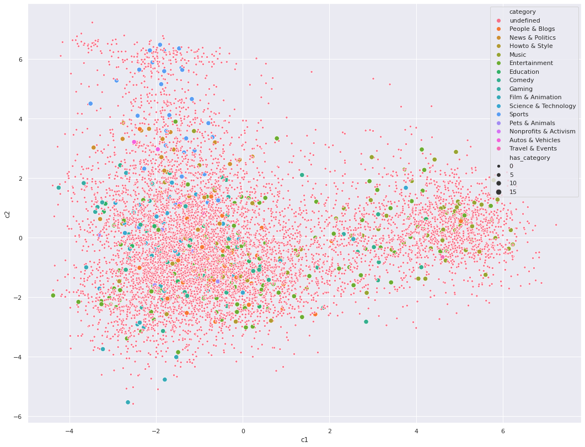


```python
labeled_idx = agg_df.index[~agg_df["category_id"].isna()].tolist()
X = normalized_df.loc[labeled_idx, :].values
y = list(map(int, agg_df.loc[labeled_idx, "category_id"].values))

pca = PCA(n_components=2)
X_pca = pca.fit_transform(X)

import seaborn as sns

sns.scatterplot(
    x='c1', 
    y='c2',
      hue='category',
    data=pd.DataFrame({
      'c1': X_pca[:, 0],
      'c2': X_pca[:, 1],
      'category': list(map(lambda x : categories.get(int(x), "undefined"), y)),
  }))

plt.show()
```


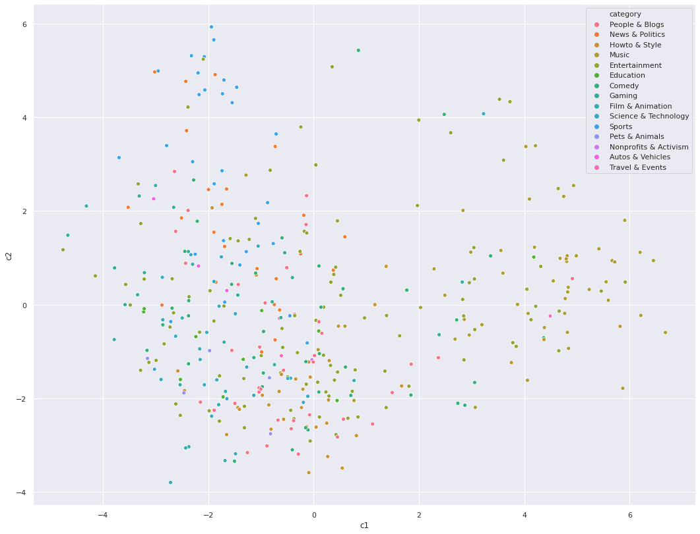


```python
_ = normalized_df.hist(bins=20)
plt.tight_layout()
plt.show()
```


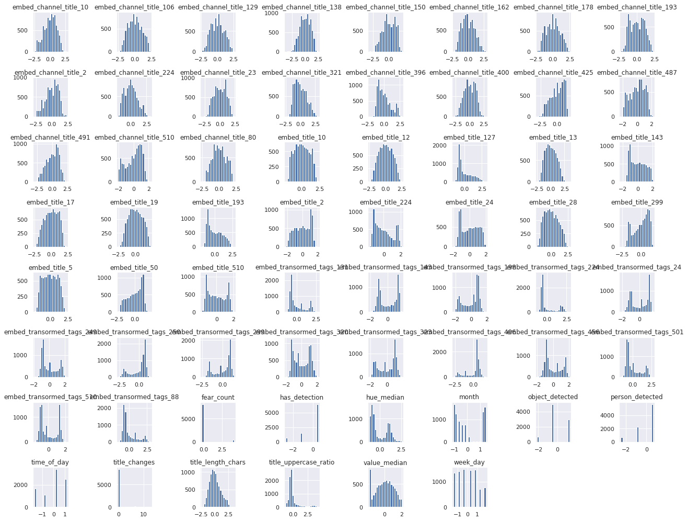


## Distribution of known categories


```python
ax = sns.countplot(
    x="category", 
    data=pd.DataFrame({"category": map(lambda x : categories.get(x),filter(lambda x : x > -1, y_all))})
)
plt.tight_layout()
plt.show()
```


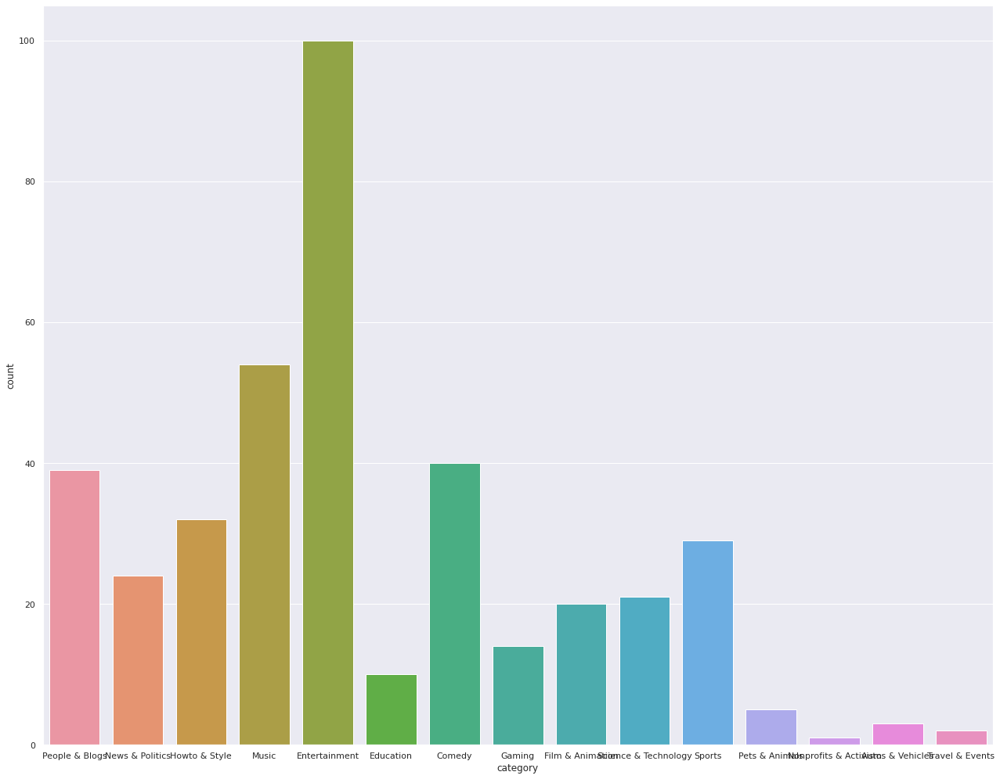


## Try: supervised apprroach vs. naive Self Learning Model


```python
import numpy as np
from sklearn.linear_model.stochastic_gradient import SGDClassifier
from frameworks.SelfLearning import SelfLearningModel

# supervised score 
# basemodel = WQDA() # weighted Quadratic Discriminant Analysis
basemodel = SGDClassifier(loss='log', penalty='l2', random_state=20200501)  # scikit logistic regression
basemodel.fit(X, y)
print("supervised log.reg. score", basemodel.score(X, y))  # 0.8426395939086294

y = np.array(y)
y_all = np.array(y_all)

# # fast (but naive, unsafe) self learning framework
ssmodel = SelfLearningModel(basemodel)
ssmodel.fit(X_all, y_all)
print("self-learning log.reg. score", ssmodel.score(X, y))  # 0.25380710659898476
```

    supervised log.reg. score 0.8324873096446701
    self-learning log.reg. score 0.2639593908629442


## Label Spreading


```python
from sklearn.semi_supervised import LabelSpreading

# label_spread = LabelSpreading(kernel='knn', alpha=0.8, max_iter=1000)
label_spread = LabelSpreading(kernel='knn', alpha=0.2, max_iter=1000)

label_spread.fit(X_all, y_all)
```

    /home/maaslak/PycharmProjects/ped/venv/lib/python3.8/site-packages/sklearn/semi_supervised/_label_propagation.py:293: RuntimeWarning: invalid value encountered in true_divide
      self.label_distributions_ /= normalizer


    LabelSpreading(alpha=0.2, gamma=20, kernel='knn', max_iter=1000, n_jobs=None,
                   n_neighbors=7, tol=0.001)


```python
from sklearn.metrics import plot_confusion_matrix
from sklearn.metrics import confusion_matrix, classification_report

y_pred = label_spread.predict(X)
cm = confusion_matrix(y, y_pred, labels=label_spread.classes_)

print(classification_report(y, y_pred))

disp = plot_confusion_matrix(label_spread, X, y,
                                 display_labels=label_spread.classes_,
                                 cmap=plt.cm.Blues)

#               precision    recall  f1-score   support
#            1       0.38      0.75      0.51        20
#            2       0.00      0.00      0.00         3
#           10       0.79      0.91      0.84        54
#           15       1.00      0.60      0.75         5
#           17       0.88      0.76      0.81        29
#           19       0.00      0.00      0.00         2
#           20       0.92      0.79      0.85        14
#           22       0.89      0.82      0.85        39
#           23       0.86      0.78      0.82        40
#           24       0.90      0.86      0.88       100
#           25       0.91      0.83      0.87        24
#           26       0.81      0.94      0.87        32
#           27       0.86      0.60      0.71        10
#           28       0.89      0.76      0.82        21
#           29       1.00      1.00      1.00         1
#     accuracy                           0.82       394
#    macro avg       0.74      0.69      0.71       394
# weighted avg       0.83      0.82      0.82       394
```

    /home/maaslak/PycharmProjects/ped/venv/lib/python3.8/site-packages/sklearn/metrics/_classification.py:1272: UndefinedMetricWarning: Precision and F-score are ill-defined and being set to 0.0 in labels with no predicted samples. Use `zero_division` parameter to control this behavior.
      _warn_prf(average, modifier, msg_start, len(result))


                  precision    recall  f1-score   support
    
               1       0.38      0.75      0.51        20
               2       0.00      0.00      0.00         3
              10       0.79      0.91      0.84        54
              15       1.00      0.60      0.75         5
              17       0.88      0.76      0.81        29
              19       0.00      0.00      0.00         2
              20       0.92      0.79      0.85        14
              22       0.89      0.82      0.85        39
              23       0.86      0.78      0.82        40
              24       0.90      0.86      0.88       100
              25       0.91      0.83      0.87        24
              26       0.81      0.94      0.87        32
              27       0.86      0.60      0.71        10
              28       0.89      0.76      0.82        21
              29       1.00      1.00      1.00         1
    
        accuracy                           0.82       394
       macro avg       0.74      0.69      0.71       394
    weighted avg       0.83      0.82      0.82       394
    


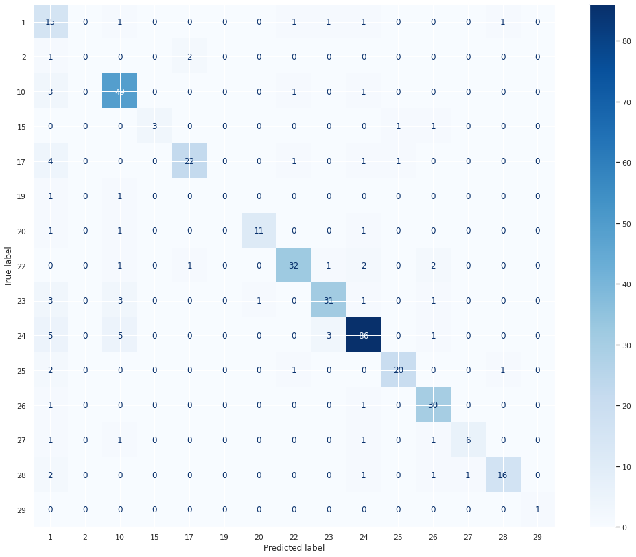


```python
sns.scatterplot(
    x='c1', 
    y='c2',
      hue='category',
    size='correct',
    data=pd.DataFrame({
      'c1': X_pca_all[:, 0],
      'c2': X_pca_all[:, 1],
      'category': list(map(lambda x: categories.get(int(x), "undefined"),
                          label_spread.predict(X_all))),
        'correct': list(map(
            lambda x : 15 if x[0] == x[1] else 1, zip(y_all, label_spread.predict(X_all))))
  }))

plt.show()
```


## Entropies


```python
from scipy import stats

# #############################################################################
# Calculate uncertainty values for each transduced distribution
pred_entropies = stats.distributions.entropy(label_spread.label_distributions_.T)
print(pred_entropies.shape)

sns.distplot(pred_entropies)
plt.show()
```

    (8607,)


    /home/maaslak/PycharmProjects/ped/venv/lib/python3.8/site-packages/scipy/stats/stats.py:1713: FutureWarning: Using a non-tuple sequence for multidimensional indexing is deprecated; use `arr[tuple(seq)]` instead of `arr[seq]`. In the future this will be interpreted as an array index, `arr[np.array(seq)]`, which will result either in an error or a different result.
      return np.add.reduce(sorted[indexer] * weights, axis=axis) / sumval


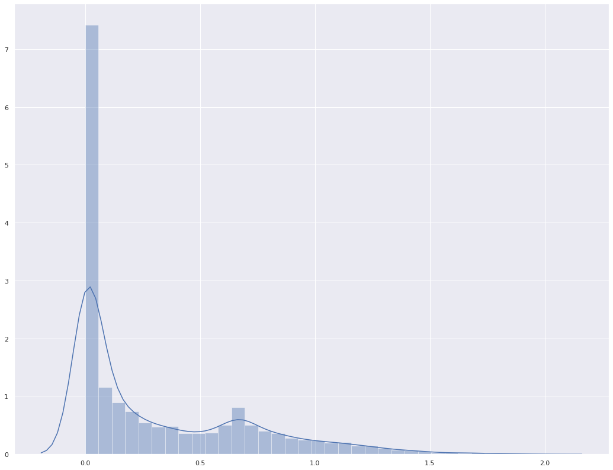


### Read original dataframe to reference original titles & tags


```python
path = "../data/"

GB_videos_df = pd.read_csv(path + "/" + "GB_videos_5p.csv", sep=";", engine="python")
US_videos_df = pd.read_csv(path + "/" + "US_videos_5p.csv", sep=";", engine="python")

df = pd.concat([GB_videos_df, US_videos_df]).drop_duplicates().reset_index(drop=True)
df = df.rename(columns={"description ": "description"})
print(df.shape)
df.head(3) 
```

    (78255, 16)


<div>
<style scoped>
    .dataframe tbody tr th:only-of-type {
        vertical-align: middle;
    }

    .dataframe tbody tr th {
        vertical-align: top;
    }

    .dataframe thead th {
        text-align: right;
    }
</style>
<table border="1" class="dataframe">
  <thead>
    <tr style="text-align: right;">
      <th></th>
      <th>video_id</th>
      <th>trending_date</th>
      <th>title</th>
      <th>channel_title</th>
      <th>category_id</th>
      <th>publish_time</th>
      <th>tags</th>
      <th>views</th>
      <th>likes</th>
      <th>dislikes</th>
      <th>comment_count</th>
      <th>thumbnail_link</th>
      <th>comments_disabled</th>
      <th>ratings_disabled</th>
      <th>video_error_or_removed</th>
      <th>description</th>
    </tr>
  </thead>
  <tbody>
    <tr>
      <th>0</th>
      <td>Jw1Y-zhQURU</td>
      <td>17.14.11</td>
      <td>John Lewis Christmas Ad 2017 - #MozTheMonster</td>
      <td>John Lewis</td>
      <td>NaN</td>
      <td>2017-11-10T07:38:29.000Z</td>
      <td>christmas|"john lewis christmas"|"john lewis"|...</td>
      <td>7224515</td>
      <td>55681</td>
      <td>10247</td>
      <td>9479</td>
      <td>https://i.ytimg.com/vi/Jw1Y-zhQURU/default.jpg</td>
      <td>False</td>
      <td>False</td>
      <td>False</td>
      <td>Click here to continue the story and make your...</td>
    </tr>
    <tr>
      <th>1</th>
      <td>3s1rvMFUweQ</td>
      <td>17.14.11</td>
      <td>Taylor Swift: …Ready for It? (Live) - SNL</td>
      <td>Saturday Night Live</td>
      <td>NaN</td>
      <td>2017-11-12T06:24:44.000Z</td>
      <td>SNL|"Saturday Night Live"|"SNL Season 43"|"Epi...</td>
      <td>1053632</td>
      <td>25561</td>
      <td>2294</td>
      <td>2757</td>
      <td>https://i.ytimg.com/vi/3s1rvMFUweQ/default.jpg</td>
      <td>False</td>
      <td>False</td>
      <td>False</td>
      <td>Musical guest Taylor Swift performs …Ready for...</td>
    </tr>
    <tr>
      <th>2</th>
      <td>n1WpP7iowLc</td>
      <td>17.14.11</td>
      <td>Eminem - Walk On Water (Audio) ft. Beyoncé</td>
      <td>EminemVEVO</td>
      <td>NaN</td>
      <td>2017-11-10T17:00:03.000Z</td>
      <td>Eminem|"Walk"|"On"|"Water"|"Aftermath/Shady/In...</td>
      <td>17158579</td>
      <td>787420</td>
      <td>43420</td>
      <td>125882</td>
      <td>https://i.ytimg.com/vi/n1WpP7iowLc/default.jpg</td>
      <td>False</td>
      <td>False</td>
      <td>False</td>
      <td>Eminem's new track Walk on Water ft. Beyoncé i...</td>
    </tr>
  </tbody>
</table>
</div>


## Least certain


```python
transductions_entropies = list(zip(
    label_spread.transduction_, 
    pred_entropies,
    [i for i in range(len(pred_entropies))]
))

for c in label_spread.classes_:
    print("\nCATEGORY", categories.get(c))
    print(">>> SUPPORT: ", len(list(filter(lambda x : x == c, y_all))), "\n")
    
    t_e_per_class = list(filter(lambda x : x[0] == c, transductions_entropies))
    t_e_per_class = list(sorted(t_e_per_class, key=lambda x : -1*x[1]))
    for _, entropy, idx in t_e_per_class[:5]:
        print(entropy)
        vid_id = agg_df.loc[idx, ["video_id"]].values[0]
        select_from_df = df[df["video_id"] == vid_id]
        print(select_from_df.loc[:, ["title"]].values[0][0])
        print(select_from_df.loc[:, ["tags"]].values[0][0])
        print()
```

    
    CATEGORY Film & Animation
    >>> SUPPORT:  20 
    
    1.730070618886821
    Corgi Snowplow
    [none]
    
    1.1947667343725565
    the fall the man whose head expanded
    [none]
    
    1.1701202340483041
    Why is NASA sending a spacecraft to a metal world? - Linda T. Elkins-Tanton
    TED-Ed|"TEDEd"|"TED Ed"|"TED Education"|"TED"|"NASA"|"Linda T. Elkins-Tanton"|"Eoin Duffy"|"space travel"|"asteroids"|"16 Psyche"|"Psyche"|"Psyche Asteroid Mission"
    
    1.1057595753178315
    [ProjectTL] Trailer movie
    NC|"NCSOFT"|"MMORPG"|"ProjectTL"|"Lineage"|"프로젝트TL"
    
    0.8573444429314476
    Beat Saber Gameplay Teaser
    [none]
    
    
    CATEGORY Autos & Vehicles
    >>> SUPPORT:  3 
    
    0.863809007312607
    Open Workout 18.2 Standards
    Functional Fitness|"Fitness"|"Functional"|"CrossFit"|"The CrossFit Games"|"The Sport of Fitness"|"Forging Elite Fitness"|"Affiliates"|"CrossFit Affiliates"|"2018"|"18.2"|"Standards"
    
    0.8345280054286605
    PUBG Mobile + Mouse & Keyboard = GODMODE
    shivaxi|"pubg mobile"|"pubg"|"mobile games"|"keyboard mouse"|"shroud"|"ez"|"ezpz"|"ez mode"|"basically cheating"|"player unknown's battlegrounds"|"battlegrounds"|"player unknown"
    
    0.700152874180396
    Metro Exodus - Game Awards 2017 Trailer
    Trailer|"Gameplay"|"Game Awards 2017"|"Walkthrough"|"No Commentary"|"Nintendo"|"Switch"|"3DS"|"Microsoft"|"Xbox"|"Playstation"|"Playstation4"|"PS4"|"Lets Play"|"Xcagegame"|"E3"|"Mario"|"Gaming"|"2017"|"2018"
    
    0.3936406612311507
    SIDEMEN FC VS YOUTUBE ALLSTARS 2018 (Goals & Highlights)
    sidemen|"sdmnvsytas"|"SDMN vs YTAS 2018 Highlights"
    
    0.3879266592725351
    Heidelberg's nifty hook-and-lateral to the left tackle
    D3sports|"NCAA Division III"|"D3sports.com"|"D3football.com"|"Division III football"|"#d3fb"|"college football"|"Division III (Sports Association)"
    
    
    CATEGORY Music
    >>> SUPPORT:  54 
    
    1.6906868794006085
    TWICE「Wake Me Up」Music Video
    TWICE|"トワイス"|"トゥワイス"|"ナヨン"|"ジョンヨン"|"モモ"|"サナ"|"ジヒョ"|"ミナ"|"ダヒョン"|"チェヨン"|"ツウィ"
    
    1.6199416898002568
    dapulse is now monday.com. And there's a good reason why.
    dapulse|"monday.com"|"monday"|"project management"
    
    1.539431650245095
    I DONT WANNA GET S**T ON | VLOGMAS
    samantha|"maria"|"sammi"|"dont"|"wanna"|"get"|"on"|"birds"
    
    1.481422239147896
    300,000 Dominoes FALLDOWN - Turkish Domino Record! (Pt. 2)
    turkish domino record|"300000 dominoes"|"domino record"|"domino world record"|"domino day"|"new domino record"|"turkey"|"Türkiye Domino Rekoru"|"domino"|"dominos"|"dominoes"|"domino tricks"|"insane domino tricks"|"Domino Rally"|"domino fall"|"chain reaction"|"chain reactions"|"rube goldberg"|"rube goldberg machine"|"hevesh5"|"marble run"|"amazing triple spiral"|"domino spiral"|"骨牌"|"ドミノ"|"Dominostein"|"домино"|"ντόμινο"|"각설탕"|"Pitagora"|"Suichi"|"ピタゴラスイッチ"|"turkish domino record part 3"
    
    1.4802229866784946
    This Week I Learned to Saber a Champagne Bottle
    mike boyd|"saber"|"sabre"|"champagne"|"bottle"|"500k"|"this week"|"learned"|"learn quick"|"bucks fizz"|"moet"
    
    
    CATEGORY Pets & Animals
    >>> SUPPORT:  5 
    
    1.904032715460015
    Rocket in the Sky plus Accident.
    [none]
    
    1.5810370978612223
    Top 5 Programming Languages to Learn to Get a Job at Google, Facebook, Microsoft, etc.
    which programming language to learn first|"what programming language to learn first"|"top programming languages 2017"|"top programming languages 2018"|"top programming languages 2019"|"top programming languages 2020"|"what programming language should I learn first"|"which programming language should I learn first"|"python"|"ruby"|"swift"|"Java"|"kotlin"|"SQL"|"golang"|"go"|"javascript"
    
    1.5219357816436503
    What's Inside a Detectives Car?
    detective|"officer"|"401"|"officer401"|"police"|"cop"|"cops"|"law"|"enforcement"|"investigator"|"ford"|"fusion"|"crown vic"|"charger"|"dodge"|"patrol"|"cid"|"criminal"|"investigations"|"division"|"mre"|"survival food"|"trunk"|"2011"|"2012"|"2013"|"2014"|"2015"|"2016"|"2017"|"fusion se"|"ford fusion"|"ford fusion se"|"vest"|"outter"|"carrier"|"bullet-proof"|"bullet-proof vest"|"level 2 armor"|"level 3 armor"
    
    1.424258751804367
    Deer Meets Snowman And Devours Him | The Dodo
    animal video|"animals"|"the dodo"|"Rescue"|"Animal Rescue"|"deer meets snowman"|"deer snowman"|"deer eats snowman"|"funny deer video"|"snow deer"|"animals vs snowman"|"deer vs snoman"|"deer attacks snowman"|"deer eating"|"deer sounds"|"deer video"|"deer call"|"deer grunt"|"deer drives"|"deer"|"deer attack"|"deer avenger"|"deer snow"
    
    1.4193269241201814
    The Purrrfect Ride!
    cat|"funnycat"|"catriding"|"liberty"|"horsemanshiip"|"connemara"|"emma massingale"|"trainer"
    
    
    CATEGORY Sports
    >>> SUPPORT:  29 
    
    1.7402366060144547
    How to Make a Ping Pong Table // Collab with Evan & Katelyn
    ping pong|"ping pong table"|"table tennis"|"evan and katelyn"|"evan & katelyn"|"evanandkatelyn"|"collaboration"|"collab"|"how to"|"how-to"|"led"|"arduino"|"custom ping pong"|"woodworking"|"wood"|"workshop"
    
    1.7011882646947385
    Rob Gronkowski DIRTY Hit On Tre'Davious White | Pats vs. Bills | NFL
    Highlights|"Highlight Heaven"
    
    1.6846023334251001
    Women Play Hair Nah: Don't Touch Black Hair
    buzzfeed|"buzzfeedvideo"|"hair nah"|"don't touch black hair"|"solange knowles"|"don't touch my hair"|"hair care"|"women"|"black women"|"knowles"|"seat at the table"|"games"|"gamer"|"video game"|"computer games"|"travel"|"momo pixel"|"black"|"black girl"|"hair"|"natural hair"|"african american hair"|"culture"|"discrimination"
    
    1.5682457322841612
    How 29,000 Lost Rubber Ducks Helped Map the World's Oceans
    friendly|"floatees"|"rubber"|"ducks"|"duck"|"duckies"|"mapping"|"maps"|"map"|"current"|"currents"|"oceans"|"ocean"|"sea"|"water"|"weird"|"interesting"|"strange"|"story"
    
    1.4490696473938747
    Eagles Fan Gets Wrecked by Pole
    [none]
    
    
    CATEGORY Travel & Events
    >>> SUPPORT:  2 
    
    1.1859368398458123
    DAY 7: Rita Ora by Rankin #LOVEADVENT2017
    Rita Ora|"Love Magazine"|"LOVEADVENT2017"|"Love Advent"|"Anywhere"|"Rankin"
    
    0.6498840690368133
    Jason Aldean - You Make It Easy (Lyric Video)
    Jason Aldean|"You Make It Easy"|"BBRMG"|"Broken Bow Records"|"Jason Alden"|"Jason Aldene"
    
    0.638001792609327
    Tommy No 1 + Eddie Too Tall - Falling on Your Arse in 1999 (Full Album)
    tom hardy|"rap"|"hiphop"|"uk hiphop"|"tommy no 1"|"eddie too tall"|"falling on your arse in 1999"|"tommy no 1 + eddie too tall"|"erdoglija hardcore"|"erdoglija"
    
    0.6376122013955731
    Calum Scott - Only You (Audio)
    Calum|"Scott"|"Only"|"You"|"Capitol"|"Records"|"(US1A)"|"Pop"
    
    0.5093687282986937
    Volkswagen Gassed Monkeys To Prove Diesels Are Clean
    vw diesel monkey|"monkeys"|"vw"|"volkswagen"|"dieselgate"|"vw tested monkeys"|"vw dieselgate"|"vw clean diesel"|"crab-eating macaque"|"netflix"|"new york times"|"defeat device"|"vw gassed monkeys"|"diesel monkey gas"|"diesel"|"vw beetle"|"volkswagen beetle"|"vw tdi"|"tdi"|"vw beetle tdi"|"engineering explained"|"be kind"|"do good"
    
    
    CATEGORY Gaming
    >>> SUPPORT:  14 
    
    1.4518328253256139
    Worlds First Live Nuke in COD WW2 - V2 Rocket - Hidden Streak
    twitch|"games"
    
    1.4425518484917987
    Buying Used Things
    domics|"animation"|"kijiji"|"craigslist"|"ps3"|"playstation 3"|"video games"|"used"|"sell"|"buy"|"haggle"|"lootcrate"|"anime"
    
    1.428797940716044
    Classic Game Enthusiast's DREAM?
    hyperkin|"game boy"|"atari"|"sega"|"mega"|"classic"|"game"|"console"|"ces"|"2018"|"consumer"|"electronics"|"show"
    
    1.402944888127477
    YouTube Live at E3 2018: Monday with Ninja, Marshmello, PlayStation, Ubisoft, Todd Howard
    youtube live at E3|"geoff keighley"|"e3 live"|"e3 2018"|"e3 gameplay"|"electronic entertainment expo"|"playstation"|"death stranding"|"hideo kojima"|"spider-man"|"spiderman"|"the last of us part 2"|"ghost of tsushima"|"ninja"|"let's play"|"marshmello"|"ali-a"|"vikkstar"|"e3 livestream"|"press conference"|"gameplay"|"videogames"|"youtube e3 show"|"e3 stream"|"live press conference"|"e3 news"
    
    1.3992605117391455
    Dunkirk re-edited as a Silent Film – The Power of Visual Storytelling
    Christopher|"Nolan"|"Dunkirk"|"Silent"|"Film"|"visual"|"storytelling"|"elgar"|"nimrod"|"analysis"|"analyzed"|"video essay"|"mash-up"
    
    
    CATEGORY People & Blogs
    >>> SUPPORT:  39 
    
    1.8534261240173766
    How to Make Life More Interesting
    jaiden|"animations"|"jaidenanimation"|"jaidenanimations"|"how to make life more interesting"|"life tips"|"life advice"|"how to make life more interesting jaidenanimation"|"jaidenanimation life more interesting"|"how many apples are there"|"more than you think lol"|"babysitting kids"|"more tag stuff"
    
    1.8447632245020444
    Turning Sugarcane Into Candy Canes | HTME
    HTME|"DIY"|"Fun"|"Smart"|"Learn"|"Teach"|"Maker"|"History"|"Science"|"Innovator"|"Education"|"Educational"|"School"|"Invention"|"Agriculture"|"Textiles"|"Industry"|"Technology"|"candy"|"cane"|"sugar"|"sugarcane"|"corn"|"syrup"|"confectionary"|"sugary"|"cook"|"christmas"|"carmel"|"cinnamon"|"distilling"|"ethanol"|"applejack"|"cochineal"|"mexico"|"tapachula"
    
    1.6948145762166076
    I built a PC out of rope and wood...
    pc|"scratch build"|"ropenwood"|"diy perks"|"wooden pc"|"sculpture"|"computer"|"art"|"craft"|"make"|"build"|"cloud unit"|"technology"|"heatsinks"|"gpu"
    
    1.6152637314833238
    How This Island Got 10% of Their Money by Chance
    tuvalu|"pacific"|"island"|"country"|"2nd smallest"|"smallest"|"nation"|"funafuti"|"airport"|".tv"|"verisign"|"domain"|"domains"|"internet"|"world wide web"|"gdp"|"gross domestic product"|"isolated"|"auckland"|"iso"|"International Organization for Standardization"|"iso 3166"|"country code"|"weird"|"fun"|"fast"|"funny"|"interesting"|"animated"|"wendover"|"productions"|"wendover productions"|"half as interesting"|"hai"|"#24"
    
    1.6147984858454778
    A Sainty Switch
    saintly|"switch"|"new"|"orleans"|"saints"|"vivica"|"anjanetta"|"fox"|"david"|"alan"|"grier"|"football. washington"|"redskins"
    
    
    CATEGORY Comedy
    >>> SUPPORT:  40 
    
    1.8406800098338465
    Aladdin & Genisa | Lele Pons & Anwar Jibawi
    aladdin genisa|"lele"|"pons"|"anwar"|"jibawi"|"aladdin"|"genisa"|"high school bully"|"how to buy your mom a gift"|"i hate homework"|"Aladdin & Genisa | Lele Pons & Anwar Jibawi"|"lelepons"|"hannahstocking"|"rudymancuso"|"inanna"|"sarkis"|"shots"|"shotsstudios"|"alesso"|"anitta"|"brazil"
    
    1.8405705934181893
    I'm in a Sorority? | Lele Pons
    im in a sorority|"lele"|"pons"|"im"|"in"|"sorority"|"are we frenemies"|"im the easter bunny"|"aladdin genisa"|"Are We Frenemies?! | Lele Pons"|"Hannah Stocking & Anwar Jibawi"|"lelepons"|"hannahstocking"|"rudymancuso"|"inanna"|"anwar"|"sarkis"|"shots"|"shotsstudios"|"alesso"|"anitta"|"brazil"
    
    1.8405705934181893
    I'm the Easter Bunny? | Lele Pons
    im the easter bunny|"lele"|"pons"|"im"|"the"|"easter"|"bunny"|"aladdin genisa"|"high school bully"|"how to buy your mom a gift"|"I'm the Easter Bunny? | Lele Pons"|"lelepons"|"hannahstocking"|"rudymancuso"|"inanna"|"anwar"|"sarkis"|"shots"|"shotsstudios"|"alesso"|"anitta"|"brazil"
    
    1.7950647127628607
    Dating the Popular Guy | Lele Pons
    dating the popular guy|"lele"|"pons"|"dating"|"the"|"popular"|"guy"|"im a baby"|"worst fortune teller ever"|"spying on your boyfriend"|"Dating the Popular Guy | Lele Pons"|"lelepons"|"hannahstocking"|"rudymancuso"|"inanna"|"anwar"|"sarkis"|"shots"|"shotsstudios"|"alesso"|"anitta"|"brazil"
    
    1.7941006133120918
    Fantasy Glasses | Lele Pons
    fantasy glasses|"lele"|"pons"|"fantasy"|"glasses"|"dating the popular guy"|"im a baby"|"worst fortune teller ever"|"Fantasy Glasses | Lele Pons"|"lelepons"|"hannahstocking"|"rudymancuso"|"inanna"|"anwar"|"sarkis"|"shots"|"shotsstudios"|"alesso"|"anitta"|"brazil"
    
    
    CATEGORY Entertainment
    >>> SUPPORT:  100 
    
    1.9556615390786942
    New Gear for the NYC Office!! (+ How I Organize Footage)
    how to make youtube videos|"how to get first 100 youtube subscribers"|"how to vlog tutorial"|"best nyc vloggers new york city"|"b&h photo video new york city super store hual"|"new york city office tour 2018 manhattan"|"how to make youtube videos on your phone"|"5 ways to INSTANTLY make BETTER VIDEOS! peter mckinnon"|"iMac Pro Setup Tour 2018! marques mkbhd"|"sarah peachy"|"Best Hard Drives for Editing! Hard Drive Tips devingraham"|"NEW SERVER! 150TB server install with Linus! ijustine"
    
    1.757657795374823
    ROCKET JUMP RC CAR - Worlds highest vertical jump with an RC car! (probably)
    rocket|"jump"|"rc"|"car"|"Rocket jump rc car"|"remote control"|"control"|"remote"|"world record"|"jato"|"Mythbusters"|"FPV"|"rcexplorer"|"windestal"|"windestål"|"david"|"hobbyking"|"desert fox"|"desert"|"fox"|"fast"|"crash"|"air"|"highest"|"ramp"|"impact"|"traxxas"|"slow motion"|"high speed"|"lipo"|"First person view"|"rockets"|"strapped"|"world"|"record"|"high"
    
    1.6955276680490876
    Nintendo Labo
    dunkey|"videogamedunkey"|"nintendo labo"|"dunkey labo"|"dunkey nintendo labo"|"labo"
    
    1.684855968158894


    ---------------------------------------------------------------------------

    IndexError                                Traceback (most recent call last)

    <ipython-input-20-25987e30ca5f> in <module>
         15         vid_id = agg_df.loc[idx, ["video_id"]].values[0]
         16         select_from_df = df[df["video_id"] == vid_id]
    ---> 17         print(select_from_df.loc[:, ["title"]].values[0][0])
         18         print(select_from_df.loc[:, ["tags"]].values[0][0])
         19         print()


    IndexError: index 0 is out of bounds for axis 0 with size 0


## Most certain


```python
transductions_entropies = list(zip(
    label_spread.transduction_, 
    pred_entropies,
    [i for i in range(len(pred_entropies))]
))

for c in label_spread.classes_:
    print("\nCATEGORY", categories.get(c))
    print(">>> SUPPORT: ", len(list(filter(lambda x : x == c, y_all))), "\n")
    
    t_e_per_class = list(filter(lambda x : x[0] == c, transductions_entropies))
    t_e_per_class = list(sorted(t_e_per_class, key=lambda x : x[1]))
    for _, entropy, idx in t_e_per_class[:5]:
        print(entropy)
        vid_id = agg_df.loc[idx, ["video_id"]].values[0]
        select_from_df = df[df["video_id"] == vid_id]
        if select_from_df.shape[0] > 0:
            print(select_from_df.loc[:, ["title"]].values[0][0])
            print(select_from_df.loc[:, ["tags"]].values[0][0][:100])
            print()
```

    
    CATEGORY Film & Animation
    >>> SUPPORT:  20 
    
    0.005083443417729805
    TREMORS SEASON 1 Official Trailer (2018) Kevin Bacon
    [none]
    
    0.1192250806302004
    When dad hijacks elf on a shelf 😉🎄
    elf|"elfontheshelf"|"ontheshelf"|"buddytheelf"|"elfonshelf"|"christmas"|"xmas"|"dadvent"|"december"|
    
    0.17584439835516452
    ESPN's Katie Nolan (Extended Cut)
    Desus & Mero|"Desus"|"Desus Nice"|"Mero"|"The Kid Mero"|"VICELAND"|"VICE"|"Late Night"|"Talk Show"|"
    
    0.2993654742346553
    BTS Plays With Puppies While Answering Fan Questions
    BuzzFeed|"BuzzFeedVideo"|"Puppy Interview"|"puppy"|"john lennon"|"questions"|"q&A"|"BTS"|"k-pop"|"ko
    
    0.3309534103242192
    Tyron Woodley Says Things Got Real With Conor McGregor | The Hollywood Beatdown | TMZ Sports
    TMZ|"TMZ Sports"|"TMZ Sports Channel"|"TMZ 2017"|"TMZ Sports 2017"|"Celebrity"|"Sports"|"Athletes"|"
    
    
    CATEGORY Autos & Vehicles
    >>> SUPPORT:  3 
    
    0.06262426430639906
    New Year's Eve Penske Peel at the 11foot8 bridge
    11foot8|"low clearance crash"|"truck crash"|"train trestle"|"Durham"
    
    0.2218009726256637
    I Said I Would NEVER Do This To My Truck... BIG MODS INCOMING!
    tj hunt|"tjhunt"|"salomondrin"|"doug demuro"|"tanner fox"|"cleetus"|"cleetus mcfarland"|"cleetusmcfa
    
    0.28396857710934953
    FIA GT World Cup 2017. Qualification Race Macau Grand Prix. Huge Pile Up
    GT Series|"Qualification Race"|"Macau Grand Prix"|"FIA GT World Cup"|"Pile Up"|"traffic jam"|"start"
    
    0.3879266592725351
    Heidelberg's nifty hook-and-lateral to the left tackle
    D3sports|"NCAA Division III"|"D3sports.com"|"D3football.com"|"Division III football"|"#d3fb"|"colleg
    
    0.3936406612311507
    SIDEMEN FC VS YOUTUBE ALLSTARS 2018 (Goals & Highlights)
    sidemen|"sdmnvsytas"|"SDMN vs YTAS 2018 Highlights"
    
    
    CATEGORY Music
    >>> SUPPORT:  54 
    
    0.0
    NCT U 엔시티 유 'BOSS' Dance Practice
    NCT|"NCT 2018"|"TAEYONG"|"JAEHYUN"|"JUNGWOO"|"KUN"|"CHENLE"|"TEN"|"RENJUN"|"YUTA"|"DOYOUNG"|"JOHNNY"
    
    0.0
    NCT U 엔시티 유 'BOSS' MV
    NCT|"NCT 2018"|"TAEYONG"|"JAEHYUN"|"JUNGWOO"|"KUN"|"CHENLE"|"TEN"|"RENJUN"|"YUTA"|"DOYOUNG"|"JOHNNY"
    
    0.0
    TVXQ! 동방신기 '운명 (The Chance of Love)' MV
    TVXQ!|"동방신기"|"유노윤호"|"최강창민"|"MAX"|"U-KNOW"|"운명"|"The Chance of Love"|"kpop"|"MV"|"Music Video"|"Chore
    
    0.0
    NCT 127 엔시티 127 'TOUCH' MV
    NCT|"NCT 2018"|"TAEYONG"|"JAEHYUN"|"JUNGWOO"|"KUN"|"CHENLE"|"TEN"|"RENJUN"|"YUTA"|"DOYOUNG"|"JOHNNY"
    
    0.0
    SHINee 샤이니 '데리러 가 (Good Evening)' MV
    샤이니|"SHINee"|"태민"|"민호"|"키"|"온유"|"종현"|"JONGHYUN"|"TAEMIN"|"MINHO"|"KEY"|"ONEW"|"데리러 가"|"Good Evening"
    
    
    CATEGORY Pets & Animals
    >>> SUPPORT:  5 
    
    0.002758869093068426
    Cat Mind Control
    aarons animals|"aarons"|"animals"|"cat"|"cats"|"kitten"|"kittens"|"prince michael"|"prince"|"michael
    
    0.008164744791197965
    A little Dingo running on a bridge over one of the busiest freeways in the U.S!
    Eldad Hagar|"hope for paws"|"dog rescue"
    
    0.013758447648814879
    Homeless Cats
    aarons animals|"aarons"|"animals"|"cat"|"cats"|"kitten"|"kittens"|"prince michael"|"prince"|"michael
    
    0.014146582559775649
    バーレルなねこ。-Maru Bucket.-
    Maru|"cat"|"kitty"|"pets"|"まる"|"猫"|"ねこ"
    
    0.015832950381547226
    OH NO! ALL ANTS DEAD?!
    ants|"antscanada"|"mikey bustos"|"myrmecology"|"antfarm"|"ant colony"|"ant nest"|"queen ant"|"formic
    
    
    CATEGORY Sports
    >>> SUPPORT:  29 
    
    0.0
    Top 10 Moments of the NBA All-Star Celebrity Game
    nba|"highlights"|"basketball"|"plays"|"amazing"|"sports"|"hoops"|"finals"|"games"|"game"|"all star g
    
    0.0
    Stephen A. changes his mind: 76ers will beat Cavaliers to reach NBA Finals | First Take | ESPN
    espn|"espn live"|"76rs"|"philadelphia 76ers"|"sixers"|"cleveland cavaliers"|"ben simmons"|"ben"|"sim
    
    0.0
    Kobe Bryant Jersey Retirement Press Conference
    nba|"basketball"|"highlight"|"press conference"|"live"|"kobe bryant"|"los angeles lakers"|"lakers"|"
    
    0.0
    Wildest Superstar distractions: WWE Top 10, Nov. 11, 2017
    wwe|"world wrestling entertainment"|"wrestling"|"wrestler"|"wrestle"|"superstars"|"कुश्ती"|"पहलवान"|
    
    0.0
    Steve Kerr reminisces with Scottie Pippen about their Bulls playoff runs | The Jump | ESPN
    espn|"espn live"|"steve"|"kerr"|"reminisces"|"with"|"scottie"|"pippen"|"about"|"their"|"bulls"|"play
    
    
    CATEGORY Travel & Events
    >>> SUPPORT:  2 
    
    0.0020388183500055605
    Trump - S**thole Countries - shithole statement by NAMIBIA💩💩
    Trump|"shithole"|"shithole countries"|"statement"|"america"|"africa"|"haiti"|"trump shithole"|"trump
    
    0.003118087206997948
    Shane MacGowan & Nick Cave - Summer in Siam + The Wild Mountain Thyme - Shane’s 60th Birthday Party
    shane macgowan|"nick cave"|"birthday party"|"the pogues"|"dublin"|"ireland"|"summer in siam"|"nation
    
    0.01224058043752094
    Keith Urban - Coming Home ft. Julia Michaels
    Keith|"Urban"|"Coming"|"Home"|"Capitol"|"Nashville"|"Country"
    
    0.015489160378811442
    How This Frugal Family of 4 Paid Off $96k in Debt & Built a Custom Tiny House
    how|"to"|"get"|"out"|"of"|"debt"|"spend"|"less"|"save"|"more"|"money"|"credit"|"loan"|"tiny"|"house"
    
    0.05047038854412139
    Keith Urban - Coming Home (Lyric Video) ft. Julia Michaels
    Keith|"Urban"|"Coming"|"Home"|"Capitol"|"Nashville"|"Country"
    
    
    CATEGORY Gaming
    >>> SUPPORT:  14 
    
    0.0
    Rainbow Six Siege: Operation Para Bellum - Villa | Trailer | Ubisoft [NA]
    Rainbow six siege|"rainbow six siege trailer"|"rainbow six siege tips"|"pc game"|"ps4"|"xbox one"|"u
    
    0.0
    Tom Clancy’s Ghost Recon Wildlands: Ghost War – Update #2 – Jungle Storm | Ubisoft [US]
    ghost recon wildlands|"ghost recon wildlands trailer"|"ghost recon wildlands tips"|"ps4"|"xbox one"|
    
    0.0
    Rainbow Six Siege: Operation White Noise - Free Weekend November 16-19 | Trailer | Ubisoft [US]
    Rainbow six siege|"rainbow six siege trailer"|"rainbow six siege tips"|"pc game"|"steam"|"ps4"|"xbox
    
    0.0
    Tom Clancy’s The Division: 1.8 Free Update Launch Trailer | Ubisoft [US]
    Tom clancy’s the division|"the division"|"division"|"the division trailer"|"the division tips"|"ps4"
    
    0.0
    For Honor: E3 2018 Marching Fire Cinematic Trailer | Ubisoft [NA]
    for honor|"for honor trailer"|"for honor campaign"|"trailer"|"ps4"|"xbox one"|"pc"|"ubisoft"|"Japane
    
    
    CATEGORY People & Blogs
    >>> SUPPORT:  39 
    
    1.2609882492319468e-07
    I Bought 5 Knockoff Tech Products From Wish
    wish haul|"wish electronics"|"wish tech products"|"wish clothes"|"wish free"|"wish"|"wish website"|"
    
    3.9950824671047133e-07
    I Let My Subscribers Pick My Hair Color
    i let my subscribers pick my hair color|"subscribers pick my hair color"|"viewers pick my hair color
    
    2.321869649663285e-06
    I Dressed According To My Zodiac Sign For A Week
    i dressed according to my zodiac sign for a week|"zodiac sign"|"astrology"|"astrological fashion"|"z
    
    2.3734427687053033e-06
    Wearing Online Dollar Store Makeup For A Week
    wearing online dollar store makeup for a week|"online dollar store makeup"|"dollar store makeup"|"da
    
    2.573219166752961e-06
    I Wore Platform Crocs For A Week
    i wore platform crocs for a week|"platform crocs"|"questionable fashion decision"|"balenciaga platfo
    
    
    CATEGORY Comedy
    >>> SUPPORT:  40 
    
    0.0
    Trump and Republicans Rush to Pass Their Radical Tax Plan: A Closer Look
    late night|"seth meyers"|"closer look"|"trump"|"republicans"|"rush"|"pass"|"tax plan"|"NBC"|"NBC TV"
    
    0.0
    Conor Lamb's Win, Trump's Space Force and #NationalStudentWalkout: A Closer Look
    closer look|"late night"|"seth meyers"|"trump"|"conor lamb"|"space force"|"walkout"|"student"|"NBC"|
    
    0.0
    I Tried DIY Skincare For A Week | Beauty With Mi | Refinery29
    refinery29|"refinery 29"|"r29"|"r29 video"|"refinery29 video"|"female"|"empowerment"|"beauty with mi
    
    0.0
    Dupe That: Tom Ford Lipsticks | Beauty With Mi | Refinery29
    refinery29|"refinery 29"|"r29"|"r29 video"|"refinery29 video"|"female"|"empowerment"|"beauty with mi
    
    0.0
    Trump Attacks Feinstein, Makes Racist Immigration Comment: A Closer Look
    late night|"closer look"|"seth meyers"|"trump"|"NBC"|"NBC TV"|"television"|"funny"|"talk show"|"come
    
    
    CATEGORY Entertainment
    >>> SUPPORT:  100 
    
    0.0
    Marvel's VENOM (2018) - Full Trailer | Tom Hardy Movie (HD) Concept
    venom trailer|"spiderman"|"venom official trailer"|"venom teaser"|"eddie brock"|"marvel"|"venom movi
    
    0.0
    13 Reasons Why: Season 2 | Official Trailer [HD] | Netflix
    Netflix|"Trailer"|"Netflix Original Series"|"Netflix Series"|"television"|"movies"|"streaming"|"movi
    
    0.0
    Keeping Up With the Kardashians Katch-Up S14, EP.15 | E!
    Kardashians|"Kourtney Kardashian"|"Kim Kardashian"|"Khloe Kardashian"|"Scott Disick"|"Kris Jenner"|"
    
    0.0
    Netflix Acquires Seth Rogen
    Netflix|"Trailer"|"Netflix Original Series"|"Netflix Series"|"television"|"movies"|"streaming"|"movi
    
    0.0
    Gabby Barrett Sings The Climb by Miley Cyrus - Top 14 - American Idol 2018 on ABC
    ABC|"americanidol"|"idol"|"american idol"|"ryan"|"seacrest"|"ryan seacrest"|"katy"|"perry"|"katy per
    
    
    CATEGORY News & Politics
    >>> SUPPORT:  24 
    
    9.01725677483355e-10
    Summit of Hawaii's Kilauea volcano erupts
    latest News|"Happening Now"|"CNN"|"weather"|"US"|"Scott McLean"|"Wolf"
    
    2.2048948960825978e-08
    Emma Gonzalez gives speech at March for Our Lives rally
    latest News|"Happening Now"|"CNN"|"us news"|"politics"|"Emma Gonzalez"|"March For Our Lives"|"Speech
    
    2.9304077988662736e-08
    Natalie Portman speaks at Women's March
    latest News|"Happening Now"|"CNN"|"Politics"|"Entertainment"|"US News"
    
    5.4786788618251246e-08
    Ex-UFO program chief: We may not be alone
    latest News|"Happening Now"|"CNN"|"luis elizondo"|"UFO"|"ALiens"|"ebof"|"erin burnett"|"US news"
    
    6.90537679380544e-08
    Most expensive house in the world shrouded in mystery
    latest News|"Happening Now"|"CNN"|"World News"|"Culture"
    
    
    CATEGORY Howto & Style
    >>> SUPPORT:  32 
    
    0.0
    Brad and Sean Evans Make Cast-Iron Pizza | It's Alive | Bon Appétit
    hot sauce|"hot ones"|"first we feast"|"pizza"|"cast-iron"|"what is"|"brad"|"brad leone"|"it's alive"
    
    0.0
    Binging with Babish Reviews The Internet's Most Popular Food Videos | Bon Appétit
    binging|"food videos"|"most popular food videos"|"binging with babish"|"babish"|"andrew rea"|"bingin
    
    0.0
    The Ultimate Expensive Burger Tasting with Adam Richman | The Burger Show
    First we feast|"fwf"|"firstwefeast"|"food"|"food porn"|"cook"|"cooking"|"chef"|"kitchen"|"recipe"|"c
    
    0.0
    Adam Rippon Competes in the Olympics of Eating Spicy Wings | Hot Ones
    First we feast|"fwf"|"firstwefeast"|"food"|"food porn"|"cook"|"cooking"|"chef"|"kitchen"|"recipe"|"c
    
    0.0
    Pastry Chef Attempts To Make Gourmet Kit Kats | Gourmet Makes | Bon Appétit
    candy|"chocolate"|"gourmet"|"gourmet recipe"|"kit kat"|"kit kats"|"test kitchen"|"kit kat bar"|"how 
    
    
    CATEGORY Education
    >>> SUPPORT:  10 
    
    1.9919450991401285e-05
    Why Is It So Hard To Fall Asleep?
    life noggin|"life noggin youtube"|"youtube life noggin"|"life noggin channel"|"education"|"education
    
    9.919516961602222e-05
    Which Country Has The Best Technology?
    life noggin|"life noggin youtube"|"youtube life noggin"|"life noggin channel"|"education"|"education
    
    0.0001054580928396949
    What Would REALLY Happen If You Cloned Yourself?
    life noggin|"life noggin youtube"|"youtube life noggin"|"life noggin channel"|"education"|"education
    
    0.00011552634895985022
    What If You Only Drank Coffee? Ft. WheezyWaiter
    life noggin|"life noggin youtube"|"youtube life noggin"|"life noggin channel"|"education"|"education
    
    0.0001450542799551123
    Introverts vs. Extroverts: What’s The Difference? Ft. Anthony Padilla
    life noggin|"life noggin youtube"|"youtube life noggin"|"life noggin channel"|"education"|"education
    
    
    CATEGORY Science & Technology
    >>> SUPPORT:  21 
    
    9.837413936392467e-06
    😱 $1,145 iPhone Case!!
    ijustine|"gray international"|"most expensive iphone case"
    
    2.0566730590380337e-05
    Frozen Bigfoot Head DNA, Weight, Dimensions,  Up Coming Surprise for Humanity
    Frozen Bigfoot Head DNA|"Weight"|"Dimensions"|"Up Coming Surprise for Humanity"|"Sasquatch"|"Yeti"|"
    
    2.258024320291583e-05
    How iFixit Became the World's Best iPhone Teardown Team
    motherboard|"motherboardtv"|"vice"|"vice magazine"|"documentary"|"science"|"technology"|"tech"|"sci-
    
    2.9614576026177398e-05
    Samsung's Galaxy S9 event: Watch CNET's live coverage here
    CNET|"Samsung"|"Samsung Galaxy S9"|"Samsung Galaxy S8"|"Samsung Galaxy phone"|"New Galaxy phone"|"Ga
    
    7.165033566419919e-05
    Original 2007 iPhone Unboxing!!!
    ijustine|"original iphone"|"iphone unboxing"|"original iphone unboxing"|"first generation iphone"|"i
    
    
    CATEGORY Nonprofits & Activism
    >>> SUPPORT:  1 
    
    1.708866417425815e-05
    Rose McGowan Talks Alleged Sexual Misconduct By Harvey Weinstein | The View
    Rose McGowan|"Rose's Army"|"MeToo"|"Time's Up"|"The View"|"feminism"|"women's rights"|"hot topics"|"
    
    0.00015448604952212765
    Catt Sadler Shares Her Side Of E! Exit | The View
    Catt Sadler|"The View"|"E! news"|"hot topics"|"Time's Up"|"equal pay"|"pay gap"|"glass ceiling"
    
    0.0002132657754923821
    Yara Shahidi Speaks Out On Protests In Iran | The View
    yara shahidi|"iran"|"protests"|"iran protests"|"politics"|"the view"|"hot topics"
    
    0.00024938129693529386
    Meghan Markle Engaged To Prince Harry | The View
    Meghan Markle|"prince harry"|"the view"|"princess diana"|"hot topics"
    
    0.00028703306982370076
    Megyn Kelly Escalates Feud With Jane Fonda | The View
    [none]
    


# 2 Method: Gaussian Mixture Model

First (bad) implementation found at kaggle site


```python

import numpy as np
from scipy import stats


class SSGaussianMixture(object):
    def __init__(self, n_features, n_categories):
        self.n_features = n_features
        self.n_categories = n_categories

        self.mus = np.array([np.random.randn(n_features)] * n_categories)
        self.sigmas = np.array([np.eye(n_features)] * n_categories)
        self.pis = np.array([1 / n_categories] * n_categories)

    def fit(self, X_train, y_train, X_test, threshold=0.00001, max_iter=100):
        Z_train = np.eye(self.n_categories)[y_train]

        for i in range(max_iter):
            # EM algorithm
            # M step
            Z_test = np.array([self.gamma(X_test, k) for k in range(self.n_categories)]).T
            Z_test /= Z_test.sum(axis=1, keepdims=True)

            # E step
            datas = [X_train, Z_train, X_test, Z_test]
            mus = np.array([self._est_mu(k, *datas) for k in range(self.n_categories)])
            sigmas = np.array([self._est_sigma(k, *datas) for k in range(self.n_categories)])
            pis = np.array([self._est_pi(k, *datas) for k in range(self.n_categories)])

            diff = max(np.max(np.abs(mus - self.mus)),
                       np.max(np.abs(sigmas - self.sigmas)),
                       np.max(np.abs(pis - self.pis)))

            print(f"{i + 1}/{max_iter} diff = {diff} conv matrix max = {np.max(sigmas)} min {np.min(sigmas)}")
            self.mus = mus
            self.sigmas = sigmas
            self.pis = pis
            if diff < threshold:
                break

    def predict_proba(self, X):
        Z_pred = np.array([self.gamma(X, k) for k in range(self.n_categories)]).T
        Z_pred /= Z_pred.sum(axis=1, keepdims=True)
        return Z_pred

    def gamma(self, X, k):
        # X is input vectors, k is feature index
        return stats.multivariate_normal.pdf(X, mean=self.mus[k], cov=self.sigmas[k], allow_singular=True)

    def _est_mu(self, k, X_train, Z_train, X_test, Z_test):
        mu = (Z_train[:, k] @ X_train + Z_test[:, k] @ X_test).T / \
             (Z_train[:, k].sum() + Z_test[:, k].sum())
        return mu

    def _est_sigma(self, k, X_train, Z_train, X_test, Z_test):
        cmp1 = (X_train - self.mus[k]).T @ np.diag(Z_train[:, k]) @ (X_train - self.mus[k])
        cmp2 = (X_test - self.mus[k]).T @ np.diag(Z_test[:, k]) @ (X_test - self.mus[k])
        sigma = (cmp1 + cmp2) / (Z_train[:, k].sum() + Z_test[:k].sum())
        return sigma

    def _est_pi(self, k, X_train, Z_train, X_test, Z_test):
        pi = (Z_train[:, k].sum() + Z_test[:, k].sum()) / \
             (Z_train.sum() + Z_test.sum())
        return pi

# Below is just a lapper object.

from sklearn.preprocessing import StandardScaler
from sklearn.pipeline import Pipeline

from sklearn import preprocessing


class BaseClassifier(object):
    def __init__(self, n_categories):
        self.n_categories = n_categories
        self.preprocess = Pipeline([('scaler', StandardScaler())])
        self.label_encoder = preprocessing.LabelEncoder()

    def fit(self, X_train, y_train, X_test, max_iter=10, cv_qda=2, cv_meta=2):
        X_train_org = X_train
        self.label_encoder.fit(y_train)
        y_train = self.label_encoder.transform(y_train)

        self.preprocess_tune(np.vstack([X_train, X_test]))
        X_train = self.preprocess.transform(X_train)
        X_test = self.preprocess.transform(X_test)

        self.cgm = SSGaussianMixture(
            n_features=X_train.shape[1],
            n_categories=self.n_categories,
        )
        _, unique_counts = np.unique(y, return_counts=True)
        self.cgm.pis = unique_counts / np.sum(unique_counts)
        self.cgm.fit(X_train, y_train, X_test, max_iter=max_iter)

    def predict(self, X):
        X = self.preprocess.transform(X)
        y_prob = self.cgm.predict_proba(X)
        y = np.argmax(y_prob, axis=-1)
        return self.label_encoder.inverse_transform(y)

    def preprocess_tune(self, X):
        self.preprocess.fit(X)

    def validation(self, X, y):
        y_pred = self.predict(X)

        cm = confusion_matrix(y, y_pred)  # , labels=label_spread.classes_)

        print(classification_report(y, y_pred))

        sns.heatmap(cm, annot=True)
        plt.show()

n_categoties = len(np.unique(y))
bc = BaseClassifier(n_categoties)
```

### Findig correlated embeddings features


```python
corr_mat = pd.DataFrame(X_all).corr()
plt.matshow(corr_mat)
```


    <matplotlib.image.AxesImage at 0x7fb5571c8730>


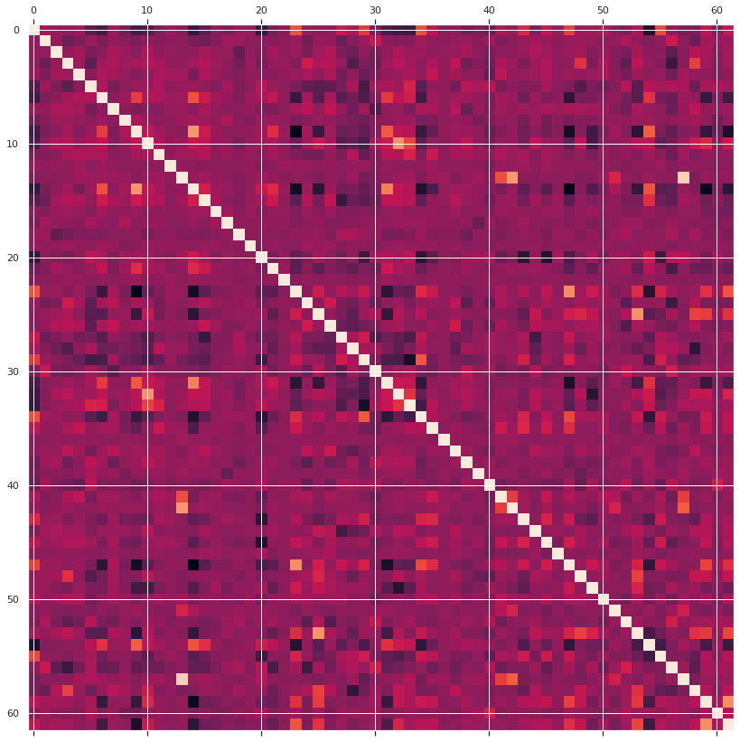


```python
np.max(np.max(corr_mat[corr_mat != 1])), np.min(np.min(corr_mat))
```


    (0.8930885523741798, -0.5620808983468358)


```python
np.array([
    pair
    for pair in 
    np.concatenate([np.array(np.where(np.logical_and(corr_mat > 0.5, corr_mat < 1.0))).T, np.array(np.where(corr_mat < -0.5)).T])
    if pair[0] < pair[1]
])
```


    array([[ 9, 14],
           [10, 32],
           [13, 42],
           [13, 57],
           [14, 31],
           [23, 47],
           [25, 53],
           [59, 61],
           [ 9, 23],
           [14, 47],
           [14, 59]])


Removing corelated features


```python
# Decided to remove
to_be_removed = [14, 13, 32, 47, 53, 61, 23]
 = np.delete(X_all, to_be_removed, axis=1)
cleaned_X = np.delete(X, to_be_removed, axis=1)

corr_mat = pd.DataFrame(cleaned_X_all).corr()
plt.matshow(corr_mat)
```


    <matplotlib.image.AxesImage at 0x7fb562b350d0>


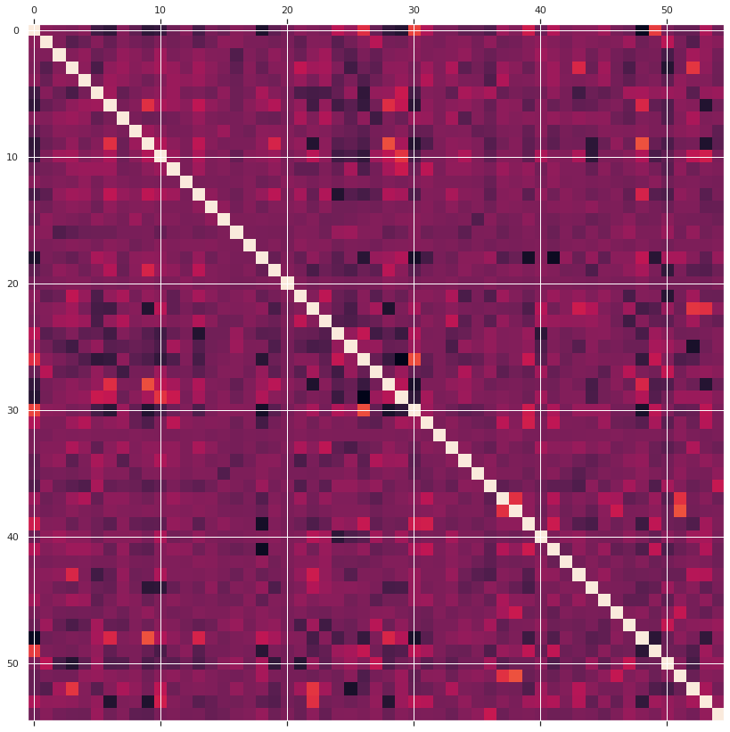


```python
np.max(np.max(corr_mat[corr_mat != 1])), np.min(np.min(corr_mat))
```


    (0.47166728198667474, -0.46564790104109616)


```python
cleaned_X_no_labels = cleaned_X_all[y_all == -1]
```


```python
np.unique(cleaned_X_no_labels, axis=0).shape, cleaned_X_no_labels.shape
```


    ((8213, 55), (8213, 55))


```python
cleaned_X_no_labels.shape, cleaned_X_no_labels[:,:20].shape
```


    ((8213, 55), (8213, 20))


### First approach generating very poor results


```python
bc.fit(cleaned_X, y, cleaned_X_no_labels, max_iter=20)
bc.validation(cleaned_X, y)
```

    1/20 diff = 788.6424825990861 conv matrix max = 789.6424825990861 min -555.5632615492393
    2/20 diff = 789.6253089105475 conv matrix max = 77.82158330408333 min -35.71844918113223
    3/20 diff = 3119.4123016858116 conv matrix max = 3120.3921580478727 min -1967.2608104225208
    4/20 diff = 3119.395146759688 conv matrix max = 498.71255599311723 min -321.1363375515846
    5/20 diff = 3300.809554276655 conv matrix max = 3301.8065655648397 min -2073.3549395075156
    6/20 diff = 3300.8453338413224 conv matrix max = 1961.6859243787742 min -967.6242960006253
    7/20 diff = 3357.538307440833 conv matrix max = 3358.49953916435 min -2102.4663825787834
    8/20 diff = 3357.5392675163666 conv matrix max = 1961.2332659081135 min -966.83519727314
    9/20 diff = 3365.082456491064 conv matrix max = 3366.0427281390475 min -2105.8971772482178
    10/20 diff = 3365.08565297496 conv matrix max = 1957.0084951417934 min -964.5157042453066
    11/20 diff = 3367.722477579929 conv matrix max = 3368.6795527440167 min -2107.042203381535
    12/20 diff = 3367.723985289273 conv matrix max = 1966.487892616416 min -969.0736986775228
    13/20 diff = 3367.2036978350757 conv matrix max = 3368.1592652898194 min -2106.7144048252194
    14/20 diff = 3367.2037586161673 conv matrix max = 1968.2005264225409 min -970.6478478831499
    15/20 diff = 2349.3552496029943 conv matrix max = 2349.3552496029943 min -1710.209117569265
    16/20 diff = 2349.1348425369674 conv matrix max = 1940.4027906040367 min -958.7905343850018
    17/20 diff = 2882.4201435574837 conv matrix max = 2883.175746570991 min -1788.0394827988255
    18/20 diff = 2882.1806919981245 conv matrix max = 1881.7575385980558 min -929.6561824102085
    19/20 diff = 3285.9290312328253 conv matrix max = 3286.924085805692 min -2067.473394171861
    20/20 diff = 3285.9606809862294 conv matrix max = 718.5646291741679 min -479.73379967084514
                  precision    recall  f1-score   support
    
               1       1.00      1.00      1.00        20
               2       0.00      0.00      0.00         3
              10       0.00      0.00      0.00        54
              15       0.00      0.00      0.00         5
              17       0.00      0.00      0.00        29
              19       0.01      1.00      0.01         2
              20       0.00      0.00      0.00        14
              22       0.00      0.00      0.00        39
              23       0.00      0.00      0.00        40
              24       0.00      0.00      0.00       100
              25       1.00      1.00      1.00        24
              26       0.00      0.00      0.00        32
              27       0.00      0.00      0.00        10
              28       1.00      1.00      1.00        21
              29       0.50      1.00      0.67         1
    
        accuracy                           0.17       394
       macro avg       0.23      0.33      0.25       394
    weighted avg       0.17      0.17      0.17       394
    


    /home/maaslak/PycharmProjects/ped/venv/lib/python3.8/site-packages/sklearn/metrics/_classification.py:1272: UndefinedMetricWarning: Precision and F-score are ill-defined and being set to 0.0 in labels with no predicted samples. Use `zero_division` parameter to control this behavior.
      _warn_prf(average, modifier, msg_start, len(result))


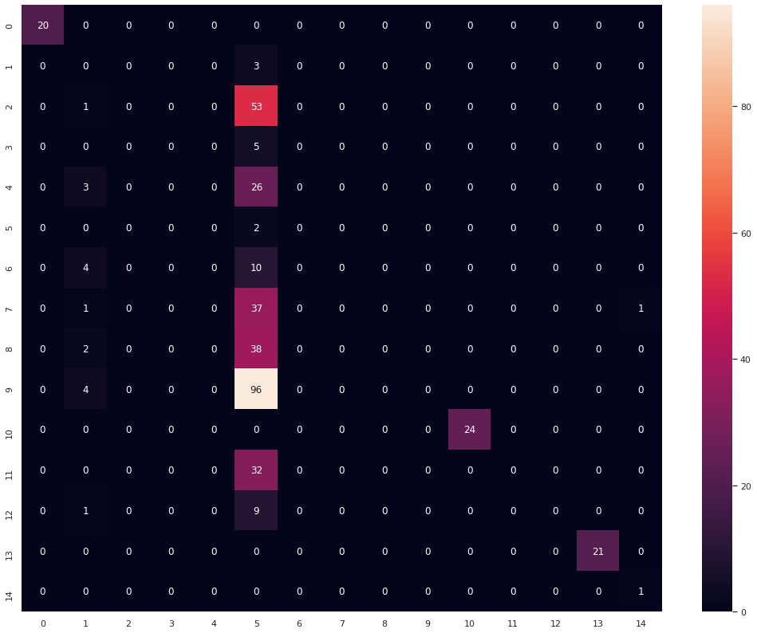


### Our implementation of SSGMM


```python
unique_labels = list(np.unique(y))
```


```python

from scipy.stats import multivariate_normal
import bidict
label_mapping = bidict.bidict({
    label_original: label_encoded
    for label_original, label_encoded in zip(unique_labels + [-1], list(range(len(unique_labels))) + [-1])
})


def get_probs_ssgmm(X, y, num_iterations=5):
    y = np.array([
        label_mapping[sing_y]
        for sing_y in y
    ])
    num_samples, n_features = X.shape
    unique_labels, unique_counts = np.unique(y, return_counts=True)
    unique_counts = unique_counts[unique_labels != -1]
    n_categories = len(unique_labels) - 1  # there is additional -1 label

    means = np.array([np.random.randn(n_features)] * n_categories)
    covs = np.array([np.eye(n_features)] * n_categories)
    qs = unique_counts / np.sum(unique_counts)

    print(means.shape)

    for iters in range(num_iterations):
        Pij = np.zeros((num_samples, n_categories))
        for i in range(num_samples):
            if y[i] == -1:
                ps = np.array([
                    multivariate_normal.pdf(X[i], means[cat_num], covs[cat_num], allow_singular=True) * q
                    for cat_num, q in zip(range(n_categories), qs)
                ])
                Pij[i] = ps / sum(ps)
            else:
                ps = np.zeros(n_categories)
                ps[y[i]] = 1
                Pij[i] = ps
        n = np.sum(Pij, axis=0)

        new_means = np.array([
            np.dot(Pij[:, cat_num], X) / n[cat_num]
            for cat_num in range(n_categories)
        ])
        diff = np.max(np.abs(means - new_means))
        means = new_means

        new_qs = n / float(num_samples)
        diff = max(np.max(np.abs(qs - new_qs)), diff)
        qs = new_qs

        old_covs = covs
        covs = np.zeros((n_categories, n_features, n_features))
        for t in range(num_samples):
            for cat_num in range(n_categories):
                covs[cat_num] += Pij[t, cat_num] * np.outer(X[t] - means[cat_num], X[t] - means[cat_num])

        for cat_num in range(n_categories):
            covs[cat_num] /= n[cat_num]

        diff = max(np.max(np.abs(old_covs - covs)), diff)
        print(f"{iters + 1} / {num_iterations} diff = {diff}")
    return Pij, [means, covs, qs]


probs, [means, covs, qs] = get_probs_ssgmm(cleaned_X_all, y_all, num_iterations=2)
```

    (15, 55)
    1 / 2 diff = 3.1500450750524736
    2 / 2 diff = 7.219902656678979


### GMM results analysis


```python
def predict_proba(X, y, means, covs, qs):
    num_samples, n_features = X.shape
    n_categories = len(unique_labels)
    Pij = np.zeros((num_samples, n_categories))
    for i in range(num_samples):
        ps = np.array([
            multivariate_normal.pdf(X[i], means[cat_num], covs[cat_num], allow_singular=True) * q
            for cat_num, q in zip(range(n_categories), qs)
        ])
        Pij[i] = ps / sum(ps)
    return Pij

gmm_y_proba = validate_model(cleaned_X, y, means, covs, qs)

gmm_y_pred = np.array([label_mapping.inverse[label] for label in np.argmax(gmm_y_proba, axis=-1)])
    
print(classification_report(y, gmm_y_pred))
    
cm = confusion_matrix(y, y_pred)
sns.heatmap(cm, annot=True)
plt.show()
```

                  precision    recall  f1-score   support
    
               1       0.95      0.95      0.95        20
               2       0.60      1.00      0.75         3
              10       0.83      0.96      0.89        54
              15       0.83      1.00      0.91         5
              17       0.91      1.00      0.95        29
              19       1.00      1.00      1.00         2
              20       0.93      1.00      0.97        14
              22       1.00      0.87      0.93        39
              23       0.95      0.95      0.95        40
              24       0.98      0.79      0.87       100
              25       1.00      0.96      0.98        24
              26       0.82      0.97      0.89        32
              27       0.91      1.00      0.95        10
              28       0.87      0.95      0.91        21
              29       1.00      1.00      1.00         1
    
        accuracy                           0.91       394
       macro avg       0.90      0.96      0.93       394
    weighted avg       0.92      0.91      0.91       394
    


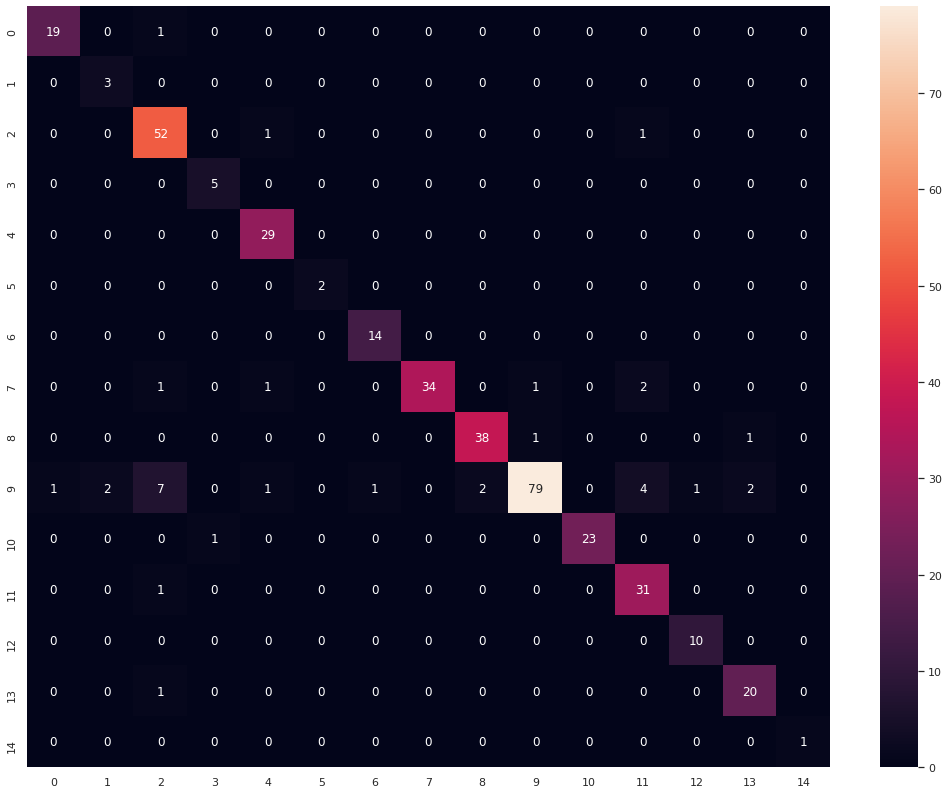


    ---------------------------------------------------------------------------

    TypeError                                 Traceback (most recent call last)

    <ipython-input-134-8b40a1b11523> in <module>
         13 gmm_y_proba = validate_model(cleaned_X, y, means, covs, qs)
         14 
    ---> 15 gmm_y_pred = np.array([label_mapping.inverse[label] for label in np.argmax(gmm_y_proba, axis=-1)])
         16 
         17 print(classification_report(y, gmm_y_pred))


    TypeError: 'numpy.int64' object is not iterable


```python
sns.scatterplot(
    x='c1', 
    y='c2',
      hue='category',
    size='correct',
    data=pd.DataFrame({
      'c1': X_pca_all[:, 0],
      'c2': X_pca_all[:, 1],
      'category': list(map(lambda x: categories.get(int(x), "undefined"),
                          y_pred_all)),
        'correct': list(map(
            lambda x : 15 if x[0] == x[1] else 1, zip(y_all, y_pred_all)))
  }))

plt.show()
```


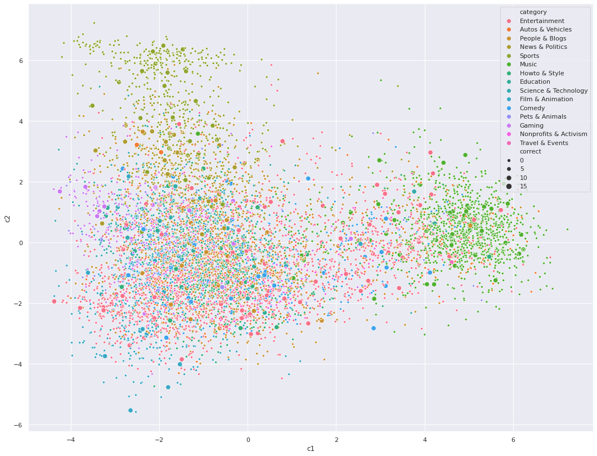


```python
from scipy import stats

# #############################################################################
# Calculate uncertainty values for each transduced distribution
pred_entropies = stats.distributions.entropy(probs.T)
print(pred_entropies.shape)

sns.distplot(pred_entropies)
plt.show()
```

    (8607,)


    /home/maaslak/PycharmProjects/ped/venv/lib/python3.8/site-packages/scipy/stats/stats.py:1713: FutureWarning: Using a non-tuple sequence for multidimensional indexing is deprecated; use `arr[tuple(seq)]` instead of `arr[seq]`. In the future this will be interpreted as an array index, `arr[np.array(seq)]`, which will result either in an error or a different result.
      return np.add.reduce(sorted[indexer] * weights, axis=axis) / sumval


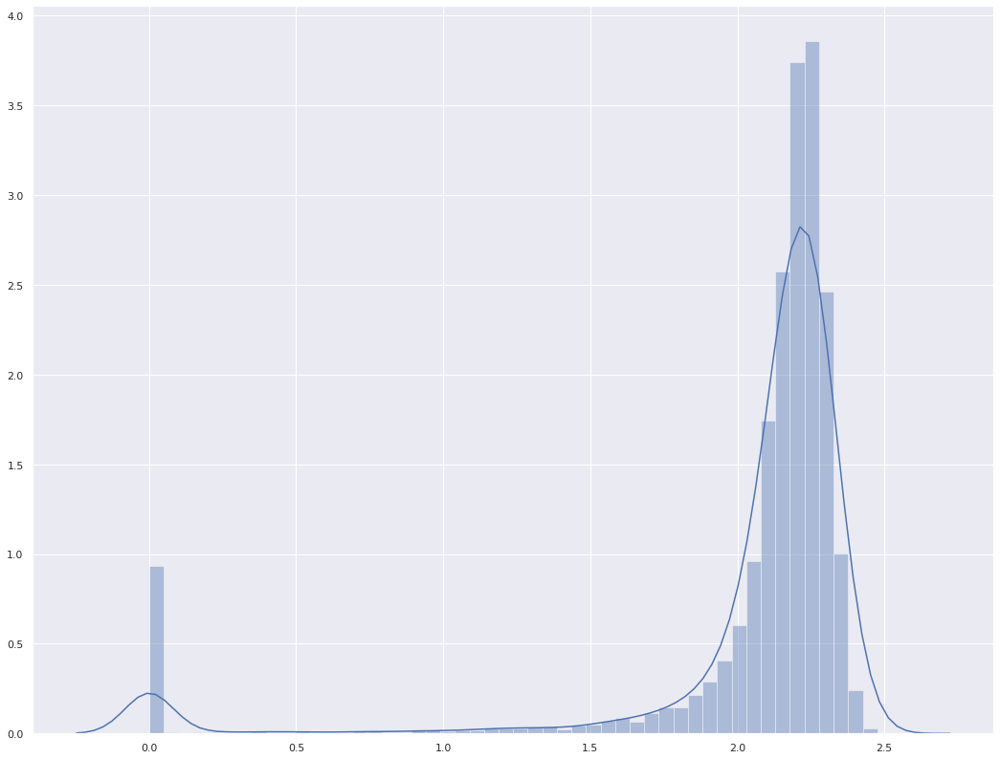


```python
transductions_entropies = list(zip(
    y_pred_all, 
    pred_entropies,
    [i for i in range(len(pred_entropies))]
))

for c in label_spread.classes_:
    print("\nCATEGORY", categories.get(c))
    print(">>> SUPPORT: ", len(list(filter(lambda x : x == c, y_all))), "\n")
    
    t_e_per_class = list(filter(lambda x : x[0] == c, transductions_entropies))
    t_e_per_class = list(sorted(t_e_per_class, key=lambda x : x[1]))
    for _, entropy, idx in t_e_per_class[:5]:
        print(entropy)
        vid_id = agg_df.loc[idx, ["video_id"]].values[0]
        select_from_df = df[df["video_id"] == vid_id]
        if select_from_df.shape[0] > 0:
            print(select_from_df.loc[:, ["title"]].values[0][0])
            print(select_from_df.loc[:, ["tags"]].values[0][0][:100])
            print()
```

    
    CATEGORY Film & Animation
    >>> SUPPORT:  20 
    
    0.0
    TREMORS SEASON 1 Official Trailer (2018) Kevin Bacon
    [none]
    
    0.0
    Lucas the Spider - Polar Bear
    LucastheSpider|"Animation"|"3D Animation"|"VFX"|"Dog"|"Cute"
    
    0.0
    「未来のミライ」特報
    東宝|"ゴジラ"|"特撮"|"アニメ"|"細田守"|"未来"|"ミライ"|"バケモノの子"|"おおかみこども"|"おおかみこどもの雨と雪"|"サマーウォーズ"|"時をかける少女"|"映画"
    
    0.0
    Rooster Teeth Animated Adventures - Millie So Serious
    Rooster Teeth|"RT"|"animation"|"television"|"filmmaking"|"games"|"video games"|"comics"|"austin"|"te
    
    0.0
    I, Tonya Trailer #1 (2017) | Movieclips Trailers
    Skate|"Competition"|"I Tonya"|"I Tonya trailer"|"I Tonya movie"|"trailer"|"2017"|"Margot Robbie"|"Bo
    
    
    CATEGORY Autos & Vehicles
    >>> SUPPORT:  3 
    
    0.0
    I Said I Would NEVER Do This To My Truck... BIG MODS INCOMING!
    tj hunt|"tjhunt"|"salomondrin"|"doug demuro"|"tanner fox"|"cleetus"|"cleetus mcfarland"|"cleetusmcfa
    
    0.0
    FIA GT World Cup 2017. Qualification Race Macau Grand Prix. Huge Pile Up
    GT Series|"Qualification Race"|"Macau Grand Prix"|"FIA GT World Cup"|"Pile Up"|"traffic jam"|"start"
    
    0.0
    New Year's Eve Penske Peel at the 11foot8 bridge
    11foot8|"low clearance crash"|"truck crash"|"train trestle"|"Durham"
    
    0.7613836331866977
    Here’s Why the 2018 Lincoln Navigator is Worth $100,000
    lincoln navigator|"navigator"|"lincoln navigator black label"|"navigator black label"|"2018 navigato
    
    1.5468074036355959
    The best bike ride in Majorca !
    cycling|"bikes"|"road racing"|"francis cade"|"keira mcvitty"|"cycling vlogger"|"majorca"|"spain"|"tr
    
    
    CATEGORY Music
    >>> SUPPORT:  54 
    
    0.0
    BEACH HOUSE -- LEMON GLOW
    Beach House Lemon Glow
    
    0.0
    Cardi B talks on how she wanted to quit rapping when a famous rapper took her verse off his song
    Cardi b|"Tmz"|"Tmz news"|"Bodak"|"Bodak yellow"|"Nicki minaj"|"Azelia banks"|"Dj khaled"|"Vlad"|"Rap
    
    0.0
    Waterparks Lucky People (Official Music Video)
    waterparks|"lucky people"|"waterparks lucky people"|"entertainment"|"double dare"|"stupid for you"|"
    
    0.0
    Havana - Walk off the Earth (Ft. Jocelyn Alice, KRNFX, Sexy Sax Man) Camila Cabello Cover
    Sexy Sax Man|"walk off the earth"|"jocelyn alice"|"krnfx"|"Camila Cabello havana"|"Havana cover"|"am
    
    0.0
    Manic Street Preachers - Distant Colours (Official Video)
    manic street preachers|"manic street preachers if you tolerate this"|"manic street preachers motorcy
    
    
    CATEGORY Pets & Animals
    >>> SUPPORT:  5 
    
    0.0
    A Friendly Arctic Fox Greets Explorers | National Geographic
    national geographic|"nat geo"|"natgeo"|"animals"|"wildlife"|"science"|"explore"|"discover"|"survival
    
    0.0
    A little Dingo running on a bridge over one of the busiest freeways in the U.S!
    Eldad Hagar|"hope for paws"|"dog rescue"
    
    0.0
    バーレルなねこ。-Maru Bucket.-
    Maru|"cat"|"kitty"|"pets"|"まる"|"猫"|"ねこ"
    
    0.0
    OH NO! ALL ANTS DEAD?!
    ants|"antscanada"|"mikey bustos"|"myrmecology"|"antfarm"|"ant colony"|"ant nest"|"queen ant"|"formic
    
    0.0
    Cat Mind Control
    aarons animals|"aarons"|"animals"|"cat"|"cats"|"kitten"|"kittens"|"prince michael"|"prince"|"michael
    
    
    CATEGORY Sports
    >>> SUPPORT:  29 
    
    0.0
    Bellator 192: Scott Coker and Jon Slusser Post-Fight Press Conference - MMA Fighting
    mma fighting|"mixed martial arts"|"martial arts"|"ultimate fighting championship"|"combat sports"|"c
    
    0.0
    NBA Bloopers - The Starters
    nba|"basketball"|"starters"
    
    0.0
    Top 5 Plays of the Night | January 02, 2018
    nba|"highlights"|"basketball"|"plays"|"amazing"|"sports"|"hoops"|"finals"|"games"|"game"|"Kris Dunn"
    
    0.0
    Making Chocolate Christmas Pudding with Mark Ferris | Tom Daley
    Tom Daley|"Tom"|"Daley"|"Tom Daley TV"|"Diver"|"Diving"|"World Champion Diver"|"Olympics"|"Food"|"Re
    
    0.0
    2018 Winter Olympics Daily Recap Day 16 I Part 2 I NBC Sports
    Olympics|"2018"|"2018 Winter Olympics"|"Winter"|"Pyeongchang"|"Closing Ceremony"|"daily"|"recap"|"da
    
    
    CATEGORY Travel & Events
    >>> SUPPORT:  2 
    
    0.0
    Trump - S**thole Countries - shithole statement by NAMIBIA💩💩
    Trump|"shithole"|"shithole countries"|"statement"|"america"|"africa"|"haiti"|"trump shithole"|"trump
    
    0.0
    Shane MacGowan & Nick Cave - Summer in Siam + The Wild Mountain Thyme - Shane’s 60th Birthday Party
    shane macgowan|"nick cave"|"birthday party"|"the pogues"|"dublin"|"ireland"|"summer in siam"|"nation
    
    0.3346116290479483
    Funeral for former first lady Barbara Bush
    nbc news|"breaking news"|"us news"|"world news"|"politics"|"nightly news"|"current events"|"top stor
    
    1.5234950215001326
    Watch Michelle Wolf roast Sarah Huckabee Sanders
    Politics|"White House"|"News"|"Desk Video"|"Michelle Wolf"|"Sara Huckabee Sanders"|"Huckabee Sanders
    
    1.539677280127111
    Sen. Booker on language used by Commander-in-cheif (C-SPAN)
    Cory Booker|"Senate"|"U.S. Senate"|"Senator Booker"|"C-SPAN"|"CSPAN"|"President of the United States
    
    
    CATEGORY Gaming
    >>> SUPPORT:  14 
    
    0.0
    First look at Nintendo Labo
    Nintendo|"Labo"|"Nintendo Labo"|"Workshop"|"Toy-Con"|"Make"|"Play"|"Discover"|"Trailer"|"Latest YouT
    
    0.0
    Our First Date
    first date|"animation"|"animated"|"short"|"shorts"|"animation shorts"|"cartoon"|"ihascupquake"|"redb
    
    0.0
    Resident Evil 7 Biohazard - Carcinogen - AGDQ 2018 - In 1:49:27  [HD]
    resident|"evil"|"resident evil 7"|"carcinogen"|"AGDQ"|"2018"|"in"|"1:49:27"|"great"|"run"|"really"|"
    
    0.0
    Battlefield 5 Official Multiplayer Trailer
    battlefield 5|"battlefield trailer"|"BF5"|"BFV"|"battlefield V"|"battlefield 5 trailer"|"battlefield
    
    0.0
    Sega Game Gear Commercial Creamed Spinach - Retro Video Game Commercial / Ad
    Video Game (Industry)|"Games"|"Commercial"|"Gameplay"|"Trailer"|"Spot"|"advert"|"advertisement"|"com
    
    
    CATEGORY People & Blogs
    >>> SUPPORT:  39 
    
    0.0
    YOUTUBER QUIZ + TRUTH OR DARE W/ THE MERRELL TWINS!
    youtube quiz|"youtuber quiz"|"truth or dare"|"exposed"|"youtube crush"|"molly burk"|"collab"|"collab
    
    0.0
    Kid orders bong. Package arrives and his mom wants to see him open it.
    bong|"mum freakout"|"mom freakout"|"frick"|"mom finds bong"|"mom catches son"|"brother"|"caught"|"ol
    
    0.0
    President Trump arrives at the White House from Camp David. Jan 7, 2018.
    President Trump arrives at the White House after Camp David. Jan 7|"President Trump back White House
    
    0.0
    BRING IT IN 2018
    john green|"history"|"learning"|"education"|"vlogbrothers"|"nerdfighters"|"podcasts"|"plans"|"goals"
    
    0.0
    God of War – War On The Floor Event | PS4
    Golden State Warriors|"God of War"|"PlayStation"|"PS4"
    
    
    CATEGORY Comedy
    >>> SUPPORT:  40 
    
    0.0
    My Summer Crush | Hannah Stocking
    my summer crush|"hannah"|"stocking"|"my"|"summer"|"crush"|"timed mile in pe"|"inside the teenage bra
    
    0.0
    THE LAST KEY OF AWESOME
    Key Of Awesome|"Mark Douglas"|"Barely Productions"|"Barely Political"|"KOA"|"Parody"|"Spoof"|"Comedy
    
    0.0
    Matt Lauer Sexual Harassment Allegations; Trump's Unhinged Tweets: A Closer Look
    Late night|"Seth Meyers"|"closer Look"|"Matt lauer"|"sexual harassment"|"NBC"|"NBC TV"|"television"|
    
    0.0
    EVERY FAMILY GATHERING EVER
    every blank ever|"smosh every blank ever"|"every ever"|"family gathering"|"family"|"every family eve
    
    0.0
    Animal sounds on violin
    animal sounds|"violin"|"funny"|"Animal sounds on violin"
    
    
    CATEGORY Entertainment
    >>> SUPPORT:  100 
    
    0.0
    Little Girl's Incredible Valentine's Day Rant
    Girl|"Valentine"|"Little"|"Valentine's Day"|"Incredible"|"Rant"|"Little Girl"|"Little Girl's Incredi
    
    0.0
    John Mayer On Andy Cohen’s Annoying Habit | WWHL
    What What Happens live|"reality"|"interview"|"fun"|"celebrity"|"Andy Cohen"|"talk"|"show"|"program"|
    
    0.0
    The BIGGEST Moments From the 2018 Grammys: Kesha, Bruno Mars, Kendrick Lamar, & Hillary Clinton
    Entertainment Tonight|"etonline"|"et online"|"celebrity"|"hollywood"|"news"|"trending"|"et"|"et toni
    
    0.0
    Jurassic World: Fallen Kingdom - Final Trailer [HD]
    [none]
    
    0.0
    BLACK DYNAMITE 2 Teaser Trailer #1 NEW (2018) Michael Jai White Movie HD
    black dynamite 2 trailer|"black dynamite 2"|"trailer"|"2018"|"new"|"new trailer"|"official"|"officia
    
    
    CATEGORY News & Politics
    >>> SUPPORT:  24 
    
    0.0
    Ex-UFO program chief: We may not be alone
    latest News|"Happening Now"|"CNN"|"luis elizondo"|"UFO"|"ALiens"|"ebof"|"erin burnett"|"US news"
    
    0.0
    4 officers hurt in shooting in South Carolina
    Washington Post YouTube|"Washington Post Video"|"WaPo Video"|"The Washington Post"|"News"
    
    0.0
    Controversial WH adviser speaks out on resignation
    Omarosa Manigault Newman|"Apprentice"|"Donald Trump"|"you're fired"|"White House"|"adviser"|"communi
    
    0.0
    Drone captures dramatic Ohio River flooding
    drones|"usatsyn"|"cincinnati"|"vpc"|"flooding"|"ohio"|"ohio river"|"flash floods"|"flood"|"usatyoutu
    
    0.0
    Officials investigating Hawaii missile false alarm | NBC News
    News|"U.S. News"|"Hawaii"|"Missile"|"National Security"
    
    
    CATEGORY Howto & Style
    >>> SUPPORT:  32 
    
    0.0
    Flying Home For Christmas | Vlogmas Days 1 & 2
    tanya burr|"tanya"|"burr"|"vlogmas"|"day 1"|"christmas"|"airport"|"flight"|"los angeles"|"LA"|"actor
    
    0.0
    MY MORNING GLOW UP | DESI PERKINS
    DESI PERKINS|"desi perkins"|"the perkins"|"makeup tutorial"|"how to makeup"|"quick tut"|"desimakeup"
    
    0.0
    I tried following a Kylie Jenner Makeup Tutorial... Realizing things😂...
    2018|"adelaine morin"|"beauty"|"channel"|"video"|"how to"|"lifestyle"|"beauty guru"|"filipino"|"i tr
    
    0.0
    What To Buy HER: Christmas 2017 | FleurDeForce
    fleurdeforce|"fleur de force"|"fleurdevlog"|"fleur de vlog"|"beauty"|"fashion"|"beauty blogger"|"hau
    
    0.0
    EARL GREY MACARONS- The Scran Line
    cupcakes|"how to make vanilla cupcakes"|"over the top recipes"|"easy cupcake recipes"|"vanilla cupca
    
    
    CATEGORY Education
    >>> SUPPORT:  10 
    
    0.0
    Rusted butcher's knife - Impossible Restoration
    butcher's knife|"cleaver"|"butcher"|"knife"|"medieval"|"rusty"|"restoration"|"vintage"|"restore"|"DI
    
    0.0
    Jordan Peterson GOTCHA leaves liberal Cathy Newman literally SPEECHLESS+Thug life
    Jordan Peterson|"Cathy Newman"|"bbc channel 4"|"bbc"
    
    0.0
    Why Is It So Hard To Fall Asleep?
    life noggin|"life noggin youtube"|"youtube life noggin"|"life noggin channel"|"education"|"education
    
    0.0
    0.0
    What Are Fever Dreams?
    SciShow|"science"|"Hank"|"Green"|"education"|"learn"|"What Are Fever Dreams?"|"dream"|"fever"|"sick"
    
    
    CATEGORY Science & Technology
    >>> SUPPORT:  21 
    
    0.0
    HomePod — Welcome Home by Spike Jonze — Apple
    anderson paak|"apartment"|"apple"|"apple music"|"choreography"|"dancer"|"dancing"|"fka twigs"|"twigs
    
    0.0
    Top 10 Black Friday 2017 Tech Deals
    deal guy|"amazon deals"|"best deals"|"top 10 black friday"|"top 10 black friday 2017"|"top 10 tech d
    
    0.0
    Crew Capsule 2.0 First Flight
    [none]
    
    0.0
    Frozen Bigfoot Head DNA, Weight, Dimensions,  Up Coming Surprise for Humanity
    Frozen Bigfoot Head DNA|"Weight"|"Dimensions"|"Up Coming Surprise for Humanity"|"Sasquatch"|"Yeti"|"
    
    0.0
    Coconut crab hunts seabird
    crab|"bird"|"biology"|"animal"|"ecology"|"nature"
    
    
    CATEGORY Nonprofits & Activism
    >>> SUPPORT:  1 
    
    0.0
    Rose McGowan Talks Alleged Sexual Misconduct By Harvey Weinstein | The View
    Rose McGowan|"Rose's Army"|"MeToo"|"Time's Up"|"The View"|"feminism"|"women's rights"|"hot topics"|"
    
    0.0018772475853714686
    Rose McGowan Shares Her Thoughts On 'Time's Up' Movement | The View
    Rose McGowan|"Rose's Army"|"MeToo"|"Time's Up"|"The View"|"feminism"|"women's rights"|"hot topics"|"
    
    0.008913057734571916
    Frozen The Broadway Musical's Caissie Levy Performs 'Let It Go'
    Frozen|"Broadway"|"Let It Go"|"Caissie Levy"|"The View"|"hot topics"|"entertainment"|"theatre"
    
    0.12767910171182795
    Helen Mirren, Donald Sutherland Talk Oscars Honor, #TimesUp Movement, Golden Globes & More
    helen mirren|"donald sutherland"|"the view"|"hot topics"|"oscars"|"timesup"|"time's up"|"golden glob
    
    0.17816211195127937
    Adam Rippon Talks Getting Set Up With Sally Field's Son, Oscars & More | The View
    Adam Rippon|"Sally Field"|"Oscars"|"The View"|"hot topics"|"figure skating"|"Olympics"|"bronze medal
    


## Least certain


```python
transductions_entropies = list(zip(
    y_pred_all, 
    pred_entropies,
    [i for i in range(len(pred_entropies))]
))

for c in label_spread.classes_:
    print("\nCATEGORY", categories.get(c))
    print(">>> SUPPORT: ", len(list(filter(lambda x : x == c, y_all))), "\n")
    
    t_e_per_class = list(filter(lambda x : x[0] == c, transductions_entropies))
    t_e_per_class = list(sorted(t_e_per_class, key=lambda x : -1*x[1]))
    for _, entropy, idx in t_e_per_class[:5]:
        print(entropy)
        vid_id = agg_df.loc[idx, ["video_id"]].values[0]
        select_from_df = df[df["video_id"] == vid_id]
        print(select_from_df.loc[:, ["title"]].values[0][0])
        print(select_from_df.loc[:, ["tags"]].values[0][0])
        print()
```

    
    CATEGORY Film & Animation
    >>> SUPPORT:  20 
    
    2.4299004328392106
    The Historic Disappearance of Louis Le Prince
    Buzzfeed unsolved|"BuzzFeed"|"unsolved"|"mystery"|"unsolved mystery"|"unexplained"|"investigation"|"investigate"|"investigative"|"true crime"|"crime"|"criminal"|"theory"|"theories"|"case"|"cold case"|"cold-case"|"detective"|"detectives"|"scary"|"spooky"|"creepy"|"eerie"|"weird"|"strange"|"haunted"|"ghost"|"monster"|"demon"|"creepypasta"|"supernatural"|"paranormal"|"Louis Le Prince"|"French"|"France"|"inventor"|"camera"|"film"|"movie"|"movies"|"Edison"|"stolen"|"disappear"|"train"|"patent"|"invention"|"Thomas Edison"|"patents"|"shane madej"|"ryan bergara"
    
    2.409639024326524
    The Cloverfield Paradox Super Bowl TV Spot | Movieclips Trailers
    The Cloverfield Paradox|"The Cloverfield Paradox Trailer"|"The Cloverfield Paradox Movie Trailer"|"The Cloverfield Paradox Trailer 2018"|"The Cloverfield Paradox Official Trailer"|"Trailer"|"Trailers"|"Movie Trailer"|"2018 Trailers"|"Trailer 1"|"Movieclips Trailers"|"Movieclips"|"Fandango"|"The Cloverfield Paradox Super Bowl Trailer"|"Super Bowl"|"Superbowl"|"Super Bowl TV Spot"|"Super Bowl 2018"
    
    2.4095014336544347
    Honest Trailers - The Emoji Movie
    screenjunkies|"screen junkies"|"honest trailers"|"honest trailer"|"the emoji movie"|"emoji movie"|"the emoji movie review"|"the emoji movie plot"|"emoji movie review"|"the emoji movie honest trailer"|"inside out"|"wreck-it ralph"|"inside out 2"|"the emoji movie sequel"|"the lego movie"
    
    2.3706797669383675
    Honest Trailers - It (2017)
    it|"it 2017"|"it movie"|"stephen king"|"stephen king it"|"stephen king's it"|"it the clown"|"pennywise"|"pennywise it"|"stephen king novel"|"stephen king movie"|"it 2017 full movie"|"it sequel"|"it review 2017"|"it remake"|"stranger things"|"honest trailers"|"honest trailer"
    
    2.369220709875282
    Star Wars: The Last Jedi - Movie Review
    Star Wars: The Last Jedi|"Movie Review"|"Chris Stuckmann"|"Episode 8"|"Episode VIII"|"Scene"|"Clip"|"Trailer"|"Teaser"|"Soundtrack"|"OST"|"Score"|"John Williams"|"Luke Skywalker"|"Rey"|"Finn"|"Rose Tico"|"Poe Dameron"|"Leia"|"Han Solo"|"Kylo Ren"|"Darth Vader"|"Lightsaber"|"Fight"|"Battle"|"Snoke"|"Mark Hamill"|"Carrie Fisher"|"Adam Driver"|"Daisy Ridley"|"John Boyega"|"Oscar Isaac"|"Domhnall Gleeson"|"Gwendoline Christie"|"Andy Serkis"|"Laura Dern"|"Kelly Marie Tran"|"Benicio Del Toro"|"Rian Johnson"|"Force Awakens"
    
    
    CATEGORY Autos & Vehicles
    >>> SUPPORT:  3 
    
    2.4289011277918724
    The Hopscotch Experiment | Dirty Data | Cut
    PLJic7bfGlo3occ87QSlmV7UfA3W3yYzHW|"PLJic7bfGlo3q0xD2Baw3jCHlt1blXkigp"|"Dirty Data"|"topics"|"Cut"|"Watch Cut"|"people"|"people videos"|"storytelling"|"relationships"|"Dating"|"Interviews"|"Firsts"|"couples"|"exes"|"love"|"Kids Try"|"games"|"challenges"|"Ethnic groups"|"People Interviews"|"Dares"|"Truth or Dare"|"100 ways"|"blind dates"|"100 people"|"experiments"|"#tbt"|"Maddox"|"Truth or Drink"|"HiHo Kids"|"Hiho"|"kids"|"kids videos"|"100 YOB"|"100 Years of Beauty"|"Fear Pong"|"Hopscotch"
    
    2.428775595143718
    Matt Hunter, Lele Pons - Dicen
    Matt|"Hunter"|"Lele"|"Pons"|"Dicen"|"Universal"|"Music"|"Latino"|"Latin"|"Urban"
    
    2.411869455327693
    This is a major problem... but I have a solution.
    PhillyD|"Philly D"|"Vloggity"|"The Philip DeFranco Show"|"Philip DeFranco Show"|"PDS"|"DeFrancoElite"|"Vlog"|"Vlogger"|"Docuvlog"|"Cinevlog"|"DeFranco Elite"|"YouTube"|"Tariff"|"Tariffs"|"China"|"Chinese"|"Steel"|"ASMR"
    
    2.4057579393037822
    NASA's plan to save Earth from a giant asteroid
    vox.com|"vox"|"explain"|"gravity tractor"|"nasa asteroids"|"asteroid collision"|"asteroids"|"asteroid collision plan"|"asteroid mission"|"asteroid impact mission"|"dart mission"|"asteroid redirect"|"meteor impact"|"didymoon"|"near earth objects"|"nasa cneos"|"nasa jpl asteroids"|"hodges meteorite"|"chelyabinsk meteor"|"chelyabinsk"|"asteroid threat"|"meteor hit"|"nasa meteor"|"meteor crater"|"impact crator"|"nasa asteroid plan"|"chicxulub"|"deep impact asteroid"|"asteroid dinosaurs"|"armageddon asteroid"
    
    2.4033646970559546
    It’s not you. Phones are designed to be addicting.
    vox.com|"vox"|"explain"|"smart phone"|"smartphone"|"iphone"|"android"|"samsung"|"ipad"|"technology"|"technology addiction"|"smartphone addiction"|"addicted to phone"|"apple"|"apple design"|"product design"|"product"|"tech"|"tech design"|"design"|"interaction design"|"user experience"|"user experience design"|"ui"|"usability"|"user interface"|"ux design"|"user experience designer"|"human-computer interaction"|"ux designer"|"social media"|"addiction"|"grayscale iphone"|"tristan harris"
    
    
    CATEGORY Music
    >>> SUPPORT:  54 
    
    2.3752105694423675
    DJ Snake - Magenta Riddim (Audio)
    DJ|"Snake"|"Magenta"|"Riddim"|"Geffen"|"Dance"
    
    2.3634496937588456
    Taylor Swift - I Did Something Bad (Cover) | By Shoshana Bean and Cynthia Erivo
    taylor swift|"reputation"|"acoustic"|"live"|"soul"|"pop"|"music"|"viola"|"violin"|"cello"|"broadway"|"wicked"|"the color purple"|"cover"
    
    2.3529400931778723
    Chris Stapleton - Midnight Train To Memphis (Live From SNL Studios/2018)
    Chris Stapleton|"Americana"|"Country Music"|"Justin Timberlake"|"Jason Isebell"|"Sturgill Simpson"|"Rock"|"Blues"|"live music"|"new music"|"country music"|"chris stapleton"|"bluegrass music"|"tv"|"SNL"|"CMA"|"justin timberlake"|"country"|"Nashville"
    
    2.3457083583023732
    BTS (방탄소년단) 'Euphoria : Theme of LOVE YOURSELF 起 Wonder'
    BIGHIT|"빅히트"|"방탄소년단"|"BTS"|"BANGTAN"|"방탄"
    
    2.345180293611572
    Troye Sivan - The Good Side (Audio)
    troye sivan|"the good side"|"troye"|"official"|"audio"|"troye new song"
    
    
    CATEGORY Pets & Animals
    >>> SUPPORT:  5 
    
    2.4049534044729746
    Top 10 Strangest Things That Happen To Your Body In Space
    beamazed|"be amazed"|"top 10"|"science"|"space"|"facts"|"NASA"|"earth"|"astronaut"|"space travel"|"top10"|"outer space"|"black hole"|"Spacesuit"|"what happens"|"vacuum"|"planet"|"Cosmonaut"|"gravity"|"Humans"|"International Space Station"|"space myths"|"Tech"|"universe"|"10s"|"lack of oxygen"
    
    2.3991865906243683
    Can You Turn Hair to Stone with Hydraulic Press?
    Hydraulic press channel|"hydraulicpresschannel"|"hydraulic press"|"hydraulicpress"|"crush"|"willitcrush"|"destroy"|"press"|"hydraulicpress channel"|"hydraulic"|"hydraulic press man"|"will it crush"|"hair"|"toilet paper"|"salt"|"salt rock"|"frying pan"|"stone"|"salt stone"|"EXPERIMENT"|"test"|"lauri"|"anni"|"how strong hair is"|"how strong"|"gone wrong"
    
    2.399141417733398
    The Warehouses That (Sort Of) Aren't in Any Country
    freeport|"freeports"|"warehouses"|"exemption"|"exempt"|"tax"|"free"|"duty-free"|"tax-free"|"weird"|"juristictional"|"juristiction"|"embassies"|"extraterritoriality"|"united nations headquarters"|"outside"|"the united states"|"south africa"|"france"|"art"|"expensive"|"Salvator Mundi"|"art market"|"interesting"|"fast"|"fun"|"animated"|"funny"|"learn"|"learning"|"educational"|"wendover"|"productions"|"half as interesting"|"hai"|"half"|"as"
    
    2.397213106290825
    DON'T WAKE the WOMBAT?!
    funny|"cute"|"baby sloth"|"three toed sloth"|"super cute"|"adorable"|"cutest baby"|"wild"|"adventure"|"adventurous"|"animals"|"breaking trail"|"coyote"|"coyote peterson"|"peterson"|"trail"|"wildife"|"cute sloth"|"cutest sloth ever"|"baby animal"|"cutest animal"|"cute video"|"possum"|"worlds cutest possum"|"cute possum"|"baby possum"|"brushtail possum"|"marsupial"|"australia"|"cutest possum ever"|"baby animals"|"tiny possum"|"dont wake the wombat"|"wombat"|"wombats"|"sleeping wombat"|"try not to laugh"|"funny videos"|"wambat"
    
    2.3931893421447072
    You'll NEVER guess how I caught this lizard!
    adventure|"adventurous"|"animals"|"breaking"|"breaking trail"|"coyote"|"coyote peterson"|"peterson"|"trail"|"wild"|"collared lizard"|"lizard"|"reptile"|"desert lizard"|"adventure show"|"dragon"|"bearded dragons"|"lizards"|"bearded dragon"|"finally caught one"|"lizard catch"|"komodo dragon"|"bitten by a lizard"|"fast lizard"|"australian lizard"|"dragons"|"monitor"|"you'll never guess"|"youll never guess how i caught this lizard"|"amazing catch"|"lizard in tree"|"monitor lizard"|"monitors"|"water monitor"|"giant lizard"|"sand"
    
    
    CATEGORY Sports
    >>> SUPPORT:  29 
    
    2.3470064952257794
    2018 Australian Grand Prix: Race Highlights
    F1|"Formula One"|"Formula 1"|"Sports"|"Sport"|"Action"|"GP"|"Grand Prix"|"Auto Racing"|"Motor Racing"|"Australian GP"|"Australian Grand Prix"|"2018 Australian GP"|"2018 Australian Grand Prix"|"Melbourne"|"Australia"|"2018 F1 Season"|"2018 Formula 1 Season"|"Lewis Hamilton"|"Sebastian Vettel"|"Kimi Raikkonen"|"Fernando Alonso"|"Max Verstappen"|"Ferrari"|"Scuderia Ferrari"|"Mercedes AMGF1"|"McLaren F1"|"F1 Highlights"|"F1 Videos"|"F1 Highlights 2018"
    
    2.3464409582210366
    Inside FC Barcelona’s ambitious plan to reinvent the Camp Nou, by Wired and Audifootball
    FC Barcelona|"برشلونة،"|"Fútbol"|"FUTBOL"|"soccer"|"FUTEBOL"|"Sepakbola"|"サッカー"|"كرة القدم"|"football"|"FCB"|"Barça"|"Sport"|"Club"|"Barcelona"|"Camp"|"Nou"|"wired"|"audi"|"espai"
    
    2.329679806471681
    Best in Show Ceremony | WESTMINSTER DOG SHOW (2018) | FOX SPORTS
    fox|"fox sports"|"fs1"|"fox sports 1"|"sports"|"news"|"sports fox"|"westminster kennel club"|"kennel"|"club"|"dog show"|"wkc"|"Best in Show"|"Best in"|"Show"|"Bichon Frise"|"Bichon"|"Frise"|"Flynn"
    
    2.3293944469820755
    Neymar Jr, Willian, Coutinho in Town as England Take on Brazil | Tunnel Cam | Inside Access
    Neymar|"Willian"|"Dani Alves"|"Coutinho"|"Marcelo"|"vardy"|"rashford"|"england brazil"|"england v brazil"|"0-0"|"highlights"|"tunnel cam"|"paulinho"|"wembley"|"england"|"brazil"|"neymar jr"|"dier"|"kane"|"david luiz"|"bertrand"|"loftus-cheek"|"casemiro"|"real madrid"|"psg"|"jesus"|"firminho"|"liverpool"|"man city"|"marquinhos"|"livermore"|"lingard"|"southgate"
    
    2.3209665666974395
    Mo Salah bursts through wall to surprise kids | KOP KIDS PRANK
    Liverpool FC|"LFC"|"Liverpool"|"Anfield"|"Melwood"|"Liverpool Football Club"|"Mo Salah"|"Mohamed Salah"|"Salah prank"|"prank"|"surprise"|"kop kids"|"subtitles"|"arabic subtitles"|"liverpool youtube"|"thailand liverpool"|"thai subtitles"|"liverpool indonesia"|"premier league"|"pl"|"epl"|"mohamed sala"|"mo sala"|"moh salah"|"أهداف محمد صلاح"
    
    
    CATEGORY Travel & Events
    >>> SUPPORT:  2 
    
    2.441566390287682
    Brazil 0-2 England (1984)
    Brazil|"England"|"June 1984"|"Football"|"Friendly"|"Maracana"|"John Barnes"|"Mark Hateley"|"Jim Rosenthal"|"Jimmy Greaves"|"Ian St John"|"Brian Moore"
    
    2.418823466498275
    The Tree (True Story!) - Simon's Cat | BLACK & WHITE
    cartoon|"simons cat"|"simon's cat"|"simonscat"|"simon the cat"|"funny cats"|"cute cats"|"cat fails"|"family friendly"|"animated animals"|"short animation"|"animated cats"|"tofield"|"simon's katze"|"simon"|"cat"|"black and white"|"kitty"|"traditional animation"|"black and white cat"|"Кот Саймона"|"cat lovers"|"animal (film character)"|"fail"|"funny cat"|"cats"|"cute"|"kitten"|"kittens"|"pets"|"simons cats"|"Cat"|"Simon"|"Tofield"|"cartoons"|"Toons"|"Animated"|"Animation"|"Kitten"|"Funny"|"Humour"|"fun"|"videos"|"tree"|"stuck"|"rescue"|"true story"
    
    2.417882538556984
    Territorial Behaviour! - Simon's Cat | LOGIC
    cartoon|"simons cat"|"simon's cat"|"simonscat"|"simon the cat"|"funny cats"|"cute cats"|"cat fails"|"family friendly"|"animated animals"|"short animation"|"animated cats"|"simon's katze"|"black and white"|"kitty"|"traditional animation"|"black and white cat"|"Кот Саймона"|"cat lovers"|"animal (film character)"|"fail"|"funny cat"|"cats"|"cute"|"kitten"|"kittens"|"pets"|"simons cats"|"Cat"|"Simon"|"Tofield"|"cartoons"|"Toons"|"Animated"|"Animation"|"Kitten"|"Funny"|"Humour"|"fun"|"videos"|"territorial"|"behaviour"|"logic"|"turf war"|"fights"
    
    2.407329109359064
    Donkey and Woman Who Both Lost Children Celebrate Their Emotional Journey | The Dodo Party Animals
    animal video|"animals"|"the dodo"|"Animal Rescue"|"emotional animal stories"|"emotional animals"|"donkey"|"donkey videos"|"donkey sounds"|"donkey singing"|"donkey and mom"|"ronnie the donkey"|"sad donkey"|"donkey rescue"|"woman and donkey"|"woman rescues donkey"|"donkey videos for children"|"donkey video for kids"|"animal rescue story"|"heartwarming animal videos"|"the dodo party animals"|"party animals"|"party animals donkey"|"party animals ronnie"|"the dodo party animals ronnie"|"donkey ronnie"
    
    2.4057062320403593
    2019 Chevrolet Silverado First Look - 2018 Detroit Auto Show
    AutoGuide|"Car"|"Automotive"|"Automobile (industry)"|"Drive"|"vehicle"|"Chevrolet"|"Silverado"|"Chevrolet SIlverado"|"Truck"|"Chevy"|"Chevy Silverado"|"Chevrolet Truck"|"Pickup Truck"|"Pickup"|"Trucks"|"Silverado debut"|"2019 Chevrolet Silverado"|"New Silverado"|"Chevy Pickup"|"Detroit Auto Show"|"2018 Detroit Auto Show"|"NAIAS"|"2018 NAIAS"|"New Truck"|"Silverado First Look"|"Duramax"|"Silverado Diesel"|"GM"|"General Motors"
    
    
    CATEGORY Gaming
    >>> SUPPORT:  14 
    
    2.397249661586512
    The Greatest Achievement in Speedrunning History Might Happen Soon (Mario Kart 64 PERFECTION!)
    speedrunning|"speedruns"|"speedrun"|"the-elite"|"the-elite.net"|"mariokart64"|"mario kart 64"|"nintendo 64"|"n64"|"speedgaming"|"matthias rustemeyer"|"greatest speedrun ever"|"amazing"|"beck abney"|"daniel burbank"|"mario kart"|"TAS"|"analysis"|"gamesdonequick"|"summer games done quick"|"sgqd2018"|"world record"|"mario kart shortcuts"|"speedrun history"|"gaming history"|"gaming"|"juegos"|"cringe"|"fail"|"funny"|"gaming fails"|"gaming rage"|"gaming cringe"|"speedrunning cringe"|"gaming wins"|"time trials"
    
    2.3963370643619464
    How Black Panther's Visual Effects Were Made | WIRED
    avengers|"black panther"|"chadwick boseman"|"computer animation"|"danai gurira"|"design fx"|"marvel"|"marvel comics"|"michael b. jordan"|"special effects"|"visual effects"|"ryan coogler"|"okoye"|"wakanda"|"shuri"|"kilmonger"|"letitia wright"|"method studios"|"kilmonger suit"|"michael b jordan bts"|"black panther behind the scenes"|"black panther making of"|"making of black panther"|"black panther movie"|"black panther visual effects"|"black panther bts"|"wired"|"wired.com"
    
    2.3896383447866536
    Game Theory: How RICH is a Pokemon Master?
    pokemon|"pokemon go"|"pikachu"|"pokemon sun and moon"|"pokemon ultra sun and moon"|"pokedex"|"pokemon pokedex"|"pokemon theme song"|"pokemon full episodes"|"pokemon master"|"pokemon go song"|"economics"|"pokemon champion"|"money"|"get rich quick"|"make money"|"how to make money"|"ultra moon"|"ultra sun"|"ultra sun and moon"|"sun and moon"|"game theory"|"matpat"|"game theorists"|"Pokemon Theory"|"pokemon game theory"|"matpat pokemon"|"pokedex game theory"|"pokédex"|"pokemon switch"|"pokémon"
    
    2.3737035878962263
    The Last Jedi Cast Answers the Web's Most Searched Questions | WIRED
    autocomplete|"autocomplete interview"|"finn"|"john boyega"|"laura dern"|"mark hamill"|"star wars"|"wired autocomplete interview"|"last jedi cast"|"star wars cast"|"star wars the last jedi"|"kelly marie tran"|"the last jedi"|"the last jedi cast"|"the last jedi autocomplete"|"the last jedi wired"|"mark hamill interview"|"mark hamill autocomplete"|"luke skywalker"|"mark hamill joker"|"joker voice"|"last jedi autocomplete"|"daisy ridley"|"starwars"|"jed"|"wired"|"wired.com"
    
    2.3734501880873653
    PlayStation Presents - PSX 2017 Opening Celebration | English
    PlayStation|"god of war"|"death stranding"|"Detroit: become human"|"dreams"|"dreams ps4"|"horizon zero dawn"|"the last guardian"|"playstation experience 2017"|"playstation vr"|"PS4"|"PSVR"|"PSX 2017"|"trailers"|"gameplay"
    
    
    CATEGORY People & Blogs
    >>> SUPPORT:  39 
    
    2.4666177006650356
    DIY Giant Human Snow Globe!!! - Man Vs Madness
    DIY|"threadbanger"|"Corinne Leigh"|"Rob Czar"|"how to"|"man vs pin"|"pinterest"|"pinterest fails"|"snow globe"|"giant snow globe"|"human snow globe"|"winter"|"snow"|"man vs madness"
    
    2.412451385870888
    3D Printed Monster Spitfire | FLITE TEST
    Flite Test|"remote controlled"|"unmanned"|"drone"|"rc"|"uav"|"rc hobby"|"rc shop"
    
    2.4075129445665127
    Weed Killer Challenge: Vinegar 'Weed B Gone' vs HDX
    Mark|"Herbicide (Consumer Product)"|"Vinegar (Ingredient)"|"Weed (Literature Subject)"|"weed b gone"|"hdx"|"Glyphosate (Chemical Compound)"|"dawn"|"epsom salt"|"thomas"|"home"|"builder"|"challenge"|"posion ivy"|"roundup"|"outdoor"|"channel"|"show"|"outdoors"
    
    2.401577455123596
    A Dad Didn't Brush His Teeth For 40 Days. This Is What Happened To His Kidneys.
    medicine|"medical"|"education"|"science"|"technology"|"teeth"|"days"|"kidneys"|"physician"|"pharmacist"|"pharmacy"|"health"|"hospital"|"patient"|"nurse"|"dad"|"brush"|"doctor"
    
    2.3998028662490682
    I Tried Making Kinetic Sand!
    kinetic sand|"kinetic sand recipe"|"kinetic sand green"|"kinetic sand blue"|"kinetic sand red"|"play sand"|"sand pit"|"for kids"|"how to make"|"sand recipe"|"make slime"|"slime recipe"|"without borax"|"davehax"|"mould sand"|"cut sand knife"|"bottle sand"|"coke bottle sand"|"make a mould"|"mold"|"craft sand"|"tutorial"|"diy"|"homemade"|"Lego"|"Lego man"|"leog figure"|"lego mold"|"make lego"
    
    
    CATEGORY Comedy
    >>> SUPPORT:  40 
    
    2.345983732582926
    Reacting to Avengers: Infinity War trailer
    jacksfilms|"react"|"reacting"|"reaction"|"infinity war"|"trailer"|"marvel"|"avengers"|"iron man"|"thanos"|"movie"
    
    2.295749161518583
    Instagram Art Show
    Collegehumor|"CH originals"|"comedy"|"sketch comedy"|"internet"|"humor"|"funny"|"sketch"|"instagram"|"art"|"artists"|"drawings"|"museums"|"social media"|"photography"|"paint"|"denial"|"genius"|"mind blown"|"mad skills"|"paul robalino"|"katie marovitch"|"raphael chestang"|"ellie panger"|"christopher schuchert"|"jason nguyen"|"katie robbins"|"Hardly Working"
    
    2.2932065844143
    Trump ACTUALLY Called These Countries S**tholes
    jimmy|"jimmy kimmel"|"jimmy kimmel live"|"late night"|"talk show"|"funny"|"comedic"|"comedy"|"clip"|"comedian"|"mean tweets"|"donald trump"|"immigration"|"haiti"|"el salvador"|"africa"|"norway"|"immigrants"|"refugees"|"DACA"|"quinnipiac poll"|"quinnipiac"|"economy"|"wolf blitzer"|"the situation room"|"cnn"|"shitholes"|"shithole countries"
    
    2.2911802386291638
    The Greatest Tax Bill Ever Sold | December 6, 2017 Act 1 | Full Frontal on TBS
    Full Frontal with Samantha Bee|"Full Frontal"|"Samantha Bee"|"Sam Bee"|"TBS"|"Donald Trump"
    
    2.2903447203988723
    Teen Romance is Too Dramatic
    Collegehumor|"CH originals"|"comedy"|"sketch comedy"|"internet"|"humor"|"funny"|"sketch"|"hot date"|"murph and em"|"em and murph"|"em and murph teenage love"|"teenage love"|"teenage drama"|"teens makeout"|"hot date em and murph teens"
    
    
    CATEGORY Entertainment
    >>> SUPPORT:  100 
    
    2.455392778247384
    Two Love Stories
    love|"love story"|"john green"|"marriage"|"happiness"|"smiling"|"wedding"|"wedding planning"|"advice"|"hank green"|"nerdfighters"|"vlogbrothers"|"love stories"
    
    2.404712601586718
    Oscars 2018: Timothée Chalamet and stars arrive on the red carpet
    Oscars 2018|"oscars"|"red carpet"|"oscars red carpet"|"Margot Robbie"|"Zendaya"|"Timothee Chalamet"|"Gary Oldma"|"Ansel Elgort"|"Steven Spielberg"|"Armie Hammer"|"Greta Gerwig"|"Tiffany Haddish"|"Aaron Sorkin"|"Willem Dafoe"|"Guillermo del Toro"
    
    2.397611313912915
    The Vamps - Same To You (Acoustic)
    The|"Vamps"|"Same"|"To"|"You"|"EMI"|"Pop"
    
    2.391768137525405
    Yale Graduation Speaker Breaks Up with Boyfriend During Speech | Rebecca Shaw and Ben Kronengold
    commencement|"commencement speech"|"yale"|"yale commencement speech"|"valedictorian speech"|"valedictorian"|"graduation speech"|"best graduation speech"|"funny graduation speech"|"funny speech"|"2018 graduation"|"graduation"|"rebecca shaw"|"rebecca shaw yale"|"ben kronengold"|"ben kronengold yale"|"viral"|"viral video"|"university"|"college"|"relationships"|"break up"|"dumped"|"humor"|"funny"|"comedy"|"hillary clinton"|"hillary"|"breakup"|"fail"|"epic"|"boyfriend"|"girlfriend"|"dating"|"liza and david"|"david and liza"
    
    2.3875573255745657
    A Tick Out Of You | House M.D.
    Gregory House|"House M.D."|"Dr House"|"House"|"Hugh Laurie"|"House Funniest Moments"|"House Best Moments"|"Allison Cameron"|"Olivia Wilde"|"Lisa Cuddy"|"Wilson"|"Best Of House"|"Thirteen"|"Foreman"|"Chase"|"tick out of you"|"ticks"|"tick removal"
    
    
    CATEGORY News & Politics
    >>> SUPPORT:  24 
    
    2.4757958601797982
    True Facts : Ant Mutualism
    [none]
    
    2.383565767775626
    Undercover footage from inside secretive Presidents Club Charity Dinner
    Business|"Insider"|"BI"|"UK"|"Europe"|"News"|"London"|"Presidents Club"|"Financial Times"|"FT"|"Investigation"|"Undercover"|"Reporting"
    
    2.3793280626312705
    Fox and Owl Face Off || ViralHog
    2018|"Animals"|"birds"|"Cool"|"Dogs"|"Featured"|"feel good"|"Humor"|"pets"|"Security Camera"|"trending"|"ViralHog"|"Weird"|"Win"|"fox"|"owl"|"face"|"off"|"interact"|"nature"|"Cobourg"|"Ontario"|"Canada"
    
    2.375565896012475
    Backstage at the 2018 Puppy Bowl
    usweekly|"puppy bowl"|"puppy"|"puppies"|"dog"|"dogs"|"pets"|"football"|"sports"|"animal planet"|"super bowl"|"puppybowl"|"2018"
    
    2.371785963741791
    Lyndon Poskitt Racing: Races to Places - Dakar Rally 2018 - Episode 12 - Stage 7
    Dakar|"dakar rally"|"motorsport"|"lyndon posit"|"racing"|"motorbikes"|"ktm"|"motored"|"adventure spec"|"races to places"|"brit"|"racer"|"malle moto"|"adventure"|"film"|"documentary"|"abrstainless"|"akrvpovic"|"alpinestars"|"ariete"|"bikersjersey"|"ossur"|"enduristan"|"hundred acre"|"leatt"|"michelin"|"motion pro"|"moot-master"|"moto minded"|"future7media"|"mx1west"|"pro seal"|"renazco"|"feridax"|"woodyswheelworks"|"attwater"
    
    
    CATEGORY Howto & Style
    >>> SUPPORT:  32 
    
    2.4141533592069497
    It's true, wife and I are getting a divorce.  Here's whats next for us.
    boogie|"boogie2988"|"francis"|"boogie2988 wife"|"boogie wife"|"boogie girlfriend"|"divorce"|"seperated"|"marriage"|"boogie2988 marriage"|"boogie2988 divorce"|"boogie2988 divorced"|"divorce lawyer"
    
    2.4075278838621808
    YANNY or LAUREL: What do you hear? (REACT)
    laurel yanny|"laurel or yanny"|"laurel vs yanny"|"YANNY or LAUREL: What do you hear? (REACT)"|"yanny laurel"|"react"|"reaction"|"thefinebros"|"fine brothers"|"fine brothers entertainment"|"finebros"|"fine bros"|"FBE"|"laugh challenge"|"try not to laugh"|"try to watch without laughing or grinning"|"staff reacts"|"kids versus food"|"do they know it"|"lyric breakdown"|"gaming"|"the 10s"|"the 10"|"Yanny"|"Laurel"|"What do you hear"|"do you hear"|"yanny or laurel"|"yanny vs laurel"|"laurel vs yanny debate"
    
    2.397856006613761
    What $1,675 Will Get You In NYC | Sweet Digs Home Tour | Refinery29
    refinery29|"refinery 29"|"r29"|"r29 video"|"video"|"refinery29 video"|"female"|"empowerment"|"sweet digs"|"house tour"|"interior design"|"apartment tour"|"nyc apartment"|"big apple"|"home tour"|"living room"|"house tour 2017"|"nyc"|"home decor"|"video blog"|"new house"|"decorating"|"living in new york city"|"living room tour"|"interior design ideas"|"do it yourself"|"diy room decor"|"new home"|"loft tour"|"video tour"|"room tour"|"home decorating"|"my apartment"|"studio apartment"|"harlem"|"rent"|"furnished"
    
    2.3948746964179564
    HOW TO GLASS SKIN: Korean Skincare Routine
    Joan Kim|"joankeem"|"조은"|"Korean Beauty"|"Korean Skincare"|"Korean Makeup"|"K-Beauty"|"Glass Skin"|"Tips & Tricks"
    
    2.3841998714704284
    10 LIFE HACKS YOU NEED TO KNOW with TEENS (REACT)
    easy life hacks|"life hacks that will change your life"|"life hack ideas"|"10 AWESOME LIFE HACKS with TEENS REACT"|"staff react"|"fbe staff"|"react"|"reaction"|"fbe"|"employees"|"coworkers"|"co-workers"|"laugh challenge"|"try not to laugh"|"try to watch without laughing or grinning"|"react gaming"|"kids versus food"|"do they know it"|"lyric breakdown"|"the 10s"|"the 10"|"simple life hacks"|"do it yourself"|"hacks"|"life"|"life hacks"|"diy"|"staff reacts"|"thefinebros"|"fine brothers"|"fine brothers entertainment"
    
    
    CATEGORY Education
    >>> SUPPORT:  10 
    
    2.397514040309239
    Could You Survive In These Extreme Conditions?
    life noggin|"life noggin youtube"|"youtube life noggin"|"life noggin channel"|"education"|"education channel"|"life noggin face reveal"|"edutainment"|"edutainment videos"|"blocko"|"blocko life noggin"|"science"|"technology"|"educational"|"school"|"how long can you run"|"how far can you run"|"how far can we push our bodies"|"biology"|"human body"|"wim hof"|"the iceman"|"immune system"|"exercise"|"heat stroke"|"health"|"dean karnazes"|"eddie hall"|"water"|"food"|"strength"
    
    2.3953033526679386
    Milk Is Just Filtered Blood
    MinuteEarth|"Minute Earth"|"MinutePhysics"|"Minute Physics"|"earth"|"history"|"science"|"environment"|"environmental science"|"earth science"|"Mammal"|"milk"|"lactation"|"mammary gland"|"alveoli"|"oxytocin"|"dairy"|"holstein"|"milk ejection reflex"
    
    2.394101658754618
    How Much Food Is There On Earth?
    MinuteEarth|"Minute Earth"|"MinutePhysics"|"Minute Physics"|"earth"|"history"|"science"|"environment"|"environmental science"|"earth science"|"food stocks"|"food reserves"|"stock to use ratio"|"global food supply"|"apocalypse"|"apocalyptic"|"nuclear"|"nuclear war"|"armageddon"|"nuclear armageddon"
    
    2.386776105682695
    Astronaut Chris Hadfield Debunks Space Myths | WIRED
    space|"space myths"|"chris hadfield"|"space facts"|"chris hadfield nasa"|"nasa"|"csa"|"nasa astronaut"|"csa astronaut"|"international space station"|"iss"|"living on the iss"|"sound in space"|"space sound"|"space smell"|"space info"|"living in space"|"outerspace"|"outer space"|"stratosphere"|"gravity"|"zero g"|"zerog"|"zero gravity"|"light speed"|"space myth"|"space trivia"|"chris hadfield astronaut"|"astronaut"|"astronaut space"|"wired"|"wired.com"
    
    2.376986490370774
    What Happens If You Lose Weight REALLY, Really Fast?
    life noggin|"life noggin youtube"|"youtube life noggin"|"life noggin channel"|"education"|"education channel"|"life noggin face reveal"|"edutainment"|"edutainment videos"|"blocko"|"blocko life noggin"|"science"|"technology"|"educational"|"school"|"losing weight"|"weight loss"|"losing weight really fast"|"how to lose weight"|"exercise"|"diet"|"body weight"|"blood pressure"|"blood cholesterol"|"blood sugar"|"unhealthy weight loss"|"rapid weight loss"|"gallstones"|"side effects"|"fatigue"|"nausea"|"constipation"
    
    
    CATEGORY Science & Technology
    >>> SUPPORT:  21 
    
    2.437440008333341
    SECRET Satellite To Speak With Unknown Group
    mystery|"alien"|"moon"|"NASA"|"aliens"|"ufo"|"planet"|"ufos"|"ovni"|"space"|"secureteam10"|"apollo"|"earth"|"sun"|"mars"|"universe"|"ocean"|"antarctica"|"technology"|"future"
    
    2.436774044732941
    Testing Flex Tape - As Seen On Tv
    Flex Tape As Seen On Tv|"As Seen On Tv"|"Flex Tape"|"review"|"flex tape review"|"as seen on tv products"|"as seen on tv reviews"|"flex tape test"|"Testing Flex Seal"|"Testing Flex Tape"
    
    2.429799447758164
    How to Heat an Off Grid Log Cabin with Wood, Thermal Imaging Scan (infrared)
    Self Reliance|"off grid"|"log cabin"|"primitive technology"|"homestead"|"diy"|"alone"|"wilderness"|"survival"|"bushcraft"|"forest"|"wood"|"cabin"|"tiny home"|"maker"|"My Self Reliance"|"thermal scan"|"thermal imaging"|"heat"|"wood stove"|"woodburning"|"dog"|"how to"|"off grid cabin"|"heat loss"|"infrared"|"infrared camera"|"night photos"|"fire"
    
    2.427122809499169
    The Ultimate Paper Airplane | WIRED
    air travel|"airplane"|"aviation"|"boeing"|"howto"|"jet"|"jets"|"model"|"modeling"|"obsession"|"science & technology"|"travel"|"details"|"detail"|"boeing 777"|"paper model"|"luca iaconi-stewart"|"model maker"|"engine"|"luca iaconi-stewart youtube"|"paper airplane"|"ultimate paper airplane"|"best paper airplane"|"manila envelope"|"boeing 777 model"|"boein model"|"model airplane"|"model plane"|"wired"|"wired.com"
    
    2.4195361516973035
    Pinarello Nytro e-bike: first ride review
    pro cycling|"road cycling"|"pinarello"|"nytro"|"bebik"|"electic bike"|"bike"|"cycle"|"estep"|"Pinarello"|"dogma"|"f10"
    
    
    CATEGORY Nonprofits & Activism
    >>> SUPPORT:  1 
    
    2.4187785306747207
    You Won’t Believe What Obama Says In This Video! 😉
    BuzzFeed|"BuzzFeedVideo"|"jordan peele"|"obama"|"jordan peele obama"|"deepfake"|"barack obama"|"key and peele"|"key and peele obama"|"fake"|"conspiracy"|"president"|"key & peele"|"trump"|"news"|"fake news"|"democracy"|"deep fake"|"president obama"|"false"|"deep state"|"ai"|"get out"|"jordan"|"scary"|"eerie"|"obama impression"|"jordan peele obama impression"|"jordan peele obama anger translator"|"comedy"|"obama translator"|"uncanny valley"|"funny"|"funny video"|"2018"
    
    2.403351603994391
    Rihanna Claps Back at Snapchat for Domestic Violence Ad Featuring Chris Brown
    cat-entertainment|"instagram"|"rihanna"|"snapchat"|"inside edition"|"domestic violence"|"chris brown"|"brown"|"chris"
    
    2.394859097414288
    Meet 13-Year-Old Who Took a Selfie With Justin Timberlake During Halftime Show
    cat-entertainment|"trending"|"news"|"ie trending"|"patriots"|"eagles"|"massachusetts"|"super bowl"|"selfie"|"leigh scheps"|"inside edition"|"justin timberlake"|"megan alexander"|"performance"|"minneapolis"|"halftime show"|"ryan mckenna"|"viral"
    
    2.3787102523472896
    Melania Trump Gives Her Own State Of The Union
    The Late Show|"Stephen Colbert"|"Colbert"|"Late Show"|"celebrities"|"late night"|"talk show"|"skits"|"bit"|"monologue"|"The Late Late Show"|"Late Late Show"|"letterman"|"david letterman"|"comedian"|"impressions"|"CBS"|"joke"|"jokes"|"funny"|"funny video"|"funny videos"|"humor"|"celebrity"|"celeb"|"hollywood"|"famous"|"James Corden"|"Corden"|"Comedy"|"Segment"|"Parody Sketch"|"Politics"|"Nonrecurring"|"Topical"|"State of the Union"|"Melania Trump"
    
    2.377034906237567
    See Meghan Markle on ‘90s Nickelodeon Show After Protesting Sexist Commercial
    nickelodeon|"1990s"|"lesson"|"prince harry"|"meghan markle"|"inside edition"|"royal family"|"wedding"|"1993"|"elementary school"|"tv show"|"linda ellerbee"|"cat-royalwedding"|"ivory"|"soap"|"social studies"|"ie royal wedding"|"throwback"
    


## Most certain


```python
transductions_entropies = list(zip(
    y_pred_all, 
    pred_entropies,
    [i for i in range(len(pred_entropies))]
))

for c in label_spread.classes_:
    print("\nCATEGORY", categories.get(c))
    print(">>> SUPPORT: ", len(list(filter(lambda x : x == c, y_all))), "\n")
    
    t_e_per_class = list(filter(lambda x : x[0] == c, transductions_entropies))
    t_e_per_class = list(sorted(t_e_per_class, key=lambda x : x[1]))
    for _, entropy, idx in t_e_per_class[:5]:
        print(entropy)
        vid_id = agg_df.loc[idx, ["video_id"]].values[0]
        select_from_df = df[df["video_id"] == vid_id]
        if select_from_df.shape[0] > 0:
            print(select_from_df.loc[:, ["title"]].values[0][0])
            print(select_from_df.loc[:, ["tags"]].values[0][0][:100])
            print()
```

    
    CATEGORY Film & Animation
    >>> SUPPORT:  20 
    
    0.0
    TREMORS SEASON 1 Official Trailer (2018) Kevin Bacon
    [none]
    
    0.0
    Lucas the Spider - Polar Bear
    LucastheSpider|"Animation"|"3D Animation"|"VFX"|"Dog"|"Cute"
    
    0.0
    「未来のミライ」特報
    東宝|"ゴジラ"|"特撮"|"アニメ"|"細田守"|"未来"|"ミライ"|"バケモノの子"|"おおかみこども"|"おおかみこどもの雨と雪"|"サマーウォーズ"|"時をかける少女"|"映画"
    
    0.0
    Rooster Teeth Animated Adventures - Millie So Serious
    Rooster Teeth|"RT"|"animation"|"television"|"filmmaking"|"games"|"video games"|"comics"|"austin"|"te
    
    0.0
    I, Tonya Trailer #1 (2017) | Movieclips Trailers
    Skate|"Competition"|"I Tonya"|"I Tonya trailer"|"I Tonya movie"|"trailer"|"2017"|"Margot Robbie"|"Bo
    
    
    CATEGORY Autos & Vehicles
    >>> SUPPORT:  3 
    
    0.0
    I Said I Would NEVER Do This To My Truck... BIG MODS INCOMING!
    tj hunt|"tjhunt"|"salomondrin"|"doug demuro"|"tanner fox"|"cleetus"|"cleetus mcfarland"|"cleetusmcfa
    
    0.0
    FIA GT World Cup 2017. Qualification Race Macau Grand Prix. Huge Pile Up
    GT Series|"Qualification Race"|"Macau Grand Prix"|"FIA GT World Cup"|"Pile Up"|"traffic jam"|"start"
    
    0.0
    New Year's Eve Penske Peel at the 11foot8 bridge
    11foot8|"low clearance crash"|"truck crash"|"train trestle"|"Durham"
    
    0.7613836331866977
    Here’s Why the 2018 Lincoln Navigator is Worth $100,000
    lincoln navigator|"navigator"|"lincoln navigator black label"|"navigator black label"|"2018 navigato
    
    1.5468074036355959
    The best bike ride in Majorca !
    cycling|"bikes"|"road racing"|"francis cade"|"keira mcvitty"|"cycling vlogger"|"majorca"|"spain"|"tr
    
    
    CATEGORY Music
    >>> SUPPORT:  54 
    
    0.0
    BEACH HOUSE -- LEMON GLOW
    Beach House Lemon Glow
    
    0.0
    Cardi B talks on how she wanted to quit rapping when a famous rapper took her verse off his song
    Cardi b|"Tmz"|"Tmz news"|"Bodak"|"Bodak yellow"|"Nicki minaj"|"Azelia banks"|"Dj khaled"|"Vlad"|"Rap
    
    0.0
    Waterparks Lucky People (Official Music Video)
    waterparks|"lucky people"|"waterparks lucky people"|"entertainment"|"double dare"|"stupid for you"|"
    
    0.0
    Havana - Walk off the Earth (Ft. Jocelyn Alice, KRNFX, Sexy Sax Man) Camila Cabello Cover
    Sexy Sax Man|"walk off the earth"|"jocelyn alice"|"krnfx"|"Camila Cabello havana"|"Havana cover"|"am
    
    0.0
    Manic Street Preachers - Distant Colours (Official Video)
    manic street preachers|"manic street preachers if you tolerate this"|"manic street preachers motorcy
    
    
    CATEGORY Pets & Animals
    >>> SUPPORT:  5 
    
    0.0
    A Friendly Arctic Fox Greets Explorers | National Geographic
    national geographic|"nat geo"|"natgeo"|"animals"|"wildlife"|"science"|"explore"|"discover"|"survival
    
    0.0
    A little Dingo running on a bridge over one of the busiest freeways in the U.S!
    Eldad Hagar|"hope for paws"|"dog rescue"
    
    0.0
    バーレルなねこ。-Maru Bucket.-
    Maru|"cat"|"kitty"|"pets"|"まる"|"猫"|"ねこ"
    
    0.0
    OH NO! ALL ANTS DEAD?!
    ants|"antscanada"|"mikey bustos"|"myrmecology"|"antfarm"|"ant colony"|"ant nest"|"queen ant"|"formic
    
    0.0
    Cat Mind Control
    aarons animals|"aarons"|"animals"|"cat"|"cats"|"kitten"|"kittens"|"prince michael"|"prince"|"michael
    
    
    CATEGORY Sports
    >>> SUPPORT:  29 
    
    0.0
    Bellator 192: Scott Coker and Jon Slusser Post-Fight Press Conference - MMA Fighting
    mma fighting|"mixed martial arts"|"martial arts"|"ultimate fighting championship"|"combat sports"|"c
    
    0.0
    NBA Bloopers - The Starters
    nba|"basketball"|"starters"
    
    0.0
    Top 5 Plays of the Night | January 02, 2018
    nba|"highlights"|"basketball"|"plays"|"amazing"|"sports"|"hoops"|"finals"|"games"|"game"|"Kris Dunn"
    
    0.0
    Making Chocolate Christmas Pudding with Mark Ferris | Tom Daley
    Tom Daley|"Tom"|"Daley"|"Tom Daley TV"|"Diver"|"Diving"|"World Champion Diver"|"Olympics"|"Food"|"Re
    
    0.0
    2018 Winter Olympics Daily Recap Day 16 I Part 2 I NBC Sports
    Olympics|"2018"|"2018 Winter Olympics"|"Winter"|"Pyeongchang"|"Closing Ceremony"|"daily"|"recap"|"da
    
    
    CATEGORY Travel & Events
    >>> SUPPORT:  2 
    
    0.0
    Trump - S**thole Countries - shithole statement by NAMIBIA💩💩
    Trump|"shithole"|"shithole countries"|"statement"|"america"|"africa"|"haiti"|"trump shithole"|"trump
    
    0.0
    Shane MacGowan & Nick Cave - Summer in Siam + The Wild Mountain Thyme - Shane’s 60th Birthday Party
    shane macgowan|"nick cave"|"birthday party"|"the pogues"|"dublin"|"ireland"|"summer in siam"|"nation
    
    0.3346116290479483
    Funeral for former first lady Barbara Bush
    nbc news|"breaking news"|"us news"|"world news"|"politics"|"nightly news"|"current events"|"top stor
    
    1.5234950215001326
    Watch Michelle Wolf roast Sarah Huckabee Sanders
    Politics|"White House"|"News"|"Desk Video"|"Michelle Wolf"|"Sara Huckabee Sanders"|"Huckabee Sanders
    
    1.539677280127111
    Sen. Booker on language used by Commander-in-cheif (C-SPAN)
    Cory Booker|"Senate"|"U.S. Senate"|"Senator Booker"|"C-SPAN"|"CSPAN"|"President of the United States
    
    
    CATEGORY Gaming
    >>> SUPPORT:  14 
    
    0.0
    First look at Nintendo Labo
    Nintendo|"Labo"|"Nintendo Labo"|"Workshop"|"Toy-Con"|"Make"|"Play"|"Discover"|"Trailer"|"Latest YouT
    
    0.0
    Our First Date
    first date|"animation"|"animated"|"short"|"shorts"|"animation shorts"|"cartoon"|"ihascupquake"|"redb
    
    0.0
    Resident Evil 7 Biohazard - Carcinogen - AGDQ 2018 - In 1:49:27  [HD]
    resident|"evil"|"resident evil 7"|"carcinogen"|"AGDQ"|"2018"|"in"|"1:49:27"|"great"|"run"|"really"|"
    
    0.0
    Battlefield 5 Official Multiplayer Trailer
    battlefield 5|"battlefield trailer"|"BF5"|"BFV"|"battlefield V"|"battlefield 5 trailer"|"battlefield
    
    0.0
    Sega Game Gear Commercial Creamed Spinach - Retro Video Game Commercial / Ad
    Video Game (Industry)|"Games"|"Commercial"|"Gameplay"|"Trailer"|"Spot"|"advert"|"advertisement"|"com
    
    
    CATEGORY People & Blogs
    >>> SUPPORT:  39 
    
    0.0
    YOUTUBER QUIZ + TRUTH OR DARE W/ THE MERRELL TWINS!
    youtube quiz|"youtuber quiz"|"truth or dare"|"exposed"|"youtube crush"|"molly burk"|"collab"|"collab
    
    0.0
    Kid orders bong. Package arrives and his mom wants to see him open it.
    bong|"mum freakout"|"mom freakout"|"frick"|"mom finds bong"|"mom catches son"|"brother"|"caught"|"ol
    
    0.0
    President Trump arrives at the White House from Camp David. Jan 7, 2018.
    President Trump arrives at the White House after Camp David. Jan 7|"President Trump back White House
    
    0.0
    BRING IT IN 2018
    john green|"history"|"learning"|"education"|"vlogbrothers"|"nerdfighters"|"podcasts"|"plans"|"goals"
    
    0.0
    God of War – War On The Floor Event | PS4
    Golden State Warriors|"God of War"|"PlayStation"|"PS4"
    
    
    CATEGORY Comedy
    >>> SUPPORT:  40 
    
    0.0
    My Summer Crush | Hannah Stocking
    my summer crush|"hannah"|"stocking"|"my"|"summer"|"crush"|"timed mile in pe"|"inside the teenage bra
    
    0.0
    THE LAST KEY OF AWESOME
    Key Of Awesome|"Mark Douglas"|"Barely Productions"|"Barely Political"|"KOA"|"Parody"|"Spoof"|"Comedy
    
    0.0
    Matt Lauer Sexual Harassment Allegations; Trump's Unhinged Tweets: A Closer Look
    Late night|"Seth Meyers"|"closer Look"|"Matt lauer"|"sexual harassment"|"NBC"|"NBC TV"|"television"|
    
    0.0
    EVERY FAMILY GATHERING EVER
    every blank ever|"smosh every blank ever"|"every ever"|"family gathering"|"family"|"every family eve
    
    0.0
    Animal sounds on violin
    animal sounds|"violin"|"funny"|"Animal sounds on violin"
    
    
    CATEGORY Entertainment
    >>> SUPPORT:  100 
    
    0.0
    Little Girl's Incredible Valentine's Day Rant
    Girl|"Valentine"|"Little"|"Valentine's Day"|"Incredible"|"Rant"|"Little Girl"|"Little Girl's Incredi
    
    0.0
    John Mayer On Andy Cohen’s Annoying Habit | WWHL
    What What Happens live|"reality"|"interview"|"fun"|"celebrity"|"Andy Cohen"|"talk"|"show"|"program"|
    
    0.0
    The BIGGEST Moments From the 2018 Grammys: Kesha, Bruno Mars, Kendrick Lamar, & Hillary Clinton
    Entertainment Tonight|"etonline"|"et online"|"celebrity"|"hollywood"|"news"|"trending"|"et"|"et toni
    
    0.0
    Jurassic World: Fallen Kingdom - Final Trailer [HD]
    [none]
    
    0.0
    BLACK DYNAMITE 2 Teaser Trailer #1 NEW (2018) Michael Jai White Movie HD
    black dynamite 2 trailer|"black dynamite 2"|"trailer"|"2018"|"new"|"new trailer"|"official"|"officia
    
    
    CATEGORY News & Politics
    >>> SUPPORT:  24 
    
    0.0
    Ex-UFO program chief: We may not be alone
    latest News|"Happening Now"|"CNN"|"luis elizondo"|"UFO"|"ALiens"|"ebof"|"erin burnett"|"US news"
    
    0.0
    4 officers hurt in shooting in South Carolina
    Washington Post YouTube|"Washington Post Video"|"WaPo Video"|"The Washington Post"|"News"
    
    0.0
    Controversial WH adviser speaks out on resignation
    Omarosa Manigault Newman|"Apprentice"|"Donald Trump"|"you're fired"|"White House"|"adviser"|"communi
    
    0.0
    Drone captures dramatic Ohio River flooding
    drones|"usatsyn"|"cincinnati"|"vpc"|"flooding"|"ohio"|"ohio river"|"flash floods"|"flood"|"usatyoutu
    
    0.0
    Officials investigating Hawaii missile false alarm | NBC News
    News|"U.S. News"|"Hawaii"|"Missile"|"National Security"
    
    
    CATEGORY Howto & Style
    >>> SUPPORT:  32 
    
    0.0
    Flying Home For Christmas | Vlogmas Days 1 & 2
    tanya burr|"tanya"|"burr"|"vlogmas"|"day 1"|"christmas"|"airport"|"flight"|"los angeles"|"LA"|"actor
    
    0.0
    MY MORNING GLOW UP | DESI PERKINS
    DESI PERKINS|"desi perkins"|"the perkins"|"makeup tutorial"|"how to makeup"|"quick tut"|"desimakeup"
    
    0.0
    I tried following a Kylie Jenner Makeup Tutorial... Realizing things😂...
    2018|"adelaine morin"|"beauty"|"channel"|"video"|"how to"|"lifestyle"|"beauty guru"|"filipino"|"i tr
    
    0.0
    What To Buy HER: Christmas 2017 | FleurDeForce
    fleurdeforce|"fleur de force"|"fleurdevlog"|"fleur de vlog"|"beauty"|"fashion"|"beauty blogger"|"hau
    
    0.0
    EARL GREY MACARONS- The Scran Line
    cupcakes|"how to make vanilla cupcakes"|"over the top recipes"|"easy cupcake recipes"|"vanilla cupca
    
    
    CATEGORY Education
    >>> SUPPORT:  10 
    
    0.0
    Rusted butcher's knife - Impossible Restoration
    butcher's knife|"cleaver"|"butcher"|"knife"|"medieval"|"rusty"|"restoration"|"vintage"|"restore"|"DI
    
    0.0
    Jordan Peterson GOTCHA leaves liberal Cathy Newman literally SPEECHLESS+Thug life
    Jordan Peterson|"Cathy Newman"|"bbc channel 4"|"bbc"
    
    0.0
    Why Is It So Hard To Fall Asleep?
    life noggin|"life noggin youtube"|"youtube life noggin"|"life noggin channel"|"education"|"education
    
    0.0
    0.0
    What Are Fever Dreams?
    SciShow|"science"|"Hank"|"Green"|"education"|"learn"|"What Are Fever Dreams?"|"dream"|"fever"|"sick"
    
    
    CATEGORY Science & Technology
    >>> SUPPORT:  21 
    
    0.0
    HomePod — Welcome Home by Spike Jonze — Apple
    anderson paak|"apartment"|"apple"|"apple music"|"choreography"|"dancer"|"dancing"|"fka twigs"|"twigs
    
    0.0
    Top 10 Black Friday 2017 Tech Deals
    deal guy|"amazon deals"|"best deals"|"top 10 black friday"|"top 10 black friday 2017"|"top 10 tech d
    
    0.0
    Crew Capsule 2.0 First Flight
    [none]
    
    0.0
    Frozen Bigfoot Head DNA, Weight, Dimensions,  Up Coming Surprise for Humanity
    Frozen Bigfoot Head DNA|"Weight"|"Dimensions"|"Up Coming Surprise for Humanity"|"Sasquatch"|"Yeti"|"
    
    0.0
    Coconut crab hunts seabird
    crab|"bird"|"biology"|"animal"|"ecology"|"nature"
    
    
    CATEGORY Nonprofits & Activism
    >>> SUPPORT:  1 
    
    0.0
    Rose McGowan Talks Alleged Sexual Misconduct By Harvey Weinstein | The View
    Rose McGowan|"Rose's Army"|"MeToo"|"Time's Up"|"The View"|"feminism"|"women's rights"|"hot topics"|"
    
    0.0018772475853714686
    Rose McGowan Shares Her Thoughts On 'Time's Up' Movement | The View
    Rose McGowan|"Rose's Army"|"MeToo"|"Time's Up"|"The View"|"feminism"|"women's rights"|"hot topics"|"
    
    0.008913057734571916
    Frozen The Broadway Musical's Caissie Levy Performs 'Let It Go'
    Frozen|"Broadway"|"Let It Go"|"Caissie Levy"|"The View"|"hot topics"|"entertainment"|"theatre"
    
    0.12767910171182795
    Helen Mirren, Donald Sutherland Talk Oscars Honor, #TimesUp Movement, Golden Globes & More
    helen mirren|"donald sutherland"|"the view"|"hot topics"|"oscars"|"timesup"|"time's up"|"golden glob
    
    0.17816211195127937
    Adam Rippon Talks Getting Set Up With Sally Field's Son, Oscars & More | The View
    Adam Rippon|"Sally Field"|"Oscars"|"The View"|"hot topics"|"figure skating"|"Olympics"|"bronze medal
    

