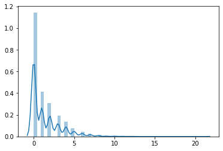
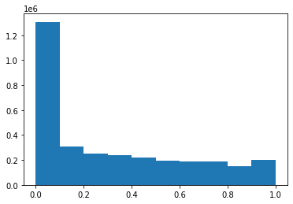
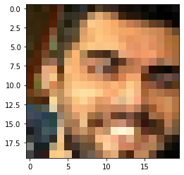
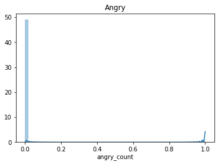
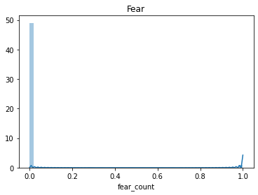
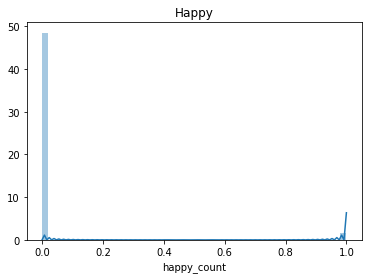

```python
from google.colab import drive
drive.mount('/content/drive')
```

    Drive already mounted at /content/drive; to attempt to forcibly remount, call drive.mount("/content/drive", force_remount=True).


```python
%tensorflow_version 2.x
import tensorflow as tf
device_name = tf.test.gpu_device_name()
if device_name != '/device:GPU:0':
  raise SystemError('GPU device not found')
print('Found GPU at: {}'.format(device_name))
```

    Found GPU at: /device:GPU:0


```python
!pip install --user keras_ocr
!pip install --user pyspellchecker
!pip install --user face_recognition
!ls -l '/content/drive/My Drive/data/PED/data'
```

    Collecting keras_ocr
    [?25l  Downloading https://files.pythonhosted.org/packages/4f/5a/ec31542d2b1c8ee9856266f8a91fa5878cd5963b8491075986f87d9572b0/keras-ocr-0.8.3.tar.gz (166kB)
         |████████████████████████████████| 174kB 2.8MB/s 
    [?25hCollecting essential_generators
    [?25l  Downloading https://files.pythonhosted.org/packages/59/b1/979b823497488e5f13c9070fcd6a2e24f6d9c6fd5398e0fbeccc8158bd3b/essential_generators-0.9.2-py3-none-any.whl (9.5MB)
         |████████████████████████████████| 9.5MB 8.0MB/s 
    [?25hRequirement already satisfied: tqdm in /usr/local/lib/python3.6/dist-packages (from keras_ocr) (4.41.1)
    Requirement already satisfied: imgaug in /usr/local/lib/python3.6/dist-packages (from keras_ocr) (0.2.9)
    Collecting validators
      Downloading https://files.pythonhosted.org/packages/c4/4a/4f9c892f9a9f08ee5f99c32bbd4297499099c2c5f7eff8c617a57d31a7d8/validators-0.15.0.tar.gz
    Collecting fonttools
    [?25l  Downloading https://files.pythonhosted.org/packages/87/d8/6b18fb99b65b6c05e5e9f1d2f8981a6862cc93458c67bea8a2958b6dcab1/fonttools-4.11.0-py3-none-any.whl (798kB)
         |████████████████████████████████| 798kB 39.3MB/s 
    [?25hRequirement already satisfied: editdistance in /usr/local/lib/python3.6/dist-packages (from keras_ocr) (0.5.3)
    Collecting pyclipper
    [?25l  Downloading https://files.pythonhosted.org/packages/e1/40/57a0d54a1c696d58253c88a95677e50ab2b305a15af0ac64b70db4320562/pyclipper-1.1.0.post3-cp36-cp36m-manylinux1_x86_64.whl (131kB)
         |████████████████████████████████| 133kB 61.0MB/s 
    [?25hRequirement already satisfied: shapely in /usr/local/lib/python3.6/dist-packages (from keras_ocr) (1.7.0)
    Collecting efficientnet==1.0.0
      Downloading https://files.pythonhosted.org/packages/97/82/f3ae07316f0461417dc54affab6e86ab188a5a22f33176d35271628b96e0/efficientnet-1.0.0-py3-none-any.whl
    Requirement already satisfied: scipy in /usr/local/lib/python3.6/dist-packages (from imgaug->keras_ocr) (1.4.1)
    Requirement already satisfied: numpy>=1.15.0 in /usr/local/lib/python3.6/dist-packages (from imgaug->keras_ocr) (1.18.4)
    Requirement already satisfied: six in /usr/local/lib/python3.6/dist-packages (from imgaug->keras_ocr) (1.12.0)
    Requirement already satisfied: Pillow in /usr/local/lib/python3.6/dist-packages (from imgaug->keras_ocr) (7.0.0)
    Requirement already satisfied: opencv-python in /usr/local/lib/python3.6/dist-packages (from imgaug->keras_ocr) (4.1.2.30)
    Requirement already satisfied: matplotlib in /usr/local/lib/python3.6/dist-packages (from imgaug->keras_ocr) (3.2.1)
    Requirement already satisfied: scikit-image>=0.11.0 in /usr/local/lib/python3.6/dist-packages (from imgaug->keras_ocr) (0.16.2)
    Requirement already satisfied: imageio in /usr/local/lib/python3.6/dist-packages (from imgaug->keras_ocr) (2.4.1)
    Requirement already satisfied: decorator>=3.4.0 in /usr/local/lib/python3.6/dist-packages (from validators->keras_ocr) (4.4.2)
    Requirement already satisfied: keras-applications<=1.0.8,>=1.0.7 in /usr/local/lib/python3.6/dist-packages (from efficientnet==1.0.0->keras_ocr) (1.0.8)
    Requirement already satisfied: kiwisolver>=1.0.1 in /usr/local/lib/python3.6/dist-packages (from matplotlib->imgaug->keras_ocr) (1.2.0)
    Requirement already satisfied: cycler>=0.10 in /usr/local/lib/python3.6/dist-packages (from matplotlib->imgaug->keras_ocr) (0.10.0)
    Requirement already satisfied: pyparsing!=2.0.4,!=2.1.2,!=2.1.6,>=2.0.1 in /usr/local/lib/python3.6/dist-packages (from matplotlib->imgaug->keras_ocr) (2.4.7)
    Requirement already satisfied: python-dateutil>=2.1 in /usr/local/lib/python3.6/dist-packages (from matplotlib->imgaug->keras_ocr) (2.8.1)
    Requirement already satisfied: networkx>=2.0 in /usr/local/lib/python3.6/dist-packages (from scikit-image>=0.11.0->imgaug->keras_ocr) (2.4)
    Requirement already satisfied: PyWavelets>=0.4.0 in /usr/local/lib/python3.6/dist-packages (from scikit-image>=0.11.0->imgaug->keras_ocr) (1.1.1)
    Requirement already satisfied: h5py in /usr/local/lib/python3.6/dist-packages (from keras-applications<=1.0.8,>=1.0.7->efficientnet==1.0.0->keras_ocr) (2.10.0)
    Building wheels for collected packages: keras-ocr, validators
      Building wheel for keras-ocr (setup.py) ... [?25l[?25hdone
      Created wheel for keras-ocr: filename=keras_ocr-0.8.3-cp36-none-any.whl size=148551 sha256=ca0f96b9306a5965d25e2ccf1da763acf95fc9780d4d9966400039feed509dc2
      Stored in directory: /root/.cache/pip/wheels/d2/da/6f/1752a00cfc486acbf010dad62ae45cb7013cf271bfd62635f5
      Building wheel for validators (setup.py) ... [?25l[?25hdone
      Created wheel for validators: filename=validators-0.15.0-cp36-none-any.whl size=18371 sha256=51be5ea3b17d71f5f4439f2d6f23d82b280c1db5a75a9158bc0dad0eae4d4134
      Stored in directory: /root/.cache/pip/wheels/56/48/64/66c29f8eaf756b780549db047057e1563dfd2d2ce8e3d316c1
    Successfully built keras-ocr validators
    Installing collected packages: essential-generators, validators, fonttools, pyclipper, efficientnet, keras-ocr
      WARNING: The scripts fonttools, pyftmerge, pyftsubset and ttx are installed in '/root/.local/bin' which is not on PATH.
      Consider adding this directory to PATH or, if you prefer to suppress this warning, use --no-warn-script-location.
    Successfully installed efficientnet-1.0.0 essential-generators-0.9.2 fonttools-4.11.0 keras-ocr-0.8.3 pyclipper-1.1.0.post3 validators-0.15.0
    Collecting pyspellchecker
    [?25l  Downloading https://files.pythonhosted.org/packages/04/d1/ec4e830e9f9c1fd788e1459dd09279fdf807bc7a475579fd7192450b879c/pyspellchecker-0.5.4-py2.py3-none-any.whl (1.9MB)
         |████████████████████████████████| 1.9MB 2.7MB/s 
    [?25hInstalling collected packages: pyspellchecker
    Successfully installed pyspellchecker-0.5.4
    Collecting face_recognition
      Downloading https://files.pythonhosted.org/packages/1e/95/f6c9330f54ab07bfa032bf3715c12455a381083125d8880c43cbe76bb3d0/face_recognition-1.3.0-py2.py3-none-any.whl
    Requirement already satisfied: Click>=6.0 in /usr/local/lib/python3.6/dist-packages (from face_recognition) (7.1.2)
    Requirement already satisfied: dlib>=19.7 in /usr/local/lib/python3.6/dist-packages (from face_recognition) (19.18.0)
    Requirement already satisfied: Pillow in /usr/local/lib/python3.6/dist-packages (from face_recognition) (7.0.0)
    Requirement already satisfied: numpy in /usr/local/lib/python3.6/dist-packages (from face_recognition) (1.18.4)
    Collecting face-recognition-models>=0.3.0
    [?25l  Downloading https://files.pythonhosted.org/packages/cf/3b/4fd8c534f6c0d1b80ce0973d01331525538045084c73c153ee6df20224cf/face_recognition_models-0.3.0.tar.gz (100.1MB)
         |████████████████████████████████| 100.2MB 43kB/s 
    [?25hBuilding wheels for collected packages: face-recognition-models
      Building wheel for face-recognition-models (setup.py) ... [?25l[?25hdone
      Created wheel for face-recognition-models: filename=face_recognition_models-0.3.0-py2.py3-none-any.whl size=100566172 sha256=eb95cbfe82b9372269df6a6d6fa999e69752e62f2b6c26c3ac33da62d5eaab93
      Stored in directory: /root/.cache/pip/wheels/d2/99/18/59c6c8f01e39810415c0e63f5bede7d83dfb0ffc039865465f
    Successfully built face-recognition-models
    Installing collected packages: face-recognition-models, face-recognition
      WARNING: The scripts face_detection and face_recognition are installed in '/root/.local/bin' which is not on PATH.
      Consider adding this directory to PATH or, if you prefer to suppress this warning, use --no-warn-script-location.
    Successfully installed face-recognition-1.3.0 face-recognition-models-0.3.0
    total 1217911
    -rw------- 1 root root     43415 Apr 18 12:28  channel_title_meta.tsv
    -rw------- 1 root root  33261605 Apr 18 12:29  channel_title_vecs.tsv
    -rw------- 1 root root    428702 Apr 18 12:28  corrected_thumbnail.json
    -rw------- 1 root root   8397517 Apr 18 13:12  descriptions.csv
    -rw------- 1 root root      5548 Apr 18 12:28 'errors copy.txt'
    -rw------- 1 root root     79513 Apr 18 12:28  errors.txt
    -rw------- 1 root root    429913 Apr 18 12:28  filename2text.json
    -rw------- 1 root root    353178 Jun  6 18:17  filename2text_not_trending.json
    -rw------- 1 root root      8225 Apr 18 12:28  GB_category_id.json
    -rw------- 1 root root  54147879 Apr 18 12:30  GB_videos_5p.csv
    -rw------- 1 root root   2763708 Apr 15 08:18  image_attributes_bedzju.csv
    -rw------- 1 root root   2755320 Apr 15 09:41  image_attributes.csv
    -rw------- 1 root root 615886534 Apr 18 15:47  image_attributes_nawrba.csv
    drwx------ 2 root root      4096 Jun  6 12:17  images
    drwx------ 2 root root      4096 Jun  6 14:03  images2
    -rw------- 1 root root  31711560 Mar 31 12:02  images.zip
    -rw------- 1 root root     43415 Apr 18 12:28  _meta.tsv
    -rw------- 1 root root    455149 Apr 18 12:28  meta.tsv
    -rw------- 1 root root   2202866 Apr 18 12:30  tags_meta.tsv
    -rw------- 1 root root  87401947 Apr 18 12:31  tags_vecs.tsv
    -rw------- 1 root root 125854077 Apr 15 08:19  text_attributes_bedzju.csv
    -rw------- 1 root root     54873 Apr 18 13:13  thumbnail_ocr_meta.tsv
    -rw------- 1 root root  37187201 Apr 18 13:13  thumbnail_ocr_vecs.tsv
    -rw------- 1 root root    455149 Apr 18 12:28  title_meta.tsv
    -rw------- 1 root root  94210729 Apr 18 12:32  title_vecs.tsv
    -rw------- 1 root root      8496 Apr 18 12:28  US_category_id.json
    -rw------- 1 root root  63133429 Apr 18 12:33  US_videos_5p.csv
    -rw------- 1 root root  19434243 Apr 18 12:33  _vecs.tsv
    -rw------- 1 root root  55002034 Apr 18 12:34  vecs.tsv
    -rw------- 1 root root  10871807 Jun  2 09:48  videos_not_trending.csv
    -rw------- 1 root root    537694 Apr 18 12:28  yolo_detections.json


```python
import os

DOWNLOAD_IMAGES = False
GENERATE_OCR = False

BASE_PATH = '/content/drive/My Drive/data/PED/'
path = os.path.join(BASE_PATH, 'data')
models_path = os.path.join(BASE_PATH, "models")
files = os.listdir(path)
files
```


    ['images.zip',
     'image_attributes_bedzju.csv',
     'text_attributes_bedzju.csv',
     'image_attributes.csv',
     'channel_title_meta.tsv',
     'errors copy.txt',
     'errors.txt',
     'GB_category_id.json',
     '_meta.tsv',
     'filename2text.json',
     'meta.tsv',
     'title_meta.tsv',
     'corrected_thumbnail.json',
     'US_category_id.json',
     'yolo_detections.json',
     'channel_title_vecs.tsv',
     'GB_videos_5p.csv',
     'tags_meta.tsv',
     'tags_vecs.tsv',
     'title_vecs.tsv',
     'US_videos_5p.csv',
     '_vecs.tsv',
     'vecs.tsv',
     'descriptions.csv',
     'thumbnail_ocr_meta.tsv',
     'thumbnail_ocr_vecs.tsv',
     'image_attributes_nawrba.csv',
     'videos_not_trending.csv',
     'images',
     'images2',
     'filename2text_not_trending.json']


```python
import pandas as pd

pd.set_option("colwidth", None)

df = pd.read_csv(path + "/" + "videos_not_trending.csv")
```


```python
df.columns
```


    Index(['Unnamed: 0', 'video_id', 'trending_date', 'title', 'channel_title',
           'category_id', 'publish_time', 'tags', 'views', 'likes', 'dislikes',
           'comment_count', 'thumbnail_link', 'comments_disabled',
           'ratings_disabled', 'video_error_or_removed', 'description '],
          dtype='object')


```python
len(df['thumbnail_link'].unique()), len(df['thumbnail_link'])
```


    (6533, 6956)


```python
df['video_id'].head()
```


    0    VZn6G0M9wNs
    1    Vfugwq2uoa0
    2    glEtdHJMcow
    3    uS3Vp_quGCw
    4    gIa4daq3180
    Name: video_id, dtype: object


# Thumbnails analysis

## Downloading images


```python
images_path = os.path.join(path, "images2")
try:
    os.mkdir(images_path)
except FileExistsError:
    pass

def url2filename(url):
    return url.replace("/", "")

# get content and write it to file
def write_to_file(filename, content):
    f = open(filename, 'wb')
    f.write(content)
    f.close()

from urllib.request import urlopen
from concurrent.futures import ThreadPoolExecutor

URLs = df['thumbnail_link'].unique()

import concurrent.futures
import urllib.request

# Retrieve a single page and report the URL and contents
def load_url(url, timeout):
    with urllib.request.urlopen(url, timeout=timeout) as conn:
        return conn.read()

# We can use a with statement to ensure threads are cleaned up promptly
def download_urls(urls, images_path, url2filename_func):
    with concurrent.futures.ThreadPoolExecutor(max_workers=5) as executor:
        # Start the load operations and mark each future with its URL
        future_to_url = {executor.submit(load_url, url, 60): url for url in URLs}
        for future in concurrent.futures.as_completed(future_to_url):
            url = future_to_url[future]
            try:
                data = future.result()
            except Exception as exc:
                if not "HTTP Error 404" in str(exc):
                    print('%r generated an exception: %s' % (url, exc))
            else:
                write_to_file(os.path.join(images_path, url2filename_func(url)), data)

if DOWNLOAD_IMAGES:
     download_urls(URLs, images_path, url2filename)
```

## Text recognition


```python
import matplotlib.pyplot as plt
import tensorflow as tf
import keras_ocr
import pathlib

def allow_memory_growth():
    gpus = tf.config.experimental.list_physical_devices('GPU')
    if gpus:
        try:
            # Currently, memory growth needs to be the same across GPUs
            for gpu in gpus:
                tf.config.experimental.set_memory_growth(gpu, True)
            logical_gpus = tf.config.experimental.list_logical_devices('GPU')
            print(len(gpus), "Physical GPUs,", len(logical_gpus), "Logical GPUs")
        except RuntimeError as e:
            # Memory growth must be set before GPUs have been initialized
            print(e)
# run the line below if you're using local runtime and have GTX > 1660 (this is known bug with tensorflow memory allocation)
# allow_memory_growth()
```


```python
pipeline = keras_ocr.pipeline.Pipeline()
```

    Looking for /root/.keras-ocr/craft_mlt_25k.h5
    Downloading /root/.keras-ocr/craft_mlt_25k.h5
    WARNING:tensorflow:From /usr/local/lib/python3.6/dist-packages/tensorflow/python/keras/backend.py:5871: sparse_to_dense (from tensorflow.python.ops.sparse_ops) is deprecated and will be removed in a future version.
    Instructions for updating:
    Create a `tf.sparse.SparseTensor` and use `tf.sparse.to_dense` instead.
    Looking for /root/.keras-ocr/crnn_kurapan.h5
    Downloading /root/.keras-ocr/crnn_kurapan.h5


```python
data_dir = pathlib.Path(images_path)
print(data_dir)
```

    /content/drive/My Drive/data/PED/data/images2


```python
image_count = len(list(data_dir.glob('*.jpg')))
image_count
```


    6530


```python
list_ds = tf.data.Dataset.list_files(str(data_dir/'*'))
```


```python
AUTOTUNE = 10
BATCH_SIZE = 100
IMG_WIDTH, IMG_HEIGHT = 90, 120

def decode_img(img):
    # convert the compressed string to a 3D uint8 tensor
    img = tf.image.decode_jpeg(img, channels=3)
    # Use `convert_image_dtype` to convert to floats in the [0,1] range.
    img = tf.image.convert_image_dtype(img, tf.float32)
    # resize the image to the desired size.
    return tf.image.resize(img, [IMG_WIDTH, IMG_HEIGHT])
def process_path(file_path):
    # load the raw data from the file as a string
    img = tf.io.read_file(file_path)
    img = decode_img(img)
    return img, file_path

ds = list_ds.map(process_path) # , num_parallel_calls=AUTOTUNE)
ds = ds.batch(BATCH_SIZE)
ds = ds.repeat()
```


```python
import json
ocr_file_path = os.path.join(path, 'filename2text_not_trending.json')
def genarete_texts_dict(ds, num_steps):
    descriptions = {}
    for i, (img_batch, filenames_batch) in enumerate(ds):
        print(f"Step {i + 1}/{num_steps}")
        if i == num_steps:
            break
        prediction_groups = pipeline.recognize(img_batch.numpy() * 256)
        texts = [" ".join([item[0] for item in group])for group in prediction_groups] # joining words into sentence
        for filename, text in zip(filenames_batch.numpy(), texts):
            descriptions[filename.decode().split("/")[-1][:-4]] = text
    return descriptions

if GENERATE_OCR:
    filename2text = genarete_texts_dict(ds, int(image_count/BATCH_SIZE) + 1)
    with open(ocr_file_path, 'w') as fp:
        json.dump(filename2text, fp)
else:
    with open(ocr_file_path, 'r') as f:
        filename2text = json.load(f)
```

### Correcting words

#### Create known words from descriptions


```python
descriptions_path = os.path.join(path, 'descriptions.csv')
df['description '].to_csv(descriptions_path, index=False, sep=" ")
```


```python
import re 
preprocessed_descriptions = pd.Series([
    " ".join([word for word in re.split(r"[^a-zA-Z]", sentence.replace("\\n", " ")) if len(word) < 15 and len(word) > 2])
    for sentence in df['description '].unique() if type(sentence) == str
])
preprocessed_descriptions.to_csv(descriptions_path, index=False, sep=" ")
```


```python
from spellchecker import SpellChecker

spell = SpellChecker()
spell.word_frequency.load_text_file(descriptions_path)
```


```python
spell.word_frequency._longest_word_length
```


    32


```python
import timeit
# filename2text_not_trending.json
thumbnails_path = os.path.join(path, 'corrected_thumbnail_not_trending.json')
start = timeit.default_timer()
if GENERATE_OCR:
    result = {}
    for i, (key, value) in enumerate(filename2text.items()):
        if i % 500 == 0:
            print(f"{i}/{len(filename2text)}")
            stop = timeit.default_timer()
            print('Time: ', stop - start)
            start = stop
        if value:
            result[key] = " ".join([spell.correction(word) for word in value.split(" ")])
        else :
            result[key] = value
    with open(thumbnails_path, 'w') as fp:
        json.dump(result, fp)
else:
    with open(thumbnails_path) as fp:
        result = json.load(fp)
```

    0/6530
    Time:  0.00026169900002059876
    500/6530
    Time:  30.397404016999985
    1000/6530
    Time:  28.293542408000008
    1500/6530
    Time:  35.54563582000003
    2000/6530
    Time:  37.09319816799996
    2500/6530
    Time:  30.106804162000003
    3000/6530
    Time:  26.256113347999985
    3500/6530
    Time:  35.607812882000076
    4000/6530
    Time:  37.28923531600003
    4500/6530
    Time:  35.35701385999994
    5000/6530
    Time:  31.20991630499998
    5500/6530
    Time:  35.401511942999946
    6000/6530
    Time:  33.65082812800006
    6500/6530
    Time:  28.97198748599999


```python
list(result.keys())[:3], list(filename2text.keys())[:3]
```


    (['https:i.ytimg.comvi_7p9p4F26_4hqdefault',
      'https:i.ytimg.comvikPH-V28epXshqdefault',
      'https:i.ytimg.comviVkFFGVfquFUhqdefault'],
     ['https:i.ytimg.comvi_7p9p4F26_4hqdefault',
      'https:i.ytimg.comvikPH-V28epXshqdefault',
      'https:i.ytimg.comviVkFFGVfquFUhqdefault'])


#### Visualization of results


```python
def show_batch(image_batch, labels=None):
    plt.figure(figsize=(10,10))
    for n in range(25):
        ax = plt.subplot(5,5,n+1)
        plt.imshow(image_batch[n])
        plt.axis('off')
        if labels:
            plt.title(labels[n])
    plt.tight_layout()


image_batch, filenames = next(iter(ds))

show_batch(image_batch.numpy(), [result[str(filename).split("/")[-1][:-5]] for filename in filenames[:25].numpy()])
```


```python
def url2filename_hq(url):
    url = url.replace("default.jpg", "hqdefault.jpg")
    return result[url2filename(url)[:-4]] if url2filename(url)[:-4] in result else ""

df['thumbnail_ocr'] = df['thumbnail_link'].map(url2filename_hq)
```


```python
df['thumbnail_ocr'].describe(), list(result.keys())[:4]
```


    (count     6956
     unique    2800
     top           
     freq      3345
     Name: thumbnail_ocr, dtype: object,
     ['https:i.ytimg.comvi_7p9p4F26_4hqdefault',
      'https:i.ytimg.comvikPH-V28epXshqdefault',
      'https:i.ytimg.comviVkFFGVfquFUhqdefault',
      'https:i.ytimg.comviIb674A1yMtghqdefault'])


#### Apply text processing


```python
import io
import os

import tensorflow as tf
import tensorflow_hub as hub
import numpy as np

tf.__version__
```


    '2.2.0'


```python
#  encoder = info.features['text'].encoder
def write_embedding_files(labels, embedded_ndarray, path=path, prefix=""):
    out_v = io.open(os.path.join(path, f"{prefix}_vecs.tsv"), "w", encoding="utf-8")
    out_m = io.open(os.path.join(path, f"{prefix}_meta.tsv"), "w", encoding="utf-8")
    vectors = embedded_ndarray
    for message, vector in zip(labels, vectors):
        out_m.write(message + "\n")
        out_v.write("\t".join([str(x) for x in vector]) + "\n")
    out_v.close()
    out_m.close()
```


```python
embed = hub.load("https://tfhub.dev/google/universal-sentence-encoder/4")
```


```python
def calc_embeddings(df, column_names, write_visualizations_files=False):
    extended_df = df
    for column in column_names:
        # batch_processing
        batch_size = 1000
        input_col = df[column].to_numpy()
        num_it = len(input_col) // batch_size

        result = np.zeros(shape=[len(input_col), 512])

        for i in range(num_it):
            result[batch_size * i: batch_size * (i + 1)]= embed(input_col[batch_size * i: batch_size * (i + 1)]).numpy()
        if len(input_col) % batch_size:
            result[batch_size * i:]= embed(input_col[batch_size * i:]).numpy()
        if write_visualizations_files:
            unique_inputs, unique_indexes = np.unique(input_col, return_index=True) 
            write_embedding_files(unique_inputs, result[unique_indexes], prefix=column)
        extended_df[f"{column}_embed"] = list(result)
    return extended_df

extended_df = calc_embeddings(df, ["thumbnail_ocr"], True) # , "description" Description doesnt work...
```

#### OCR lengths

> Conclusion: There are a lot of thumbnails without text detected, but median and mean values show that there are aproximately 1 word per image,
    which could be informative as well


```python
import seaborn as sns
import nltk
nltk.download('punkt')
from nltk.tokenize import word_tokenize

lengths = []
for t in df["thumbnail_ocr"].to_numpy():
    lengths.append(len(word_tokenize(t)))

print(pd.DataFrame({"length_statistics": lengths}).describe())
df["thumbnail_ocr_length"] = df["thumbnail_ocr"].apply(lambda x : len(word_tokenize(x)))
sns.distplot(lengths)
```

    /usr/local/lib/python3.6/dist-packages/statsmodels/tools/_testing.py:19: FutureWarning: pandas.util.testing is deprecated. Use the functions in the public API at pandas.testing instead.
      import pandas.util.testing as tm


    [nltk_data] Downloading package punkt to /root/nltk_data...
    [nltk_data]   Unzipping tokenizers/punkt.zip.
           length_statistics
    count        6956.000000
    mean            1.386141
    std             1.914072
    min             0.000000
    25%             0.000000
    50%             1.000000
    75%             2.000000
    max            21.000000


    <matplotlib.axes._subplots.AxesSubplot at 0x7fdf10181f98>





# Emotions analysis


```python
import face_recognition
```


```python
image_batch.numpy()[0].shape
plt.hist(np.reshape(image_batch.numpy(), [-1]))
```


    (array([1307559.,  305016.,  251968.,  238508.,  219391.,  191382.,
             187442.,  185405.,  151058.,  202271.]),
     array([0. , 0.1, 0.2, 0.3, 0.4, 0.5, 0.6, 0.7, 0.8, 0.9, 1. ],
           dtype=float32),
     <a list of 10 Patch objects>)





#### First face at the image visualization


```python
image_batch, filenames = next(iter(ds))
plt.imshow(image_batch[0])
plt.show()
```


```python
image = tf.image.convert_image_dtype(image_batch, tf.uint8).numpy()[0]
face_locations = face_recognition.face_locations(image, number_of_times_to_upsample=2, model="cnn")
if face_locations:
    top, right, bottom, left = face_locations[0]
    face_image = image[top:bottom, left:right]
    plt.imshow(face_image)
    plt.show()
```





```python
from tensorflow.keras.models import load_model
```


```python
face_locations
```


    [(20, 39, 40, 19), (18, 69, 38, 49), (28, 107, 48, 87)]


```python
face_recognition_model = load_model(os.path.join(models_path, "face_recognition.hdf5"))
```

#### Detected emotion


```python
emotions_map = {'Angry': 0, 'Sad': 5, 'Neutral': 4, 'Disgust': 1, 'Surprise': 6, 'Fear': 2, 'Happy': 3}
emotions_map_inv = {value: key for key, value in emotions_map.items()}
emotions_map_inv[np.argmax(face_recognition_model.predict(tf.image.rgb_to_grayscale(tf.image.resize([face_image], [48, 48]))))]
```


    'Fear'


```python
from collections import Counter

def transform_face_image(img):
    return tf.image.rgb_to_grayscale(tf.image.resize(img, [48, 48])).numpy()

def genarete_emotions_counts(ds, num_steps):
    emotions = {}
    for i, (img_batch, filenames_batch) in enumerate(ds):
        if i == num_steps:
            break
        print(f"Step {i + 1}/{num_steps}")
        images = tf.image.convert_image_dtype(image_batch, tf.uint8).numpy()
        face_images = [
            [
                image[location[0]:location[2], location[3]:location[1]]
                for location in face_recognition.face_locations(image, model="cnn")
            ]
            for image in images
        ]
        for filename, face_images_per_img in zip(filenames_batch.numpy(), face_images):
            key = filename.decode().split("/")[-1][:-4]
            if face_images_per_img:
                models_input = np.array(list(map(transform_face_image, face_images_per_img)))
                predicted_emotions = list(map(lambda x: emotions_map_inv[x], np.argmax(face_recognition_model.predict(models_input), axis=1)))
                emotions[key] = Counter(predicted_emotions)
            else:
                emotions[key] = Counter()
    return emotions
emotions_dict = genarete_emotions_counts(ds, int(image_count/BATCH_SIZE) + 1)
```

    Step 1/66
    Step 2/66
    Step 3/66
    Step 4/66
    Step 5/66
    Step 6/66
    Step 7/66
    Step 8/66
    Step 9/66
    Step 10/66
    Step 11/66
    Step 12/66
    Step 13/66
    Step 14/66
    Step 15/66
    Step 16/66
    Step 17/66
    Step 18/66
    Step 19/66
    Step 20/66
    Step 21/66
    Step 22/66
    Step 23/66
    Step 24/66
    Step 25/66
    Step 26/66
    Step 27/66
    Step 28/66
    Step 29/66
    Step 30/66
    Step 31/66
    Step 32/66
    Step 33/66
    Step 34/66
    Step 35/66
    Step 36/66
    Step 37/66
    Step 38/66
    Step 39/66
    Step 40/66
    Step 41/66
    Step 42/66
    Step 43/66
    Step 44/66
    Step 45/66
    Step 46/66
    Step 47/66
    Step 48/66
    Step 49/66
    Step 50/66
    Step 51/66
    Step 52/66
    Step 53/66
    Step 54/66
    Step 55/66
    Step 56/66
    Step 57/66
    Step 58/66
    Step 59/66
    Step 60/66
    Step 61/66
    Step 62/66
    Step 63/66
    Step 64/66
    Step 65/66
    Step 66/66


```python
len(emotions_dict), emotions_dict[list(emotions_dict.keys())[0]], list(emotions_dict.keys())[0]
```


    (6530, Counter(), 'https:i.ytimg.comviK0d_lOqB6tshqdefault')


```python
list(emotions_dict.keys())[:4], emotions_dict['https:i.ytimg.comviK0d_lOqB6tshqdefault']
```


    (['https:i.ytimg.comviK0d_lOqB6tshqdefault',
      'https:i.ytimg.comviDsO9osYxl0ohqdefault',
      'https:i.ytimg.comviy25z9Zca9R0hqdefault',
      'https:i.ytimg.comviIIf3SQ21dC4hqdefault'],
     Counter())


#### Constructing columns


```python
def gen_column_value(thumbnail_url, emotion):
    filename = url2filename(thumbnail_url).replace("default.jpg", "hqdefault.jpg")[:-4]
    if filename in emotions_dict:
        counter = emotions_dict[filename]
        if emotion in counter:
            return counter[emotion]
    return 0

for emotion in emotions_map:
    emotion_count = df["thumbnail_link"].apply(lambda x: gen_column_value(x, emotion))
    if emotion_count.max() > 0:
        df[f"{emotion.lower()}_count"] = emotion_count
        sns.distplot(df[f"{emotion.lower()}_count"]).set_title(emotion)
        plt.show()
```











Conlusions
> Only some of emotions are present at the images


```python
df.columns
```


    Index(['Unnamed: 0', 'video_id', 'trending_date', 'title', 'channel_title',
           'category_id', 'publish_time', 'tags', 'views', 'likes', 'dislikes',
           'comment_count', 'thumbnail_link', 'comments_disabled',
           'ratings_disabled', 'video_error_or_removed', 'description ',
           'thumbnail_ocr', 'thumbnail_ocr_embed', 'thumbnail_ocr_length',
           'angry_count', 'surprise_count', 'fear_count', 'happy_count'],
          dtype='object')


```python
output_columns = ['thumbnail_link', 'thumbnail_ocr_embed', 'thumbnail_ocr_length',
       'angry_count', 'surprise_count', 'fear_count', 'happy_count']
```


```python
df[output_columns].describe()
# #### Emotions visualization
```


<div>
<style scoped>
    .dataframe tbody tr th:only-of-type {
        vertical-align: middle;
    }

    .dataframe tbody tr th {
        vertical-align: top;
    }

    .dataframe thead th {
        text-align: right;
    }
</style>
<table border="1" class="dataframe">
  <thead>
    <tr style="text-align: right;">
      <th></th>
      <th>thumbnail_ocr_length</th>
      <th>angry_count</th>
      <th>surprise_count</th>
      <th>fear_count</th>
      <th>happy_count</th>
    </tr>
  </thead>
  <tbody>
    <tr>
      <th>count</th>
      <td>6956.000000</td>
      <td>6956.000000</td>
      <td>6956.000000</td>
      <td>6956.000000</td>
      <td>6956.000000</td>
    </tr>
    <tr>
      <th>mean</th>
      <td>1.386141</td>
      <td>0.020127</td>
      <td>0.060236</td>
      <td>0.020127</td>
      <td>0.030046</td>
    </tr>
    <tr>
      <th>std</th>
      <td>1.914072</td>
      <td>0.140443</td>
      <td>0.277029</td>
      <td>0.140443</td>
      <td>0.170726</td>
    </tr>
    <tr>
      <th>min</th>
      <td>0.000000</td>
      <td>0.000000</td>
      <td>0.000000</td>
      <td>0.000000</td>
      <td>0.000000</td>
    </tr>
    <tr>
      <th>25%</th>
      <td>0.000000</td>
      <td>0.000000</td>
      <td>0.000000</td>
      <td>0.000000</td>
      <td>0.000000</td>
    </tr>
    <tr>
      <th>50%</th>
      <td>1.000000</td>
      <td>0.000000</td>
      <td>0.000000</td>
      <td>0.000000</td>
      <td>0.000000</td>
    </tr>
    <tr>
      <th>75%</th>
      <td>2.000000</td>
      <td>0.000000</td>
      <td>0.000000</td>
      <td>0.000000</td>
      <td>0.000000</td>
    </tr>
    <tr>
      <th>max</th>
      <td>21.000000</td>
      <td>1.000000</td>
      <td>2.000000</td>
      <td>1.000000</td>
      <td>1.000000</td>
    </tr>
  </tbody>
</table>
</div>


```python
image_batch, filenames = next(iter(ds))
show_batch(image_batch.numpy(), [list(emotions_dict[str(filename).split("/")[-1][:-5]].keys()) for filename in filenames[:25].numpy()])
```


```python
df[output_columns].to_csv(os.path.join(path, "image_attributes_not_trending_nawrba.csv"), index=False)
```


```python

```
