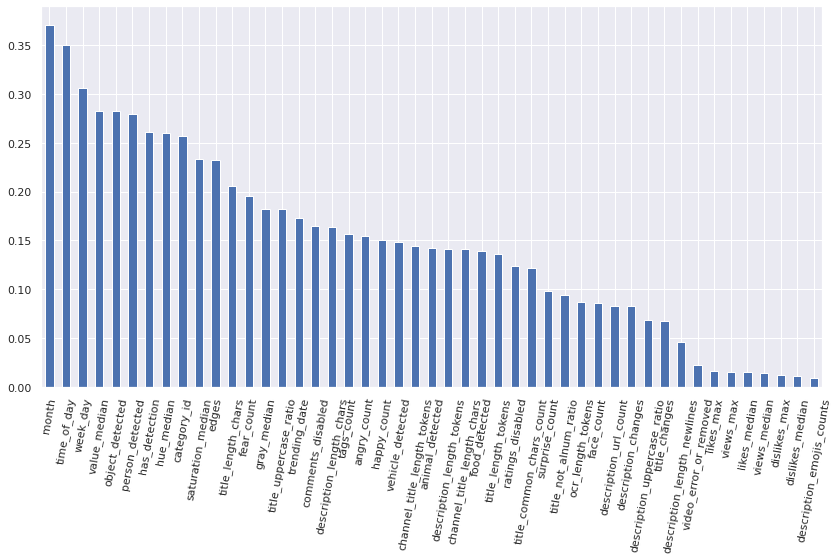
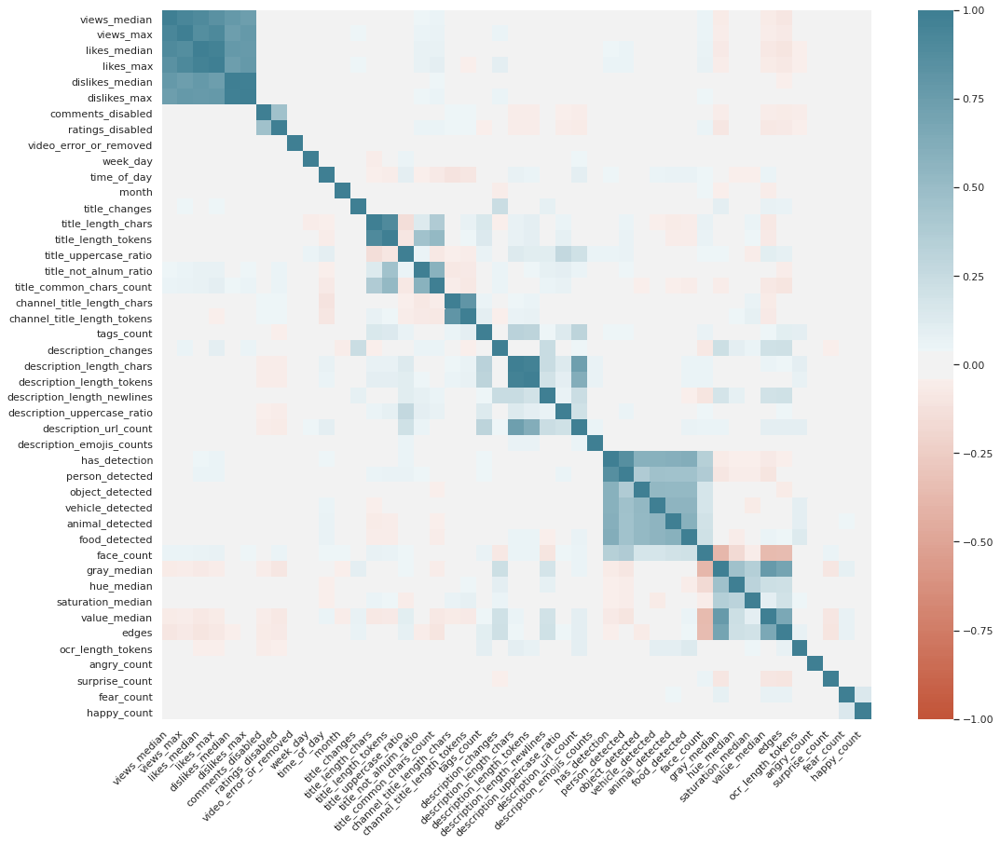
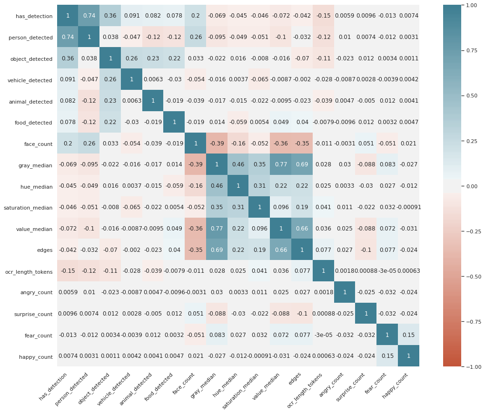
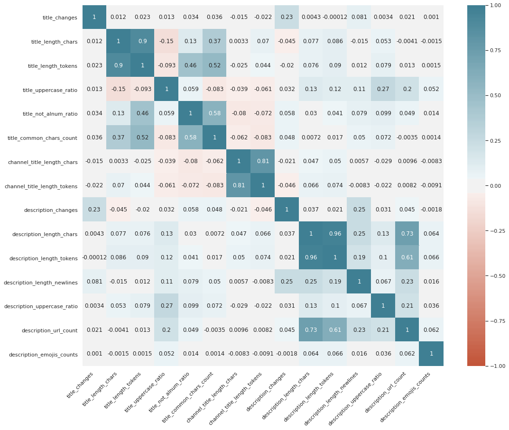
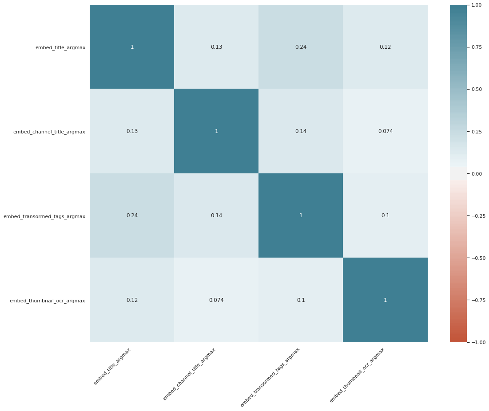
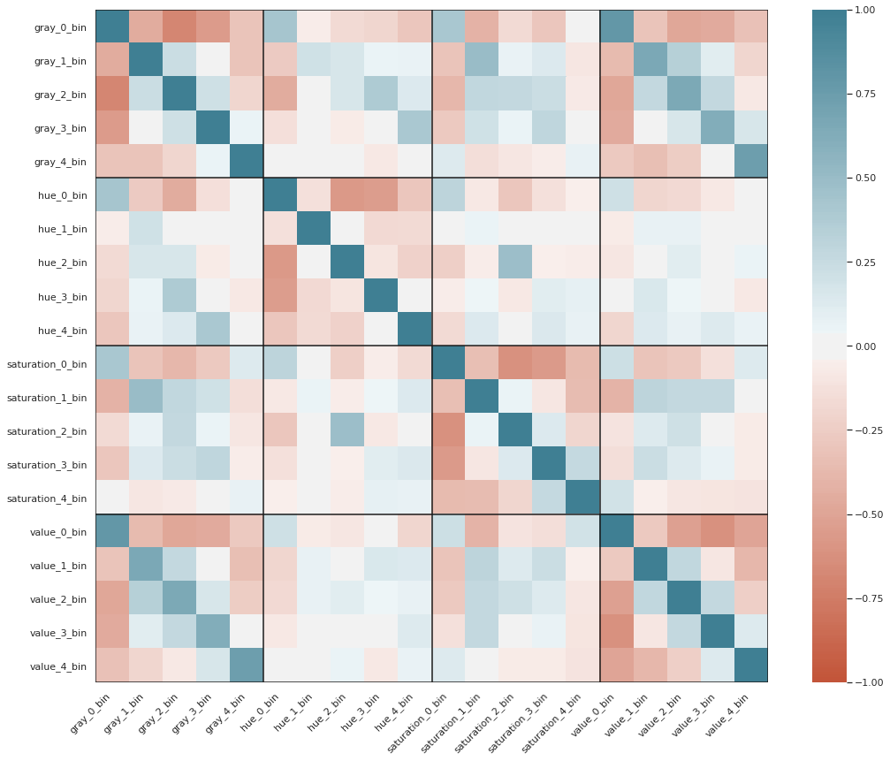
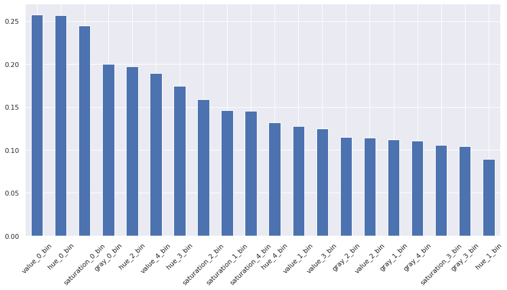
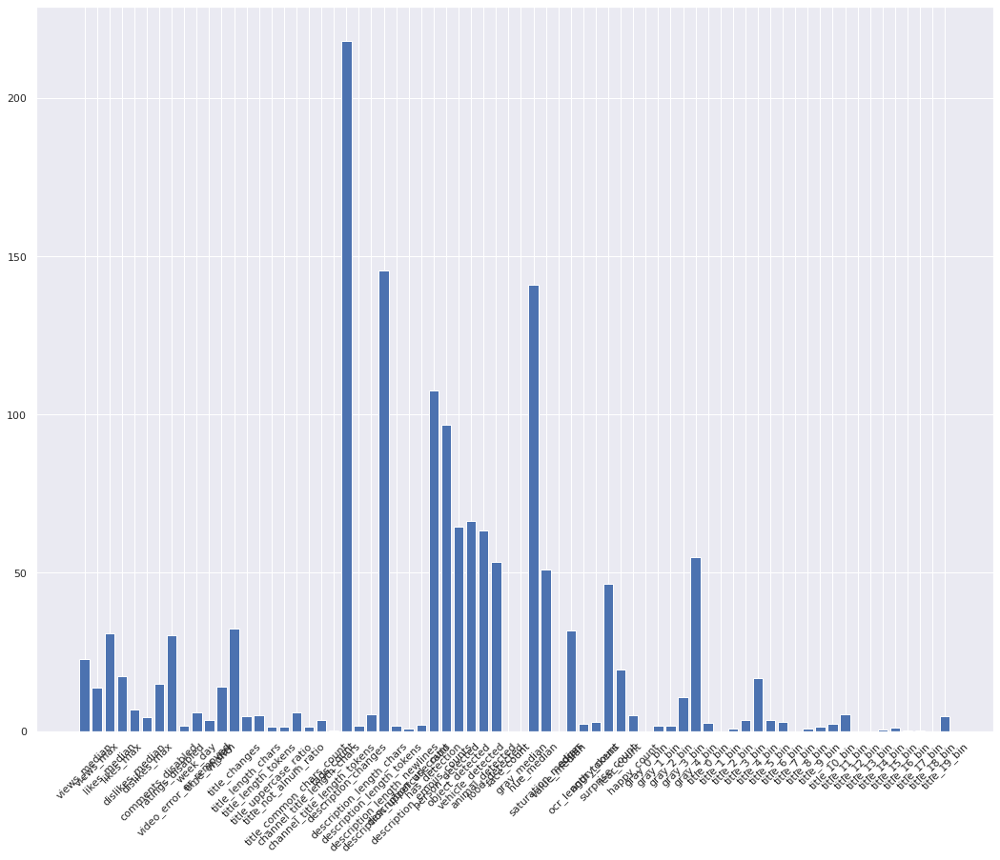

### Load dataframes with text and visual attributes


```python
import pandas as pd
import numpy as np
import os
import scipy.spatial
import scipy.stats as ss

FIGURES_DIR=os.path.join('..', 'figures')
```


```python
text_df = pd.read_csv(os.path.join('..', 'data', 'text_attributes_all.csv'))
img_df = pd.read_csv(os.path.join('..', 'data', 'image_attributes_bedzju.csv')).drop_duplicates()
img_df_2 = pd.read_csv(os.path.join('..', 'data', 'image_attributes_nawrba.csv')).drop_duplicates()
```


```python
img_df_not_trending = pd.read_csv(os.path.join('..', 'data', 'image_attributes_bedzju_not_trending.csv')).drop_duplicates()

img_df_2_not_trending = pd.read_csv(os.path.join('..', 'data', 'image_attributes_not_trending_nawrba.csv')).drop_duplicates()
text_df_not_trending = pd.read_csv(os.path.join('..', 'data', 'not_trending_text_attributes_all.csv'))
```


```python
img_df_2 = img_df_2.groupby('thumbnail_link').nth(0)
img_df_2_not_trending = img_df_2_not_trending.groupby('thumbnail_link').nth(0)

img_df_not_trending["image_filename"] = img_df_not_trending["image_filename"].apply(lambda x: x.replace("hqdefault.jpg", "default.jpg"))
```


```python
img_df_not_trending.columns, img_df_2_not_trending.columns
```

#### Text DF preview


```python
print(img_df.shape, img_df_2.shape, text_df.shape)
print(img_df_not_trending.shape, img_df_2_not_trending.drop_duplicates().shape, text_df_not_trending.shape)
text_df.head()
```

#### Visual DF preview


```python
# need to convert 'list strings' into numpy arrays
for cname in img_df.columns:
    if 'histogram' in cname:
        img_df[cname] = img_df[cname].apply(lambda x : np.fromstring(x[1:-1], sep=' '))
        img_df_not_trending[cname] = img_df_not_trending[cname].apply(lambda x : np.fromstring(x[1:-1], sep=' '))

print(img_df.shape)
img_df.head()
```

### Join dataframes with visual and text attributes


```python
text_df["image_filename"] = text_df["thumbnail_link"].apply(lambda x : x.replace('/', '').replace(':', '_'))
text_df_not_trending["image_filename"] = text_df_not_trending["thumbnail_link"].apply(lambda x : x.replace('/', '').replace(':', '_'))

df = text_df.merge(img_df_2, on=["thumbnail_link"], how="left").merge(img_df, on=["image_filename"], how="left")
df_not_trending = text_df_not_trending.merge(img_df_2_not_trending, on=["thumbnail_link"], how="left").merge(img_df_not_trending, on=["image_filename"], how="left")
print(df.shape, df_not_trending.shape)
print(df.columns, df_not_trending.columns)

df["is_trending"] = True
df_not_trending["is_trending"] = False

df = pd.concat([df, df_not_trending])

df = df.reset_index()
df
```


```python
list(df[['channel_title_embed', 'transormed_tags_embed', 'thumbnail_ocr_embed']].dtypes)
```


```python
def cast_to_list(x):
    if x and x:
        return [float(num) for num in x[1:-1].replace("\n", "").split(" ") if num]
    else:
        return None

for column in ['channel_title_embed',  'thumbnail_ocr_embed', 'transormed_tags_embed', "title_embed"]:
    df[column] = df[column].apply(cast_to_list)
```


```python
df[['channel_title_embed', 'transormed_tags_embed', 'thumbnail_ocr_embed', "title_embed"]].isnull().sum()
```

## More textual features -> TF, TF IDF based


```python
import csv

categories = {}
with open(os.path.join('..', 'data', 'categories.csv')) as csv_file:
    csv_reader = csv.reader(csv_file, delimiter=';')
    
    line_count = 0
    for row in csv_reader:
        if line_count == 0:
            line_count += 1
            continue
        else:
            categories[int(row[0])] = row[1]
        line_count += 1
        
    print(f'Processed {line_count} lines.')
```


```python
import pandas as pd
from sklearn.feature_extraction.text import TfidfVectorizer, CountVectorizer

vectorizer = TfidfVectorizer(stop_words='english')
vectors = vectorizer.fit_transform(np.unique(df["title"].values))

def top_tfidf_scores(corpus, n=15):
    # http://stackoverflow.com/questions/16078015/
    MAX_DF = 0.3 if len(corpus) > 10 else 1.0
    vectorizer = TfidfVectorizer(stop_words='english', max_features=100, max_df=MAX_DF, sublinear_tf=True)
    tfidf_result = vectorizer.fit_transform(corpus)
    
    scores = zip(vectorizer.get_feature_names(),
                 np.asarray(tfidf_result.sum(axis=0)).ravel())
    sorted_scores = sorted(scores, key=lambda x: x[1], reverse=True)
    return sorted_scores[:n]

def get_top_n_words(corpus, n=None):
    vec = CountVectorizer(stop_words='english').fit(corpus)
    bag_of_words = vec.transform(corpus)
    sum_words = bag_of_words.sum(axis=0) 
    words_freq = [(word, sum_words[0, idx]) for word, idx in     vec.vocabulary_.items()]
    words_freq =sorted(words_freq, key = lambda x: x[1], reverse=True)
    return words_freq[:n]

titles_bow = []
N = 30

for i in df["category_id"].value_counts().keys():
    titles = np.unique(df[df["category_id"] == i]["title"].values)
    titles_bow.extend(w[0] for w in get_top_n_words(titles, n=N))
    titles_bow.extend(w[0] for w in top_tfidf_scores(titles, n=N))

titles_bow = list(sorted(set(titles_bow)))

def onehot_encode(x, BOW):
    x_lower = x.lower()
    result = np.zeros(shape=len(BOW), dtype=np.uint8)
    for idx, w in enumerate(BOW):
        if w in x_lower:
            result[idx] += 1
    return result

titles_onehot = []
df["title_onehot"] = df["title"].apply(lambda x : onehot_encode(x, titles_bow))
```


```python
from sklearn.decomposition import PCA
import matplotlib.pyplot as plt
import seaborn as sns

def reduce_histogram(series):
    series = list(filter(lambda x : not isinstance(x, float), series))
    if series:
        return tuple(np.mean(series, axis=0))
    else:
        return tuple(np.zeros(5)-1.0)

sns.set(rc={'figure.figsize':(18, 14)})

bow_agg_df = df.groupby("video_id").agg(
    title_onehot=("title_onehot", reduce_histogram),
    category_id=("category_id", lambda s : max(s)),
).reset_index()

X = np.stack(bow_agg_df["title_onehot"].values, axis=0)
pca = PCA(n_components=20)
X_pca = pca.fit_transform(X)

sns.scatterplot(
    x='c1', 
    y='c2',
      hue='category',
    size='has_category',
    data=pd.DataFrame({
      'c1': X_pca[:, 0],
      'c2': X_pca[:, 1],
      'category': list(map(lambda x : categories.get(int(x), "undefined"), bow_agg_df.fillna(0)["category_id"].values)),
        'has_category': list(map(lambda x : 1 if x == -1 else 15, bow_agg_df.fillna(-1)["category_id"].values))
  })); 
```

## Perform aggregations


```python
def max_with_nans(series):
    result = max(series)
    if np.isnan(result):
        return -1.0
    else:
        return float(result) if isinstance(result, bool) else result
    
def reduce_medoid(series):
    series = np.array([row for row in series.to_numpy()])
    dist_matrix = scipy.spatial.distance_matrix(series, series)    
    return tuple(series[np.argmin(dist_matrix.sum(axis=0))])

agg_df = df.groupby("video_id").agg(
    trending_date=("trending_date", lambda s : len(set(s))), # how many days this video was trending,
    category_id=("category_id", lambda s : max(s)), # if a category was given, then take it :)
    publish_time=("publish_time", lambda s : max(s)), # we expect only one publish time anyway
    
    views_median=("views", "median"),
    views_max=("views", "max"),
    
    likes_median=("likes", "median"),
    likes_max=("likes", "max"),
    
    dislikes_median=("dislikes", "median"),
    dislikes_max=("dislikes", "max"),

    comments_disabled=("comments_disabled", "mean"),
    ratings_disabled=('ratings_disabled', "mean"),
    video_error_or_removed=('video_error_or_removed', "mean"),
    
    week_day=('week_day', "max"), # we don't expect different values here
    time_of_day=("time_of_day", "max"), # as they come from publish_time column
    month=('month', "max"),
    
    title_changes=("title", lambda s : len(set(s))), # how many different titles did we have?
    title_length_chars=('title_length_chars', "median"),
    title_length_tokens=("title_length_tokens", "median"),
    title_uppercase_ratio=("title_uppercase_ratio", "mean"),
    title_not_alnum_ratio=("title_not_alnum_ratio", "mean"),
    title_common_chars_count=("title_common_chars_count", "median"),
#     title_onehot=("title_onehot", reduce_histogram),
    
    channel_title_length_chars=("channel_title_length_chars", "median"),
    channel_title_length_tokens=("channel_title_length_tokens", "median"),
    
    tags_count=("tags_count", "median"),
    
    description_changes=("description", lambda s : len(set(s))), # how many changes of description?
    description_length_chars=("description_length_chars", "median"),
    description_length_tokens=("description_length_tokens", "median"),
    description_length_newlines=("description_length_newlines", "median"),
    description_uppercase_ratio=("description_uppercase_ratio", "mean"),
    description_url_count=("description_url_count", "median"),
    # description_top_domains_count=("description_top_domains_count", "median"),
    description_emojis_counts = ('emojis_counts', "median"),
    
    has_detection=("has_detection", max_with_nans),
    person_detected=("person_detected", max_with_nans),
    object_detected=("object_detected", max_with_nans),
    vehicle_detected=("vehicle_detected", max_with_nans),
    animal_detected=("animal_detected", max_with_nans),
    food_detected=("food_detected", max_with_nans),
    face_count=("face_count", max_with_nans),
    
    gray_histogram=("gray_histogram", reduce_histogram),
    hue_histogram=("hue_histogram", reduce_histogram),
    saturation_histogram=("saturation_histogram", reduce_histogram),
    value_histogram=("value_histogram", reduce_histogram),
    
    gray_median=("gray_median", "median"),
    hue_median=("hue_median", "median"),
    saturation_median=("saturation_median", "median"),
    value_median=("value_median", "median"),
    edges=("edges", "median"),
    
    ocr_length_tokens=('thumbnail_ocr_length', "median"),
    angry_count=('angry_count', "median"),
    surprise_count=('surprise_count', "median"),
    fear_count=('fear_count', "median"),
    happy_count=('happy_count', "median"),
    
    embed_title=('title_embed', reduce_medoid), 
    embed_channel_title=('channel_title_embed', reduce_medoid),
    embed_transormed_tags=('transormed_tags_embed', reduce_medoid), 
    embed_thumbnail_ocr=('thumbnail_ocr_embed', reduce_medoid),
    
    is_trending=('is_trending', lambda x: list(x)[0])
)

agg_df["title_onehot"] = list(map(list, X_pca))
agg_df.head()
```


```python
del df
del text_df
del img_df
del img_df_2
```


```python
agg_df
```


<div>
<style scoped>
    .dataframe tbody tr th:only-of-type {
        vertical-align: middle;
    }

    .dataframe tbody tr th {
        vertical-align: top;
    }

    .dataframe thead th {
        text-align: right;
    }
</style>
<table border="1" class="dataframe">
  <thead>
    <tr style="text-align: right;">
      <th></th>
      <th>trending_date</th>
      <th>category_id</th>
      <th>publish_time</th>
      <th>views_median</th>
      <th>views_max</th>
      <th>likes_median</th>
      <th>likes_max</th>
      <th>dislikes_median</th>
      <th>dislikes_max</th>
      <th>comments_disabled</th>
      <th>...</th>
      <th>angry_count</th>
      <th>surprise_count</th>
      <th>fear_count</th>
      <th>happy_count</th>
      <th>embed_title</th>
      <th>embed_channel_title</th>
      <th>embed_transormed_tags</th>
      <th>embed_thumbnail_ocr</th>
      <th>is_trending</th>
      <th>title_onehot</th>
    </tr>
    <tr>
      <th>video_id</th>
      <th></th>
      <th></th>
      <th></th>
      <th></th>
      <th></th>
      <th></th>
      <th></th>
      <th></th>
      <th></th>
      <th></th>
      <th></th>
      <th></th>
      <th></th>
      <th></th>
      <th></th>
      <th></th>
      <th></th>
      <th></th>
      <th></th>
      <th></th>
      <th></th>
    </tr>
  </thead>
  <tbody>
    <tr>
      <th>--cxZbnmmoc</th>
      <td>1</td>
      <td>10.0</td>
      <td>2018-02-09T08:25:30Z</td>
      <td>19087332.0</td>
      <td>19087332</td>
      <td>513771.0</td>
      <td>513771</td>
      <td>7322.0</td>
      <td>7322</td>
      <td>0.0</td>
      <td>...</td>
      <td>0.0</td>
      <td>0.0</td>
      <td>0.0</td>
      <td>0.0</td>
      <td>(0.03967499, -0.00773221, 0.07493569, -0.03566...</td>
      <td>(-0.0661685169, 0.021524217, 0.00812358968, 0....</td>
      <td>(-0.052321516, -0.0506301783, 0.0669021085, -0...</td>
      <td>(-0.0356568135, -0.0331957228, 0.0704742745, 0...</td>
      <td>False</td>
      <td>[-0.4716167654254109, -0.37592135307714863, -0...</td>
    </tr>
    <tr>
      <th>--yhkb7g9-0</th>
      <td>1</td>
      <td>24.0</td>
      <td>2019-05-21T22:00:00Z</td>
      <td>5963067.0</td>
      <td>5963067</td>
      <td>33054.0</td>
      <td>33054</td>
      <td>3408.0</td>
      <td>3408</td>
      <td>0.0</td>
      <td>...</td>
      <td>0.0</td>
      <td>0.0</td>
      <td>0.0</td>
      <td>0.0</td>
      <td>(-0.0403709, -0.04926631, 0.08353318, -0.05055...</td>
      <td>(0.0495597012, -0.00679528574, 0.0742692798, 0...</td>
      <td>(-0.00782008, -0.05251598, 0.05298975, -0.0498...</td>
      <td>(-0.0356568135, -0.0331957191, 0.0704742745, 0...</td>
      <td>False</td>
      <td>[0.6906631000673359, -0.26251934503239444, -0....</td>
    </tr>
    <tr>
      <th>-0CMnp02rNY</th>
      <td>6</td>
      <td>NaN</td>
      <td>2018-06-04T13:00:00.000Z</td>
      <td>730129.5</td>
      <td>800359</td>
      <td>9162.5</td>
      <td>9773</td>
      <td>290.0</td>
      <td>332</td>
      <td>0.0</td>
      <td>...</td>
      <td>0.0</td>
      <td>0.0</td>
      <td>0.0</td>
      <td>0.0</td>
      <td>(-0.00371912424, -0.0168767627, 0.0225341171, ...</td>
      <td>(-0.0549157821, 0.0274216253, 0.0595019646, 0....</td>
      <td>(-0.04590597, -0.03426605, 0.04779969, -0.0468...</td>
      <td>(-0.0356568135, -0.0331957191, 0.0704742745, 0...</td>
      <td>True</td>
      <td>[0.6848186699714649, -0.26790276050712974, -0....</td>
    </tr>
    <tr>
      <th>-0NYY8cqdiQ</th>
      <td>1</td>
      <td>NaN</td>
      <td>2018-01-29T14:00:39.000Z</td>
      <td>563746.0</td>
      <td>563746</td>
      <td>4429.0</td>
      <td>4429</td>
      <td>54.0</td>
      <td>54</td>
      <td>0.0</td>
      <td>...</td>
      <td>0.0</td>
      <td>0.0</td>
      <td>0.0</td>
      <td>0.0</td>
      <td>(0.000328458817, 0.0106091285, -0.0233515855, ...</td>
      <td>(-0.0549157821, 0.0274216253, 0.0595019646, 0....</td>
      <td>(-0.00803635, -0.05238112, 0.05465587, -0.0220...</td>
      <td>(-0.0356568135, -0.0331957191, 0.0704742745, 0...</td>
      <td>True</td>
      <td>[0.7118941890000775, 0.6980199400383457, -0.36...</td>
    </tr>
    <tr>
      <th>-0xZNTHUgJE</th>
      <td>1</td>
      <td>10.0</td>
      <td>2018-01-24T00:08:08Z</td>
      <td>226900.0</td>
      <td>226900</td>
      <td>4827.0</td>
      <td>4827</td>
      <td>93.0</td>
      <td>93</td>
      <td>0.0</td>
      <td>...</td>
      <td>0.0</td>
      <td>0.0</td>
      <td>0.0</td>
      <td>0.0</td>
      <td>(0.0593829378, -0.0216600411, 0.0828682557, 0....</td>
      <td>(0.0539994165, -0.0272604711, 0.0538546704, -0...</td>
      <td>(-0.01233774, -0.04297872, 0.06622579, 0.01517...</td>
      <td>(0.0536796823, -0.0486334898, 0.0836342275, 0....</td>
      <td>False</td>
      <td>[-0.2818527852527685, -0.19436497794440566, -0...</td>
    </tr>
    <tr>
      <th>...</th>
      <td>...</td>
      <td>...</td>
      <td>...</td>
      <td>...</td>
      <td>...</td>
      <td>...</td>
      <td>...</td>
      <td>...</td>
      <td>...</td>
      <td>...</td>
      <td>...</td>
      <td>...</td>
      <td>...</td>
      <td>...</td>
      <td>...</td>
      <td>...</td>
      <td>...</td>
      <td>...</td>
      <td>...</td>
      <td>...</td>
      <td>...</td>
    </tr>
    <tr>
      <th>zyKjMVyDJx8</th>
      <td>1</td>
      <td>26.0</td>
      <td>2018-06-23T15:00:04Z</td>
      <td>2526192.0</td>
      <td>2526192</td>
      <td>37948.0</td>
      <td>37948</td>
      <td>1535.0</td>
      <td>1535</td>
      <td>0.0</td>
      <td>...</td>
      <td>0.0</td>
      <td>0.0</td>
      <td>0.0</td>
      <td>0.0</td>
      <td>(-0.0226771925, 0.031353347, 0.0485866591, -0....</td>
      <td>(0.0346229598, -0.00995090697, 0.00452383002, ...</td>
      <td>(0.040609, -0.03567367, 0.05501096, -0.0477812...</td>
      <td>(0.06914616, 0.01121138, 0.06693688, -0.006118...</td>
      <td>False</td>
      <td>[-0.2513232271579395, 0.7647501830929033, -0.2...</td>
    </tr>
    <tr>
      <th>zysDWQMqOuc</th>
      <td>2</td>
      <td>22.0</td>
      <td>2017-11-20T19:19:20Z</td>
      <td>1143131.5</td>
      <td>1143132</td>
      <td>17464.0</td>
      <td>17464</td>
      <td>144.0</td>
      <td>144</td>
      <td>0.0</td>
      <td>...</td>
      <td>0.0</td>
      <td>0.0</td>
      <td>0.0</td>
      <td>0.0</td>
      <td>(0.05210635, -0.00557799, 0.00235439, -0.03319...</td>
      <td>(0.0142100789, 0.0100621767, 0.0662972778, -0....</td>
      <td>(-0.0489889, 0.01116576, 0.05676469, -0.001183...</td>
      <td>(-0.0356568135, -0.0331957228, 0.0704742745, 0...</td>
      <td>False</td>
      <td>[-0.2773957049857826, -0.19595138587393832, -0...</td>
    </tr>
    <tr>
      <th>zz6v6OfoQvs</th>
      <td>1</td>
      <td>27.0</td>
      <td>2014-05-06T01:40:25Z</td>
      <td>10556189.0</td>
      <td>10556189</td>
      <td>96541.0</td>
      <td>96541</td>
      <td>4523.0</td>
      <td>4523</td>
      <td>0.0</td>
      <td>...</td>
      <td>0.0</td>
      <td>1.0</td>
      <td>0.0</td>
      <td>0.0</td>
      <td>(0.0296417158, -0.0593062975, -0.0587844923, 0...</td>
      <td>(0.0571106933, -0.0507915206, 0.0524930619, -0...</td>
      <td>(0.03432279, -0.03457299, -0.01740939, 0.01156...</td>
      <td>(0.0127810659, -0.0811294094, -0.0300158653, 0...</td>
      <td>False</td>
      <td>[-0.17238190754615024, 0.019933977574216593, 0...</td>
    </tr>
    <tr>
      <th>zzQsGL_F9_c</th>
      <td>2</td>
      <td>NaN</td>
      <td>2018-01-30T18:30:04.000Z</td>
      <td>176623.5</td>
      <td>199041</td>
      <td>1297.5</td>
      <td>1415</td>
      <td>114.0</td>
      <td>121</td>
      <td>0.0</td>
      <td>...</td>
      <td>0.0</td>
      <td>0.0</td>
      <td>0.0</td>
      <td>0.0</td>
      <td>(0.0339502655, -0.00978831761, -0.0666705593, ...</td>
      <td>(0.0261014551, -0.0383094028, -0.0673796386, 0...</td>
      <td>(-0.0245034, 0.02764957, -0.06606486, -0.01300...</td>
      <td>(-0.0356568135, -0.0331957191, 0.0704742745, 0...</td>
      <td>True</td>
      <td>[-0.28365997282789085, -0.1953396301818211, -0...</td>
    </tr>
    <tr>
      <th>zzVLaNjIl70</th>
      <td>1</td>
      <td>24.0</td>
      <td>2018-02-25T04:43:02Z</td>
      <td>1849996.0</td>
      <td>1849996</td>
      <td>2526.0</td>
      <td>2526</td>
      <td>625.0</td>
      <td>625</td>
      <td>0.0</td>
      <td>...</td>
      <td>0.0</td>
      <td>0.0</td>
      <td>0.0</td>
      <td>0.0</td>
      <td>(-0.01106227, -0.02526204, -0.04556387, 0.0051...</td>
      <td>(0.04113426, -0.06477464, -0.06196975, -0.0107...</td>
      <td>(0.00371648, 0.03449807, 0.04475644, -0.007011...</td>
      <td>(0.0451932438, -0.00856544077, -0.0282179657, ...</td>
      <td>False</td>
      <td>[0.7127230383873399, 0.8103863037163676, 0.398...</td>
    </tr>
  </tbody>
</table>
<p>14753 rows × 58 columns</p>
</div>


### Extract subsets: numeric columns, non-numeric, histograms and videos with category_id given


```python
agg_df_histograms = agg_df[[cname for cname in agg_df.columns if 'histogram' in cname]]
agg_df_numeric = agg_df[[cname for idx, cname in enumerate(agg_df.columns) if agg_df.dtypes[idx] in [np.int64, np.float64]]]
agg_df_not_numeric = agg_df[[cname for idx, cname in enumerate(agg_df.columns) if agg_df.dtypes[idx] not in [np.int64, np.float64]]]
agg_df_embeddings = agg_df[[cname for cname in agg_df.columns if cname.startswith('embed_')]]

agg_df_embeddings_numeric = pd.concat([
    pd.DataFrame(agg_df_embeddings[colname].values.tolist()).add_prefix(colname + '_')
    for colname in agg_df_embeddings.columns
], axis=1)
```

### Analyze features stats
> In order to do so, we normalize all the values into one range: 0-1, so that the variances are more comparable


```python
# normalized_df = (agg_df_numeric - agg_df_numeric.mean()) / agg_df_numeric.std()

normalized_df = (agg_df_numeric - agg_df_numeric.min()) / (agg_df_numeric.max()-agg_df_numeric.min())

stats = normalized_df.describe()
stats
```


<div>
<style scoped>
    .dataframe tbody tr th:only-of-type {
        vertical-align: middle;
    }

    .dataframe tbody tr th {
        vertical-align: top;
    }

    .dataframe thead th {
        text-align: right;
    }
</style>
<table border="1" class="dataframe">
  <thead>
    <tr style="text-align: right;">
      <th></th>
      <th>trending_date</th>
      <th>category_id</th>
      <th>views_median</th>
      <th>views_max</th>
      <th>likes_median</th>
      <th>likes_max</th>
      <th>dislikes_median</th>
      <th>dislikes_max</th>
      <th>comments_disabled</th>
      <th>ratings_disabled</th>
      <th>...</th>
      <th>gray_median</th>
      <th>hue_median</th>
      <th>saturation_median</th>
      <th>value_median</th>
      <th>edges</th>
      <th>ocr_length_tokens</th>
      <th>angry_count</th>
      <th>surprise_count</th>
      <th>fear_count</th>
      <th>happy_count</th>
    </tr>
  </thead>
  <tbody>
    <tr>
      <th>count</th>
      <td>14753.000000</td>
      <td>6541.000000</td>
      <td>14753.000000</td>
      <td>14753.000000</td>
      <td>14753.000000</td>
      <td>14753.000000</td>
      <td>14753.000000</td>
      <td>14753.000000</td>
      <td>14753.000000</td>
      <td>14753.000000</td>
      <td>...</td>
      <td>14072.000000</td>
      <td>14072.000000</td>
      <td>14072.000000</td>
      <td>14072.000000</td>
      <td>14072.000000</td>
      <td>14753.000000</td>
      <td>14753.000000</td>
      <td>14753.000000</td>
      <td>14753.000000</td>
      <td>14753.000000</td>
    </tr>
    <tr>
      <th>mean</th>
      <td>0.116558</td>
      <td>0.666630</td>
      <td>0.001351</td>
      <td>0.001613</td>
      <td>0.002691</td>
      <td>0.003022</td>
      <td>0.001077</td>
      <td>0.001225</td>
      <td>0.028046</td>
      <td>0.015819</td>
      <td>...</td>
      <td>0.213716</td>
      <td>0.275070</td>
      <td>0.293335</td>
      <td>0.323170</td>
      <td>0.340845</td>
      <td>0.062835</td>
      <td>0.024436</td>
      <td>0.015573</td>
      <td>0.040127</td>
      <td>0.023114</td>
    </tr>
    <tr>
      <th>std</th>
      <td>0.173282</td>
      <td>0.256532</td>
      <td>0.014200</td>
      <td>0.015317</td>
      <td>0.014880</td>
      <td>0.016120</td>
      <td>0.011419</td>
      <td>0.012070</td>
      <td>0.164621</td>
      <td>0.124336</td>
      <td>...</td>
      <td>0.182300</td>
      <td>0.260059</td>
      <td>0.233169</td>
      <td>0.283083</td>
      <td>0.232196</td>
      <td>0.087046</td>
      <td>0.154348</td>
      <td>0.098365</td>
      <td>0.196005</td>
      <td>0.150158</td>
    </tr>
    <tr>
      <th>min</th>
      <td>0.000000</td>
      <td>0.000000</td>
      <td>0.000000</td>
      <td>0.000000</td>
      <td>0.000000</td>
      <td>0.000000</td>
      <td>0.000000</td>
      <td>0.000000</td>
      <td>0.000000</td>
      <td>0.000000</td>
      <td>...</td>
      <td>0.000000</td>
      <td>0.000000</td>
      <td>0.000000</td>
      <td>0.000000</td>
      <td>0.000000</td>
      <td>0.000000</td>
      <td>0.000000</td>
      <td>0.000000</td>
      <td>0.000000</td>
      <td>0.000000</td>
    </tr>
    <tr>
      <th>25%</th>
      <td>0.000000</td>
      <td>0.500000</td>
      <td>0.000025</td>
      <td>0.000027</td>
      <td>0.000080</td>
      <td>0.000085</td>
      <td>0.000026</td>
      <td>0.000028</td>
      <td>0.000000</td>
      <td>0.000000</td>
      <td>...</td>
      <td>0.031373</td>
      <td>0.061798</td>
      <td>0.105882</td>
      <td>0.062745</td>
      <td>0.120893</td>
      <td>0.000000</td>
      <td>0.000000</td>
      <td>0.000000</td>
      <td>0.000000</td>
      <td>0.000000</td>
    </tr>
    <tr>
      <th>50%</th>
      <td>0.026316</td>
      <td>0.785714</td>
      <td>0.000103</td>
      <td>0.000115</td>
      <td>0.000376</td>
      <td>0.000402</td>
      <td>0.000108</td>
      <td>0.000119</td>
      <td>0.000000</td>
      <td>0.000000</td>
      <td>...</td>
      <td>0.207843</td>
      <td>0.140449</td>
      <td>0.258824</td>
      <td>0.250980</td>
      <td>0.315871</td>
      <td>0.047619</td>
      <td>0.000000</td>
      <td>0.000000</td>
      <td>0.000000</td>
      <td>0.000000</td>
    </tr>
    <tr>
      <th>75%</th>
      <td>0.184211</td>
      <td>0.821429</td>
      <td>0.000406</td>
      <td>0.000468</td>
      <td>0.001513</td>
      <td>0.001628</td>
      <td>0.000420</td>
      <td>0.000463</td>
      <td>0.000000</td>
      <td>0.000000</td>
      <td>...</td>
      <td>0.368627</td>
      <td>0.550562</td>
      <td>0.435294</td>
      <td>0.552941</td>
      <td>0.543785</td>
      <td>0.095238</td>
      <td>0.000000</td>
      <td>0.000000</td>
      <td>0.000000</td>
      <td>0.000000</td>
    </tr>
    <tr>
      <th>max</th>
      <td>1.000000</td>
      <td>1.000000</td>
      <td>1.000000</td>
      <td>1.000000</td>
      <td>1.000000</td>
      <td>1.000000</td>
      <td>1.000000</td>
      <td>1.000000</td>
      <td>1.000000</td>
      <td>1.000000</td>
      <td>...</td>
      <td>1.000000</td>
      <td>1.000000</td>
      <td>1.000000</td>
      <td>1.000000</td>
      <td>1.000000</td>
      <td>1.000000</td>
      <td>1.000000</td>
      <td>1.000000</td>
      <td>1.000000</td>
      <td>1.000000</td>
    </tr>
  </tbody>
</table>
<p>8 rows × 47 columns</p>
</div>


#### Which columns have the highest variance?


```python
import matplotlib.pyplot as plt

std_deviations = stats.loc["std", :].sort_values(ascending=False)
std_plot = std_deviations.plot.bar(figsize=(14, 7), rot=80)
std_plot.get_figure().savefig("std_dev.pdf")
std_plot.plot()
```


    []





```python
std_deviations[ std_deviations < 0.1 ]
```


    surprise_count                 0.098365
    title_not_alnum_ratio          0.094455
    ocr_length_tokens              0.087046
    face_count                     0.086363
    description_url_count          0.082630
    description_changes            0.082437
    description_uppercase_ratio    0.068806
    title_changes                  0.067579
    description_length_newlines    0.046197
    video_error_or_removed         0.022006
    likes_max                      0.016120
    views_max                      0.015317
    likes_median                   0.014880
    views_median                   0.014200
    dislikes_max                   0.012070
    dislikes_median                0.011419
    description_emojis_counts      0.008890
    Name: std, dtype: float64


## Feature corerlations
> Using `-1.0` to denote missing values will potentially break the usefulness of correlation coef, so in the next heatmaps we split the features by their 'domain' (text or visual), skipping the missing values. This makes new coefficients more relevant.


```python
import seaborn as sns

corr = agg_df_numeric[[
    cname for cname in agg_df_numeric.columns if cname not in ["trending_date", "category_id"]]
].corr()
ax = sns.heatmap(
    corr, 
    vmin=-1, vmax=1, center=0,
    cmap=sns.diverging_palette(20, 220, n=200),
    square=True
)

xxx = ax.set_xticklabels(
    ax.get_xticklabels(),
    rotation=45,
    horizontalalignment='right'
)
```





```python
ax.get_figure().savefig(os.path.join(FIGURES_DIR, "corr_all.pdf"))
```

## Let's go deeper
### Visual attributes


```python
visual_words = ['detect', 'face', 'gray', 'hue', 'saturation', 'value', 'edges', "ocr_length_tokens", "angry_count", "surprise_count", "fear_count", "happy_count"]
select_columns = [cname for cname in agg_df_numeric.columns if any([word in cname for word in visual_words])]

select_df = agg_df_numeric[select_columns]
select_df = select_df[select_df != -1.0]

corr = select_df.corr()
ax = sns.heatmap(
    corr, 
    vmin=-1, vmax=1, center=0,
    cmap=sns.diverging_palette(20, 220, n=200),
    square=True,
    annot=True
)

xxx = ax.set_xticklabels(
    ax.get_xticklabels(),
    rotation=45,
    horizontalalignment='right'
)
```





```python
ax.get_figure().savefig(os.path.join(FIGURES_DIR, "corr_visual.pdf"))
```

## Title, Channel Title + Description attributes


```python
select_columns = [cname for cname in agg_df_numeric.columns if any([word in cname for word in ["title", "description"]])]

select_df = agg_df_numeric[select_columns]
select_df = select_df[select_df != -1.0]

corr = select_df.corr()
ax = sns.heatmap(
    corr, 
    vmin=-1, vmax=1, center=0,
    cmap=sns.diverging_palette(20, 220, n=200),
    square=True,
    annot=True
)

xxx = ax.set_xticklabels(
    ax.get_xticklabels(),
    rotation=45,
    horizontalalignment='right'
)
```





```python
ax.get_figure().savefig(os.path.join(FIGURES_DIR, "corr_desc.pdf"))
```

## Print most and least correlated feature for each column


```python
import pandas as pd
import numpy as np

for idx, cname in enumerate(corr.index):
    if cname == 'category_id':
        continue
    
    max_corr = np.max(corr.loc[cname, corr.columns != cname])
    closest_idx = np.argmax(corr.loc[cname, (corr.columns != cname) & (corr.columns != "category_id")])
    print(cname, '-', corr.index[closest_idx], ' : ', max_corr)
    
    min_corr = np.min(corr.loc[cname, corr.columns != cname])
    furthest_idx = np.argmin(corr.loc[cname, (corr.columns != cname) & (corr.columns != "category_id")])
    print(cname, '-', corr.index[furthest_idx], ' : ', min_corr)
    
    print()
```

    title_changes - channel_title_length_tokens  :  0.23358524772483077
    title_changes - channel_title_length_chars  :  -0.02219865869156423
    
    title_length_chars - title_length_chars  :  0.903041014775186
    title_length_chars - title_length_tokens  :  -0.14646437218261824
    
    title_length_tokens - title_length_chars  :  0.903041014775186
    title_length_tokens - title_length_tokens  :  -0.09335073624176783
    
    title_uppercase_ratio - description_length_newlines  :  0.274326450606685
    title_uppercase_ratio - title_length_chars  :  -0.14646437218261824
    
    title_not_alnum_ratio - title_not_alnum_ratio  :  0.5848915198808711
    title_not_alnum_ratio - title_common_chars_count  :  -0.07997502620992736
    
    title_common_chars_count - title_not_alnum_ratio  :  0.5848915198808711
    title_common_chars_count - title_uppercase_ratio  :  -0.08326410846413931
    
    channel_title_length_chars - channel_title_length_chars  :  0.8073167554461743
    channel_title_length_chars - title_not_alnum_ratio  :  -0.07997502620992736
    
    channel_title_length_tokens - channel_title_length_chars  :  0.8073167554461743
    channel_title_length_tokens - title_common_chars_count  :  -0.08302936975685749
    
    description_changes - description_length_tokens  :  0.2486217974118623
    description_changes - channel_title_length_tokens  :  -0.045934422532789516
    
    description_length_chars - description_length_chars  :  0.964499403403624
    description_length_chars - title_changes  :  0.004348703703421806
    
    description_length_tokens - description_length_chars  :  0.964499403403624
    description_length_tokens - title_changes  :  -0.00011677157406883934
    
    description_length_newlines - description_length_chars  :  0.2499966890602979
    description_length_newlines - title_length_chars  :  -0.015088675295814133
    
    description_uppercase_ratio - title_uppercase_ratio  :  0.274326450606685
    description_uppercase_ratio - channel_title_length_chars  :  -0.02859267178309748
    
    description_url_count - description_length_chars  :  0.728648265576817
    description_url_count - title_length_chars  :  -0.004103996420400009
    
    description_emojis_counts - description_length_tokens  :  0.06646756560381153
    description_emojis_counts - channel_title_length_tokens  :  -0.009065653657676415
    


### Embeddings comparison


```python
for column_name in agg_df_embeddings.columns:
    print(column_name)
    agg_df_embeddings[column_name + "_argmax"] = agg_df_embeddings[column_name].copy().apply(np.argmax).copy()
```

    embed_title


    <ipython-input-29-038be2c54ba2>:3: SettingWithCopyWarning: 
    A value is trying to be set on a copy of a slice from a DataFrame.
    Try using .loc[row_indexer,col_indexer] = value instead
    
    See the caveats in the documentation: https://pandas.pydata.org/pandas-docs/stable/user_guide/indexing.html#returning-a-view-versus-a-copy
      agg_df_embeddings[column_name + "_argmax"] = agg_df_embeddings[column_name].copy().apply(np.argmax).copy()


    embed_channel_title
    embed_transormed_tags
    embed_thumbnail_ocr


```python
agg_df_embeddings.columns
```


    Index(['embed_title', 'embed_channel_title', 'embed_transormed_tags',
           'embed_thumbnail_ocr', 'embed_title_argmax',
           'embed_channel_title_argmax', 'embed_transormed_tags_argmax',
           'embed_thumbnail_ocr_argmax'],
          dtype='object')


```python
def cramers_corrected_stat(confusion_matrix):
    """ calculate Cramers V statistic for categorial-categorial association.
        uses correction from Bergsma and Wicher, 
        Journal of the Korean Statistical Society 42 (2013): 323-328
    """
    chi2 = ss.chi2_contingency(confusion_matrix)[0]
    n = confusion_matrix.sum()
    phi2 = chi2/n
    r,k = confusion_matrix.shape
    phi2corr = max(0, phi2 - ((k-1)*(r-1))/(n-1))    
    rcorr = r - ((r-1)**2)/(n-1)
    kcorr = k - ((k-1)**2)/(n-1)
    return np.sqrt(phi2corr / min( (kcorr-1), (rcorr-1)))
```


```python
max_embed_column_names = [colname for colname in agg_df_embeddings.columns if colname.endswith("_argmax")]
corr = []
for column_name in max_embed_column_names:
    corr.append([])
    for column_name_2 in max_embed_column_names:
        confusion_matrix = pd.crosstab(agg_df_embeddings[column_name], agg_df_embeddings[column_name_2]).values
        # print(confusion_matrix)
        corr[-1].append(cramers_corrected_stat(confusion_matrix))
```


```python
corr
```


    [[0.9999999999999999,
      0.12963177592011904,
      0.24170869936104783,
      0.12023982009232198],
     [0.12963177592011899, 1.0, 0.14498746806744686, 0.07431653822524795],
     [0.24170869936104786, 0.14498746806744683, 1.0, 0.10031439973607187],
     [0.12023982009232195,
      0.07431653822524797,
      0.10031439973607187,
      0.9999999999999999]]


```python
ax = sns.heatmap(
    corr, 
    vmin=-1, vmax=1, center=0,
    cmap=sns.diverging_palette(20, 220, n=200),
    square=True,
    annot=True,
    xticklabels=max_embed_column_names,
    yticklabels=max_embed_column_names
)

xxx = ax.set_xticklabels(
    ax.get_xticklabels(),
    rotation=45,
    horizontalalignment='right'
)

yxx = ax.set_yticklabels(
    ax.get_yticklabels(),
    rotation=0,
)
```





```python
ax.get_figure().savefig(os.path.join(FIGURES_DIR, "corr_embed.pdf"))
```

### "Flatten" histogram values into columns


```python
def transform_histogram_df(df):
    for cname in df.columns:
        if 'histogram' in cname:
            prefix = cname.split('_')[0]
            for i in range(5):
                df[f"{prefix}_{i}_bin"] = df[cname].apply(lambda x : x[i])
            df = df.drop(columns=[cname])
    return df

agg_df_histograms = transform_histogram_df(agg_df[[cname for cname in agg_df.columns if 'histogram' in cname]])
     
# VERY important, remove -1.0s! 
agg_df_histograms = agg_df_histograms[agg_df_histograms["gray_0_bin"] != -1.0]
```

    <ipython-input-36-3140a966a8f1>:6: SettingWithCopyWarning: 
    A value is trying to be set on a copy of a slice from a DataFrame.
    Try using .loc[row_indexer,col_indexer] = value instead
    
    See the caveats in the documentation: https://pandas.pydata.org/pandas-docs/stable/user_guide/indexing.html#returning-a-view-versus-a-copy
      df[f"{prefix}_{i}_bin"] = df[cname].apply(lambda x : x[i])


```python
corr = agg_df_histograms.corr()
ax = sns.heatmap(
    corr, 
    vmin=-1, vmax=1, center=0,
    cmap=sns.diverging_palette(20, 220, n=200),
    square=True
)

xxx = ax.set_xticklabels(
    ax.get_xticklabels(),
    rotation=45,
    horizontalalignment='right'
)

ax.hlines([0, 5, 10, 15, 20], *ax.get_xlim())
ax.vlines([0, 5, 10, 15, 20], *ax.get_xlim())
```


    <matplotlib.collections.LineCollection at 0x7f5d839b8160>





### Histogram bins variances


```python
normalized_df = (agg_df_histograms - agg_df_histograms.min()) / (agg_df_histograms.max()-agg_df_histograms.min())

stats = normalized_df.describe()

std_deviations = stats.loc["std", :].sort_values(ascending=False)
std_deviations.plot.bar(figsize=(14, 7), rot=45)
```


    <matplotlib.axes._subplots.AxesSubplot at 0x7f5d83962550>





> Feature selection is performed using ANOVA F measure via the f_classif() function.


```python

FEATURE_SELECTION_COLUMNS = ['category_id', 'publish_time', 'views_median',
       'views_max', 'likes_median', 'likes_max', 'dislikes_median',
       'dislikes_max', 'comments_disabled', 'ratings_disabled',
       'video_error_or_removed', 'week_day', 'time_of_day', 'month',
       'title_changes', 'title_length_chars', 'title_length_tokens',
       'title_uppercase_ratio', 'title_not_alnum_ratio',
       'title_common_chars_count', 'channel_title_length_chars',
       'channel_title_length_tokens', 'tags_count', 'description_changes',
       'description_length_chars', 'description_length_tokens',
       'description_length_newlines', 'description_uppercase_ratio',
       'description_url_count', 'description_emojis_counts', 'has_detection',
       'person_detected', 'object_detected', 'vehicle_detected',
       'animal_detected', 'food_detected', 'face_count', 'gray_histogram',
       'hue_histogram', 'saturation_histogram', 'value_histogram',
       'gray_median', 'hue_median', 'saturation_median', 'value_median',
       'edges', 'ocr_length_tokens', 'angry_count', 'surprise_count',
       'fear_count', 'happy_count', 'is_trending',
       'title_onehot']
```


```python
import math
from sklearn.model_selection import train_test_split

def transform_onehot_df(df):
    for cname in df.columns:
        if 'onehot' in cname:
            prefix = cname.split('_')[0]
            for i in range(len(df[cname].values[0])):
                df[f"{prefix}_{i}_bin"] = df[cname].apply(lambda x : x[i])
            df = df.drop(columns=[cname])
    return df

df_feature_selection = agg_df[FEATURE_SELECTION_COLUMNS]

with open(os.path.join("..", "data", "API_categories.json"), "r") as handle:
    ids_to_categories_dict = json.load(handle)
df_feature_selection["category_id"] = df_feature_selection[["category_id"]].apply(
    # Fill missing categories
    lambda row : ids_to_categories_dict.get(row.name, -1) if math.isnan(row.category_id) or row.category_id == -1 else row.category_id,
    axis=1
)

df_feature_selection_numeric = transform_histogram_df(df_feature_selection)
df_feature_selection_numeric = transform_onehot_df(df_feature_selection)

df_feature_selection_numeric = df_feature_selection_numeric[
    [cname for idx, cname in enumerate(df_feature_selection_numeric.columns) if df_feature_selection_numeric.dtypes[idx] in [np.int64, np.float64, np.bool]]
]

y = df_feature_selection_numeric["is_trending"].values
X = df_feature_selection_numeric.drop(columns=["is_trending", "category_id"]).fillna(-1.0)

X = (X - X.min()) / (X.max()-X.min()+1e-12) # normalize values - how about those that are missing?

# Splitting


train_idxs, test_idxs = train_test_split(np.arange(X.shape[0]), test_size=0.2)

X_columns = X.columns
X = X.values

X = X[train_idxs]
y = y[train_idxs]

X.shape
```

    <ipython-input-111-b009db75dd82>:17: SettingWithCopyWarning: 
    A value is trying to be set on a copy of a slice from a DataFrame.
    Try using .loc[row_indexer,col_indexer] = value instead
    
    See the caveats in the documentation: https://pandas.pydata.org/pandas-docs/stable/user_guide/indexing.html#returning-a-view-versus-a-copy
      df_feature_selection["category_id"] = df_feature_selection[["category_id"]].apply(
    <ipython-input-36-3140a966a8f1>:6: SettingWithCopyWarning: 
    A value is trying to be set on a copy of a slice from a DataFrame.
    Try using .loc[row_indexer,col_indexer] = value instead
    
    See the caveats in the documentation: https://pandas.pydata.org/pandas-docs/stable/user_guide/indexing.html#returning-a-view-versus-a-copy
      df[f"{prefix}_{i}_bin"] = df[cname].apply(lambda x : x[i])


    (11802, 70)


```python
from sklearn.feature_selection import SelectKBest
from sklearn.feature_selection import f_classif
import json

selector = SelectKBest(score_func=f_classif, k=20)
fit = selector.fit(X, y)

# summarize scores
print(fit.scores_)
features = fit.transform(X)

cols = selector.get_support(indices=True)
print(list(X_columns[cols]))
with open(os.path.join("..", "data", "anova_best_all_no_embeddings.json"), "w") as fp:
    json.dump(list(X_columns[cols]), fp)

X_indices = np.arange(X.shape[-1])
plt.bar(X_indices, -np.log10(selector.pvalues_), tick_label=X_columns)
# plt.bar(X_indices, selector.pvalues_, tick_label=X_columns)

plt.xticks(rotation=45)
```

    [1.00183393e+02 5.83622170e+01 1.37331855e+02 7.59535987e+01
     2.82621602e+01 1.63252262e+01 6.47740954e+01 1.34313546e+02
     4.99641329e+00 2.36995924e+01 1.27354159e+01 6.08597029e+01
     1.45004469e+02 1.78700230e+01 1.94720920e+01 3.73758917e+00
     4.47376235e+00 2.30968093e+01 3.85078800e+00 1.23698720e+01
     3.92550281e-02 1.04014320e+03 5.66277893e+00 2.14457585e+01
     6.81949004e+02 5.50218515e+00 1.50194134e+00 6.06537557e+00
     4.99612292e+02 4.46917150e+02 2.94228090e+02 3.03308652e+02
     2.89655661e+02 2.42547085e+02 4.43770472e+03 9.92401498e+03
     6.60252072e+02 2.31516220e+02 8.29820024e+03 1.41996811e+02
     7.64403501e+00 1.04581472e+01 2.10111109e+02 8.51850809e+01
     1.95524340e+01 3.69825856e+03 5.76374679e+00 5.63537676e+00
     4.48368198e+01 2.49791607e+02 9.28231314e+00 6.70900638e-04
     1.48794604e+00 1.26025906e+01 7.19783956e+01 1.25669028e+01
     1.05818844e+01 1.10459727e-02 1.72963204e+00 4.65706361e+00
     7.54005850e+00 2.11146244e+01 1.04997271e-02 1.29320832e-04
     6.98328952e-01 2.61458669e+00 2.11712620e-01 5.90406772e-02
     1.19616718e-02 1.82003916e+01]
    ['likes_median', 'ratings_disabled', 'title_changes', 'description_changes', 'description_length_newlines', 'has_detection', 'person_detected', 'object_detected', 'vehicle_detected', 'animal_detected', 'food_detected', 'face_count', 'gray_median', 'hue_median', 'saturation_median', 'value_median', 'edges', 'surprise_count', 'gray_0_bin', 'gray_4_bin']


    <ipython-input-112-3eec5f2323e5>:18: RuntimeWarning: divide by zero encountered in log10
      plt.bar(X_indices, -np.log10(selector.pvalues_), tick_label=X_columns)


    (array([ 0,  1,  2,  3,  4,  5,  6,  7,  8,  9, 10, 11, 12, 13, 14, 15, 16,
            17, 18, 19, 20, 21, 22, 23, 24, 25, 26, 27, 28, 29, 30, 31, 32, 33,
            34, 35, 36, 37, 38, 39, 40, 41, 42, 43, 44, 45, 46, 47, 48, 49, 50,
            51, 52, 53, 54, 55, 56, 57, 58, 59, 60, 61, 62, 63, 64, 65, 66, 67,
            68, 69]),
     <a list of 70 Text major ticklabel objects>)





```python
from sklearn.feature_selection import chi2

selector = SelectKBest(score_func=chi2, k=20)
fit = selector.fit(X, y)

# summarize scores
print(fit.scores_)
features = fit.transform(X)

cols = selector.get_support(indices=True)
print(list(X_columns[cols]))

with open(os.path.join("..", "data", "chi2_best_all_no_embeddings.json"), "w") as fp:
    json.dump(list(X_columns[cols]), fp)

X_indices = np.arange(X.shape[-1])
# plt.bar(X_indices, selector.pvalues_)
```

    [1.41617990e+01 8.06151462e+00 1.07243168e+01 6.30714314e+00
     3.67185731e+00 2.01413089e+00 6.23245560e+01 1.30045046e+02
     4.95635430e+00 4.92145852e+00 2.57598447e+00 1.84425309e+01
     7.38384146e+01 1.51819641e+00 1.19742661e+00 5.69999363e-01
     1.01542069e-01 2.67044600e+00 3.09325634e-01 2.19375102e+00
     3.84839408e-03 2.33881098e+02 8.24411607e-01 2.78930132e+00
     1.08103534e+02 2.46466311e-01 1.34131588e-01 9.71447539e-01
     3.70149624e+01 4.01266434e+01 3.40820758e+01 1.29621793e+01
     1.16153795e+01 9.50429975e+00 2.16188070e+02 8.76812294e+02
     1.58951963e+02 4.42566025e+01 1.27056469e+03 6.04769673e+00
     9.16432287e-01 1.01801511e+01 1.28091684e+02 8.10029186e+01
     1.90207530e+01 1.35159709e+02 1.88961049e-01 1.82689030e-01
     1.43650622e+00 7.68314792e+00 2.38335431e+00 1.30918228e-04
     1.30700045e-01 1.82754999e+00 2.70187083e+00 1.51348556e+00
     3.75000154e-01 4.19170946e-04 7.20699463e-02 3.49654779e-01
     2.30275151e-01 4.40720661e-01 2.22480996e-04 2.05424945e-06
     1.06912435e-02 7.51374469e-02 7.98983456e-03 1.15847557e-03
     3.83528747e-04 2.09356498e-01]
    ['views_median', 'comments_disabled', 'ratings_disabled', 'month', 'title_changes', 'description_changes', 'description_length_newlines', 'has_detection', 'person_detected', 'object_detected', 'vehicle_detected', 'face_count', 'gray_median', 'hue_median', 'saturation_median', 'value_median', 'surprise_count', 'fear_count', 'happy_count', 'gray_0_bin']


```python
from sklearn.feature_selection import mutual_info_classif

selector = SelectKBest(score_func=mutual_info_classif, k=20)
fit = selector.fit(X, y)

# summarize scores
print(fit.scores_)
features = fit.transform(X)

cols = selector.get_support(indices=True)
print(list(X_columns[cols]))
with open(os.path.join("..", "data", "mi_best_all_no_embeddings.json"), "w") as fp:
    json.dump(list(X_columns[cols]), fp)
```

    [9.01010867e-02 6.85493312e-02 4.20933234e-02 3.41095468e-02
     3.04799503e-02 2.13442430e-02 5.04644489e-03 1.12003256e-02
     1.10453121e-03 0.00000000e+00 1.15135262e-02 1.04896645e-01
     1.34898015e-02 0.00000000e+00 0.00000000e+00 0.00000000e+00
     2.24607950e-03 5.94040472e-04 4.29234890e-03 3.01073364e-04
     0.00000000e+00 7.53522139e-02 4.41647152e-03 9.76440930e-04
     9.48563501e-02 0.00000000e+00 3.80204014e-03 7.16348409e-03
     2.48586932e-02 2.27667122e-02 3.28014312e-02 2.90259868e-02
     2.89908057e-02 2.08624411e-02 1.98199890e-01 4.88844006e-01
     1.30011748e-01 9.58270142e-02 4.23394620e-01 4.97693195e-01
     0.00000000e+00 0.00000000e+00 1.47111362e-02 0.00000000e+00
     0.00000000e+00 4.19530852e-01 1.88408196e-01 2.44733582e-01
     1.89440502e-01 1.63659457e-01 1.94963586e-02 1.37856344e-02
     1.36045657e-02 1.74922124e-02 2.18500641e-02 1.17603916e-02
     1.93582052e-02 1.22671694e-02 1.91259816e-02 1.43612262e-02
     1.65736070e-02 1.93029704e-02 1.47960032e-02 1.89431577e-02
     1.08244450e-02 1.87947074e-02 1.60992655e-02 9.32269111e-03
     1.36917893e-02 1.79364999e-02]
    ['views_median', 'views_max', 'likes_median', 'likes_max', 'dislikes_median', 'month', 'description_changes', 'description_length_newlines', 'object_detected', 'face_count', 'gray_median', 'hue_median', 'saturation_median', 'value_median', 'edges', 'gray_0_bin', 'gray_1_bin', 'gray_2_bin', 'gray_3_bin', 'gray_4_bin']


```python
import matplotlib.pyplot as plt
from sklearn.svm import SVC
from sklearn.model_selection import StratifiedKFold
from sklearn.feature_selection import RFECV
from sklearn.datasets import make_classification


# Create the RFE object and compute a cross-validated score.
svc = SVC(kernel="linear", class_weight='balanced')
# The "accuracy" scoring is proportional to the number of correct
# classifications
rfecv = RFECV(estimator=svc, step=1, cv=StratifiedKFold(n_splits=15, shuffle=True, random_state=15042020),
              scoring='accuracy')
rfecv.fit(X, y)

print("Optimal number of features : %d" % rfecv.n_features_)

# Plot number of features VS. cross-validation scores
plt.figure()
plt.xlabel("Number of features selected")
plt.ylabel("Cross validation score (nb of correct classifications)")
plt.plot(range(1, len(rfecv.grid_scores_) + 1), rfecv.grid_scores_)
plt.show()

print(X_columns[rfecv.get_support(indices=True)])
```

    Optimal number of features : 57


    Index(['views_median', 'views_max', 'likes_median', 'likes_max',
           'dislikes_median', 'dislikes_max', 'comments_disabled',
           'ratings_disabled', 'week_day', 'month', 'title_changes',
           'title_length_chars', 'title_length_tokens', 'title_uppercase_ratio',
           'title_not_alnum_ratio', 'channel_title_length_chars',
           'channel_title_length_tokens', 'tags_count', 'description_changes',
           'description_length_tokens', 'description_length_newlines',
           'description_uppercase_ratio', 'description_url_count',
           'description_emojis_counts', 'has_detection', 'vehicle_detected',
           'animal_detected', 'food_detected', 'face_count', 'gray_median',
           'saturation_median', 'value_median', 'edges', 'ocr_length_tokens',
           'angry_count', 'surprise_count', 'fear_count', 'gray_0_bin',
           'gray_1_bin', 'gray_2_bin', 'gray_3_bin', 'gray_4_bin', 'title_3_bin',
           'title_4_bin', 'title_5_bin', 'title_6_bin', 'title_7_bin',
           'title_8_bin', 'title_9_bin', 'title_10_bin', 'title_12_bin',
           'title_13_bin', 'title_14_bin', 'title_15_bin', 'title_16_bin',
           'title_18_bin', 'title_19_bin'],
          dtype='object')


```python
df_feature_selection_numeric
```


<div>
<style scoped>
    .dataframe tbody tr th:only-of-type {
        vertical-align: middle;
    }

    .dataframe tbody tr th {
        vertical-align: top;
    }

    .dataframe thead th {
        text-align: right;
    }
</style>
<table border="1" class="dataframe">
  <thead>
    <tr style="text-align: right;">
      <th></th>
      <th>category_id</th>
      <th>views_median</th>
      <th>views_max</th>
      <th>likes_median</th>
      <th>likes_max</th>
      <th>dislikes_median</th>
      <th>dislikes_max</th>
      <th>comments_disabled</th>
      <th>ratings_disabled</th>
      <th>video_error_or_removed</th>
      <th>week_day</th>
      <th>time_of_day</th>
      <th>month</th>
      <th>title_changes</th>
      <th>title_length_chars</th>
      <th>title_length_tokens</th>
      <th>title_uppercase_ratio</th>
      <th>title_not_alnum_ratio</th>
      <th>title_common_chars_count</th>
      <th>channel_title_length_chars</th>
      <th>channel_title_length_tokens</th>
      <th>tags_count</th>
      <th>description_changes</th>
      <th>description_length_chars</th>
      <th>description_length_tokens</th>
      <th>description_length_newlines</th>
      <th>description_uppercase_ratio</th>
      <th>description_url_count</th>
      <th>description_emojis_counts</th>
      <th>has_detection</th>
      <th>person_detected</th>
      <th>object_detected</th>
      <th>vehicle_detected</th>
      <th>animal_detected</th>
      <th>food_detected</th>
      <th>face_count</th>
      <th>gray_median</th>
      <th>hue_median</th>
      <th>saturation_median</th>
      <th>value_median</th>
      <th>edges</th>
      <th>ocr_length_tokens</th>
      <th>angry_count</th>
      <th>surprise_count</th>
      <th>fear_count</th>
      <th>happy_count</th>
      <th>is_trending</th>
      <th>gray_0_bin</th>
      <th>gray_1_bin</th>
      <th>gray_2_bin</th>
      <th>gray_3_bin</th>
      <th>gray_4_bin</th>
      <th>title_0_bin</th>
      <th>title_1_bin</th>
      <th>title_2_bin</th>
      <th>title_3_bin</th>
      <th>title_4_bin</th>
      <th>title_5_bin</th>
      <th>title_6_bin</th>
      <th>title_7_bin</th>
      <th>title_8_bin</th>
      <th>title_9_bin</th>
      <th>title_10_bin</th>
      <th>title_11_bin</th>
      <th>title_12_bin</th>
      <th>title_13_bin</th>
      <th>title_14_bin</th>
      <th>title_15_bin</th>
      <th>title_16_bin</th>
      <th>title_17_bin</th>
      <th>title_18_bin</th>
      <th>title_19_bin</th>
    </tr>
    <tr>
      <th>video_id</th>
      <th></th>
      <th></th>
      <th></th>
      <th></th>
      <th></th>
      <th></th>
      <th></th>
      <th></th>
      <th></th>
      <th></th>
      <th></th>
      <th></th>
      <th></th>
      <th></th>
      <th></th>
      <th></th>
      <th></th>
      <th></th>
      <th></th>
      <th></th>
      <th></th>
      <th></th>
      <th></th>
      <th></th>
      <th></th>
      <th></th>
      <th></th>
      <th></th>
      <th></th>
      <th></th>
      <th></th>
      <th></th>
      <th></th>
      <th></th>
      <th></th>
      <th></th>
      <th></th>
      <th></th>
      <th></th>
      <th></th>
      <th></th>
      <th></th>
      <th></th>
      <th></th>
      <th></th>
      <th></th>
      <th></th>
      <th></th>
      <th></th>
      <th></th>
      <th></th>
      <th></th>
      <th></th>
      <th></th>
      <th></th>
      <th></th>
      <th></th>
      <th></th>
      <th></th>
      <th></th>
      <th></th>
      <th></th>
      <th></th>
      <th></th>
      <th></th>
      <th></th>
      <th></th>
      <th></th>
      <th></th>
      <th></th>
      <th></th>
      <th></th>
    </tr>
  </thead>
  <tbody>
    <tr>
      <th>--cxZbnmmoc</th>
      <td>10.0</td>
      <td>19087332.0</td>
      <td>19087332</td>
      <td>513771.0</td>
      <td>513771</td>
      <td>7322.0</td>
      <td>7322</td>
      <td>0.0</td>
      <td>0.0</td>
      <td>0.0</td>
      <td>4</td>
      <td>2</td>
      <td>2</td>
      <td>1</td>
      <td>38.0</td>
      <td>8.0</td>
      <td>0.131579</td>
      <td>0.210526</td>
      <td>3.0</td>
      <td>13.0</td>
      <td>1.0</td>
      <td>17.0</td>
      <td>1</td>
      <td>543.0</td>
      <td>84.0</td>
      <td>0.0</td>
      <td>0.099448</td>
      <td>6.0</td>
      <td>0</td>
      <td>1.0</td>
      <td>1.0</td>
      <td>1.0</td>
      <td>0.0</td>
      <td>0.0</td>
      <td>0.0</td>
      <td>3.0</td>
      <td>5.0</td>
      <td>106.0</td>
      <td>72.0</td>
      <td>14.0</td>
      <td>0.040564</td>
      <td>0</td>
      <td>0.0</td>
      <td>0.0</td>
      <td>0.0</td>
      <td>0.0</td>
      <td>False</td>
      <td>0.549755</td>
      <td>0.036121</td>
      <td>0.335110</td>
      <td>0.069118</td>
      <td>0.009896</td>
      <td>-0.471617</td>
      <td>-0.375921</td>
      <td>-0.372562</td>
      <td>0.971190</td>
      <td>-0.458041</td>
      <td>0.012203</td>
      <td>0.095765</td>
      <td>-0.129432</td>
      <td>0.026784</td>
      <td>-0.241182</td>
      <td>-0.015735</td>
      <td>-0.019483</td>
      <td>0.014387</td>
      <td>-0.005528</td>
      <td>0.010549</td>
      <td>-0.037972</td>
      <td>0.003587</td>
      <td>-0.007639</td>
      <td>-0.054153</td>
      <td>-0.031141</td>
    </tr>
    <tr>
      <th>--yhkb7g9-0</th>
      <td>24.0</td>
      <td>5963067.0</td>
      <td>5963067</td>
      <td>33054.0</td>
      <td>33054</td>
      <td>3408.0</td>
      <td>3408</td>
      <td>0.0</td>
      <td>0.0</td>
      <td>0.0</td>
      <td>1</td>
      <td>4</td>
      <td>5</td>
      <td>1</td>
      <td>52.0</td>
      <td>9.0</td>
      <td>0.134615</td>
      <td>0.134615</td>
      <td>0.0</td>
      <td>10.0</td>
      <td>1.0</td>
      <td>26.0</td>
      <td>1</td>
      <td>717.0</td>
      <td>141.0</td>
      <td>0.0</td>
      <td>0.065551</td>
      <td>2.0</td>
      <td>0</td>
      <td>1.0</td>
      <td>1.0</td>
      <td>0.0</td>
      <td>0.0</td>
      <td>0.0</td>
      <td>0.0</td>
      <td>1.0</td>
      <td>11.0</td>
      <td>11.0</td>
      <td>20.0</td>
      <td>23.5</td>
      <td>0.075306</td>
      <td>0</td>
      <td>0.0</td>
      <td>0.0</td>
      <td>0.0</td>
      <td>0.0</td>
      <td>False</td>
      <td>0.509283</td>
      <td>0.030913</td>
      <td>0.078922</td>
      <td>0.079013</td>
      <td>0.301869</td>
      <td>0.690663</td>
      <td>-0.262519</td>
      <td>-0.145470</td>
      <td>-0.118870</td>
      <td>-0.010766</td>
      <td>-0.077401</td>
      <td>-0.029440</td>
      <td>-0.022364</td>
      <td>-0.053491</td>
      <td>-0.077371</td>
      <td>-0.043298</td>
      <td>-0.129497</td>
      <td>-0.070505</td>
      <td>-0.001002</td>
      <td>0.008781</td>
      <td>0.040808</td>
      <td>-0.114422</td>
      <td>-0.230862</td>
      <td>-0.003920</td>
      <td>0.086935</td>
    </tr>
    <tr>
      <th>-0CMnp02rNY</th>
      <td>24.0</td>
      <td>730129.5</td>
      <td>800359</td>
      <td>9162.5</td>
      <td>9773</td>
      <td>290.0</td>
      <td>332</td>
      <td>0.0</td>
      <td>0.0</td>
      <td>0.0</td>
      <td>0</td>
      <td>3</td>
      <td>6</td>
      <td>1</td>
      <td>74.0</td>
      <td>13.0</td>
      <td>0.121622</td>
      <td>0.162162</td>
      <td>2.0</td>
      <td>12.0</td>
      <td>1.0</td>
      <td>32.0</td>
      <td>1</td>
      <td>101.0</td>
      <td>21.0</td>
      <td>0.0</td>
      <td>0.039604</td>
      <td>0.0</td>
      <td>0</td>
      <td>1.0</td>
      <td>1.0</td>
      <td>1.0</td>
      <td>0.0</td>
      <td>0.0</td>
      <td>0.0</td>
      <td>0.0</td>
      <td>94.0</td>
      <td>20.0</td>
      <td>49.0</td>
      <td>163.0</td>
      <td>0.261029</td>
      <td>0</td>
      <td>0.0</td>
      <td>0.0</td>
      <td>0.0</td>
      <td>0.0</td>
      <td>True</td>
      <td>0.405556</td>
      <td>0.121364</td>
      <td>0.196814</td>
      <td>0.142157</td>
      <td>0.134109</td>
      <td>0.684819</td>
      <td>-0.267903</td>
      <td>-0.126964</td>
      <td>-0.095916</td>
      <td>-0.022320</td>
      <td>-0.080909</td>
      <td>-0.035545</td>
      <td>-0.056794</td>
      <td>-0.078469</td>
      <td>-0.094394</td>
      <td>0.036006</td>
      <td>0.049922</td>
      <td>-0.127310</td>
      <td>-0.044425</td>
      <td>-0.015511</td>
      <td>0.043562</td>
      <td>-0.179253</td>
      <td>-0.104118</td>
      <td>-0.033620</td>
      <td>-0.035922</td>
    </tr>
    <tr>
      <th>-0NYY8cqdiQ</th>
      <td>24.0</td>
      <td>563746.0</td>
      <td>563746</td>
      <td>4429.0</td>
      <td>4429</td>
      <td>54.0</td>
      <td>54</td>
      <td>0.0</td>
      <td>0.0</td>
      <td>0.0</td>
      <td>0</td>
      <td>3</td>
      <td>1</td>
      <td>1</td>
      <td>75.0</td>
      <td>12.0</td>
      <td>0.106667</td>
      <td>0.146667</td>
      <td>2.0</td>
      <td>12.0</td>
      <td>1.0</td>
      <td>32.0</td>
      <td>1</td>
      <td>244.0</td>
      <td>47.0</td>
      <td>0.0</td>
      <td>0.045082</td>
      <td>0.0</td>
      <td>0</td>
      <td>1.0</td>
      <td>1.0</td>
      <td>1.0</td>
      <td>0.0</td>
      <td>0.0</td>
      <td>0.0</td>
      <td>0.0</td>
      <td>84.0</td>
      <td>17.0</td>
      <td>46.0</td>
      <td>193.0</td>
      <td>0.223775</td>
      <td>0</td>
      <td>0.0</td>
      <td>0.0</td>
      <td>0.0</td>
      <td>0.0</td>
      <td>True</td>
      <td>0.433783</td>
      <td>0.111029</td>
      <td>0.155351</td>
      <td>0.122876</td>
      <td>0.176961</td>
      <td>0.711894</td>
      <td>0.698020</td>
      <td>-0.365921</td>
      <td>-0.009579</td>
      <td>-0.038863</td>
      <td>-0.116665</td>
      <td>-0.062037</td>
      <td>-0.050353</td>
      <td>-0.080573</td>
      <td>-0.076173</td>
      <td>0.043294</td>
      <td>-0.035121</td>
      <td>-0.098079</td>
      <td>0.005641</td>
      <td>0.059365</td>
      <td>0.033179</td>
      <td>-0.098913</td>
      <td>-0.109056</td>
      <td>0.019157</td>
      <td>0.027967</td>
    </tr>
    <tr>
      <th>-0xZNTHUgJE</th>
      <td>10.0</td>
      <td>226900.0</td>
      <td>226900</td>
      <td>4827.0</td>
      <td>4827</td>
      <td>93.0</td>
      <td>93</td>
      <td>0.0</td>
      <td>0.0</td>
      <td>0.0</td>
      <td>2</td>
      <td>1</td>
      <td>1</td>
      <td>1</td>
      <td>84.0</td>
      <td>19.0</td>
      <td>0.166667</td>
      <td>0.238095</td>
      <td>3.0</td>
      <td>21.0</td>
      <td>4.0</td>
      <td>10.0</td>
      <td>1</td>
      <td>398.0</td>
      <td>71.0</td>
      <td>0.0</td>
      <td>0.120603</td>
      <td>5.0</td>
      <td>0</td>
      <td>1.0</td>
      <td>1.0</td>
      <td>0.0</td>
      <td>0.0</td>
      <td>0.0</td>
      <td>0.0</td>
      <td>8.0</td>
      <td>7.0</td>
      <td>39.0</td>
      <td>75.0</td>
      <td>11.0</td>
      <td>0.171906</td>
      <td>1</td>
      <td>0.0</td>
      <td>0.0</td>
      <td>0.0</td>
      <td>0.0</td>
      <td>False</td>
      <td>0.721507</td>
      <td>0.182598</td>
      <td>0.058885</td>
      <td>0.026103</td>
      <td>0.010907</td>
      <td>-0.281853</td>
      <td>-0.194365</td>
      <td>-0.045898</td>
      <td>-0.204518</td>
      <td>-0.016985</td>
      <td>-0.067281</td>
      <td>-0.003143</td>
      <td>-0.020770</td>
      <td>-0.073688</td>
      <td>-0.051203</td>
      <td>-0.004991</td>
      <td>-0.049945</td>
      <td>-0.030121</td>
      <td>0.005318</td>
      <td>-0.011197</td>
      <td>-0.027563</td>
      <td>-0.055486</td>
      <td>0.049876</td>
      <td>-0.029887</td>
      <td>0.004497</td>
    </tr>
    <tr>
      <th>...</th>
      <td>...</td>
      <td>...</td>
      <td>...</td>
      <td>...</td>
      <td>...</td>
      <td>...</td>
      <td>...</td>
      <td>...</td>
      <td>...</td>
      <td>...</td>
      <td>...</td>
      <td>...</td>
      <td>...</td>
      <td>...</td>
      <td>...</td>
      <td>...</td>
      <td>...</td>
      <td>...</td>
      <td>...</td>
      <td>...</td>
      <td>...</td>
      <td>...</td>
      <td>...</td>
      <td>...</td>
      <td>...</td>
      <td>...</td>
      <td>...</td>
      <td>...</td>
      <td>...</td>
      <td>...</td>
      <td>...</td>
      <td>...</td>
      <td>...</td>
      <td>...</td>
      <td>...</td>
      <td>...</td>
      <td>...</td>
      <td>...</td>
      <td>...</td>
      <td>...</td>
      <td>...</td>
      <td>...</td>
      <td>...</td>
      <td>...</td>
      <td>...</td>
      <td>...</td>
      <td>...</td>
      <td>...</td>
      <td>...</td>
      <td>...</td>
      <td>...</td>
      <td>...</td>
      <td>...</td>
      <td>...</td>
      <td>...</td>
      <td>...</td>
      <td>...</td>
      <td>...</td>
      <td>...</td>
      <td>...</td>
      <td>...</td>
      <td>...</td>
      <td>...</td>
      <td>...</td>
      <td>...</td>
      <td>...</td>
      <td>...</td>
      <td>...</td>
      <td>...</td>
      <td>...</td>
      <td>...</td>
      <td>...</td>
    </tr>
    <tr>
      <th>zyKjMVyDJx8</th>
      <td>26.0</td>
      <td>2526192.0</td>
      <td>2526192</td>
      <td>37948.0</td>
      <td>37948</td>
      <td>1535.0</td>
      <td>1535</td>
      <td>0.0</td>
      <td>0.0</td>
      <td>0.0</td>
      <td>5</td>
      <td>3</td>
      <td>6</td>
      <td>1</td>
      <td>71.0</td>
      <td>10.0</td>
      <td>0.126761</td>
      <td>0.169014</td>
      <td>3.0</td>
      <td>10.0</td>
      <td>1.0</td>
      <td>32.0</td>
      <td>1</td>
      <td>1771.0</td>
      <td>293.0</td>
      <td>0.0</td>
      <td>0.092038</td>
      <td>12.0</td>
      <td>0</td>
      <td>1.0</td>
      <td>1.0</td>
      <td>1.0</td>
      <td>0.0</td>
      <td>0.0</td>
      <td>0.0</td>
      <td>2.0</td>
      <td>10.5</td>
      <td>9.0</td>
      <td>4.0</td>
      <td>20.5</td>
      <td>0.029963</td>
      <td>1</td>
      <td>0.0</td>
      <td>0.0</td>
      <td>0.0</td>
      <td>0.0</td>
      <td>False</td>
      <td>0.532843</td>
      <td>0.069179</td>
      <td>0.044730</td>
      <td>0.137071</td>
      <td>0.216176</td>
      <td>-0.251323</td>
      <td>0.764750</td>
      <td>-0.262813</td>
      <td>-0.111948</td>
      <td>-0.020113</td>
      <td>-0.102615</td>
      <td>-0.063036</td>
      <td>-0.046690</td>
      <td>-0.104093</td>
      <td>-0.073930</td>
      <td>0.007267</td>
      <td>-0.049979</td>
      <td>-0.005354</td>
      <td>0.012155</td>
      <td>-0.009875</td>
      <td>-0.013917</td>
      <td>-0.057557</td>
      <td>0.042958</td>
      <td>-0.033822</td>
      <td>0.002163</td>
    </tr>
    <tr>
      <th>zysDWQMqOuc</th>
      <td>22.0</td>
      <td>1143131.5</td>
      <td>1143132</td>
      <td>17464.0</td>
      <td>17464</td>
      <td>144.0</td>
      <td>144</td>
      <td>0.0</td>
      <td>0.0</td>
      <td>0.0</td>
      <td>0</td>
      <td>4</td>
      <td>11</td>
      <td>1</td>
      <td>77.0</td>
      <td>15.0</td>
      <td>0.168831</td>
      <td>0.207792</td>
      <td>0.0</td>
      <td>15.0</td>
      <td>2.0</td>
      <td>19.0</td>
      <td>1</td>
      <td>204.0</td>
      <td>36.0</td>
      <td>0.0</td>
      <td>0.039216</td>
      <td>0.0</td>
      <td>0</td>
      <td>1.0</td>
      <td>1.0</td>
      <td>0.0</td>
      <td>0.0</td>
      <td>0.0</td>
      <td>0.0</td>
      <td>4.0</td>
      <td>0.0</td>
      <td>0.0</td>
      <td>0.0</td>
      <td>0.0</td>
      <td>0.027175</td>
      <td>0</td>
      <td>0.0</td>
      <td>0.0</td>
      <td>0.0</td>
      <td>0.0</td>
      <td>False</td>
      <td>0.953615</td>
      <td>0.034099</td>
      <td>0.007200</td>
      <td>0.002206</td>
      <td>0.002880</td>
      <td>-0.277396</td>
      <td>-0.195951</td>
      <td>-0.045096</td>
      <td>-0.207045</td>
      <td>-0.018276</td>
      <td>-0.053142</td>
      <td>-0.002629</td>
      <td>-0.018049</td>
      <td>-0.061448</td>
      <td>-0.045432</td>
      <td>-0.005987</td>
      <td>-0.072168</td>
      <td>-0.029570</td>
      <td>-0.016522</td>
      <td>-0.026230</td>
      <td>-0.016278</td>
      <td>-0.048477</td>
      <td>0.023317</td>
      <td>-0.035472</td>
      <td>-0.016538</td>
    </tr>
    <tr>
      <th>zz6v6OfoQvs</th>
      <td>27.0</td>
      <td>10556189.0</td>
      <td>10556189</td>
      <td>96541.0</td>
      <td>96541</td>
      <td>4523.0</td>
      <td>4523</td>
      <td>0.0</td>
      <td>0.0</td>
      <td>0.0</td>
      <td>1</td>
      <td>1</td>
      <td>5</td>
      <td>1</td>
      <td>61.0</td>
      <td>14.0</td>
      <td>0.163934</td>
      <td>0.213115</td>
      <td>1.0</td>
      <td>7.0</td>
      <td>1.0</td>
      <td>19.0</td>
      <td>1</td>
      <td>1067.0</td>
      <td>150.0</td>
      <td>0.0</td>
      <td>0.040300</td>
      <td>12.0</td>
      <td>0</td>
      <td>0.0</td>
      <td>0.0</td>
      <td>0.0</td>
      <td>0.0</td>
      <td>0.0</td>
      <td>0.0</td>
      <td>0.0</td>
      <td>211.0</td>
      <td>52.0</td>
      <td>13.0</td>
      <td>218.0</td>
      <td>0.047641</td>
      <td>4</td>
      <td>0.0</td>
      <td>1.0</td>
      <td>0.0</td>
      <td>0.0</td>
      <td>False</td>
      <td>0.052359</td>
      <td>0.306066</td>
      <td>0.006587</td>
      <td>0.198100</td>
      <td>0.436887</td>
      <td>-0.172382</td>
      <td>0.019934</td>
      <td>0.887527</td>
      <td>0.003752</td>
      <td>-0.054710</td>
      <td>0.854078</td>
      <td>-0.145072</td>
      <td>-0.301569</td>
      <td>-0.064277</td>
      <td>-0.047378</td>
      <td>-0.025714</td>
      <td>-0.034543</td>
      <td>-0.012367</td>
      <td>0.039156</td>
      <td>-0.011548</td>
      <td>-0.069707</td>
      <td>-0.067439</td>
      <td>0.097443</td>
      <td>0.028656</td>
      <td>0.017353</td>
    </tr>
    <tr>
      <th>zzQsGL_F9_c</th>
      <td>-1.0</td>
      <td>176623.5</td>
      <td>199041</td>
      <td>1297.5</td>
      <td>1415</td>
      <td>114.0</td>
      <td>121</td>
      <td>0.0</td>
      <td>0.0</td>
      <td>0.0</td>
      <td>1</td>
      <td>4</td>
      <td>1</td>
      <td>1</td>
      <td>30.0</td>
      <td>6.0</td>
      <td>0.100000</td>
      <td>0.266667</td>
      <td>3.0</td>
      <td>9.0</td>
      <td>1.0</td>
      <td>10.0</td>
      <td>1</td>
      <td>198.0</td>
      <td>42.0</td>
      <td>0.0</td>
      <td>0.045455</td>
      <td>0.0</td>
      <td>0</td>
      <td>-1.0</td>
      <td>-1.0</td>
      <td>-1.0</td>
      <td>-1.0</td>
      <td>-1.0</td>
      <td>-1.0</td>
      <td>-1.0</td>
      <td>NaN</td>
      <td>NaN</td>
      <td>NaN</td>
      <td>NaN</td>
      <td>NaN</td>
      <td>0</td>
      <td>0.0</td>
      <td>0.0</td>
      <td>0.0</td>
      <td>0.0</td>
      <td>True</td>
      <td>-1.000000</td>
      <td>-1.000000</td>
      <td>-1.000000</td>
      <td>-1.000000</td>
      <td>-1.000000</td>
      <td>-0.283660</td>
      <td>-0.195340</td>
      <td>-0.041431</td>
      <td>-0.213755</td>
      <td>-0.023824</td>
      <td>-0.079313</td>
      <td>-0.004228</td>
      <td>-0.029236</td>
      <td>-0.083749</td>
      <td>-0.059958</td>
      <td>-0.006724</td>
      <td>-0.034436</td>
      <td>-0.014907</td>
      <td>0.000806</td>
      <td>-0.015022</td>
      <td>-0.027208</td>
      <td>-0.071919</td>
      <td>0.037160</td>
      <td>-0.030324</td>
      <td>0.010036</td>
    </tr>
    <tr>
      <th>zzVLaNjIl70</th>
      <td>24.0</td>
      <td>1849996.0</td>
      <td>1849996</td>
      <td>2526.0</td>
      <td>2526</td>
      <td>625.0</td>
      <td>625</td>
      <td>0.0</td>
      <td>0.0</td>
      <td>0.0</td>
      <td>6</td>
      <td>1</td>
      <td>2</td>
      <td>1</td>
      <td>87.0</td>
      <td>17.0</td>
      <td>0.126437</td>
      <td>0.218391</td>
      <td>0.0</td>
      <td>9.0</td>
      <td>2.0</td>
      <td>4.0</td>
      <td>1</td>
      <td>724.0</td>
      <td>141.0</td>
      <td>0.0</td>
      <td>0.044199</td>
      <td>0.0</td>
      <td>0</td>
      <td>1.0</td>
      <td>1.0</td>
      <td>0.0</td>
      <td>0.0</td>
      <td>0.0</td>
      <td>0.0</td>
      <td>3.0</td>
      <td>0.0</td>
      <td>0.0</td>
      <td>0.0</td>
      <td>0.0</td>
      <td>0.085294</td>
      <td>12</td>
      <td>0.0</td>
      <td>0.0</td>
      <td>0.0</td>
      <td>0.0</td>
      <td>False</td>
      <td>0.575429</td>
      <td>0.147733</td>
      <td>0.106219</td>
      <td>0.133548</td>
      <td>0.037071</td>
      <td>0.712723</td>
      <td>0.810386</td>
      <td>0.398618</td>
      <td>0.752632</td>
      <td>-0.503111</td>
      <td>-0.124666</td>
      <td>-0.057192</td>
      <td>-0.128309</td>
      <td>0.216780</td>
      <td>-0.168611</td>
      <td>0.010698</td>
      <td>0.061521</td>
      <td>0.040152</td>
      <td>0.067965</td>
      <td>-0.083173</td>
      <td>0.064745</td>
      <td>-0.263391</td>
      <td>-0.115337</td>
      <td>0.732733</td>
      <td>0.134941</td>
    </tr>
  </tbody>
</table>
<p>14753 rows × 72 columns</p>
</div>


```python
print(df_feature_selection.shape)
agg_df_transformed = transform_histogram_df(df_feature_selection)
agg_df_transformed = transform_onehot_df(df_feature_selection)

print(agg_df_transformed.columns, agg_df_transformed.shape)
```

    (14753, 78)
    Index(['category_id', 'publish_time', 'views_median', 'views_max',
           'likes_median', 'likes_max', 'dislikes_median', 'dislikes_max',
           'comments_disabled', 'ratings_disabled', 'video_error_or_removed',
           'week_day', 'time_of_day', 'month', 'title_changes',
           'title_length_chars', 'title_length_tokens', 'title_uppercase_ratio',
           'title_not_alnum_ratio', 'title_common_chars_count',
           'channel_title_length_chars', 'channel_title_length_tokens',
           'tags_count', 'description_changes', 'description_length_chars',
           'description_length_tokens', 'description_length_newlines',
           'description_uppercase_ratio', 'description_url_count',
           'description_emojis_counts', 'has_detection', 'person_detected',
           'object_detected', 'vehicle_detected', 'animal_detected',
           'food_detected', 'face_count', 'gray_histogram', 'hue_histogram',
           'saturation_histogram', 'value_histogram', 'gray_median', 'hue_median',
           'saturation_median', 'value_median', 'edges', 'ocr_length_tokens',
           'angry_count', 'surprise_count', 'fear_count', 'happy_count',
           'is_trending', 'gray_0_bin', 'gray_1_bin', 'gray_2_bin', 'gray_3_bin',
           'gray_4_bin', 'title_0_bin', 'title_1_bin', 'title_2_bin',
           'title_3_bin', 'title_4_bin', 'title_5_bin', 'title_6_bin',
           'title_7_bin', 'title_8_bin', 'title_9_bin', 'title_10_bin',
           'title_11_bin', 'title_12_bin', 'title_13_bin', 'title_14_bin',
           'title_15_bin', 'title_16_bin', 'title_17_bin', 'title_18_bin',
           'title_19_bin'],
          dtype='object') (14753, 77)


```python
agg_df_transformed.iloc[train_idxs].to_csv(os.path.join("..", "data", "aggregated_train_no_embeddings.csv"))
agg_df_transformed.iloc[test_idxs].to_csv(os.path.join("..", "data", "aggregated_test_no_embeddings.csv"))
```


```python
df_feature_selection[X_columns[rfecv.get_support(indices=True)]].to_csv(os.path.join("..", "data", "selected_features_all_no_embeddings.csv"))
```


```python
selected = pd.read_csv(os.path.join(os.path.join("..", "data", "selected_features_all_no_embeddings.csv")))
```


```python
with open(os.path.join("..", "data", "rfecv_best_all_no_embeddings.json"), "w") as fp:
    json.dump(list(selected.columns)[1:], fp)
```
