```python
import nltk
nltk.download("punkt")

import os

path = "../data/"
files = os.listdir(path)
files
```

    [nltk_data] Downloading package punkt to /home/nawrba/nltk_data...
    [nltk_data]   Package punkt is already up-to-date!


    ['aggregated_all.csv',
     'thumbnail_ocr_vecs.tsv',
     'mi_best_all.json',
     'tags_meta.tsv',
     'images.zip',
     'text_attributes_bedzju.csv',
     'aggregated_all_no_embeddings.csv',
     'channel_title_meta.tsv',
     'rfecv_best_all_no_embeddings.json',
     'selected_features_all_no_embeddings.csv',
     'GB_category_id.json',
     'US_category_id.json',
     'tags_vecs.tsv',
     'image_attributes_not_trending_nawrba.csv',
     'yolo_detections.json',
     'image_attributes_bedzju.csv',
     'selected_features_all.csv',
     'title_meta.tsv',
     'thumbnail_ocr_meta.tsv',
     'errors copy.txt',
     'corrected_thumbnail.json',
     '_meta.tsv',
     'anova_best_all.json',
     'filename2text.json',
     'text_attributes_all.csv',
     'not_trending_text_attributes_all.csv',
     'chi2_best_all_no_embeddings.json',
     'channel_title_vecs.tsv',
     'chi2_best_all.json',
     'vecs.tsv',
     'title_vecs.tsv',
     'meta.tsv',
     'text_attributes_nawrba.csv',
     'GB_videos_5p.csv',
     'descriptions.csv',
     'mi_best_all_no_embeddings.json',
     'images',
     'anova_best.json',
     'errors.txt',
     'categories.csv',
     '.~lock.text_attributes_all.csv#',
     '_vecs.tsv',
     'chi2_best.json',
     'image_attributes_nawrba.csv',
     'US_videos_5p.csv',
     'image_attributes_bedzju_not_trending.csv',
     'videos_not_trending.csv',
     'anova_best_all_no_embeddings.json']


```python
import pandas as pd

pd.set_option("colwidth", None)

df = pd.read_csv(path + "/" + "videos_not_trending.csv", index_col=0)
df = df.rename(columns={"description ": "description"})
print(df.shape)
df.head(3) 
```

    (6956, 16)


<div>
<style scoped>
    .dataframe tbody tr th:only-of-type {
        vertical-align: middle;
    }

    .dataframe tbody tr th {
        vertical-align: top;
    }

    .dataframe thead th {
        text-align: right;
    }
</style>
<table border="1" class="dataframe">
  <thead>
    <tr style="text-align: right;">
      <th></th>
      <th>video_id</th>
      <th>trending_date</th>
      <th>title</th>
      <th>channel_title</th>
      <th>category_id</th>
      <th>publish_time</th>
      <th>tags</th>
      <th>views</th>
      <th>likes</th>
      <th>dislikes</th>
      <th>comment_count</th>
      <th>thumbnail_link</th>
      <th>comments_disabled</th>
      <th>ratings_disabled</th>
      <th>video_error_or_removed</th>
      <th>description</th>
    </tr>
  </thead>
  <tbody>
    <tr>
      <th>0</th>
      <td>VZn6G0M9wNs</td>
      <td>NaN</td>
      <td>Brain On Fire | Official Trailer [HD] | Netflix</td>
      <td>Netflix</td>
      <td>24</td>
      <td>2018-06-13T13:59:50Z</td>
      <td>"Netflix"|"Trailer"|"Netflix Original Series"|"Netflix Series"|"television"|"movies"|"streaming"|"movies online"|"comedy"|"drama"|"08282016NtflxUSCAN"|"watch movies"|"International Films and Series"|"PLvahqwMqN4M35d1XdbUEWZT_r36Z6tIz3"|"PLvahqwMqN4M3lRAQGSsLEVbFADl7BBBwq"|"brain on fire"|"chloe grace moretz"|"brain on fire trailer"|"sofia vergara"|"the female brain"|"tv spot"</td>
      <td>8468347</td>
      <td>118176</td>
      <td>1656</td>
      <td>2542</td>
      <td>https://i.ytimg.com/vi/VZn6G0M9wNs/default.jpg</td>
      <td>False</td>
      <td>False</td>
      <td>False</td>
      <td>A mysterious illness is devastating her body and mind, but she's determined to find answers. Brain on Fire premieres June 22 on Netflix.\n\nWatch Brain On Fire on Netflix: https://www.netflix.com/in/title/80128245\n\nSUBSCRIBE: http://bit.ly/29qBUt7\n\nAbout Netflix:\nNetflix is the world's leading internet entertainment service with 130 million memberships in over 190 countries enjoying TV series, documentaries and feature films across a wide variety of genres and languages. Members can watch as much as they want, anytime, anywhere, on any internet-connected screen. Members can play, pause and resume watching, all without commercials or commitments.\n\nConnect with Netflix Online:\nVisit Netflix WEBSITE: http://nflx.it/29BcWb5\nLike Netflix Kids on FACEBOOK: http://bit.ly/NetflixFamily\nLike Netflix on FACEBOOK: http://bit.ly/29kkAtN\nFollow Netflix on TWITTER: http://bit.ly/29gswqd\nFollow Netflix on INSTAGRAM: http://bit.ly/29oO4UP\nFollow Netflix on TUMBLR: http://bit.ly/29kkemT\n\nBrain On Fire | Official Trailer [HD] | Netflix\nhttp://youtube.com/netflix</td>
    </tr>
    <tr>
      <th>1</th>
      <td>Vfugwq2uoa0</td>
      <td>NaN</td>
      <td>The Ritual | Official Trailer [HD] | Netflix</td>
      <td>Netflix</td>
      <td>24</td>
      <td>2018-01-26T18:00:19Z</td>
      <td>"Netflix"|"Trailer"|"Netflix Original Series"|"Netflix Series"|"television"|"movies"|"streaming"|"movies online"|"television online"|"documentary"|"drama"|"08282016NtflxUSCAN"|"watch movies"|"The Ritual"|"horror"|"horror movies"|"scary movie"|"ritualmain"|"the ritual netflix"|"movie"|"satanic"|"burning sands"|"england"|"haunted forest"|"hunters"|"nature trail"|"demons"|"possesion"|"nightmare"|"Rafe Spall"|"Robert James-Collier"|"Sam Troughton"|"Arsher Ali"|"Paul Reid"|"Kerri McLean"|"David Bruckner"|"Maria Erwolter"</td>
      <td>5139716</td>
      <td>38719</td>
      <td>1291</td>
      <td>3438</td>
      <td>https://i.ytimg.com/vi/Vfugwq2uoa0/default.jpg</td>
      <td>False</td>
      <td>False</td>
      <td>False</td>
      <td>A NETFLIX FILM.  The deeper you go, the scarier it becomes.\n\nSUBSCRIBE: http://bit.ly/29qBUt7\n\nAbout Netflix:\nNetflix is the world's leading internet entertainment service with 130 million memberships in over 190 countries enjoying TV series, documentaries and feature films across a wide variety of genres and languages. Members can watch as much as they want, anytime, anywhere, on any internet-connected screen. Members can play, pause and resume watching, all without commercials or commitments.\n\nConnect with Netflix Online:\nVisit Netflix WEBSITE: http://nflx.it/29BcWb5\nLike Netflix Kids on FACEBOOK: http://bit.ly/NetflixFamily\nLike Netflix on FACEBOOK: http://bit.ly/29kkAtN\nFollow Netflix on TWITTER: http://bit.ly/29gswqd\nFollow Netflix on INSTAGRAM: http://bit.ly/29oO4UP\nFollow Netflix on TUMBLR: http://bit.ly/29kkemT\n\nThe Ritual | Official Trailer [HD] | Netflix\nhttp://youtube.com/netflix</td>
    </tr>
    <tr>
      <th>2</th>
      <td>glEtdHJMcow</td>
      <td>NaN</td>
      <td>Top 10 Most Underrated TV Shows to Watch Now!</td>
      <td>TechGumbo</td>
      <td>28</td>
      <td>2018-01-22T12:43:21Z</td>
      <td>"Top 10 Best Underrated TV Series"|"Top 10 Must See Underrated TV Shows"|"Underrated TV Shows"|"Best TV Shows No One is Watching"|"10 Underrated TV Shows"|"Underrated TV Series"|"Netflix"|"Hulu"|"Top 10"|"TV Show"|"Peaky Blinders"|"Better Call Saul"|"Mindhunter"|"Taboo"|"Ozark"|"Legion"|"Underrated"|"TV Shows"|"Top 10 Most Underrated TV Shows to Watch Now"|"Top 10 Underrated TV Shows"|"TechGumbo"</td>
      <td>1878088</td>
      <td>15433</td>
      <td>791</td>
      <td>1963</td>
      <td>https://i.ytimg.com/vi/glEtdHJMcow/default.jpg</td>
      <td>False</td>
      <td>False</td>
      <td>False</td>
      <td>These are 10 TV shows more people should be watching. There are so many underrated TV shows that get overlooked that should be more popular than they are. So, we’ve decided to come up with a list of the Top 10 Most Underrated TV shows that are available to watch right now. While some of these TV series have loyal viewers, and have received positive reviews from critics, to qualify, they must have not received a lot of mainstream press or gained widespread popularity. These will be counted down in order based on their rating on IMDB.\n\nIf you're new, Subscribe! ▶ https://www.youtube.com/techgumbo\nShare This Video ▶ https://youtu.be/glEtdHJMcow\n\n“Best TV Shows” Series\nhttps://www.youtube.com/playlist?list=PLunpbmfrhFAUYWpfQmYLSWJEoo0RnGhX9\n\nTechGumbo is a leading source for the technology that we use each day. Whether it’s discussing computer operating system tricks, the latest tips for your mobile phone, finding out about the newest gadgets, or Top 10 lists letting you know about the best TV shows or movies, TechGumbo has boundless topics on technology and entertainment for the astute YouTube viewer.</td>
    </tr>
  </tbody>
</table>
</div>


## Unwanted attributes
- We do not need to analyze **views**, **likes**, **dislikes** or **comment_count** as we cannot base the trending guidelines upon such statistics

## Check for **missing values**
Apart from category_id column about which we already know it has values missing, there are other attributes with missing data.

### Description


```python
missing_values_df = df.drop(["category_id"], axis=1)
missing_values_df = missing_values_df[missing_values_df.isnull().any(axis=1)]

for cname in missing_values_df.columns:
    check_nulls = missing_values_df[[cname]].isnull().sum().values[0]
    if check_nulls > 0:
        print("Missing values in column", cname, ":", check_nulls)
```

    Missing values in column trending_date : 6956
    Missing values in column description : 122


There are NaNs in column `description`.

**Solution**: Replace `NaN`s with "no description"


```python
df.loc[df["description"].isna(), "description"] = "no description"
```

### Tags
We can also observe that there can be missing tags, represented as `[none]`. We leave it as it is as no tags is also some kind of an information.


```python
df[df["tags"] == "[none]"].shape
```


    (338, 16)


### Video_id

Some `video_ids` seem corrupted:
> #NAZWA?


```python
print(
    "Count #NAZWA?:",
    df[df["video_id"].apply(lambda x: any([not char.isalnum() and char not in "-_" for char in x]))]["video_id"].shape,
)
df[df["video_id"].apply(lambda x: any([not char.isalnum() and char not in "-_" for char in x]))][
    ["video_id", "title"]
].head(3)
```

    Count #NAZWA?: (0,)


<div>
<style scoped>
    .dataframe tbody tr th:only-of-type {
        vertical-align: middle;
    }

    .dataframe tbody tr th {
        vertical-align: top;
    }

    .dataframe thead th {
        text-align: right;
    }
</style>
<table border="1" class="dataframe">
  <thead>
    <tr style="text-align: right;">
      <th></th>
      <th>video_id</th>
      <th>title</th>
    </tr>
  </thead>
  <tbody>
  </tbody>
</table>
</div>


### Single video - different descriptions and titles ...

Typical `video_id` contains alphanumeric characters, and `-` or `_`, and is 11 characters long.

Grouping by `video_id`, and looking at columns of our interest there are some columns which values are different:
- trending_date - as expected,
- description - there are very slight differences between those (few characters diff), so it is definitely not enough to say that given the same title, the video is different. <u>It rather means that the user who uploaded the video, has decided to change a description a few days after the upload.</u>
- tags - there are very rare cases, but also tags can vary!
- title - unfortunately, in this column we can also observe changes.

There is also `category_id` which yields two unique values when some of them are NaNs.

After the analysis, we decided that the only column that can distinguish videos between themselves, aside from `video_id`, is `publish_time`.


```python
for example_video_id in df["video_id"].values[:5]:
    if "NAZWA" not in example_video_id:
        video_id_df = df[df["video_id"] == example_video_id]
        for cname in video_id_df.columns:
            if cname not in ["category_id", "views", "likes", "dislikes", "comment_count"]:
                count_unique = len(video_id_df[cname].unique())
                if count_unique > 1:
                    if cname == "title" or cname == "tags" or cname == "description":
                        print("\nnumber of unique '", cname, "': ", count_unique, '\n')
                        print(video_id_df[cname].unique())
```

> We can replace "#NAZWA?" with manually-generated video_ids.


```python
corrupted_id_df = df[df["video_id"] == "#NAZWA?"]
for idx, t in enumerate(corrupted_id_df["publish_time"].unique()):
    corrupted_id_df.loc[corrupted_id_df["publish_time"] == t, "video_id"] = f"XXX{idx}"

df.loc[corrupted_id_df.index, :] = corrupted_id_df

df[df["video_id"].apply(lambda x: "XXX" in x)][["video_id", "title", "publish_time"]].head()
```


<div>
<style scoped>
    .dataframe tbody tr th:only-of-type {
        vertical-align: middle;
    }

    .dataframe tbody tr th {
        vertical-align: top;
    }

    .dataframe thead th {
        text-align: right;
    }
</style>
<table border="1" class="dataframe">
  <thead>
    <tr style="text-align: right;">
      <th></th>
      <th>video_id</th>
      <th>title</th>
      <th>publish_time</th>
    </tr>
  </thead>
  <tbody>
  </tbody>
</table>
</div>


Now with the missing values fixed, we can look at UNIQUE values per column.
<!--
There are repeating entries for the same video, but only with different `trending_date`, as already shown.

> We can aggregate those videos into one row, and replace `trending_date` column with:

> - count of different trending_dates
> - list of exact trending_dates  -->
### Can one `video_id` have more than one title?
> Answer: YES ...

> This shows that user who uploaded a video is able to change its title while it's listed in TRENDING.


```python
df_by_video_id = df.groupby("video_id").agg({"title": lambda x: len(set(x))})
df_by_video_id.sort_values(by="title", ascending=False).head(3)
```


<div>
<style scoped>
    .dataframe tbody tr th:only-of-type {
        vertical-align: middle;
    }

    .dataframe tbody tr th {
        vertical-align: top;
    }

    .dataframe thead th {
        text-align: right;
    }
</style>
<table border="1" class="dataframe">
  <thead>
    <tr style="text-align: right;">
      <th></th>
      <th>title</th>
    </tr>
    <tr>
      <th>video_id</th>
      <th></th>
    </tr>
  </thead>
  <tbody>
    <tr>
      <th>w_Ma8oQLmSM</th>
      <td>2</td>
    </tr>
    <tr>
      <th>--cxZbnmmoc</th>
      <td>1</td>
    </tr>
    <tr>
      <th>eiDiKwbGfIY</th>
      <td>1</td>
    </tr>
  </tbody>
</table>
</div>


```python
print(df[df["video_id"] == "w_Ma8oQLmSM"].title.unique())
```

    ['WATCH LIVE: Update on protests in Boston after the death of George Floyd'
     'WATCH LIVE: Joe Biden holds virtual roundtable with mayors across the country on unrest']


### Analyze distribution of 'category_id'


```python
from collections import Counter
import numpy as np

categories = df.category_id.values
nans = categories[np.isnan(categories)]
categories = categories[~np.isnan(categories)]
print("NANs:", nans.shape, "not NANs:", categories.shape)

df.hist(column="category_id", bins=int(max(categories)))
Counter(categories.tolist()).most_common()
```

    NANs: (0,) not NANs: (6956,)


    [(24, 1875),
     (10, 1383),
     (17, 536),
     (26, 517),
     (23, 501),
     (22, 469),
     (25, 386),
     (28, 290),
     (1, 281),
     (27, 269),
     (20, 180),
     (15, 101),
     (19, 79),
     (2, 62),
     (29, 27)]


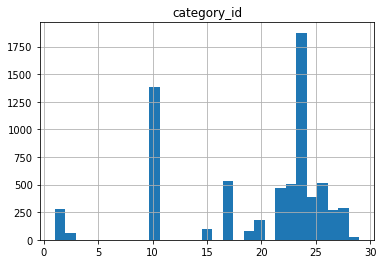


## Preview some categories examples
- category **1** is trailers
- category **2** is about cars and racing :P
- category **10** is music videos
- ...


```python
df[df["category_id"] == 24].head(10)["title"]
```


    0                                     Brain On Fire | Official Trailer [HD] | Netflix
    1                                        The Ritual | Official Trailer [HD] | Netflix
    3                       First They Killed My Father | Official Trailer [HD] | Netflix
    12                              HOW TO MAKE CHOCOLATE AT HOME bean to bar Ann Reardon
    14                    The 'Avengers: Infinity War' Cast Play Marvel Trivia | MTV News
    17                                 The Cast of Infinity War Plays 'Guess the Avenger'
    18      Avengers: Endgame Cast Answer 50 of the Most Googled Marvel Questions | WIRED
    35                        The GRINCH MOVIE Inspired Gingerbread Man Cookie Decoration
    47    [골라봐야지][ENG] 팬티 안에!! (⬇️힐끔) 팬티 안에 두 글자 ㅂ0ㅂ..? 아형 찢고 간 엑소(EXO)ㅋㅋㅋ #아는형님 #JTBC봐야지
    52                                      A Serbian Film Official Red Band U.S. Trailer
    Name: title, dtype: object


# TEXT Attributes
- publish time
- title
- channel title
- tags
- description

## 1. Publish Time
A) Years of publish


```python
import dateutil.parser

dates = [dateutil.parser.isoparse(d) for d in df["publish_time"].unique()]
years = [d.year for d in dates]
count_years = Counter(years)

import matplotlib.pyplot as plt

fig, ax = plt.subplots(figsize=(8, 6))
its =  sorted(count_years.items(), key=lambda x : -1*x[1])
rects = ax.bar([it[0] for it in its], [it[1] for it in its])
ax.set_xticks([it[0] for it in its])
ax.set_title("Years of publish_time")
```


    Text(0.5, 1.0, 'Years of publish_time')


*B*) Month of publish
> We can see that during some months, there have been much less trending videos than during other ones. In particular, months July to October (inclusive) are very rare.


```python
import datetime 

months = [d.month for d in dates]
count_months = Counter(months)

fig, ax = plt.subplots(figsize=(8, 6))
its =  sorted(count_months.items(), key=lambda x : -1*x[1])
rects = ax.bar([it[0] for it in its], [it[1] for it in its])

ax.set_xticks([it[0] for it in its])
ax.set_xticklabels([datetime.date(1900, it[0], 1).strftime('%B') for it in its], rotation=30)
ax.set_title("Months of publish_time")
```


    Text(0.5, 1.0, 'Months of publish_time')


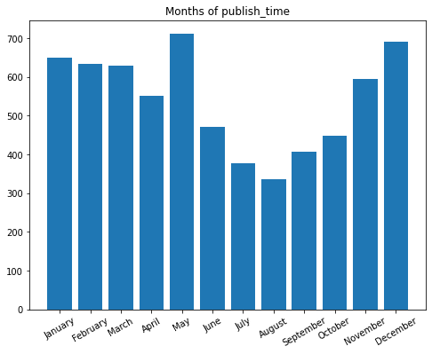


C) Weekday
> Conversely to what we expected, most trending videos have not been published on weekend


```python
days = [d.weekday() for d in dates]
count_days = Counter(days)
weekDays = ("Monday", "Tuesday", "Wednesday", "Thursday", "Friday", "Saturday", "Sunday")

fig, ax = plt.subplots(figsize=(8, 6))
its =  count_days.items()
rects = ax.bar([it[0] for it in its], [it[1] for it in its])

ax.set_xticks([it[0] for it in its])
ax.set_xticklabels([weekDays[it[0]] for it in its], rotation=30)
ax.set_title("WeekDays of publish_time")
```


    Text(0.5, 1.0, 'WeekDays of publish_time')


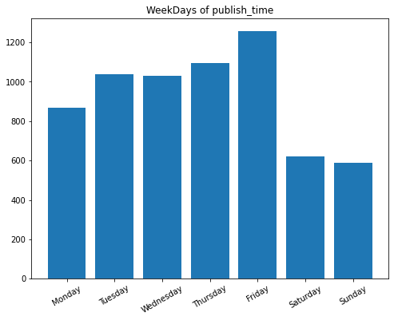


```python
# ADD week_day attribute
df["week_day"] = df["publish_time"].apply(lambda x : dateutil.parser.isoparse(x).weekday())
```

D) Hour
> There is a significant increase in trending videos in the middle of the day, between 13:00 and 19:00

> Hours can be divided into four periods in a day:
- 00:00 - 06:00 (time_of_day = 1)
- 06:00 - 12:00 (time_of_day = 2)
- 12:00 - 18:00 (time_of_day = 3)
- 18:00 - 24:00 (time_of_day = 4)

Let's make an attribute out of that.


```python
hours = [d.hour for d in dates]
count_hours = Counter(hours)

fig, ax = plt.subplots(figsize=(8, 6))
its =  sorted(count_hours.items(), key=lambda x : -1*x[1])
rects = ax.bar([it[0] for it in its], [it[1] for it in its])

ax.set_xticks([it[0] for it in its])
ax.set_xticklabels([f"{it[0]:02d}:00" for it in its], rotation=40)
ax.set_title("Hours of publish_time")
```


    Text(0.5, 1.0, 'Hours of publish_time')


```python
def extract_time_of_day(datestring):
  d = dateutil.parser.isoparse(datestring)
  return d.hour // 6 + 1

# ADD time_of_day attribute
df["time_of_day"] = df["publish_time"].apply(extract_time_of_day)
df[["time_of_day", "publish_time"]].head()

# ## 1. Publish Time
# A) Years of publish
#
```


<div>
<style scoped>
    .dataframe tbody tr th:only-of-type {
        vertical-align: middle;
    }

    .dataframe tbody tr th {
        vertical-align: top;
    }

    .dataframe thead th {
        text-align: right;
    }
</style>
<table border="1" class="dataframe">
  <thead>
    <tr style="text-align: right;">
      <th></th>
      <th>time_of_day</th>
      <th>publish_time</th>
    </tr>
  </thead>
  <tbody>
    <tr>
      <th>0</th>
      <td>3</td>
      <td>2018-06-13T13:59:50Z</td>
    </tr>
    <tr>
      <th>1</th>
      <td>4</td>
      <td>2018-01-26T18:00:19Z</td>
    </tr>
    <tr>
      <th>2</th>
      <td>3</td>
      <td>2018-01-22T12:43:21Z</td>
    </tr>
    <tr>
      <th>3</th>
      <td>3</td>
      <td>2017-08-02T13:29:22Z</td>
    </tr>
    <tr>
      <th>4</th>
      <td>3</td>
      <td>2017-11-14T16:00:12Z</td>
    </tr>
  </tbody>
</table>
</div>


```python
import dateutil.parser

dates = [dateutil.parser.isoparse(d) for d in df["publish_time"].unique()]
years = [d.year for d in dates]
count_years = Counter(years)

import matplotlib.pyplot as plt

fig, ax = plt.subplots(figsize=(8, 6))
its =  sorted(count_years.items(), key=lambda x : -1*x[1])
rects = ax.bar([it[0] for it in its], [it[1] for it in its])
ax.set_xticks([it[0] for it in its])
ax.set_title("Years of publish_time")
```


    Text(0.5, 1.0, 'Years of publish_time')


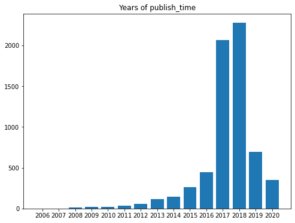


*B*) Month of publish
> We can see that during some months, there have been much less trending videos than during other ones. In particular, months July to October (inclusive) are very rare.


```python
import datetime 

months = [d.month for d in dates]
count_months = Counter(months)

fig, ax = plt.subplots(figsize=(8, 6))
its =  sorted(count_months.items(), key=lambda x : -1*x[1])
rects = ax.bar([it[0] for it in its], [it[1] for it in its])

ax.set_xticks([it[0] for it in its])
ax.set_xticklabels([datetime.date(1900, it[0], 1).strftime('%B') for it in its], rotation=30)
ax.set_title("Months of publish_time")
```


    Text(0.5, 1.0, 'Months of publish_time')


```python
# ADD month attribute
df["month"] = df["publish_time"].apply(lambda x : dateutil.parser.isoparse(x).month)
```

C) Weekday
> Conversely to what we expected, most trending videos have not been published on weekend


```python
days = [d.weekday() for d in dates]
count_days = Counter(days)
weekDays = ("Monday", "Tuesday", "Wednesday", "Thursday", "Friday", "Saturday", "Sunday")

fig, ax = plt.subplots(figsize=(8, 6))
its =  count_days.items()
rects = ax.bar([it[0] for it in its], [it[1] for it in its])

ax.set_xticks([it[0] for it in its])
ax.set_xticklabels([weekDays[it[0]] for it in its], rotation=30)
ax.set_title("WeekDays of publish_time")
```


    Text(0.5, 1.0, 'WeekDays of publish_time')


```python
# ADD week_day attribute
df["week_day"] = df["publish_time"].apply(lambda x : dateutil.parser.isoparse(x).weekday())
```

D) Hour
> There is a significant increase in trending videos in the middle of the day, between 13:00 and 19:00

> Hours can be divided into four periods in a day:
- 00:00 - 06:00 (time_of_day = 1)
- 06:00 - 12:00 (time_of_day = 2)
- 12:00 - 18:00 (time_of_day = 3)
- 18:00 - 24:00 (time_of_day = 4)

Let's make an attribute out of that.


```python
hours = [d.hour for d in dates]
count_hours = Counter(hours)

fig, ax = plt.subplots(figsize=(8, 6))
its =  sorted(count_hours.items(), key=lambda x : -1*x[1])
rects = ax.bar([it[0] for it in its], [it[1] for it in its])

ax.set_xticks([it[0] for it in its])
ax.set_xticklabels([f"{it[0]:02d}:00" for it in its], rotation=40)
ax.set_title("Hours of publish_time")
```


    Text(0.5, 1.0, 'Hours of publish_time')


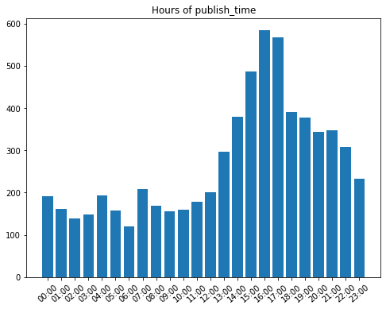


```python
def extract_time_of_day(datestring):
  d = dateutil.parser.isoparse(datestring)
  return d.hour // 6 + 1

# ADD time_of_day attribute
df["time_of_day"] = df["publish_time"].apply(extract_time_of_day)
df[["time_of_day", "publish_time"]].head()
```


<div>
<style scoped>
    .dataframe tbody tr th:only-of-type {
        vertical-align: middle;
    }

    .dataframe tbody tr th {
        vertical-align: top;
    }

    .dataframe thead th {
        text-align: right;
    }
</style>
<table border="1" class="dataframe">
  <thead>
    <tr style="text-align: right;">
      <th></th>
      <th>time_of_day</th>
      <th>publish_time</th>
    </tr>
  </thead>
  <tbody>
    <tr>
      <th>0</th>
      <td>3</td>
      <td>2018-06-13T13:59:50Z</td>
    </tr>
    <tr>
      <th>1</th>
      <td>4</td>
      <td>2018-01-26T18:00:19Z</td>
    </tr>
    <tr>
      <th>2</th>
      <td>3</td>
      <td>2018-01-22T12:43:21Z</td>
    </tr>
    <tr>
      <th>3</th>
      <td>3</td>
      <td>2017-08-02T13:29:22Z</td>
    </tr>
    <tr>
      <th>4</th>
      <td>3</td>
      <td>2017-11-14T16:00:12Z</td>
    </tr>
  </tbody>
</table>
</div>


## 2. Title

**Lengths in characters**
> On average, around 50 characters describe the title.

> It seems as if there was normal distribution of title length in characters, with a right tail slightly longer.


```python
import seaborn as sns

titles = df["title"].values
lengths = list(map(len, titles))

# ADD title_length_chars attribute
df["title_length_chars"] = df["title"].apply(len)

print(pd.DataFrame({"length_statistics": lengths}).describe())
sns.distplot(lengths)
```

           length_statistics
    count        6956.000000
    mean           52.037090
    std            20.079556
    min             3.000000
    25%            37.000000
    50%            50.000000
    75%            65.000000
    max           100.000000


    <matplotlib.axes._subplots.AxesSubplot at 0x7fabc47d1d90>


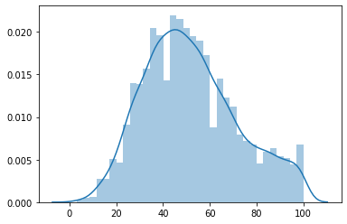


```python
print("MAX length:", df.loc[df["title"].apply(len).idxmax(), :]["title"])
print()
print("MIN length:", df.loc[df["title"].apply(len).idxmin(), :]["title"])
```

    MAX length: How To Make A Stack Of WAFFLES CAKE For ELEVEN From STRANGER THINGS | Yolanda Gampp | How To Cake It
    
    MIN length: May


**Lengths in words (*tokens*)**
> There are 10 *words* in average describing a video's title.

> There exist titles with only one word, and titles with a maximum of 28 words. 

> The distirbution seems normal, but is not very smooth.


```python
from nltk.tokenize import word_tokenize

lengths = []
for t in titles:
    lengths.append(len(word_tokenize(t)))

# ADD title_length_tokens attribute
df["title_length_tokens"] = df["title"].apply(lambda x : len(word_tokenize(x)))
    
print(pd.DataFrame({"length_statistics": lengths}).describe())
sns.distplot(lengths)
```

           length_statistics
    count        6956.000000
    mean           10.444940
    std             4.292067
    min             1.000000
    25%             7.000000
    50%            10.000000
    75%            13.000000
    max            31.000000


    <matplotlib.axes._subplots.AxesSubplot at 0x7fabc3b6e580>


### Upper vs. Lower case
> We can observe a dominating ratio between uppercase letters and overall length of title: most of them have 20% uppercase characters. Right tail shows that higher ratios appear, but not as often as we could expect.


```python
def get_uppercase_ratio(x):
    return sum([1 if char.isalpha() and char.isupper() else 0 for char in x]) / len(x)

# ADD title_uppercase_ratio attribute
df["title_uppercase_ratio"] = df["title"].apply(get_uppercase_ratio)

uppercase_ratio = df["title_uppercase_ratio"]
print(uppercase_ratio.describe())
sns.distplot(uppercase_ratio)
```

    count    6956.000000
    mean        0.204954
    std         0.166311
    min         0.000000
    25%         0.125000
    50%         0.153846
    75%         0.203390
    max         0.944444
    Name: title_uppercase_ratio, dtype: float64


    <matplotlib.axes._subplots.AxesSubplot at 0x7fabc38fd8e0>


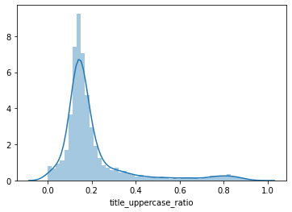


### Non-alphanumeric characters
> Similarily to uppercase ratio, there is a trend in titles that 20% of the characters describing it are neither letters nor digits, but other special characters.


```python
def get_not_alnum_ratio(x):
    return sum([1 if not char.isalnum() else 0 for char in x]) / len(x)


# ADD title_uppercase_ratio attribute
df["title_not_alnum_ratio"] = df["title"].apply(get_not_alnum_ratio)

not_alnum_ratio = df["title_not_alnum_ratio"]
print(not_alnum_ratio.describe())
sns.distplot(not_alnum_ratio)
```

    count    6956.000000
    mean        0.198792
    std         0.046777
    min         0.000000
    25%         0.169177
    50%         0.200000
    75%         0.226415
    max         0.500000
    Name: title_not_alnum_ratio, dtype: float64


    <matplotlib.axes._subplots.AxesSubplot at 0x7fabc37f26d0>


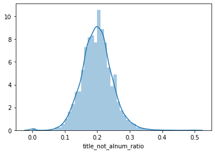


### Top not-alphanumeric characters
> For each often occurring character, we check in how many titles it was observed. Large percentages could suggest one should use this character in the title :)

> We can create binary features which will tell for each title, whether it contains this particular character, or not. However, we don't want our feature vector to grow too much at this point, so instead of binary encoding for each common character, we will count all characters that belong to TOP-N characters. TOP-N will be derived by applying threshold: <u>more than 10% of titles</u>. Furthermore, we skip whitespace characters and assume that number of tokens will reflect this feature well enough.


```python
count_chars = Counter("".join(titles))
print("Number of different characters:", len(count_chars.keys()))

top_chars = count_chars.most_common()
not_alnum = [t for t in top_chars if not t[0].isalnum()]
top_not_alnum = not_alnum[:15]

common_chars = []
for char, count in not_alnum:
    percentage = sum(df["title"].apply(lambda x : char in x)) / df.shape[0] * 100.0
    if percentage > 10.0:
        print(f"'{char}': {count}", ",", round(percentage, 3), "%")
        if not char.isspace():
            common_chars.append(char)
```

    Number of different characters: 1093
    ' ': 56263 , 99.655 %
    '-': 2888 , 35.825 %
    '|': 1925 , 21.262 %
    '(': 1652 , 22.355 %
    ')': 1652 , 22.326 %
    ''': 1308 , 14.247 %
    '.': 1072 , 11.041 %
    ':': 854 , 12.033 %


```python
# ADD title_common_chars_count
df["title_common_chars_count"] = df["title"].apply(lambda x : sum(1 if char in common_chars else 0 for char in x))
sns.distplot(df["title_common_chars_count"])
```


    <matplotlib.axes._subplots.AxesSubplot at 0x7fabc3754d90>


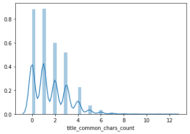


## 3. Channel title
> For Channel title, we follow very similar analysis to **Title** analysis 

> Channel title is usually less than 20 characters long


```python
import seaborn as sns

titles = df["channel_title"].values
lengths = list(map(len, titles))

# ADD title_length_chars attribute
df["channel_title_length_chars"] = df["channel_title"].apply(len)

print(pd.DataFrame({"length_statistics": lengths}).describe())
sns.distplot(lengths)
```

           length_statistics
    count        6956.000000
    mean           13.403537
    std             6.991011
    min             1.000000
    25%             9.000000
    50%            12.000000
    75%            16.000000
    max            51.000000


    <matplotlib.axes._subplots.AxesSubplot at 0x7fabc363d9a0>


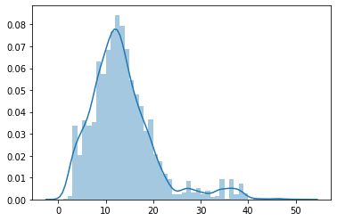


> Most Channel titles are one or two words long.


```python
from nltk.tokenize import word_tokenize

lengths = []
for t in titles:
    lengths.append(len(word_tokenize(t)))

# ADD title_length_tokens attribute
df["channel_title_length_tokens"] = df["channel_title"].apply(lambda x : len(word_tokenize(x)))
    
print(pd.DataFrame({"length_statistics": lengths}).describe())
sns.distplot(lengths)
```

           length_statistics
    count        6956.000000
    mean            2.092582
    std             1.309610
    min             1.000000
    25%             1.000000
    50%             2.000000
    75%             3.000000
    max            10.000000


    <matplotlib.axes._subplots.AxesSubplot at 0x7fabc3926940>


-

## 4. Tags

> For Tags, we simply apply **counting**. If **Tags** are `[none]`, we use $-1$ to denote this special value.
> Looking at the distribution of tags counts, we can tell that there is no simple relation such as: the more tags the better.


```python
df["tags_count"] = df["tags"].apply(lambda x : x.count('|') if '|' in x else -1)
sns.distplot(df["tags_count"])
```


    <matplotlib.axes._subplots.AxesSubplot at 0x7fabc3598eb0>


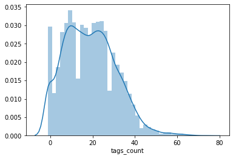


#### Are there any popular tags?
We apply `unique` in order to find popular tags,as if there was a video which was trending for many days, its tags are recorded multiple times. This would distort the distribution of tags across all the videos.

> Some tags are more common than other ones, however most of them are connected to some fixed category, for example `trailer` - implies that the video content will be a movie trailer.


```python
all_tags_list = df["tags"].apply(lambda x : [tag.lower().replace('"', '') for tag in x.split('|')]).values
print(len(all_tags_list))
all_tags_list = np.unique(all_tags_list)
print(len(all_tags_list))

all_tags = []
all_tags_tokens = []
for atl in all_tags_list:
    all_tags.extend(atl)
    for tag in atl:
        all_tags_tokens.extend(tag.split())
    
print("\nPOPULAR TAGS:")
print(Counter(all_tags).most_common(30))
```

    6956
    5979
    
    POPULAR TAGS:
    [('funny', 647), ('comedy', 462), ('music', 332), ('interview', 228), ('video', 227), ('pop', 200), ('news', 197), ('live', 182), ('how to', 181), ('humor', 169), ('science', 162), ('talk show', 151), ('official', 148), ('comedian', 148), ('nba', 137), ('diy', 132), ('food', 131), ('clip', 131), ('fun', 128), ('late night', 127), ('rap', 127), ('review', 125), ('show', 122), ('snl', 122), ('beauty', 121), ('makeup', 120), ('new', 120), ('vlog', 115), ('movie', 115), ('game', 115)]


```python
print("POPULAR TAGS TOKENS:")
print(Counter(all_tags_tokens).most_common(30))
```

    POPULAR TAGS TOKENS:
    [('the', 3244), ('music', 1435), ('video', 1419), ('to', 1357), ('funny', 1262), ('of', 1192), ('and', 1076), ('show', 1047), ('how', 927), ('new', 914), ('news', 910), ('makeup', 879), ('live', 835), ('in', 823), ('movie', 728), ('comedy', 728), ('interview', 722), ('a', 694), ('best', 609), ('2018', 602), ('official', 588), ('youtube', 532), ('movies', 522), ('world', 510), ('food', 477), ('star', 463), ('you', 458), ('on', 458), ('i', 449), ('with', 442)]


## 5. Description
**Lengths in characters**

> Average length of description in characters is close to one thousand. However, the standard deviation is also very high, very close to the mean - roughly 845 characters. Median of the distribution is equal to 733 characters.

> Almost no-descriptions also happen: minimum value observed is 1.


```python
descriptions = df["description"].values
lengths = list(map(len, descriptions))

# ADD title_length_chars attribute
df["description_length_chars"] = df["description"].apply(len)

print(pd.DataFrame({"length_statistics": lengths}).describe())
sns.distplot(lengths)
```

           length_statistics
    count        6956.000000
    mean         1010.067424
    std           901.821168
    min             1.000000
    25%           367.000000
    50%           773.000000
    75%          1356.250000
    max          4995.000000


    <matplotlib.axes._subplots.AxesSubplot at 0x7fabc34138e0>


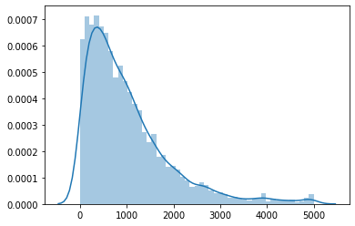


**Lengths in tokens**
> On average, there are 156 words (tokens) per description. Maximum observation was 1520, which is a great outlier as the 75th percentile is equal to 212 words. 


```python
lengths = []
for d in descriptions:
    lengths.append(len(word_tokenize(d)))

# ADD title_length_tokens attribute
df["description_length_tokens"] = df["description"].apply(lambda x : len(word_tokenize(x)))
    
print(pd.DataFrame({"length_statistics": lengths}).describe())
sns.distplot(lengths)
```

           length_statistics
    count        6956.000000
    mean          174.846032
    std           162.518628
    min             0.000000
    25%            60.000000
    50%           128.000000
    75%           235.000000
    max          1220.000000


    <matplotlib.axes._subplots.AxesSubplot at 0x7fabc1dc0af0>


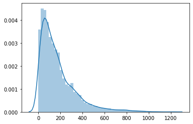


**Lengths in lines**
> For description, we decided also to count newlines. This is because youtubers often format description in some way, for example enuemrating links to their social medias in new lines each.

> It turned out that many descriptions have no new line at all. We suspect that sometimes there could have been an error when exporting the data.


```python
def count_newlines(x):
    x = x.replace(r'\\n', r'\n')
    return x.count(r'\n')

# ADD title_length_tokens attribute
df["description_length_newlines"] = df["description"].apply(count_newlines)
    
print(df["description_length_newlines"].describe())
sns.distplot(df["description_length_newlines"])
```

    count    6956.0
    mean        0.0
    std         0.0
    min         0.0
    25%         0.0
    50%         0.0
    75%         0.0
    max         0.0
    Name: description_length_newlines, dtype: float64


    /home/nawrba/PycharmProjects/PED/venv/lib/python3.8/site-packages/seaborn/distributions.py:288: UserWarning: Data must have variance to compute a kernel density estimate.
      warnings.warn(msg, UserWarning)


    <matplotlib.axes._subplots.AxesSubplot at 0x7fabc4755250>


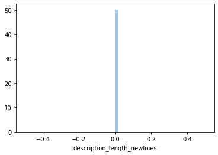


**Upper vs. Lower case (again)**
> We take a look onto uppercase letters again, followed by what we discovered in titles.

> For the description attribute, the tendency towards using uppercase letters is smaller. Most ratios don't exceed 10%.


```python
# ADD title_uppercase_ratio attribute
df["description_uppercase_ratio"] = df["description"].apply(get_uppercase_ratio)

uppercase_ratio = df["description_uppercase_ratio"]
print(uppercase_ratio.describe())
sns.distplot(uppercase_ratio)
```

    count    6956.000000
    mean        0.090300
    std         0.059016
    min         0.000000
    25%         0.053333
    50%         0.080823
    75%         0.115002
    max         0.875000
    Name: description_uppercase_ratio, dtype: float64


    <matplotlib.axes._subplots.AxesSubplot at 0x7fabc34d5b50>


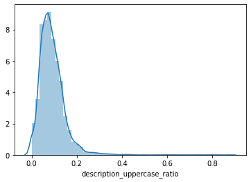


**Number of URLs per description**
> We observed that users often leave many links in their descriptions, such as: instagram profile, twitter profile, subscribe redirection url, or event download links. It may be useful to keep track on how many URLs each description has.

> Although some descriptions lack URLs, the median count of URLs is equal to 7 - quite a lot - and the maximum observation is 83 URLs!


```python
import re

best_url_regex = r'(http:\/\/www\.|http:\/\/|https:\/\/www\.|https:\/\/|www\.)?(?P<domain>([a-zA-Z0-9]+\.)+[a-zA-Z0-9]+)\/*[a-zA-Z0-9-_\/\.]*'
df["description_url_count"] = df["description"].apply(lambda x : len(re.findall(best_url_regex, x)))

print(df["description_url_count"].describe())
sns.distplot(df["description_url_count"])
```

    count    6956.000000
    mean        7.908424
    std         8.708959
    min         0.000000
    25%         2.000000
    50%         6.000000
    75%        11.000000
    max       102.000000
    Name: description_url_count, dtype: float64


    <matplotlib.axes._subplots.AxesSubplot at 0x7fabc1be9a90>


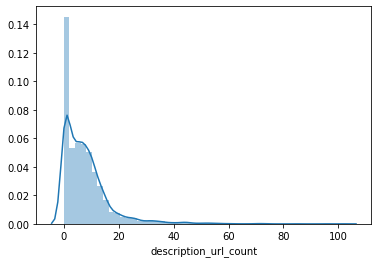


#### Which URLs are popular?


```python
descriptions = df["description"].unique()

domains = []
for d in descriptions:
    matches = re.findall(best_url_regex, d)
    for m in matches:
        if len(m) > 1:
            domains.append(m[1])

top_domains = Counter(domains).most_common(30)
print(top_domains)
```

    [('bit.ly', 6984), ('youtube.com', 5462), ('twitter.com', 3544), ('instagram.com', 3528), ('facebook.com', 3024), ('youtu.be', 2536), ('goo.gl', 1997), ('amzn.to', 1651), ('smarturl.it', 1115), ('rstyle.me', 534), ('patreon.com', 428), ('soundcloud.com', 346), ('itunes.apple.com', 302), ('tinyurl.com', 252), ('lisae.me.uk', 252), ('po.st', 242), ('Twitter.com', 242), ('gmail.com', 239), ('Facebook.com', 239), ('incompetech.com', 215), ('es.pn', 197), ('creativecommons.org', 186), ('vevo.ly', 185), ('buzzfeed.com', 185), ('pinterest.com', 182), ('plus.google.com', 169), ('nfl.com', 159), ('foxs.pt', 148), ('amazon.com', 146), ('on.today.com', 146)]


#### For the most popular URLs, in how many unique descriptions (in %) do they appear?
> Some URLs appear very often:
- twitter.com
- facebook.com
- instagram.com

We can hypothesise that trending videos include links to popular social medias. It is correlated with the fact that if some youtuber is popular, then she/he already has accounts on many other social medias as well, to reach out to more fans.


```python
percentages = []
for domain, count in top_domains:
    percentage = sum(1 if domain in d else 0 for d in descriptions) / len(descriptions) * 100.0
    percentages.append((domain, percentage))

for domain, count in sorted(percentages, key=lambda x : -x[1]):
    print(f"{domain} : {count:.3f}%")
```

    twitter.com : 44.243%
    facebook.com : 42.161%
    instagram.com : 39.558%
    youtube.com : 34.385%
    bit.ly : 30.946%
    goo.gl : 11.420%
    youtu.be : 10.095%
    patreon.com : 6.183%
    smarturl.it : 5.158%
    amzn.to : 4.543%
    soundcloud.com : 3.975%
    gmail.com : 3.391%
    vevo.ly : 2.918%
    pinterest.com : 2.886%
    itunes.apple.com : 2.555%
    plus.google.com : 2.319%
    Facebook.com : 2.287%
    Twitter.com : 2.256%
    amazon.com : 1.940%
    creativecommons.org : 1.514%
    incompetech.com : 1.293%
    buzzfeed.com : 1.183%
    tinyurl.com : 0.931%
    po.st : 0.915%
    es.pn : 0.741%
    rstyle.me : 0.457%
    nfl.com : 0.331%
    on.today.com : 0.331%
    foxs.pt : 0.221%
    lisae.me.uk : 0.126%


### Non-ascii characters
# `TO DELETE?`


```python
count_chars = Counter("".join(titles))
print("Number of different characters:", len(count_chars.keys()))
non_ascii = [key for key in count_chars if ord(key) > 127]
non_ascii_count = sorted([(key, count_chars[key]) for key in non_ascii], key=lambda x: -1 * x[1])
for pair in non_ascii_count[:15]:
    print(pair, ord(pair[0]))
```

    Number of different characters: 260
    ('é', 38) 233
    ('í', 18) 237
    ('–', 11) 8211
    ('á', 10) 225
    ('이', 8) 51060
    ('자', 7) 51088
    ('스', 7) 49828
    ('ú', 7) 250
    ('영', 6) 50689
    ('국', 6) 44397
    ('남', 6) 45224
    ('더', 6) 45908
    ('케', 6) 52992
    ('ç', 6) 231
    ('원', 5) 50896


```python
from sklearn.cluster import KMeans

codes = np.array(list(map(ord, [key for key in count_chars.keys() if ord(key) > 127]))).reshape(-1, 1)

nc = 3
kmeans = KMeans(n_clusters=nc)
kmeans.fit(codes)
y_kmeans = kmeans.predict(codes)

chars_clusters = list(zip(map(chr, codes.reshape(-1)), y_kmeans))
for i in range(nc):
    print("\nCLUSTER #", i)
    print(list(filter(lambda x: x[1] == i, chars_clusters))[:20])
    print(ord(list(filter(lambda x: x[1] == i, chars_clusters))[0][0]))
```

    
    CLUSTER # 0
    [('영', 0), ('국', 0), ('남', 0), ('자', 0), ('멜', 0), ('론', 0), ('뮤', 0), ('직', 0), ('어', 0), ('워', 0), ('드', 0), ('올', 0), ('더', 0), ('케', 0), ('이', 0), ('잼', 0), ('종', 0), ('접', 0), ('기', 0), ('송', 0)]
    50689
    
    CLUSTER # 1
    [('é', 1), ('В', 1), ('Р', 1), ('е', 1), ('й', 1), ('т', 1), ('и', 1), ('н', 1), ('г', 1), ('è', 1), ('У', 1), ('Х', 1), ('ï', 1), ('ñ', 1), ('ú', 1), ('İ', 1), ('ü', 1), ('✿', 1), ('–', 1), ('ô', 1)]
    233
    
    CLUSTER # 2
    [('春', 2), ('晚', 2), ('中', 2), ('国', 2), ('辽', 2), ('宁', 2), ('卫', 2), ('视', 2), ('官', 2), ('方', 2), ('道', 2), ('央', 2), ('电', 2), ('台', 2), ('李', 2), ('建', 2), ('軒', 2), ('天', 2), ('碟', 2), ('加', 2)]
    26149


### Emojis analysis


```python
def read_emojis_txt(filename):
    emojis_df = pd.read_csv(filename, sep=";", header=None, comment="#")
    print(emojis_df[0].head())
    array = emojis_df[0].to_numpy()
    result = []
    for code in array:
        # range
        code = code.strip()
        if ".." in code:
            begin_code, end_code = code.split("..")
            for code in range(int(begin_code, 16), int(end_code, 16)):
                result.append(chr(code))
            pass
        elif not " " in code:
            result.append(chr(int(code, 16)))
    print(len(result))
    return set(result)
    

emojis = read_emojis_txt("emojis.txt")

# small test
"👻" in emojis
```

    0    231A..231B    
    1    23E9..23EC    
    2    23F0          
    3    23F3          
    4    25FD..25FE    
    Name: 0, dtype: object
    983


    True


```python
def count_emojis(text):
    return sum([1 for char in text if char in emojis])

df["emojis_counts"] = df["description"].apply(count_emojis)
```


```python
print(df["emojis_counts"].describe())
sum(df["emojis_counts"] == 0), sum(df["emojis_counts"] != 0)
```

    count    6956.000000
    mean        0.303335
    std         5.015919
    min         0.000000
    25%         0.000000
    50%         0.000000
    75%         0.000000
    max       400.000000
    Name: emojis_counts, dtype: float64


    (6515, 441)


#### There is not much emojis in descriptions, anyway added column into consideration


```python
sns.distplot(df["emojis_counts"][df["emojis_counts"] != 0])
```


    <matplotlib.axes._subplots.AxesSubplot at 0x7fabbf02d6a0>


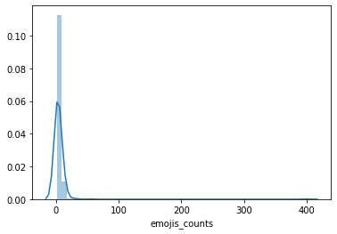


### Embeddings


```python
import io
import os

import tensorflow as tf
import tensorflow_hub as hub
import numpy as np

tf.__version__
```


    '2.2.0-rc1'


```python
#  encoder = info.features['text'].encoder
def write_embedding_files(labels, embedded_ndarray, path=path, prefix=""):
    out_v = io.open(os.path.join(path, f"{prefix}_vecs.tsv"), "w", encoding="utf-8")
    out_m = io.open(os.path.join(path, f"{prefix}_meta.tsv"), "w", encoding="utf-8")
    vectors = embedded_ndarray
    for message, vector in zip(labels, vectors):
        out_m.write(message + "\n")
        out_v.write("\t".join([str(x) for x in vector]) + "\n")
    out_v.close()
    out_m.close()
```


```python
embed = hub.load("https://tfhub.dev/google/universal-sentence-encoder/4")
```


```python
messages = [
    "The quick brown fox jumps over the lazy dog.",
    "I am a sentence for which I would like to get its embedding",
]

message_embeddings = embed(messages)

for i, message_embedding in enumerate(np.array(message_embeddings).tolist()):
    print("Message: {}".format(messages[i]))
    print("Embedding size: {}".format(len(message_embedding)))
    message_embedding_snippet = ", ".join((str(x) for x in message_embedding[:3]))
    print("Embedding[{},...]\n".format(message_embedding_snippet))
```

    Message: The quick brown fox jumps over the lazy dog.
    Embedding size: 512
    Embedding[-0.031330183148384094, -0.06338633596897125, -0.0160750150680542,...]
    
    Message: I am a sentence for which I would like to get its embedding
    Embedding size: 512
    Embedding[0.0508086122572422, -0.01652427949011326, 0.015737809240818024,...]
    


```python
unique_titles = np.unique(titles)
write_embedding_files(unique_titles, embed(unique_titles).numpy())
```

Embeding appropriate text columns


```python
df.columns
```


    Index(['video_id', 'trending_date', 'title', 'channel_title', 'category_id',
           'publish_time', 'tags', 'views', 'likes', 'dislikes', 'comment_count',
           'thumbnail_link', 'comments_disabled', 'ratings_disabled',
           'video_error_or_removed', 'description', 'week_day', 'time_of_day',
           'month', 'title_length_chars', 'title_length_tokens',
           'title_uppercase_ratio', 'title_not_alnum_ratio',
           'title_common_chars_count', 'channel_title_length_chars',
           'channel_title_length_tokens', 'tags_count', 'description_length_chars',
           'description_length_tokens', 'description_length_newlines',
           'description_uppercase_ratio', 'description_url_count',
           'emojis_counts'],
          dtype='object')


```python
def calc_embeddings(df, column_names, write_visualizations_files=False):
    for column in column_names:
        # batch_processing
        batch_size = 1000
        input_col = df[column].to_numpy()
        num_it = len(input_col) // batch_size

        result = np.zeros(shape=[len(input_col), 512])
        for i in range(num_it):
            result[batch_size * i: batch_size * (i + 1)]= embed(input_col[batch_size * i: batch_size * (i + 1)]).numpy()
        if len(input_col) % batch_size:
            result[batch_size * i:]= embed(input_col[batch_size * i:]).numpy()
        if write_visualizations_files:
            unique_inputs, unique_indexes = np.unique(input_col, return_index=True) 
            write_embedding_files(unique_inputs, result[unique_indexes], prefix=column)
        df[f"{column}_embed"] = list(result)

calc_embeddings(df, ["title", "channel_title"], False) # , "description" Description doesnt work...
```


```python
np.unique([[0, 1], [0, 1]], axis=0)
```


    array([[0, 1]])


```python
pd.set_option("colwidth", 15)
print(df.head())
pd.set_option("colwidth", None)
```

          video_id  trending_date           title   channel_title  category_id  \
    0  VZn6G0M9wNs            NaN  Brain On Fi...         Netflix           24   
    1  Vfugwq2uoa0            NaN  The Ritual ...         Netflix           24   
    2  glEtdHJMcow            NaN  Top 10 Most...       TechGumbo           28   
    3  uS3Vp_quGCw            NaN  First They ...         Netflix           24   
    4  gIa4daq3180            NaN  How To Make...  How To Cake It           26   
    
         publish_time            tags    views   likes  dislikes  ...  \
    0  2018-06-13T...  "Netflix"|"...  8468347  118176      1656  ...   
    1  2018-01-26T...  "Netflix"|"...  5139716   38719      1291  ...   
    2  2018-01-22T...  "Top 10 Bes...  1878088   15433       791  ...   
    3  2017-08-02T...  "Netflix"|"...  2469653   23744       747  ...   
    4  2017-11-14T...  "How To Cak...  1325366   38095       383  ...   
    
       channel_title_length_tokens tags_count  description_length_chars  \
    0               1                      20            1058             
    1               1                      36             903             
    2               1                      20            1115             
    3               1                      29             998             
    4               4                      29            3115             
    
       description_length_tokens  description_length_newlines  \
    0             179                          0                
    1             155                          0                
    2             205                          0                
    3             168                          0                
    4             536                          0                
    
      description_uppercase_ratio  description_url_count  emojis_counts  \
    0        0.101134                           9                     0   
    1        0.120709                           8                     0   
    2        0.054709                           3                     0   
    3        0.100200                           8                     0   
    4        0.209631                          25                     0   
    
          title_embed  channel_title_embed  
    0  [-0.0122206...  [-0.0552856...       
    1  [0.02755012...  [-0.0552856...       
    2  [-0.0700422...  [-0.0082432...       
    3  [-0.0044006...  [-0.0552856...       
    4  [-0.0045746...  [-0.0091870...       
    
    [5 rows x 35 columns]


### Tags


```python
def tags_transformer(x):
    return ", ".join(sorted([tag.replace('"', "") for tag in x.split("|")]))

df["transormed_tags"] = df["tags"].apply(tags_transformer)
```


```python
df["transormed_tags"].head()
```


    0                                                                                                                                           08282016NtflxUSCAN, International Films and Series, Netflix, Netflix Original Series, Netflix Series, PLvahqwMqN4M35d1XdbUEWZT_r36Z6tIz3, PLvahqwMqN4M3lRAQGSsLEVbFADl7BBBwq, Trailer, brain on fire, brain on fire trailer, chloe grace moretz, comedy, drama, movies, movies online, sofia vergara, streaming, television, the female brain, tv spot, watch movies
    1            08282016NtflxUSCAN, Arsher Ali, David Bruckner, Kerri McLean, Maria Erwolter, Netflix, Netflix Original Series, Netflix Series, Paul Reid, Rafe Spall, Robert James-Collier, Sam Troughton, The Ritual, Trailer, burning sands, demons, documentary, drama, england, haunted forest, horror, horror movies, hunters, movie, movies, movies online, nature trail, nightmare, possesion, ritualmain, satanic, scary movie, streaming, television, television online, the ritual netflix, watch movies
    2                                                                                                                      10 Underrated TV Shows, Best TV Shows No One is Watching, Better Call Saul, Hulu, Legion, Mindhunter, Netflix, Ozark, Peaky Blinders, TV Show, TV Shows, Taboo, TechGumbo, Top 10, Top 10 Best Underrated TV Series, Top 10 Most Underrated TV Shows to Watch Now, Top 10 Must See Underrated TV Shows, Top 10 Underrated TV Shows, Underrated, Underrated TV Series, Underrated TV Shows
    3           08282016NtflxUSCAN, A Netflix Original Film, Angelina, Angelina Jolie, Cambodia, First They Killed My Father, Jolie, Khmer Rouge, Luong Ung, Netflix, Netflix Original, Netflix Original Series, Netflix Series, PLvahqwMqN4M2N01FfQy2wXkyVyucAL86b, PLvahqwMqN4M35d1XdbUEWZT_r36Z6tIz3, Phnom Penh, Phoeung Kompheak, Sveng Socheata, TIFF, Toronto International Film Festival, Trailer, comedy, documentary, drama, movies, movies online, streaming, television, television online, watch movies
    4    Buttercream, Cake, Cakes, Chocolate, Chocolate Cake Recipe, Google, How To Cake It, How To Cake It By Yolanda, How To Make A Stack Of EGGO WAFFLES CAKE For ELEVEN From STRANGER THINGS, Recipe, Simple Syrup, Sugar Stars, Vanilla, Vanilla Cake, Yolanda Gamp, Yolanda Gampp, best cake decoration 2017, breakfast, breakfast cakes, cake art, eggo waffles, eggo waffles eleven, eleven, howtocakeit, netflix, realistic cakes, stranger things, stranger things cake, stranger things season 2, waffles
    Name: transormed_tags, dtype: object


```python
cosine_loss = tf.keras.losses.CosineSimilarity(axis=1)
print(df["transormed_tags"][0])
cosine_loss(embed([df["transormed_tags"][0]]), embed(["lewis, christmas, what, none, moz"]))
```

    08282016NtflxUSCAN, International Films and Series, Netflix, Netflix Original Series, Netflix Series, PLvahqwMqN4M35d1XdbUEWZT_r36Z6tIz3, PLvahqwMqN4M3lRAQGSsLEVbFADl7BBBwq, Trailer, brain on fire, brain on fire trailer, chloe grace moretz, comedy, drama, movies, movies online, sofia vergara, streaming, television, the female brain, tv spot, watch movies


    <tf.Tensor: shape=(), dtype=float32, numpy=0.010443026>


```python
df.shape
```


    (6956, 36)


```python
calc_embeddings(df, ["transormed_tags"], False)
```


```python
df.to_csv(os.path.join(path, "text_attributes_all_not_trending.csv"), index=False)
```
