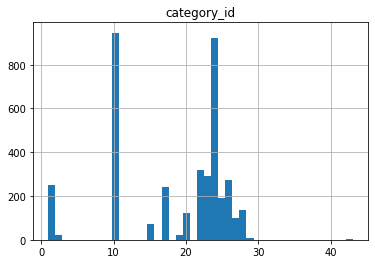
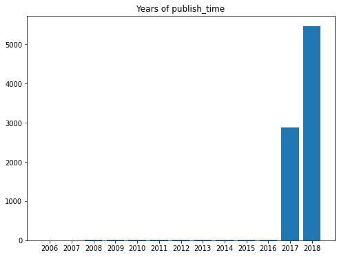
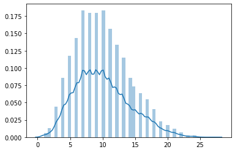
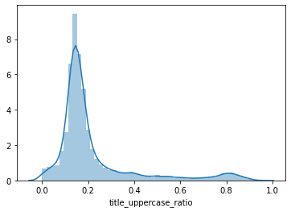
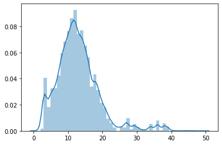
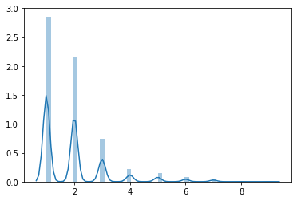
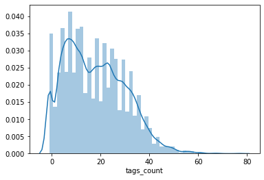
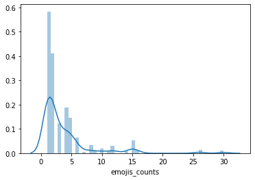

```python
import nltk
nltk.download("punkt")

import os

path = "../data/"
files = os.listdir(path)
files
```

    [nltk_data] Downloading package punkt to /home/nawrba/nltk_data...
    [nltk_data]   Package punkt is already up-to-date!


    ['tags_meta.tsv',
     'channel_title_meta.tsv',
     'GB_category_id.json',
     'US_category_id.json',
     'tags_vecs.tsv',
     'title_meta.tsv',
     'emojis.txt',
     '_meta.tsv',
     'channel_title_vecs.tsv',
     'vecs.tsv',
     'title_vecs.tsv',
     'meta.tsv',
     'GB_videos_5p.csv',
     '_vecs.tsv',
     'US_videos_5p.csv']


```python
import pandas as pd

pd.set_option("colwidth", None)

GB_videos_df = pd.read_csv(path + "/" + "GB_videos_5p.csv", sep=";", engine="python")
US_videos_df = pd.read_csv(path + "/" + "US_videos_5p.csv", sep=";", engine="python")

df = pd.concat([GB_videos_df, US_videos_df]).drop_duplicates().reset_index(drop=True)
df = df.rename(columns={"description ": "description"})
print(df.shape)
df.head(3) 
```

    (78255, 16)


<div>
<style scoped>
    .dataframe tbody tr th:only-of-type {
        vertical-align: middle;
    }

    .dataframe tbody tr th {
        vertical-align: top;
    }

    .dataframe thead th {
        text-align: right;
    }
</style>
<table border="1" class="dataframe">
  <thead>
    <tr style="text-align: right;">
      <th></th>
      <th>video_id</th>
      <th>trending_date</th>
      <th>title</th>
      <th>channel_title</th>
      <th>category_id</th>
      <th>publish_time</th>
      <th>tags</th>
      <th>views</th>
      <th>likes</th>
      <th>dislikes</th>
      <th>comment_count</th>
      <th>thumbnail_link</th>
      <th>comments_disabled</th>
      <th>ratings_disabled</th>
      <th>video_error_or_removed</th>
      <th>description</th>
    </tr>
  </thead>
  <tbody>
    <tr>
      <th>0</th>
      <td>Jw1Y-zhQURU</td>
      <td>17.14.11</td>
      <td>John Lewis Christmas Ad 2017 - #MozTheMonster</td>
      <td>John Lewis</td>
      <td>NaN</td>
      <td>2017-11-10T07:38:29.000Z</td>
      <td>christmas|"john lewis christmas"|"john lewis"|"christmas ad"|"mozthemonster"|"christmas 2017"|"christmas ad 2017"|"john lewis christmas advert"|"moz"</td>
      <td>7224515</td>
      <td>55681</td>
      <td>10247</td>
      <td>9479</td>
      <td>https://i.ytimg.com/vi/Jw1Y-zhQURU/default.jpg</td>
      <td>False</td>
      <td>False</td>
      <td>False</td>
      <td>Click here to continue the story and make your own monster:\nhttp://bit.ly/2mboXgj\n\nJoe befriends a noisy Monster under his bed but the two have so much fun together that he can't get to sleep, leaving him tired by day. For Christmas Joe receives a gift to help him finally get a good night’s sleep.\n\nShop the ad\nhttp://bit.ly/2hg04Lc\n\nThe music is Golden Slumbers performed by elbow, the original song was by The Beatles. \nFind the track:\nhttps://Elbow.lnk.to/GoldenSlumbersXS\n\nSubscribe to this channel for regular video updates\nhttp://bit.ly/2eU8MvW\n\nIf you want to hear more from John Lewis:\n\nLike John Lewis on Facebook\nhttp://www.facebook.com/johnlewisretail\n\nFollow John Lewis on Twitter\nhttp://twitter.com/johnlewisretail\n\nFollow John Lewis on Instagram\nhttp://instagram.com/johnlewisretail</td>
    </tr>
    <tr>
      <th>1</th>
      <td>3s1rvMFUweQ</td>
      <td>17.14.11</td>
      <td>Taylor Swift: …Ready for It? (Live) - SNL</td>
      <td>Saturday Night Live</td>
      <td>NaN</td>
      <td>2017-11-12T06:24:44.000Z</td>
      <td>SNL|"Saturday Night Live"|"SNL Season 43"|"Episode 1730"|"Tiffany Haddish"|"Taylor Swift"|"Taylor Swift Ready for It"|"s43"|"s43e5"|"episode 5"|"live"|"new york"|"comedy"|"sketch"|"funny"|"hilarious"|"late night"|"host"|"music"|"guest"|"laugh"|"impersonation"|"actor"|"improv"|"musician"|"comedian"|"actress"|"If Loving You Is Wrong"|"Oprah Winfrey"|"OWN"|"Girls Trip"|"The Carmichael Show"|"Keanu"|"Reputation"|"Look What You Made Me Do"|"ready for it?"</td>
      <td>1053632</td>
      <td>25561</td>
      <td>2294</td>
      <td>2757</td>
      <td>https://i.ytimg.com/vi/3s1rvMFUweQ/default.jpg</td>
      <td>False</td>
      <td>False</td>
      <td>False</td>
      <td>Musical guest Taylor Swift performs …Ready for It? on Saturday Night Live.\n\n#SNL #SNL43\n\nGet more SNL: http://www.nbc.com/saturday-night-live\nFull Episodes: http://www.nbc.com/saturday-night-liv...\n\nLike SNL: https://www.facebook.com/snl\nFollow SNL: https://twitter.com/nbcsnl\nSNL Tumblr: http://nbcsnl.tumblr.com/\nSNL Instagram: http://instagram.com/nbcsnl \nSNL Pinterest: http://www.pinterest.com/nbcsnl/</td>
    </tr>
    <tr>
      <th>2</th>
      <td>n1WpP7iowLc</td>
      <td>17.14.11</td>
      <td>Eminem - Walk On Water (Audio) ft. Beyoncé</td>
      <td>EminemVEVO</td>
      <td>NaN</td>
      <td>2017-11-10T17:00:03.000Z</td>
      <td>Eminem|"Walk"|"On"|"Water"|"Aftermath/Shady/Interscope"|"Rap"</td>
      <td>17158579</td>
      <td>787420</td>
      <td>43420</td>
      <td>125882</td>
      <td>https://i.ytimg.com/vi/n1WpP7iowLc/default.jpg</td>
      <td>False</td>
      <td>False</td>
      <td>False</td>
      <td>Eminem's new track Walk on Water ft. Beyoncé is available everywhere: http://shady.sr/WOWEminem \nPlaylist Best of Eminem: https://goo.gl/AquNpo\nSubscribe for more: https://goo.gl/DxCrDV\n\nFor more visit: \nhttp://eminem.com\nhttp://facebook.com/eminem\nhttp://twitter.com/eminem\nhttp://instagram.com/eminem\nhttp://eminem.tumblr.com\nhttp://shadyrecords.com\nhttp://facebook.com/shadyrecords\nhttp://twitter.com/shadyrecords\nhttp://instagram.com/shadyrecords\nhttp://trustshady.tumblr.com\n\nMusic video by Eminem performing Walk On Water. (C) 2017 Aftermath Records\nhttp://vevo.ly/gA7xKt</td>
    </tr>
  </tbody>
</table>
</div>


## Unwanted attributes
- We do not need to analyze **views**, **likes**, **dislikes** or **comment_count** as we cannot base the trending guidelines upon such statistics

## Check for **missing values**
Apart from category_id column about which we already know it has values missing, there are other attributes with missing data.

### Description


```python
missing_values_df = df.drop(["category_id"], axis=1)
missing_values_df = missing_values_df[missing_values_df.isnull().any(axis=1)]

for cname in missing_values_df.columns:
    check_nulls = missing_values_df[[cname]].isnull().sum().values[0]
    if check_nulls > 0:
        print("Missing values in column", cname, ":", check_nulls)
```

    Missing values in column description : 1098


There are NaNs in column `description`.

**Solution**: Replace `NaN`s with "no description"


```python
df.loc[df["description"].isna(), "description"] = "no description"
```

### Tags
We can also observe that there can be missing tags, represented as `[none]`. We leave it as it is as no tags is also some kind of an information.


```python
df[df["tags"] == "[none]"].shape
```


    (3449, 16)


### Video_id

Some `video_ids` seem corrupted:
> #NAZWA?


```python
print(
    "Count #NAZWA?:",
    df[df["video_id"].apply(lambda x: any([not char.isalnum() and char not in "-_" for char in x]))]["video_id"].shape,
)
df[df["video_id"].apply(lambda x: any([not char.isalnum() and char not in "-_" for char in x]))][
    ["video_id", "title"]
].head(3)
```

    Count #NAZWA?: (721,)


<div>
<style scoped>
    .dataframe tbody tr th:only-of-type {
        vertical-align: middle;
    }

    .dataframe tbody tr th {
        vertical-align: top;
    }

    .dataframe thead th {
        text-align: right;
    }
</style>
<table border="1" class="dataframe">
  <thead>
    <tr style="text-align: right;">
      <th></th>
      <th>video_id</th>
      <th>title</th>
    </tr>
  </thead>
  <tbody>
    <tr>
      <th>7</th>
      <td>#NAZWA?</td>
      <td>CHRISTMAS HAS GONE TO MY HEAD</td>
    </tr>
    <tr>
      <th>179</th>
      <td>#NAZWA?</td>
      <td>Don Diablo ft. A R I Z O N A - Take Her Place (Official Lyric Video)</td>
    </tr>
    <tr>
      <th>198</th>
      <td>#NAZWA?</td>
      <td>Wendy Williams Faints On Live TV</td>
    </tr>
  </tbody>
</table>
</div>


### Single video - different descriptions and titles ...

Typical `video_id` contains alphanumeric characters, and `-` or `_`, and is 11 characters long.

Grouping by `video_id`, and looking at columns of our interest there are some columns which values are different:
- trending_date - as expected,
- description - there are very slight differences between those (few characters diff), so it is definitely not enough to say that given the same title, the video is different. <u>It rather means that the user who uploaded the video, has decided to change a description a few days after the upload.</u>
- tags - there are very rare cases, but also tags can vary!
- title - unfortunately, in this column we can also observe changes.

There is also `category_id` which yields two unique values when some of them are NaNs.

After the analysis, we decided that the only column that can distinguish videos between themselves, aside from `video_id`, is `publish_time`.


```python
for example_video_id in df["video_id"].values[:5]:
    if "NAZWA" not in example_video_id:
        video_id_df = df[df["video_id"] == example_video_id]
        for cname in video_id_df.columns:
            if cname not in ["category_id", "views", "likes", "dislikes", "comment_count"]:
                count_unique = len(video_id_df[cname].unique())
                if count_unique > 1:
                    if cname == "title" or cname == "tags" or cname == "description":
                        print("\nnumber of unique '", cname, "': ", count_unique, '\n')
                        print(video_id_df[cname].unique())
```

    
    number of unique ' description ':  2 
    
    ["Click here to continue the story and make your own monster:\\nhttp://bit.ly/2mboXgj\\n\\nJoe befriends a noisy Monster under his bed but the two have so much fun together that he can't get to sleep, leaving him tired by day. For Christmas Joe receives a gift to help him finally get a good night’s sleep.\\n\\nShop the ad\\nhttp://bit.ly/2hg04Lc\\n\\nThe music is Golden Slumbers performed by elbow, the original song was by The Beatles. \\nFind the track:\\nhttps://Elbow.lnk.to/GoldenSlumbersXS\\n\\nSubscribe to this channel for regular video updates\\nhttp://bit.ly/2eU8MvW\\n\\nIf you want to hear more from John Lewis:\\n\\nLike John Lewis on Facebook\\nhttp://www.facebook.com/johnlewisretail\\n\\nFollow John Lewis on Twitter\\nhttp://twitter.com/johnlewisretail\\n\\nFollow John Lewis on Instagram\\nhttp://instagram.com/johnlewisretail"
     "Click here to continue the story and make your own monster: http://bit.ly/2mboXgj Joe befriends a noisy Monster under his bed but the two have so much fun together that he can't get to sleep, leaving him tired by day. For Christmas Joe receives a gift to help him finally get a good night’s sleep. Shop the ad http://bit.ly/2hg04Lc The music is Golden Slumbers performed by elbow, the original song was by The Beatles.  Find the track: https://Elbow.lnk.to/GoldenSlumbersXS Subscribe to this channel for regular video updates http://bit.ly/2eU8MvW If you want to hear more from John Lewis: Like John Lewis on Facebook http://www.facebook.com/johnlewisretail Follow John Lewis on Twitter http://twitter.com/johnlewisretail Follow John Lewis on Instagram http://instagram.com/johnlewisretail"]
    
    number of unique ' description ':  3 
    
    ["Eminem's new track Walk on Water ft. Beyoncé is available everywhere: http://shady.sr/WOWEminem \\nPlaylist Best of Eminem: https://goo.gl/AquNpo\\nSubscribe for more: https://goo.gl/DxCrDV\\n\\nFor more visit: \\nhttp://eminem.com\\nhttp://facebook.com/eminem\\nhttp://twitter.com/eminem\\nhttp://instagram.com/eminem\\nhttp://eminem.tumblr.com\\nhttp://shadyrecords.com\\nhttp://facebook.com/shadyrecords\\nhttp://twitter.com/shadyrecords\\nhttp://instagram.com/shadyrecords\\nhttp://trustshady.tumblr.com\\n\\nMusic video by Eminem performing Walk On Water. (C) 2017 Aftermath Records\\nhttp://vevo.ly/gA7xKt"
     "Eminem's new track Walk on Water ft. Beyoncé is available everywhere: http://shady.sr/WOWEminem \\n\\nFor more visit: \\nhttp://eminem.com\\nhttp://facebook.com/eminem\\nhttp://twitter.com/eminem\\nhttp://instagram.com/eminem\\nhttp://eminem.tumblr.com\\nhttp://shadyrecords.com\\nhttp://facebook.com/shadyrecords\\nhttp://twitter.com/shadyrecords\\nhttp://instagram.com/shadyrecords\\nhttp://trustshady.tumblr.com\\n\\nMusic video by Eminem performing Walk On Water. (C) 2017 Aftermath Records\\nhttp://vevo.ly/gA7xKt"
     "Eminem's new track Walk on Water ft. Beyoncé is available everywhere: http://shady.sr/WOWEminem  Playlist Best of Eminem: https://goo.gl/AquNpo Subscribe for more: https://goo.gl/DxCrDV For more visit:  http://eminem.com http://facebook.com/eminem http://twitter.com/eminem http://instagram.com/eminem http://eminem.tumblr.com http://shadyrecords.com http://facebook.com/shadyrecords http://twitter.com/shadyrecords http://instagram.com/shadyrecords http://trustshady.tumblr.com Music video by Eminem performing Walk On Water. (C) 2017 Aftermath Records http://vevo.ly/gA7xKt"]
    
    number of unique ' description ':  2 
    
    ['Salford drew 4-4 against the Class of 92 and Friends at the newly opened The Peninsula Stadium!\\n\\nLike us on Facebook: https://www.facebook.com/SalfordCityFC/ \\nFollow us on Twitter: https://twitter.com/SalfordCityFC\\nFollow us on Instagram: https://www.instagram.com/salfordcityfc/ \\nSubscribe to us on YouTube: https://www.youtube.com/user/SalfordCityTV\\n\\nWebsite: https://salfordcityfc.co.uk'
     'Salford drew 4-4 against the Class of 92 and Friends at the newly opened The Peninsula Stadium!\\n\\nThanks to University of Salford students Andy Bellamy, Zoe Worthington and Hugh Nelson for the filming the replay angles. \\n\\nLike us on Facebook: https://www.facebook.com/SalfordCityFC/ \\nFollow us on Twitter: https://twitter.com/SalfordCityFC\\nFollow us on Instagram: https://www.instagram.com/salfordcityfc/ \\nSubscribe to us on YouTube: https://www.youtube.com/user/SalfordCityTV\\n\\nWebsite: https://salfordcityfc.co.uk']


> We can replace "#NAZWA?" with manually-generated video_ids.


```python
corrupted_id_df = df[df["video_id"] == "#NAZWA?"]
for idx, t in enumerate(corrupted_id_df["publish_time"].unique()):
    corrupted_id_df.loc[corrupted_id_df["publish_time"] == t, "video_id"] = f"XXX{idx}"

df.loc[corrupted_id_df.index, :] = corrupted_id_df

df[df["video_id"].apply(lambda x: "XXX" in x)][["video_id", "title", "publish_time"]].head()
```

    /home/nawrba/PycharmProjects/PED/venv/lib/python3.8/site-packages/pandas/core/indexing.py:966: SettingWithCopyWarning: 
    A value is trying to be set on a copy of a slice from a DataFrame.
    Try using .loc[row_indexer,col_indexer] = value instead
    
    See the caveats in the documentation: https://pandas.pydata.org/pandas-docs/stable/user_guide/indexing.html#returning-a-view-versus-a-copy
      self.obj[item] = s


<div>
<style scoped>
    .dataframe tbody tr th:only-of-type {
        vertical-align: middle;
    }

    .dataframe tbody tr th {
        vertical-align: top;
    }

    .dataframe thead th {
        text-align: right;
    }
</style>
<table border="1" class="dataframe">
  <thead>
    <tr style="text-align: right;">
      <th></th>
      <th>video_id</th>
      <th>title</th>
      <th>publish_time</th>
    </tr>
  </thead>
  <tbody>
    <tr>
      <th>7</th>
      <td>XXX0</td>
      <td>CHRISTMAS HAS GONE TO MY HEAD</td>
      <td>2017-11-10T19:19:43.000Z</td>
    </tr>
    <tr>
      <th>179</th>
      <td>XXX1</td>
      <td>Don Diablo ft. A R I Z O N A - Take Her Place (Official Lyric Video)</td>
      <td>2017-11-02T16:34:20.000Z</td>
    </tr>
    <tr>
      <th>198</th>
      <td>XXX2</td>
      <td>Wendy Williams Faints On Live TV</td>
      <td>2017-10-31T15:59:58.000Z</td>
    </tr>
    <tr>
      <th>383</th>
      <td>XXX1</td>
      <td>Don Diablo ft. A R I Z O N A - Take Her Place (Official Lyric Video)</td>
      <td>2017-11-02T16:34:20.000Z</td>
    </tr>
    <tr>
      <th>593</th>
      <td>XXX1</td>
      <td>Don Diablo ft. A R I Z O N A - Take Her Place (Official Lyric Video)</td>
      <td>2017-11-02T16:34:20.000Z</td>
    </tr>
  </tbody>
</table>
</div>


Now with the missing values fixed, we can look at UNIQUE values per column.
<!--
There are repeating entries for the same video, but only with different `trending_date`, as already shown.

> We can aggregate those videos into one row, and replace `trending_date` column with:

> - count of different trending_dates
> - list of exact trending_dates  -->
### Can one `video_id` have more than one title?
> Answer: YES ...

> This shows that user who uploaded a video is able to change its title while it's listed in TRENDING.


```python
df_by_video_id = df.groupby("video_id").agg({"title": lambda x: len(set(x))})
df_by_video_id.sort_values(by="title", ascending=False).head(3)
```


<div>
<style scoped>
    .dataframe tbody tr th:only-of-type {
        vertical-align: middle;
    }

    .dataframe tbody tr th {
        vertical-align: top;
    }

    .dataframe thead th {
        text-align: right;
    }
</style>
<table border="1" class="dataframe">
  <thead>
    <tr style="text-align: right;">
      <th></th>
      <th>title</th>
    </tr>
    <tr>
      <th>video_id</th>
      <th></th>
    </tr>
  </thead>
  <tbody>
    <tr>
      <th>w4SSZQDFuc8</th>
      <td>3</td>
    </tr>
    <tr>
      <th>sfMwXjNo3Rs</th>
      <td>3</td>
    </tr>
    <tr>
      <th>eVoXmDdI6Qg</th>
      <td>3</td>
    </tr>
  </tbody>
</table>
</div>


```python
print(df[df["video_id"] == "w4SSZQDFuc8"].title.unique())
print(df[df["video_id"] == "sfMwXjNo3Rs"].title.unique())
print(df[df["video_id"] == "eVoXmDdI6Qg"].title.unique())
```

    ['Ghost Adventures S15E17 - The Slaughter House [HD 720p]'
     'Ghost Adventures S15E17 - The Slaughter House'
     'Ghost Adventures S15E17 - The Slaughterhouse [HD 720p]']
    ['How Spring Looks Like around the World'
     'What Spring Looks Like around the World'
     'What Spring Looks Like Around The World']
    ['5000 IQ IS REQUIRED TO WATCH'
     '5000 IQ IS REQUIRED TO WATCH /r/iamverysmart/ #4'
     '5000 IQ IS REQUIRED TO WATCH /r/iamverysmart/ #4 [REDDIT REVIEW]']


### Analyze distribution of 'category_id'


```python
from collections import Counter
import numpy as np

categories = df.category_id.values
nans = categories[np.isnan(categories)]
categories = categories[~np.isnan(categories)]
print("NANs:", nans.shape, "not NANs:", categories.shape)

df.hist(column="category_id", bins=int(max(categories)))
Counter(categories.tolist()).most_common()
```

    NANs: (74335,) not NANs: (3920,)


    [(10.0, 946),
     (24.0, 923),
     (22.0, 321),
     (23.0, 292),
     (26.0, 274),
     (1.0, 249),
     (17.0, 243),
     (25.0, 192),
     (28.0, 134),
     (20.0, 121),
     (27.0, 99),
     (15.0, 74),
     (19.0, 24),
     (2.0, 20),
     (29.0, 6),
     (43.0, 2)]





## Preview some categories examples
- category **1** is trailers
- category **2** is about cars and racing :P
- category **10** is music videos
- ...


```python
df[df["category_id"] == 24].head(10)["title"]
```


    76                                              How Are Waves Formed? - Earth Lab
    181                                                HALLOWEEN AFTERMATH AND Q&A 👻🎃
    199            Drop the Mic: Rob Gronkowski vs Gina Rodriguez - FULL BATTLE | TBS
    316    Selena Gomez Singing Wolves and It Ain't Me FULL Instagram Live | Acoustic
    424                                     Taylor Swift: …Ready for It? (Live) - SNL
    457                               Taylor Swift - “New Year’s Day” Fan Performance
    645                                                         How to be an Aquarius
    786                                  [Mnet Present Special] SEVENTEEN - CHANGE UP
    809                                          73 Questions With Liza Koshy | Vogue
    826                                                 Justice League - Movie Review
    Name: title, dtype: object


# TEXT Attributes
- publish time
- title
- channel title
- tags
- description

## 1. Publish Time
A) Years of publish


```python
import dateutil.parser

dates = [dateutil.parser.isoparse(d) for d in df["publish_time"].unique()]
years = [d.year for d in dates]
count_years = Counter(years)

import matplotlib.pyplot as plt

fig, ax = plt.subplots(figsize=(8, 6))
its =  sorted(count_years.items(), key=lambda x : -1*x[1])
rects = ax.bar([it[0] for it in its], [it[1] for it in its])
ax.set_xticks([it[0] for it in its])
ax.set_title("Years of publish_time")
```


    Text(0.5, 1.0, 'Years of publish_time')


*B*) Month of publish
> We can see that during some months, there have been much less trending videos than during other ones. In particular, months July to October (inclusive) are very rare.


```python
import datetime 

months = [d.month for d in dates]
count_months = Counter(months)

fig, ax = plt.subplots(figsize=(8, 6))
its =  sorted(count_months.items(), key=lambda x : -1*x[1])
rects = ax.bar([it[0] for it in its], [it[1] for it in its])

ax.set_xticks([it[0] for it in its])
ax.set_xticklabels([datetime.date(1900, it[0], 1).strftime('%B') for it in its], rotation=30)
ax.set_title("Months of publish_time")
```


    Text(0.5, 1.0, 'Months of publish_time')


C) Weekday
> Conversely to what we expected, most trending videos have not been published on weekend


```python
days = [d.weekday() for d in dates]
count_days = Counter(days)
weekDays = ("Monday", "Tuesday", "Wednesday", "Thursday", "Friday", "Saturday", "Sunday")

fig, ax = plt.subplots(figsize=(8, 6))
its =  count_days.items()
rects = ax.bar([it[0] for it in its], [it[1] for it in its])

ax.set_xticks([it[0] for it in its])
ax.set_xticklabels([weekDays[it[0]] for it in its], rotation=30)
ax.set_title("WeekDays of publish_time")
```


    Text(0.5, 1.0, 'WeekDays of publish_time')


```python
# ADD week_day attribute
df["week_day"] = df["publish_time"].apply(lambda x : dateutil.parser.isoparse(x).weekday())
```

D) Hour
> There is a significant increase in trending videos in the middle of the day, between 13:00 and 19:00

> Hours can be divided into four periods in a day:
- 00:00 - 06:00 (time_of_day = 1)
- 06:00 - 12:00 (time_of_day = 2)
- 12:00 - 18:00 (time_of_day = 3)
- 18:00 - 24:00 (time_of_day = 4)

Let's make an attribute out of that.


```python
hours = [d.hour for d in dates]
count_hours = Counter(hours)

fig, ax = plt.subplots(figsize=(8, 6))
its =  sorted(count_hours.items(), key=lambda x : -1*x[1])
rects = ax.bar([it[0] for it in its], [it[1] for it in its])

ax.set_xticks([it[0] for it in its])
ax.set_xticklabels([f"{it[0]:02d}:00" for it in its], rotation=40)
ax.set_title("Hours of publish_time")
```


    Text(0.5, 1.0, 'Hours of publish_time')


```python
def extract_time_of_day(datestring):
  d = dateutil.parser.isoparse(datestring)
  return d.hour // 6 + 1

# ADD time_of_day attribute
df["time_of_day"] = df["publish_time"].apply(extract_time_of_day)
df[["time_of_day", "publish_time"]].head()

# ## 1. Publish Time
# A) Years of publish
#
```


<div>
<style scoped>
    .dataframe tbody tr th:only-of-type {
        vertical-align: middle;
    }

    .dataframe tbody tr th {
        vertical-align: top;
    }

    .dataframe thead th {
        text-align: right;
    }
</style>
<table border="1" class="dataframe">
  <thead>
    <tr style="text-align: right;">
      <th></th>
      <th>time_of_day</th>
      <th>publish_time</th>
    </tr>
  </thead>
  <tbody>
    <tr>
      <th>0</th>
      <td>2</td>
      <td>2017-11-10T07:38:29.000Z</td>
    </tr>
    <tr>
      <th>1</th>
      <td>2</td>
      <td>2017-11-12T06:24:44.000Z</td>
    </tr>
    <tr>
      <th>2</th>
      <td>3</td>
      <td>2017-11-10T17:00:03.000Z</td>
    </tr>
    <tr>
      <th>3</th>
      <td>1</td>
      <td>2017-11-13T02:30:38.000Z</td>
    </tr>
    <tr>
      <th>4</th>
      <td>1</td>
      <td>2017-11-13T01:45:13.000Z</td>
    </tr>
  </tbody>
</table>
</div>


```python
import dateutil.parser

dates = [dateutil.parser.isoparse(d) for d in df["publish_time"].unique()]
years = [d.year for d in dates]
count_years = Counter(years)

import matplotlib.pyplot as plt

fig, ax = plt.subplots(figsize=(8, 6))
its =  sorted(count_years.items(), key=lambda x : -1*x[1])
rects = ax.bar([it[0] for it in its], [it[1] for it in its])
ax.set_xticks([it[0] for it in its])
ax.set_title("Years of publish_time")
```


    Text(0.5, 1.0, 'Years of publish_time')





*B*) Month of publish
> We can see that during some months, there have been much less trending videos than during other ones. In particular, months July to October (inclusive) are very rare.


```python
import datetime 

months = [d.month for d in dates]
count_months = Counter(months)

fig, ax = plt.subplots(figsize=(8, 6))
its =  sorted(count_months.items(), key=lambda x : -1*x[1])
rects = ax.bar([it[0] for it in its], [it[1] for it in its])

ax.set_xticks([it[0] for it in its])
ax.set_xticklabels([datetime.date(1900, it[0], 1).strftime('%B') for it in its], rotation=30)
ax.set_title("Months of publish_time")
```


    Text(0.5, 1.0, 'Months of publish_time')


```python
# ADD month attribute
df["month"] = df["publish_time"].apply(lambda x : dateutil.parser.isoparse(x).month)
```

C) Weekday
> Conversely to what we expected, most trending videos have not been published on weekend


```python
days = [d.weekday() for d in dates]
count_days = Counter(days)
weekDays = ("Monday", "Tuesday", "Wednesday", "Thursday", "Friday", "Saturday", "Sunday")

fig, ax = plt.subplots(figsize=(8, 6))
its =  count_days.items()
rects = ax.bar([it[0] for it in its], [it[1] for it in its])

ax.set_xticks([it[0] for it in its])
ax.set_xticklabels([weekDays[it[0]] for it in its], rotation=30)
ax.set_title("WeekDays of publish_time")
```


    Text(0.5, 1.0, 'WeekDays of publish_time')


```python
# ADD week_day attribute
df["week_day"] = df["publish_time"].apply(lambda x : dateutil.parser.isoparse(x).weekday())
```

D) Hour
> There is a significant increase in trending videos in the middle of the day, between 13:00 and 19:00

> Hours can be divided into four periods in a day:
- 00:00 - 06:00 (time_of_day = 1)
- 06:00 - 12:00 (time_of_day = 2)
- 12:00 - 18:00 (time_of_day = 3)
- 18:00 - 24:00 (time_of_day = 4)

Let's make an attribute out of that.


```python
hours = [d.hour for d in dates]
count_hours = Counter(hours)

fig, ax = plt.subplots(figsize=(8, 6))
its =  sorted(count_hours.items(), key=lambda x : -1*x[1])
rects = ax.bar([it[0] for it in its], [it[1] for it in its])

ax.set_xticks([it[0] for it in its])
ax.set_xticklabels([f"{it[0]:02d}:00" for it in its], rotation=40)
ax.set_title("Hours of publish_time")
```


    Text(0.5, 1.0, 'Hours of publish_time')


```python
def extract_time_of_day(datestring):
  d = dateutil.parser.isoparse(datestring)
  return d.hour // 6 + 1

# ADD time_of_day attribute
df["time_of_day"] = df["publish_time"].apply(extract_time_of_day)
df[["time_of_day", "publish_time"]].head()
```


<div>
<style scoped>
    .dataframe tbody tr th:only-of-type {
        vertical-align: middle;
    }

    .dataframe tbody tr th {
        vertical-align: top;
    }

    .dataframe thead th {
        text-align: right;
    }
</style>
<table border="1" class="dataframe">
  <thead>
    <tr style="text-align: right;">
      <th></th>
      <th>time_of_day</th>
      <th>publish_time</th>
    </tr>
  </thead>
  <tbody>
    <tr>
      <th>0</th>
      <td>2</td>
      <td>2017-11-10T07:38:29.000Z</td>
    </tr>
    <tr>
      <th>1</th>
      <td>2</td>
      <td>2017-11-12T06:24:44.000Z</td>
    </tr>
    <tr>
      <th>2</th>
      <td>3</td>
      <td>2017-11-10T17:00:03.000Z</td>
    </tr>
    <tr>
      <th>3</th>
      <td>1</td>
      <td>2017-11-13T02:30:38.000Z</td>
    </tr>
    <tr>
      <th>4</th>
      <td>1</td>
      <td>2017-11-13T01:45:13.000Z</td>
    </tr>
  </tbody>
</table>
</div>


## 2. Title

**Lengths in characters**
> On average, around 50 characters describe the title.

> It seems as if there was normal distribution of title length in characters, with a right tail slightly longer.


```python
import seaborn as sns

titles = df["title"].values
lengths = list(map(len, titles))

# ADD title_length_chars attribute
df["title_length_chars"] = df["title"].apply(len)

print(pd.DataFrame({"length_statistics": lengths}).describe())
sns.distplot(lengths)
```

           length_statistics
    count       78255.000000
    mean           49.059587
    std            19.742279
    min             3.000000
    25%            34.000000
    50%            47.000000
    75%            61.000000
    max           100.000000


    <matplotlib.axes._subplots.AxesSubplot at 0x7f619b9c8910>


```python
print("MAX length:", df.loc[df["title"].apply(len).idxmax(), :]["title"])
print()
print("MIN length:", df.loc[df["title"].apply(len).idxmin(), :]["title"])
```

    MAX length: President Trump and First Lady Melania Trump participates in NORAD Santa Tracker phone calls. Dec 24
    
    MIN length: 435


**Lengths in words (*tokens*)**
> There are 10 *words* in average describing a video's title.

> There exist titles with only one word, and titles with a maximum of 28 words. 

> The distirbution seems normal, but is not very smooth.


```python
from nltk.tokenize import word_tokenize

lengths = []
for t in titles:
    lengths.append(len(word_tokenize(t)))

# ADD title_length_tokens attribute
df["title_length_tokens"] = df["title"].apply(lambda x : len(word_tokenize(x)))
    
print(pd.DataFrame({"length_statistics": lengths}).describe())
sns.distplot(lengths)
```

           length_statistics
    count       78255.000000
    mean            9.999962
    std             4.192119
    min             1.000000
    25%             7.000000
    50%            10.000000
    75%            13.000000
    max            27.000000


    <matplotlib.axes._subplots.AxesSubplot at 0x7f6199407f70>





### Upper vs. Lower case
> We can observe a dominating ratio between uppercase letters and overall length of title: most of them have 20% uppercase characters. Right tail shows that higher ratios appear, but not as often as we could expect.


```python
def get_uppercase_ratio(x):
    return sum([1 if char.isalpha() and char.isupper() else 0 for char in x]) / len(x)

# ADD title_uppercase_ratio attribute
df["title_uppercase_ratio"] = df["title"].apply(get_uppercase_ratio)

uppercase_ratio = df["title_uppercase_ratio"]
print(uppercase_ratio.describe())
sns.distplot(uppercase_ratio)
```

    count    78255.000000
    mean         0.220660
    std          0.181672
    min          0.000000
    25%          0.130435
    50%          0.157895
    75%          0.215686
    max          0.947368
    Name: title_uppercase_ratio, dtype: float64


    <matplotlib.axes._subplots.AxesSubplot at 0x7f619c2f8b20>





### Non-alphanumeric characters
> Similarily to uppercase ratio, there is a trend in titles that 20% of the characters describing it are neither letters nor digits, but other special characters.


```python
def get_not_alnum_ratio(x):
    return sum([1 if not char.isalnum() else 0 for char in x]) / len(x)


# ADD title_uppercase_ratio attribute
df["title_not_alnum_ratio"] = df["title"].apply(get_not_alnum_ratio)

not_alnum_ratio = df["title_not_alnum_ratio"]
print(not_alnum_ratio.describe())
sns.distplot(not_alnum_ratio)
```

    count    78255.000000
    mean         0.201883
    std          0.048081
    min          0.000000
    25%          0.171429
    50%          0.200000
    75%          0.231884
    max          0.500000
    Name: title_not_alnum_ratio, dtype: float64


    <matplotlib.axes._subplots.AxesSubplot at 0x7f619ac1b880>


### Top not-alphanumeric characters
> For each often occurring character, we check in how many titles it was observed. Large percentages could suggest one should use this character in the title :)

> We can create binary features which will tell for each title, whether it contains this particular character, or not. However, we don't want our feature vector to grow too much at this point, so instead of binary encoding for each common character, we will count all characters that belong to TOP-N characters. TOP-N will be derived by applying threshold: <u>more than 10% of titles</u>. Furthermore, we skip whitespace characters and assume that number of tokens will reflect this feature well enough.


```python
count_chars = Counter("".join(titles))
print("Number of different characters:", len(count_chars.keys()))

top_chars = count_chars.most_common()
not_alnum = [t for t in top_chars if not t[0].isalnum()]
top_not_alnum = not_alnum[:15]

common_chars = []
for char, count in not_alnum:
    percentage = sum(df["title"].apply(lambda x : char in x)) / df.shape[0] * 100.0
    if percentage > 10.0:
        print(f"'{char}': {count}", ",", round(percentage, 3), "%")
        if not char.isspace():
            common_chars.append(char)
```

    Number of different characters: 734
    ' ': 598207 , 99.672 %
    '-': 33210 , 37.908 %
    '|': 19711 , 19.811 %
    '(': 19213 , 22.736 %
    ')': 19191 , 22.687 %
    '.': 14383 , 13.439 %
    ''': 14304 , 13.953 %
    ':': 9295 , 11.394 %


```python
# ADD title_common_chars_count
df["title_common_chars_count"] = df["title"].apply(lambda x : sum(1 if char in common_chars else 0 for char in x))
sns.distplot(df["title_common_chars_count"])
```


    <matplotlib.axes._subplots.AxesSubplot at 0x7f61992ebf70>


## 3. Channel title
> For Channel title, we follow very similar analysis to **Title** analysis 

> Channel title is usually less than 20 characters long


```python
import seaborn as sns

titles = df["channel_title"].values
lengths = list(map(len, titles))

# ADD title_length_chars attribute
df["channel_title_length_chars"] = df["channel_title"].apply(len)

print(pd.DataFrame({"length_statistics": lengths}).describe())
sns.distplot(lengths)
```

           length_statistics
    count       78255.000000
    mean           12.944272
    std             6.300970
    min             1.000000
    25%             9.000000
    50%            12.000000
    75%            16.000000
    max            49.000000


    <matplotlib.axes._subplots.AxesSubplot at 0x7f619bf7eb80>





> Most Channel titles are one or two words long.


```python
from nltk.tokenize import word_tokenize

lengths = []
for t in titles:
    lengths.append(len(word_tokenize(t)))

# ADD title_length_tokens attribute
df["channel_title_length_tokens"] = df["channel_title"].apply(lambda x : len(word_tokenize(x)))
    
print(pd.DataFrame({"length_statistics": lengths}).describe())
sns.distplot(lengths)
```

           length_statistics
    count       78255.000000
    mean            1.897400
    std             1.159166
    min             1.000000
    25%             1.000000
    50%             2.000000
    75%             2.000000
    max             9.000000


    <matplotlib.axes._subplots.AxesSubplot at 0x7f619b5fa1c0>





-

## 4. Tags

> For Tags, we simply apply **counting**. If **Tags** are `[none]`, we use $-1$ to denote this special value.
> Looking at the distribution of tags counts, we can tell that there is no simple relation such as: the more tags the better.


```python
df["tags_count"] = df["tags"].apply(lambda x : x.count('|') if '|' in x else -1)
sns.distplot(df["tags_count"])
```


    <matplotlib.axes._subplots.AxesSubplot at 0x7f6199c5d2e0>





#### Are there any popular tags?
We apply `unique` in order to find popular tags,as if there was a video which was trending for many days, its tags are recorded multiple times. This would distort the distribution of tags across all the videos.

> Some tags are more common than other ones, however most of them are connected to some fixed category, for example `trailer` - implies that the video content will be a movie trailer.


```python

all_tags_list = df["tags"].apply(lambda x : [tag.lower().replace('"', '') for tag in x.split('|')]).values
print(len(all_tags_list))
all_tags_list = np.unique(all_tags_list)
print(len(all_tags_list))

all_tags = []
all_tags_tokens = []
for atl in all_tags_list:
    all_tags.extend(atl)
    for tag in atl:
        all_tags_tokens.extend(tag.split())
    
print("\nPOPULAR TAGS:")
print(Counter(all_tags).most_common(30))
```

    78255
    8185
    
    POPULAR TAGS:
    [('funny', 917), ('comedy', 788), ('music', 439), ('interview', 379), ('trailer', 322), ('humor', 316), ('video', 315), ('news', 290), ('television', 287), ('2018', 276), ('celebrity', 275), ('comedian', 262), ('talk show', 261), ('pop', 255), ('live', 255), ('show', 239), ('review', 235), ('nbc', 234), ('how to', 233), ('clip', 230), ('celebrities', 225), ('late night', 225), ('entertainment', 212), ('food', 211), ('science', 210), ('sports', 209), ('funny video', 207), ('movie', 202), ('vlog', 200), ('comedic', 199)]


```python
print("POPULAR TAGS TOKENS:")
print(Counter(all_tags_tokens).most_common(30))
```

    POPULAR TAGS TOKENS:
    [('the', 4560), ('video', 2021), ('show', 1685), ('to', 1666), ('music', 1615), ('new', 1569), ('funny', 1560), ('news', 1501), ('of', 1376), ('2018', 1301), ('and', 1184), ('makeup', 1168), ('how', 1127), ('comedy', 1072), ('live', 1069), ('a', 1014), ('trailer', 955), ('in', 838), ('movie', 810), ('star', 782), ('2017', 779), ('interview', 755), ('ellen', 738), ('food', 726), ('youtube', 722), ('best', 708), ('official', 704), ('late', 665), ('game', 649), ('you', 626)]


## 5. Description


```python
df["description"].values[0]
```


    "Click here to continue the story and make your own monster:\\nhttp://bit.ly/2mboXgj\\n\\nJoe befriends a noisy Monster under his bed but the two have so much fun together that he can't get to sleep, leaving him tired by day. For Christmas Joe receives a gift to help him finally get a good night’s sleep.\\n\\nShop the ad\\nhttp://bit.ly/2hg04Lc\\n\\nThe music is Golden Slumbers performed by elbow, the original song was by The Beatles. \\nFind the track:\\nhttps://Elbow.lnk.to/GoldenSlumbersXS\\n\\nSubscribe to this channel for regular video updates\\nhttp://bit.ly/2eU8MvW\\n\\nIf you want to hear more from John Lewis:\\n\\nLike John Lewis on Facebook\\nhttp://www.facebook.com/johnlewisretail\\n\\nFollow John Lewis on Twitter\\nhttp://twitter.com/johnlewisretail\\n\\nFollow John Lewis on Instagram\\nhttp://instagram.com/johnlewisretail"


### Non-ascii characters


```python
count_chars = Counter("".join(titles))
print("Number of different characters:", len(count_chars.keys()))
non_ascii = [key for key in count_chars if ord(key) > 127]
non_ascii_count = sorted([(key, count_chars[key]) for key in non_ascii], key=lambda x: -1 * x[1])
for pair in non_ascii_count[:15]:
    print(pair, ord(pair[0]))
```

    Number of different characters: 217
    ('é', 457) 233
    ('ン', 178) 12531
    ('ー', 159) 12540
    ('á', 141) 225
    ('이', 140) 51060
    ('и', 138) 1080
    ('원', 128) 50896
    ('더', 128) 45908
    ('케', 128) 52992
    ('–', 118) 8211
    ('式', 116) 24335
    ('チ', 115) 12481
    ('ャ', 115) 12515
    ('ネ', 115) 12493
    ('ル', 115) 12523


```python
from sklearn.cluster import KMeans

codes = np.array(list(map(ord, [key for key in count_chars.keys() if ord(key) > 127]))).reshape(-1, 1)

nc = 3
kmeans = KMeans(n_clusters=nc)
kmeans.fit(codes)
y_kmeans = kmeans.predict(codes)

chars_clusters = list(zip(map(chr, codes.reshape(-1)), y_kmeans))
for i in range(nc):
    print("\nCLUSTER #", i)
    print(list(filter(lambda x: x[1] == i, chars_clusters))[:20])
    print(ord(list(filter(lambda x: x[1] == i, chars_clusters))[0][0]))
```

    
    CLUSTER # 0
    [('é', 0), ('ė', 0), ('–', 0), ('ö', 0), ('ス', 0), ('ク', 0), ('ウ', 0), ('ェ', 0), ('ア', 0), ('・', 0), ('エ', 0), ('ニ', 0), ('ッ', 0), ('ワ', 0), ('ー', 0), ('ナ', 0), ('ブ', 0), ('ラ', 0), ('ザ', 0), ('チ', 0)]
    233
    
    CLUSTER # 1
    [('원', 1), ('더', 1), ('케', 1), ('이', 1), ('영', 1), ('국', 1), ('남', 1), ('자', 1), ('특', 1), ('한', 1), ('동', 1), ('물', 1), ('채', 1), ('널', 1), ('펜', 1), ('타', 1), ('곤', 1), ('여', 1), ('친', 1), ('구', 1)]
    50896
    
    CLUSTER # 2
    [('公', 2), ('式', 2), ('新', 2), ('日', 2), ('本', 2), ('株', 2), ('会', 2), ('社', 2), ('米', 2), ('津', 2), ('玄', 2), ('師', 2), ('東', 2), ('宝', 2), ('春', 2), ('晚', 2), ('郭', 2), ('辰', 2), ('圧', 2), ('倒', 2)]
    20844


### Emojis analysis


```python
def read_emojis_txt(filename):
    emojis_df = pd.read_csv(filename, sep=";", header=None, comment="#")
    print(emojis_df[0].head())
    array = emojis_df[0].to_numpy()
    result = []
    for code in array:
        # range
        code = code.strip()
        if ".." in code:
            begin_code, end_code = code.split("..")
            for code in range(int(begin_code, 16), int(end_code, 16)):
                result.append(chr(code))
            pass
        elif not " " in code:
            result.append(chr(int(code, 16)))
    print(len(result))
    return set(result)
    

emojis = read_emojis_txt("emojis.txt")

# small test
"👻" in emojis
```

    0    231A..231B    
    1    23E9..23EC    
    2    23F0          
    3    23F3          
    4    25FD..25FE    
    Name: 0, dtype: object
    983


    True


```python
def count_emojis(text):
    return sum([1 for char in text if char in emojis])

df["emojis_counts"] = df["description"].apply(count_emojis)
```


```python
print(df["emojis_counts"].describe())
sum(df["emojis_counts"] == 0), sum(df["emojis_counts"] != 0)
```


    (74450, 3805)


#### There is not much emojis in descriptions, anyway added column into consideration


```python
sns.distplot(df["emojis_counts"][df["emojis_counts"] != 0])
```


    <matplotlib.axes._subplots.AxesSubplot at 0x7f618feb8730>





### Embeddings


```python
import io
import os

import tensorflow as tf
import tensorflow_hub as hub
import numpy as np

tf.__version__
```


    '2.2.0-rc1'


```python
#  encoder = info.features['text'].encoder
def write_embedding_files(labels, embedded_ndarray, path=path, prefix=""):
    out_v = io.open(os.path.join(path, f"{prefix}_vecs.tsv"), "w", encoding="utf-8")
    out_m = io.open(os.path.join(path, f"{prefix}_meta.tsv"), "w", encoding="utf-8")
    vectors = embedded_ndarray
    for message, vector in zip(labels, vectors):
        out_m.write(message + "\n")
        out_v.write("\t".join([str(x) for x in vector]) + "\n")
    out_v.close()
    out_m.close()
```


```python
embed = hub.load("https://tfhub.dev/google/universal-sentence-encoder/4")
```


```python
messages = [
    "The quick brown fox jumps over the lazy dog.",
    "I am a sentence for which I would like to get its embedding",
]

message_embeddings = embed(messages)

for i, message_embedding in enumerate(np.array(message_embeddings).tolist()):
    print("Message: {}".format(messages[i]))
    print("Embedding size: {}".format(len(message_embedding)))
    message_embedding_snippet = ", ".join((str(x) for x in message_embedding[:3]))
    print("Embedding[{},...]\n".format(message_embedding_snippet))
```

    Message: The quick brown fox jumps over the lazy dog.
    Embedding size: 512
    Embedding[-0.031330183148384094, -0.06338633596897125, -0.0160750150680542,...]
    
    Message: I am a sentence for which I would like to get its embedding
    Embedding size: 512
    Embedding[0.0508086122572422, -0.01652427949011326, 0.015737809240818024,...]
    


```python
unique_titles = np.unique(titles)
write_embedding_files(unique_titles, embed(unique_titles).numpy())
```

Embeding appropriate text columns


```python
df.columns
```


    Index(['video_id', 'trending_date', 'title', 'channel_title', 'category_id',
           'publish_time', 'tags', 'views', 'likes', 'dislikes', 'comment_count',
           'thumbnail_link', 'comments_disabled', 'ratings_disabled',
           'video_error_or_removed', 'description', 'week_day', 'time_of_day',
           'month', 'title_length_chars', 'title_length_tokens',
           'title_uppercase_ratio', 'title_not_alnum_ratio',
           'title_common_chars_count', 'channel_title_length_chars',
           'channel_title_length_tokens', 'tags_count'],
          dtype='object')


```python
def calc_embeddings(df, column_names, write_visualizations_files=False):
    extended_df = df
    for column in column_names:
        # batch_processing
        batch_size = 1000
        input_col = df[column].to_numpy()
        num_it = len(input_col) // batch_size

        result = np.zeros(shape=[len(input_col), 512])
        for i in range(num_it):
            result[batch_size * i: batch_size * (i + 1)]= embed(input_col[batch_size * i: batch_size * (i + 1)]).numpy()
        if len(input_col) % batch_size:
            result[batch_size * i:]= embed(input_col[batch_size * i:]).numpy()
        if write_visualizations_files:
            unique_inputs, unique_indexes = np.unique(input_col, return_index=True) 
            write_embedding_files(unique_inputs, result[unique_indexes], prefix=column)
        extended_df[f"{column}_embed"] = list(result)
    return extended_df

extended_df = calc_embeddings(df, ["title", "channel_title"], True) # , "description" Description doesnt work...
```


```python
np.unique([[0, 1], [0, 1]], axis=0)
```


```python
pd.set_option("colwidth", 15)
print(extended_df.head())
pd.set_option("colwidth", None)
```

### Tags


```python
def tags_transformer(x):
    return ", ".join(sorted([tag.replace('"', "") for tag in x.split("|")]))

transformed_tags = df["tags"].apply(tags_transformer)
```


```python
transformed_tags.head()
```


```python
cosine_loss = tf.keras.losses.CosineSimilarity(axis=1)
print(transformed_tags[0])
cosine_loss(embed([transformed_tags[0]]), embed(["lewis, christmas, what, none, moz"]))
```


```python
extended_df = calc_embeddings(pd.DataFrame({"tags": transformed_tags}), ["tags"], True)
```


```python
extended_df
```
